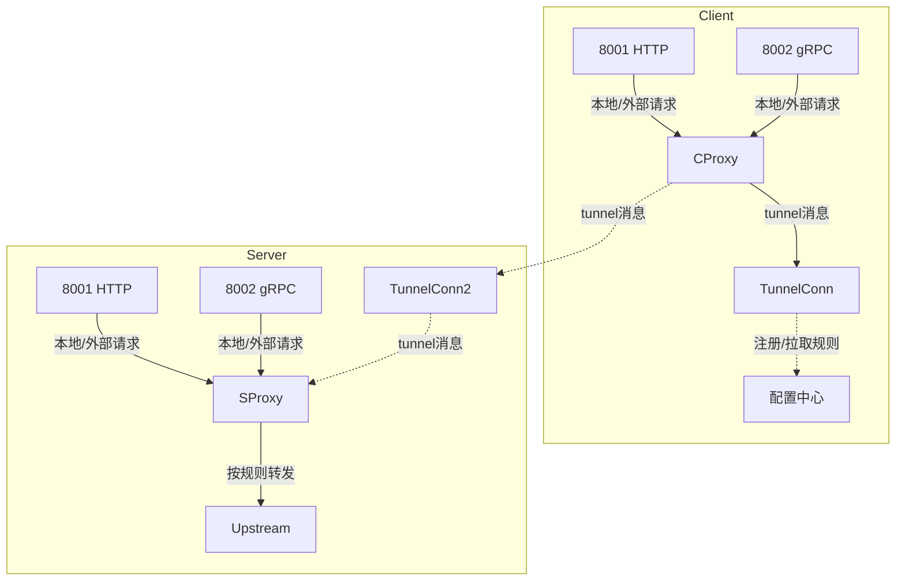

# Tunnel: 多端口多协议分组动态转发隧道系统

## 项目简介

Tunnel 是一个支持 HTTP/gRPC 多端口、多协议、分组、动态配置、双向转发的高性能隧道网关。它适用于多云、混合云、内外网穿透、微服务网关等场景，支持灵活的转发规则和 client group 管理。

---

## 架构与端口说明

| 角色    | 端口   | 协议 | 作用/用途                         | 访问者         |
|---------|--------|------|-----------------------------------|----------------|
| client  |   任意  | gRPC | tunnel 隧道，连接 server           | 只连 server    |
| client  | 8001   | HTTP | 本地 listen，接收 HTTP 请求        | 外部用户  |
| client  | 8002   | gRPC | 本地 listen，接收 gRPC 请求        | 外部用户  |
| server  | 50001  | gRPC | tunnel 隧道，收 client 连接        | 只收 client    |
| server  | 8001   | HTTP | 本地 listen，接收 HTTP 请求        | 外部用户  |
| server  | 8002   | gRPC | 本地 listen，接收 gRPC 请求        | 外部用户  |

---

## 流转逻辑

### 1. 用户访问 server:8001/8002
- 外部用户访问 server:8001 (HTTP) 或 server:8002 (gRPC)。
- server 按规则判断：
  - 匹配到 client group，则通过 tunnel转发到目标 client，由 client 处理，再返回响应。

### 2. 用户访问 client:8001/8002
- 本地或外部用户访问 client:8001 (HTTP) 或 client:8002 (gRPC)。
- client 通过 tunnel（50001）转发到 server，由 server 根据reverse_proxy.rules 处理

---

## 转发规则与分组

- server 侧可配置多条转发规则（如 nginx 配置），支持 host、path、method、header 等多条件匹配。
- server 侧可配置"client group"，每个 group 下挂多个 client，支持负载均衡、健康检查等。
- client 启动后注册到 server，声明自己属于哪个 group，并定期拉取最新转发规则。

---

## 典型场景

- 外部用户访问 server:8001/api，server 按规则转发到对应proxypaas client group ,client 根据 rules match 转发到对应的 proxypass
- 外部用户访问 client:8002/grpc.Service，client 按规则转发到对应proxypaas client group ,client 根据 rules match 转发到对应的 proxypass

---

## 配置建议

- server 侧统一管理所有转发规则和 client group，支持热更新和动态下发。
- client 侧注册 group，定期拉取规则，支持本地 fallback。
- 支持 HTTP/gRPC 的 host、path、header、method 等多条件匹配。
- tunnel 消息格式用 protobuf 定义，支持 HTTP/gRPC 全字段。

---

## 架构流程图



---

## TODO
- [ ] 支持多 client group 动态注册与健康检查
- [ ] 支持 server 侧热更新转发规则
- [ ] 支持 HTTP/gRPC 全字段转发与 header/metadata 保留
- [ ] 支持多协议负载均衡与熔断
- [ ] 提供详细的配置样例与管理工具

---

## 设计说明：server 统一转发与配置中心（nginx 风格）

### 1. server 作为统一转发与配置中心
- server 负责所有 HTTP/gRPC 入口（8001/8002）的请求分发、转发规则、upstream 管理、SSL、header 注入等。
- 所有转发规则、upstream、负载均衡、header、SNI、健康检查等均在 server 侧统一配置和管理。
- client 只负责监听本地 8001/8002，将所有请求通过 tunnel 发给 server，并从 server 拉取最新配置。

### 2. nginx 风格的 server 配置示例

```toml
# 定义 upstream 后端池
[server.upstreams.backend]
servers = [
    { address = "zilliz-byoc-us.byoc-uat.zillizcloud.com:443", resolve = true }
]
zone = "infra_service_zone"
zone_size = "64k"

[[server.reverse_proxy.http_rules]]
match = { host = "www.google.com" }
action = { proxy_pass = "http://backend" }
listen = { port = 8001 }

# HTTP 规则
[[server.proxy.http_rules]]
match = { host = "www.google.com", path_prefix = "/" }
action = { 
    proxy_pass = "https://group-a",  # 直接对应client group
    proxy_ssl_server_name = true,
    proxy_set_header = { Host = "zilliz-byoc-us.byoc.zillizcloud.com" }
}
listen = { port = 8001 }

# gRPC 规则同理
[[server.proxy.grpc_rules]]
match = { host = "grpc.google.com", service = "com.example.MyService" }
action = { proxy_pass = "grpc://group-b" }
listen = { port = 8002 }


```

- 支持多 upstream、负载均衡、fallback、本地服务等。
- 规则优先级与 nginx 一致，按顺序优先匹配。
- HTTP/gRPC 规则语义一致，均可通过 8001/8002 端口统一入口处理。

### 3. 配置热更新与分发
- server 作为配置中心，支持规则和 upstream 动态热更新。
- client 启动后注册 group，定期拉取 server 配置，支持自动生效。

### 4. 典型流转
- 用户访问 client:8001/8002，client 通过 tunnel 发给 server，server 按规则转发到目标 upstream 或本地服务。
- 用户访问 server:8001/8002，server 按规则本地处理或转发到 client group。

> 该设计实现了"nginx 级别的灵活转发能力 + 动态分布式 tunnel + 统一配置中心"，适用于多云、混合云、内外网穿透、微服务网关等复杂场景。

---

## client-group 分组规则配置

- client-group 规则以 `[client_groups.<group>.rules]` 层级组织，不同 group 可配置不同规则。
- 每个 group 可有独立的 `http_rules` 和 `grpc_rules`，规则语法与 server 侧一致。
- client 启动时注册 group，拉取 server 下发的专属规则。

### 多 group 配置示例

```toml
[client]
group_id = "group-a"
server_addr = "tunnel-server.example.com:50001"

[client.local_services]
http_port = 8001
grpc_port = 8002

[client_groups.group-a.rules]

[[client_groups.group-a.rules.http_rules]]
match = { host = "www.google.com" }
action = { proxy_pass = "http://b.com:9000" }

[[client_groups.group-a.rules.grpc_rules]]
match = { service = "com.example.Special" }
action = { proxy_pass = "grpc://127.0.0.1:9002" }

[client_groups.group-b.rules]

[[client_groups.group-b.rules.http_rules]]
match = { host = "b.com" }
action = { proxy_pass = "http://127.0.0.1:9100" }

[[client_groups.group-b.rules.grpc_rules]]
match = { service = "com.example.Another" }
action = { proxy_pass = "grpc://127.0.0.1:9102" }
```

- `client_groups.<group>.rules`：每个 group 独立配置规则。
- 支持多 group 并行，client 启动时根据自身 group 拉取对应规则。
- 规则语法与 server 侧一致，支持 host/path/header/service 等多条件匹配。 