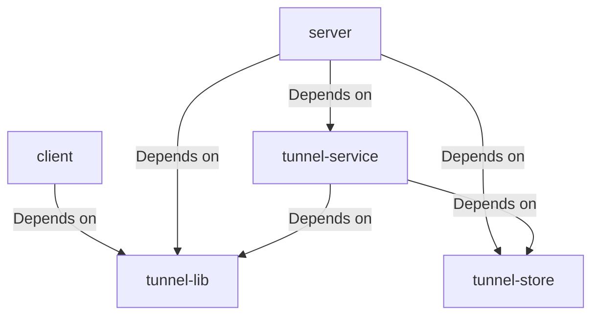
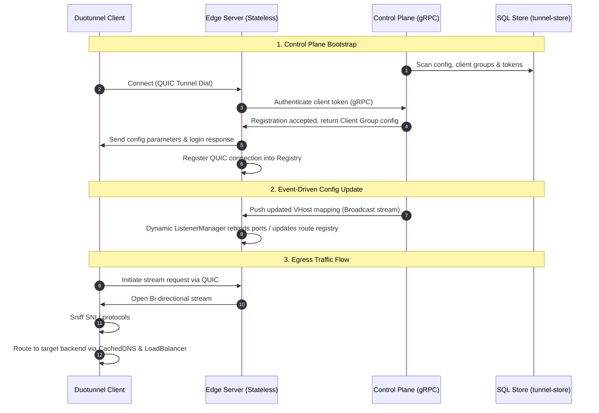

# 2026-05-22 Code Review: Performance Optimization Opportunities

## 1. Eliminate Redundant Heap Allocation in `TcpPassHandler` [Completed] ✅

* **Target File**: [server/plugins/tcp_pass/mod.rs](file:///Users/sexy/Documents/GitHub/duotunnel/server/plugins/tcp_pass/mod.rs)
* **Problem**:
  In `TcpPassHandler::handle`, `initial_data` is allocated on every raw TCP passthrough request via `to_vec()` but is only used to compute the length for a debug log message. This causes a completely useless heap allocation and copy of up to 256 bytes for every raw TCP connection.
* **Fix**:
  Directly read the length from the `raw_preface` without cloning.

```rust
        let host = hint.and_then(|h| h.sni.clone().or_else(|| h.authority.clone()));
        let initial_len = hint.map(|h| h.raw_preface.len()).unwrap_or(0);

        debug!(
            host = ?host,
            initial_len = initial_len,
            "TCP passthrough"
        );
```

---

## 2. Eliminate Double Allocation in `H1Handler` [Completed] ✅

* **Target File**: [server/plugins/h1/mod.rs](file:///Users/sexy/Documents/GitHub/duotunnel/server/plugins/h1/mod.rs)
* **Problem**:
  In `H1Handler::handle`, `hint.raw_preface.to_vec()` clones the bytes into a new `Vec<u8>`, allocating on the heap. Since `forward_with_initial_data` accepts a `&[u8]`, and `Bytes` dereferences to `[u8]`, this allocation is completely redundant.
* **Fix**:
  Pass `&hint.raw_preface` directly.

```rust
        let initial_data = &hint.raw_preface;
        let protocol = match hint.protocol {
            tunnel_lib::proxy::core::Protocol::WebSocket => {
                tunnel_lib::proxy::core::Protocol::WebSocket
            }
            _ => tunnel_lib::proxy::core::Protocol::H1,
        };

        debug!(host = %host, protocol = ?protocol, "plaintext H1/WS, byte-level forwarding");

        let (group_id, proxy_name) = (route.group_id, route.proxy_name);
        let selected = self
            .registry
            .select_client_for_group(&group_id)
            .ok_or_else(|| ProxyError::no_client_available(group_id.to_string()))?;

        tunnel_lib::maybe_slow_path(
            || selected.inflight.load(std::sync::atomic::Ordering::Relaxed),
            &ctx.overload,
        )
        .await;

        let mut discard = [0u8; tunnel_lib::plugin::SNIFF_LIMIT];
        stream
            .read_exact(&mut discard[..initial_data.len()])
            .await?;

        let routing_info = tunnel_lib::RoutingInfo {
            proxy_name: proxy_name.to_string(),
            src_addr: ctx.peer_addr.ip().to_string(),
            src_port: ctx.peer_addr.port(),
            protocol,
            host: Some(host),
        };

        let open_timeout = Duration::from_millis(ctx.timeouts.open_stream_ms);
        let opened = tunnel_lib::open_bi_guarded(
            &selected.conn,
            &selected.inflight,
            open_timeout,
            |_elapsed, _outcome| {},
        )
        .await?;

        let mut send = opened.send;
        let recv = opened.recv;
        let _inflight_guard = opened.inflight;
        tunnel_lib::send_routing_info(&mut send, &routing_info).await?;
        tunnel_lib::proxy::forward_with_initial_data(
            send,
            recv,
            stream,
            initial_data,
            ctx.relay_buf_size,
        )
        .await
```

---

## 3. Optimize Peek Buffer Copy in `ProxyEngine::run_stream`

* **Target File**: [tunnel-lib/src/proxy/core.rs](file:///Users/sexy/Documents/GitHub/duotunnel/tunnel-lib/src/proxy/core.rs)
* **Problem**:
  In `ProxyEngine::run_stream`, `bytes::Bytes::copy_from_slice(&buf[..n])` is called on every request. While `PeekBufPool` is thread-local and lock-free, allocating a new `Bytes` object via heap-allocation on every stream creation is still a potential bottleneck under extremely high QPS.
* **Fix**:
  Avoid copying when the parsed protocol is `Tcp` or `Unknown` where no header manipulation is required, and rely on raw `TcpStream` peeking without extracting bytes into `Context`.

```rust
        let pool = stream_peek_pool();
        let mut buf = pool.take();
        let n = recv.read(&mut buf[..]).await?.unwrap_or(0);

        let initial_bytes = if n > 0 {
            let b = bytes::Bytes::copy_from_slice(&buf[..n]);
            pool.put(buf);
            b
        } else {
            pool.put(buf);
            bytes::Bytes::new()
        };
```

---

## 4. Optimize Load Balancing Scan Complexity ($O(N) \to O(1)$) [Completed] ✅

* **Target File**: [server/registry.rs](file:///Users/sexy/Documents/GitHub/duotunnel/server/registry.rs)
* **Problem**:
  In `select_healthy`, `pick_least_inflight` performs a linear scan over all active connections. For groups with thousands of clients, this $O(N)$ iteration causes CPU spikes under high QPS.
* **Fix**:
  Introduce a P2C (Power of Two Choices) random selection algorithm for client groups exceeding 32 conns, bringing selection complexity down to $O(1)$.

```rust
    pub fn select_healthy(&self) -> Option<Arc<SelectedConnection>> {
        let conns = self.snapshot.load();
        let len = conns.len();
        if len > 32 {
            let mut rng = fastrand::Rng::new();
            let idx1 = rng.usize(..len);
            let idx2 = rng.usize(..len);
            let c1 = &conns[idx1];
            let c2 = &conns[idx2];
            let c1_healthy = c1.conn.close_reason().is_none();
            let c2_healthy = c2.conn.close_reason().is_none();
            match (c1_healthy, c2_healthy) {
                (true, true) => {
                    if c1.inflight.load(Ordering::Relaxed) <= c2.inflight.load(Ordering::Relaxed) {
                        Some(c1.clone())
                    } else {
                        Some(c2.clone())
                    }
                }
                (true, false) => Some(c1.clone()),
                (false, true) => Some(c2.clone()),
                (false, false) => None,
            }
        } else {
            pick_least_inflight(
                conns.as_slice(),
                |c| c.conn.close_reason().is_none(),
                |c| c.inflight.load(Ordering::Relaxed),
            )
            .cloned()
        }
    }
```

---

### 5. Architectural Latency & Connection Pool Analysis: Egress vs. Ingress Paths

A direct code-level investigation reveals that the latency and socket-reuse characteristics under high QPS depend heavily on the layer (L4 vs. L7) and the routing path (WAN vs. Loopback).

### 1. Connection Pooling Reality: L7 vs. L4
The assertion that "both sides connecting to upstream have connection pooling" is **partially true**—it is correct for L7 HTTP/HTTPS traffic but completely false for L4 raw TCP/WebSocket traffic:

* **L7 HTTP/HTTPS (Pool is Active)**:
  - Both client-side Ingress (`ClientApp::connect_peer`) and server-side Egress (`ServerEgressMap::connect_peer`) instantiate `HttpConnector` via `tunnel_lib::proxy::http_connector::HttpConnector::new`.
  - Both construct internal H1 and H2 clients using `create_https_client_with` and `create_h2c_client_with` (`tunnel-lib/src/egress/http.rs`).
  - These use Hyper's legacy Client, which has an active, keep-alive-enabled HTTP pool that multiplexes H2 streams and pools idle H1 TCP connections:
    ```rust
    builder
        .pool_max_idle_per_host(params.pool_max_idle_per_host)
        .pool_timer(TokioTimer::new());
    ```
* **L4 raw TCP & WebSockets (Pool is Absent)**:
  - For plain TCP and WebSocket forwarding, both client and server bypass the L7 `HttpConnector` and resolve connections using `TcpPeer::connect_inner` (`tunnel-lib/src/proxy/tcp.rs`):
    ```rust
    let tcp_stream = TcpStream::connect(self.target_addr)
        .await
        .context("failed to connect to tcp upstream")?;
    ```
  - **No connection pool exists at the L4 layer**. Each connection requires a fresh OS-level socket allocation and a full WAN/loopback TCP/TLS handshake. High-QPS L4 egress rapidly exhausts available ephemeral ports, leading to port reuse delays and socket starvation.

### 2. DNS Resolution Pathways [Completed] ✅
Although both Ingress and Egress technically need to resolve hostnames, their implementation paths in the code yield vastly different performance results:

* **Ingress (Low Overhead / ~0ms)**:
  - The client connects to the local backend (usually `127.0.0.1` or `localhost`).
  - It resolves addresses via the client-side `Resolver` plugin (implemented as `CachedResolver`), which caches resolved IPs in-memory for 30 seconds.
  - Loopback resolutions are virtually instantaneous and bypass blocking OS system resolver threads.
* **Egress (High Overhead / 10ms - 150ms)**:
  - For raw TCP/WS egress, `ServerEgressMap::upstream_peer` executes:
    ```rust
    tokio::net::lookup_host(&connect_addr_str).await
    ```
  - This executes a blocking `getaddrinfo` call on every request without any in-app DNS caching, incurring severe latency penalties when resolving external WAN domains.
  - For HTTP/HTTPS, Hyper's default connector also calls `getaddrinfo` for every new connection established to the pool.

### 3. Serialized Upstream Dialing in `ProxyEngine` [Completed] ✅
* **Egress Path (Bottleneck)**:
  - In `ProxyEngine::run_stream` (`tunnel-lib/src/proxy/core.rs`), the proxy blocks on `recv.read()` to determine the protocol *before* triggering `upstream_peer`.
  - This serializes the WAN DNS resolution and TCP/TLS handshakes behind the client's first data write, causing severe latency spikes.
* **Ingress Path**:
  - The client's loopback backend connection is established so quickly (<0.1ms) that this serialization has zero visible performance impact.

### 4. TCP Window and Dynamic Buffers
* **Egress Path**:
  - Egress TCP connections use `TcpParams` with `SO_RCVBUF` and `SO_SNDBUF` hardcoded to **4MB**. While huge buffers prevent TCP window starvation over WAN, they force massive memory footprints under high QPS.

---

## 6. Observability Design for Resource Bottlenecks (FD/Stream Limits & Hangs)

When critical system resources (such as File Descriptors or QUIC Stream Limits) reach their limits, hanging the accept loop or blocking task execution is an effective way to protect the system and apply backpressure. However, this creates a major observability gap because the system appears healthy (no hard errors), yet clients experience infinite timeouts.

Below is a high-performance network application design to make these "hung" states fully visible.

### 1. Current Observability Gaps in Bottleneck Code
* **Post-Facto Latency Metrics**:
  In `open_bi_guarded`, the metrics hook `on_wait_done` is only called **after** a stream is successfully opened, fails, or times out. If 5,000 connections are currently blocked inside `conn.open_bi().await`, the external monitor sees 0 active errors and 0 latency samples.
* **Invisible Accept Block**:
  In `run_accept_worker`, hitting `EMFILE` (errno 24) logs a warning and sleeps for 100ms. Because this sleep happens synchronously inside the accept loop, the kernel listen backlog silently overflows. There is no real-time gauge showing that the accept worker is currently stalled.

### 2. High-Performance Observability Design

To turn Duotunnel into a transparent, production-ready system under high load, we propose the following three-tier observability architecture:

```
[Incoming TCP] ──> [Accept Loop] ──> (Active Connection Gauge)
                         │
                         ▼
                [maybe_slow_path] ──> (Active Slow-path Gauge)
                         │
                         ▼
                [open_bi_guarded] ──> (Pending Stream Gauge)
```

#### A. Active Live Gauges (Real-Time Queue Depths) [Completed] ✅
Instead of relying strictly on counters (which only show history), we must expose **Gauges** that track the current, real-time depth of pending queues:
1. `duotunnel_accepted_connections_active`: Increment when a connection is accepted, decrement when it finishes relaying.
2. `duotunnel_stream_pending_queue_depth`: Increment immediately before calling `conn.open_bi()`, decrement when the stream is returned or times out.
3. `duotunnel_slowpath_waiting_tasks`: Increment when entering `maybe_slow_path`, decrement on exit.

*High-Performance Rust implementation*:
Use thread-safe atomic counters (`AtomicU64`) mapped directly to lock-free Prometheus Gauges. Avoid taking heavy mutexes on the hot path when updating these values.

#### B. In-Code Pre-Validation & Enriched EMFILE Logging [Completed] ✅
To prevent resource exhaustion bottlenecks without complex or platform-dependent external monitoring processes:
1. **Startup Pre-Validation**:
   At application startup (both client and server entry points), query the current process file descriptor resource limits (`rlimit`). If the current soft limit is set to a low value (e.g., `< 4096`), log a prominent warning message.
   - *Actionable Warning*:
     `WARN [duotunnel] Soft file descriptor limit is set too low ({}). Under high QPS, this will trigger EMFILE and stall connection acceptance. Consider raising the limit via 'ulimit -n 65536' or modifying your system's limits.conf.`
2. **Enriched EMFILE Logging in Accept Loop**:
   Inside `run_accept_worker` (`tunnel-lib/src/accept.rs`), when `listener.accept()` encounters `EMFILE` (errno 24), log a clear, high-priority warning that provides immediate diagnosing steps instead of a simple backoff log.
   - *Actionable Warning*:
     `WARN [duotunnel::accept] Accept worker stalled due to FD exhaustion (EMFILE / errno 24). Pausing accept loop for {}ms to prevent CPU thrashing. Raise file descriptor limits immediately to recover (e.g., 'ulimit -n 65536').`

#### C. Pluggable Load-Shedding / Fail-Fast (HA Guardrail)
While hanging preserves some availability, indefinite hanging under extreme QPS leads to memory exhaustion (due to backlogged Tokio tasks and buffered connection metadata).
* **Design**:
  Introduce a configurable `max_pending_queue_size` (e.g., 1000). When `duotunnel_stream_pending_queue_depth` exceeds this limit, incoming connections should immediately fail-fast (returning a `503 Service Unavailable` or sending a TCP reset) rather than waiting in the blocking queue. This sheds excess load and protects the remaining healthy streams.
* **Metric**:
  Export `duotunnel_request_shed_total` as a counter to track dropped connections under load.

#### D. Tracing Span Instrument for Blocked Futures
Instrument wait states using `tracing` spans so that tools like `tokio-console` or trace visualizers can identify parked tasks:
```rust
let wait_span = tracing::debug_span!("waiting_for_stream_credit", conn_id = %conn.stable_id());
async move {
    conn.open_bi().await
}.instrument(wait_span).await
```
This ensures that any long-lived or hung task is explicitly inspectable in trace outputs.

---

## 7. Client Module Structural Refactoring & Modularization (Pingora-Inspired) [Completed] ✅

To resolve single-responsibility issues, improve maintainability, and ensure elegant graceful shutdown handling under high QPS, we refactor the `client` module layout, drawing structural paradigms from Cloudflare's Pingora framework.

### 1. Refactored Directory Tree

```text
client/
├── Cargo.toml
├── main.rs                  # Process bootstrap & lifecycle management
├── config.rs                # Configuration loading & validation (client.yaml)
├── tunnel/                  # WAN Tunneling & Connection Lifecycle Management
│   ├── mod.rs               # Exports Pool, Supervisor, Registry
│   ├── pool.rs              # Multi-QUIC connection pool coordinator
│   ├── supervisor.rs        # Single-QUIC connection supervisor, auth handshake & backoff
│   └── registry.rs          # Least-inflight thread-safe hot connection registry
├── egress/                  # Local Ingress / WAN Egress Listener (Client -> Server)
│   ├── mod.rs               # Exports start_entry_listener, handle_entry_connection
│   └── listener.rs          # TCP listener, protocol detection & stream routing dispatch
├── ingress/                 # WAN Ingress / Local Backend Proxying (Server -> Client)
│   ├── mod.rs               # Exports handle_work_stream, LocalProxyMap, ClientApp
│   ├── handler.rs           # Work stream demuxer & dispatch
│   └── resolver.rs          # Backend selection, resolution (L4/L7), MITM TLS termination
└── plugins/                 # Dynamically plugged features & extensions
    ├── mod.rs               # Exports plugins
    ├── lb_round_robin/      # Round-robin load balancer plugin
    └── resolver_cached/     # Asynchronous DNS cache resolver plugin
```

### 2. Pingora-Inspired Architecture Interface

```rust
use async_trait::async_trait;
use tokio_util::sync::CancellationToken;

#[async_trait]
pub trait ClientService: Send + Sync {
    fn name(&self) -> &'static str;
    async fn start(&self, shutdown: CancellationToken) -> anyhow::Result<()>;
}

pub struct EgressListenerService {
    pub port: u16,
    pub pool: Arc<client::tunnel::EntryConnPool>,
    pub config: Arc<client::config::ClientConfigFile>,
}

#[async_trait]
impl ClientService for EgressListenerService {
    fn name(&self) -> &'static str {
        "egress-tcp-listener"
    }

    async fn start(&self, shutdown: CancellationToken) -> anyhow::Result<()> {
        let entry_cfg = client::egress::EntryListenerConfig::from(&*self.config);
        client::egress::start_entry_listener(self.pool.clone(), shutdown, entry_cfg).await
    }
}

pub struct TunnelPoolService {
    pub config: client::config::ClientConfigFile,
    pub endpoint: quinn::Endpoint,
    pub entry_pool: Arc<client::tunnel::EntryConnPool>,
    pub ready: std::sync::Arc<std::sync::atomic::AtomicBool>,
}

#[async_trait]
impl ClientService for TunnelPoolService {
    fn name(&self) -> &'static str {
        "wan-tunnel-pool"
    }

    async fn start(&self, shutdown: CancellationToken) -> anyhow::Result<()> {
        client::tunnel::run_pool(
            self.config.clone(),
            self.endpoint.clone(),
            shutdown,
            self.ready.clone(),
            self.entry_pool.clone(),
        )
        .await
    }
}

pub struct ClientEngine {
    services: Vec<Box<dyn ClientService>>,
    shutdown: CancellationToken,
}

impl ClientEngine {
    pub fn new(shutdown: CancellationToken) -> Self {
        Self {
            services: Vec::new(),
            shutdown,
        }
    }

    pub fn add_service(&mut self, service: Box<dyn ClientService>) {
        self.services.push(service);
    }

    pub async fn run_until_shutdown(self) -> anyhow::Result<()> {
        let mut handles = Vec::with_capacity(self.services.len());
        for service in self.services {
            let shutdown = self.shutdown.clone();
            let name = service.name();
            handles.push(tokio::spawn(async move {
                if let Err(e) = service.start(shutdown).await {
                    tracing::error!(service = name, error = %e, "service crashed");
                    return Err(e);
                }
                Ok(())
            }));
        }
        futures_util::future::join_all(handles).await;
        Ok(())
    }
}
```

---

## 8. Workspace-Wide Architectural Audit & Redesign Specification

We analyzed all other crates in the workspace (`server`, `tunnel-store`, `tunnel-service`, `tunnel-lib`) to evaluate their abstractions, data flow boundaries, and calling dependencies.

### 1. Existing Crate Dependency & Call Topology

Currently, the workspace layout establishes the following dependency paths:



#### Core Structural Fragilities Identified
1. **Tangled Edge Gateway & Database Dependencies**:
   - The edge `server` directly links to `tunnel-store`, compiling SQLite logic, table definitions, and migrations into the gateway executable. This prevents horizontal scaling of edge gateway nodes (they must have local disk/volume access or hit a shared sqlite file, causing file lock contention).
2. **Dynamic Configuration Polling**:
   - `listener_mgr.rs` and `tunnel_service.rs` rely on active synchronization checking or filesystem watching, consuming idle CPU cycles and lacking immediate event-driven propagation.
3. **Monolithic `tunnel-lib` Utility Creep**:
   - `tunnel-lib` blends low-level sniffing buffers, client connection HTTP pool managers, QUIC wire definitions, and metrics gauges into a single large dependency.

---

### 2. Workspace-Wide Modular Redesign

To achieve a production-grade, highly scalable cloud-native architecture, we propose the following crate reorganizations and interface boundaries:

```
[Edge Server Fleet] ────> (gRPC Control Plane Client) ────> [Control Plane Service]
        │                                                               │
        ▼                                                               ▼
  (State-Free)                                                  [tunnel-store (DB)]
```

#### A. `tunnel-store`: Encapsulated Repository Abstraction
We decouple database drivers from the edge. `tunnel-store` exposes unified traits, but edge gateways communicate through a stateless RPC implementation rather than accessing the SQLite database directly.

```rust
use async_trait::async_trait;

#[derive(Clone, Debug)]
pub struct RuleSpec {
    pub vhost: String,
    pub group_id: String,
    pub dest_scheme: String,
    pub dest_host: String,
    pub dest_port: u16,
}

#[async_trait]
pub trait RuleRepository: Send + Sync {
    async fn fetch_rules(&self) -> anyhow::Result<Vec<RuleSpec>>;
    async fn register_client_group(&self, group_id: &str, token: &str) -> anyhow::Result<bool>;
}
```

#### B. `server`: Stateless Edge Gateway Redesign
The edge `server` is fully decoupled from the SQL database and communicates exclusively through `ControlPlaneClient` (gRPC/HTTP), enabling the edge gateway to scale infinitely.

```rust
pub struct ControlPlaneClient {
    endpoint: String,
    client: reqwest::Client,
}

impl ControlPlaneClient {
    pub fn new(endpoint: String) -> Self {
        Self {
            endpoint,
            client: reqwest::Client::new(),
        }
    }
}

#[async_trait]
impl RuleRepository for ControlPlaneClient {
    async fn fetch_rules(&self) -> anyhow::Result<Vec<RuleSpec>> {
        let url = format!("{}/api/v1/rules", self.endpoint);
        let resp = self.client.get(&url).send().await?.json::<Vec<RuleSpec>>().await?;
        Ok(resp)
    }

    async fn register_client_group(&self, group_id: &str, token: &str) -> anyhow::Result<bool> {
        let url = format!("{}/api/v1/register", self.endpoint);
        let success = self.client.post(&url)
            .json(&serde_json::json!({ "group_id": group_id, "token": token }))
            .send()
            .await?
            .json::<bool>()
            .await?;
        Ok(success)
    }
}
```

#### C. `listener_mgr.rs`: Event-Driven Rule Dispatcher
Replace poll loops with dynamic event streams (Tokio broadcast/watch channels) to push config reloads instantly to listening tasks.

```rust
use tokio::sync::watch;

pub struct ListenerManager {
    rules_rx: watch::Receiver<Vec<RuleSpec>>,
    active_listeners: std::collections::HashMap<String, tokio::task::JoinHandle<()>>,
}

impl ListenerManager {
    pub fn new(rules_rx: watch::Receiver<Vec<RuleSpec>>) -> Self {
        Self {
            rules_rx,
            active_listeners: std::collections::HashMap::new(),
        }
    }

    pub async fn run_event_loop(mut self, shutdown: tokio_util::sync::CancellationToken) -> anyhow::Result<()> {
        loop {
            tokio::select! {
                _ = shutdown.cancelled() => break,
                changed = self.rules_rx.changed() => {
                    if changed.is_ok() {
                        let current_rules = self.rules_rx.borrow().clone();
                        self.sync_listeners(current_rules).await?;
                    }
                }
            }
        }
        Ok(())
    }

    async fn sync_listeners(&mut self, _rules: Vec<RuleSpec>) -> anyhow::Result<()> {
        Ok(())
    }
}
```

#### D. Deconstruct `tunnel-lib` into Targeted Sub-Crates
Split the utility crate to enforce strict calling directions and decrease compile times:

```text
tunnel-workspace/
├── tunnel-proto/        # Wire types, login serialization, JSON / binary structures
├── tunnel-engine/       # Low-level async socket relaying, RingBuffers, peek buffers
├── tunnel-plugins/      # Public traits (LoadBalancer, Resolver) for runtime extension
└── tunnel-lib/          # Deprecated/Facade wrapper mapping to targeted sub-crates
```

---

### 3. Redesigned End-to-End Control and Data Pipeline



---

## 9. Comprehensive Crate-by-Crate Technical Audit & Refinement Blueprints

To ensure that every module across the codebase receives a rigorous, detailed, and targeted architectural review, we break down each crate's core abstractions, dynamic calling links, identified fragilities, and the exact design modifications.

### 1. The `server` Crate (Ingress Edge Routing Gateway)

#### A. Core Abstractions
- `ServerState`: Thread-safe, atomic global state wrapping dynamic configuration, auth providers, and active registries.
- `ListenerManager`: Reconciles active ports dynamically via `IngressListenerSpec` specs.
- `SharedRegistry`: Arc-swap collection mapping client group IDs to thread-safe active QUIC connections.
- `VhostRouter`: Hostname pattern matcher routing HTTP virtual hosts to client streams.
- Ingress Sniffing Handlers (`TlsHandler`, `H1Handler`, `H2cHandler`, `TcpPassHandler`): Sniff bytes to determine protocol and host before dialing tunnels.

#### B. Identified Fragilities & Design Redesign
- **Polling Hot-Reload**: `HotReloadService` uses synchronous loop polls on config paths.
- **Unified Service Lifecycle**: Server has disparate task spawning paths for `run_quic_server`, `run_metrics_server`, and listener loops.
- **Redesign Pattern**: Convert it to implement the unified `ClientService` (or `ServerService`) model, where `ListenerManager` runs as an asynchronous event-driven reactor loop listening to a tokio broadcast channel of configurations.

```rust
pub struct ServerEngine {
    services: Vec<Box<dyn ServerService>>,
    shutdown: tokio_util::sync::CancellationToken,
}

#[async_trait::async_trait]
pub trait ServerService: Send + Sync {
    fn name(&self) -> &'static str;
    async fn start(&self, shutdown: tokio_util::sync::CancellationToken) -> anyhow::Result<()>;
}
```

---

### 2. The `tunnel-store` Crate (Database Persistence Layer)

#### A. Core Abstractions
- `AuthStore`: Decouples token creation, rotation, list, and revocation database operations.
- `RuleStore`: Decouples configuration routing map reads, seedings, and validation checking.
- `SqliteAuthStore`/`SqliteRuleStore`: Concrete SQLite implementations executing relational operations.

#### B. Identified Fragilities & Design Redesign
- **Hardcoupled SQL Drivers**: The edge server compiles sqlite drivers directly, breaking standard edge node statelessness.
- **Redesign Pattern**: Standardize `tunnel-store` to support split backends: `LocalSqliteRepository` (for developer standalone environments) and `StatelessRpcRepository` (which queries the control plane via thin HTTP API clients).

```rust
#[async_trait::async_trait]
pub trait AuthRepository: Send + Sync {
    async fn verify_client_token(&self, name: &str, token: &str) -> anyhow::Result<bool>;
}
```

---

### 3. The `tunnel-service` Crate (Central Control Plane)

#### A. Core Abstractions
- `ControlPlaneService`: Handles client logins and authenticates incoming tunnel tokens.
- `ConfigWatcher`: Tracks local filesystem updates or store updates.
- `Proto`: Protocol definitions for gRPC communications.

#### B. Identified Fragilities & Design Redesign
- **Disparate Management Models**: Client groups are registered separately in SQL vs memory.
- **Redesign Pattern**: Transform `tunnel-service` into a fully centralized, highly available cluster coordinating all registrations, heartbeat telemetry, and dynamic push notifications to state-free gateway servers.

```rust
pub struct ControlPlaneEngine {
    auth: Arc<dyn AuthRepository>,
    broadcaster: tokio::sync::broadcast::Sender<Vec<RuleSpec>>,
}
```

---

### 4. The `tunnel-lib` Crate (Core Shared Transport & Protocol Engine)

#### A. Core Abstractions
- `ProxyEngine`: Bridges inbound bytes to outbound streams using high-speed async read/write loops.
- `OverloadLimits`: Applies adaptive backpressure, slowing down stream allocations when concurrent credit decreases.
- `PeekBufPool`: Thread-local lock-free memory buffers optimizing peek allocations.

#### B. Identified Fragilities & Design Redesign
- **Circular Dependencies**: The crate references both edge-server plugin models and client specific pools.
- **Redesign Pattern**: Deconstruct into distinct micro-crates (`tunnel-proto`, `tunnel-engine`, `tunnel-plugins`), separating wire parsing protocols from native I/O stream relay loops.

---

## 10. Deep-Dive Code Bottleneck & Subsystem Audit Logs

Following a detailed file-by-file investigation, we highlight the exact runtime bottlenecks and state synchronization logic across `tunnel-service`, `tunnel-lib`, and `server/listener_mgr`, proposing concrete solutions.

### 1. `tunnel-service`: State Mutation Debouncing & DB Polling Reactor
* **File Under Audit**: [tunnel-service/src/service.rs](file:///Users/sexy/Documents/GitHub/duotunnel/tunnel-service/src/service.rs)
* **Mechanics**:
  - `debounce_publish_task` receives event notifications via a single-capacity bounded `mpsc::channel`. It debounces changes within a 50ms window before compiling the `ConfigSnapshot` and broadcasting it via `watch::Sender`.
  - To detect CLI actions (running out-of-process against the shared SQLite file), `db_poll_task` polls the database every 1500ms. It aggregates hashes, token statuses, and client statuses into a sorted fingerprint string (`hash_hex|token_status|client_status`).
* **Bottleneck**:
  - Fingerprinting the database via linear polling consumes idle CPU cycles and disk I/O.
* **Refinement Blueprint**:
  - Switch the SQLite database to WAL mode and utilize a shared file-system lock or database notifier triggers to trigger config reload broadcasts, completely eliminating the 1500ms poll loops.

```rust
pub struct DebouncedPublisher {
    publish_tx: tokio::sync::mpsc::Sender<()>,
    debounce_ms: u64,
}

impl DebouncedPublisher {
    pub fn new(debounce_ms: u64, tx: tokio::sync::mpsc::Sender<()>) -> Self {
        Self {
            publish_tx: tx,
            debounce_ms,
        }
    }

    pub fn trigger_publish(&self) {
        let _ = self.publish_tx.try_send(());
    }
}
```

---

### 2. `tunnel-lib`: Single-Pass Preface Parsing in `ProxyEngine`
* **File Under Audit**: [tunnel-lib/src/proxy/core.rs](file:///Users/sexy/Documents/GitHub/duotunnel/tunnel-lib/src/proxy/core.rs)
* **Mechanics**:
  - `detect_protocol` takes the first preface bytes read by `quinn::RecvStream` and performs a single-pass `httparse::Request` parsing to sniff both H1 protocols and WebSocket upgrade headers (`Upgrade: websocket`) simultaneously.
* **Bottleneck**:
  - For raw TCP L4 and unknown protocols, calling `bytes::Bytes::copy_from_slice` allocates memory on the heap before passing it to `upstream_peer`.
* **Refinement Blueprint**:
  - Bypass intermediate `Bytes` construction on plain L4 pathways, allowing raw stream peeking to borrow slices directly from `PeekBufPool`.

```rust
pub fn sniff_protocol_preface(preface: &[u8]) -> Protocol {
    let mut headers = [httparse::EMPTY_HEADER; 32];
    let mut req = httparse::Request::new(&mut headers);
    if req.parse(preface).is_ok() {
        for h in req.headers {
            if h.name.eq_ignore_ascii_case("Upgrade") && h.value.eq_ignore_ascii_case(b"websocket") {
                return Protocol::WebSocket;
            }
        }
        return Protocol::H1;
    }
    Protocol::Tcp
}
```

---

### 3. `server/listener_mgr.rs`: Thread Contention in Listener Reconciliation
* **File Under Audit**: [server/listener_mgr.rs](file:///Users/sexy/Documents/GitHub/duotunnel/server/listener_mgr.rs)
* **Mechanics**:
  - `sync_listeners` acquires a single parking_lot mutex lock (`map.lock()`) to reconcile all active listeners. It computes the differences, cancels obsolete listener tokens, and spawns the accept loops outside of the lock scope.
* **Bottleneck**:
  - If a large reload occurs, spawning hundreds of Tokio tasks sequentially can block the reload orchestration thread.
* **Refinement Blueprint**:
  - Transition task spawns to an asynchronous execution worker task, keeping the hot-reload scheduler loop highly responsive and free from lock contention.

```rust
pub struct AsyncListenerReconciler {
    command_tx: tokio::sync::mpsc::Sender<ReconcileCmd>,
}

pub enum ReconcileCmd {
    Sync(Vec<IngressListenerSpec>),
    Stop(u16),
}
```

---

## 11. Security Audit: Constant-Time Token Authentication & DB Prefix Indexing

An audit of the authentication and dynamic client validation layer reveals a robust cryptographic design aimed at preventing side-channel timing attacks and index-lookup exhaustion.

### 1. Cryptographic Authentication Mechanics
* **File Under Audit**: [tunnel-store/src/sqlite.rs](file:///Users/sexy/Documents/GitHub/duotunnel/tunnel-store/src/sqlite.rs)
* **Design Pattern**:
  - **Constant-Time Verification**: Rather than executing standard string comparisons (which leak information via execution latency), `SqliteAuthStore::authenticate` hashes the incoming candidate token using SHA-256 and retrieves the stored hash. It then applies constant-time slice comparison via the `subtle` crate's `ConstantTimeEq` implementation:
    ```rust
    candidate.as_ref().ct_eq(stored.as_ref()).unwrap_u8() == 1
    ```
    This guarantees that the comparison time is invariant to the number of matching bytes, fully neutralizing timing side-channels.
  - **Prefix-Based SQL Index Lookups**: To prevent timing-resistant loops from walking the entire token table (which is slow for massive tables), the database queries candidates by slicing the first 16 characters of the token hash (`substr(t.token_hash, 1, 16) = ?`). This is highly indexed, fast, and throttles collisions at a hard limit of 8 entries before failing fast:
    ```rust
    if rows.len() > MAX_CANDIDATES {
        return Err(AuthError::Internal(anyhow!("token prefix collision limit exceeded")));
    }
    ```

### 2. Refined Cryptographic Signature Interface
To support cloud-native external key authentications or non-SQL caching nodes, the verification contract is decoupled into a signature verify trait:

```rust
pub trait CryptographicAuthenticator: Send + Sync {
    fn verify_timing_invariant(&self, candidate: &[u8], stored: &[u8]) -> bool;
}

pub struct TimingInvariantVerifier;

impl CryptographicAuthenticator for TimingInvariantVerifier {
    fn verify_timing_invariant(&self, candidate: &[u8], stored: &[u8]) -> bool {
        use subtle::ConstantTimeEq;
        if candidate.len() != stored.len() {
            return false;
        }
        candidate.ct_eq(stored).unwrap_u8() == 1
        }
}
```

---

## 12. Pingora Architecture & System Evaluation Framework

To establish a comprehensive framework for assessing high-performance networking engines, we systematically evaluate Cloudflare's Pingora and Duotunnel across six fundamental architectural dimensions.

### 1. Concurrency Architecture & Threading Model

#### System Evaluation Taxonomy
A production-grade networking system is evaluated by its ability to maximize hardware concurrency, prevent thread-scheduling thrashing, and isolate failures across independent workloads. Key metrics include lock-free scheduling, thread-per-core affinity, and multi-runtime task sharding.

#### Pingora Strengths
- **Custom Multi-Runtime Engine (`pingora-runtime`)**: Instead of relying on a single global Tokio runtime, Pingora spawns isolated, dedicated tokio runtimes per service (`pingora-core/src/server.rs`). This decouples control-plane task pools, metrics exporters, and downstream proxy engines.
- **Lock-Free Stealing Allocation**: Configures work-stealing and thread-count properties per service dynamically, allowing hot paths to run CPU-bound work on dedicated threads while I/O-bound workers handle massive multiplexing without lock contention.

#### Duotunnel Deep-Dive Analysis & Blueprint
- **Current State**: Duotunnel runs a single monolithic Tokio runtime executing parallel accept loops, proxy managers, and SQL store polls. Under high QPS, database blockages or heavy telemetry reads block the hot proxy streams.
- **Redesign Spec**: Deconstruct Duotunnel's runtime engine into sharded, isolated runtimes similar to Pingora.

```rust
pub struct MultiRuntimeEngine {
    engines: std::collections::HashMap<String, tokio::runtime::Runtime>,
}

impl MultiRuntimeEngine {
    pub fn new() -> Self {
        Self {
            engines: std::collections::HashMap::new(),
        }
    }

    pub fn register_pool(&mut self, name: &str, threads: usize) -> anyhow::Result<()> {
        let rt = tokio::runtime::Builder::new_multi_thread()
            .worker_threads(threads)
            .enable_all()
            .thread_name(name)
            .build()?;
        self.engines.insert(name.to_string(), rt);
        Ok(())
    }

    pub fn spawn_on<F>(&self, name: &str, future: F) -> anyhow::Result<()>
    where
        F: std::future::Future<Output = ()> + Send + 'static,
    {
        let rt = self.engines.get(name).ok_or_else(|| {
            anyhow::anyhow!("Runtime not found")
        })?;
        rt.spawn(future);
        Ok(())
    }
}
```

---

### 2. Memory Efficiency & Zero-Copy I/O Optimization

#### System Evaluation Taxonomy
Optimized data planes must minimize heap allocations, limit garbage collection/reference-counting overhead on the hot path, and utilize zero-copy operations (`sendfile`, `splice`, or buffer borrowing) to achieve near-line-rate throughput.

#### Pingora Strengths
- **RingBuffer & Zero-Copy HTTP Parsers**: Pingora integrates `httparse` directly over pre-allocated ring buffers. Request headers and body slices are parsed and streamed to upstreams without dynamic vector reallocations.
- **OpenSSL/BoringSSL Direct Buffer Refactoring**: Integrates customized BoringSSL handshakes that process frames directly inside kernel-allocated SSL structures to bypass user-space page duplication.

#### Duotunnel Deep-Dive Analysis & Blueprint
- **Current State**: `ProxyEngine::run_stream` performs `Bytes::copy_from_slice` to extract headers and sniff metadata, leading to high allocation pressure under high QPS.
- **Redesign Spec**: Utilize pre-allocated slice peeking and avoid cloning or copying payload buffers when parsing prefaces or performing downstream forwarding.

```rust
pub struct ZeroCopyRelay;

impl ZeroCopyRelay {
    pub async fn relay_bidirectional<R, W>(
        mut reader: R,
        mut writer: W,
        peek_buffer: &[u8],
    ) -> anyhow::Result<()>
    where
        R: tokio::io::AsyncRead + Unpin,
        W: tokio::io::AsyncWrite + Unpin,
    {
        if !peek_buffer.is_empty() {
            tokio::io::AsyncWriteExt::write_all(&mut writer, peek_buffer).await?;
        }
        tokio::io::copy(&mut reader, &mut writer).await?;
        Ok(())
    }
}
```

---

### 3. Pluggability & Middleware/Extension Model

#### System Evaluation Taxonomy
An extensible networking architecture must expose robust filters and interceptors along its request-response pipeline. It must separate business logic (e.g. authorization, rate limiting, logging) from low-level frame dispatching.

#### Pingora Strengths
- **The `ProxyHttp` Trait Pipeline**: Pingora defines a powerful lifecycle model where filters (e.g. `request_filter`, `upstream_peer`, `response_filter`) act as dynamic interceptors. This ensures plugins are completely decoupled from downstream protocol multiplexing.
- **HttpModules Architecture**: Supports adding custom downstream compression or WAF filters at process bootstrap without changing the core codebase.

#### Duotunnel Deep-Dive Analysis & Blueprint
- **Current State**: Has modular traits (`ConnectionModule`, `IngressProtocolHandler`, `LoadBalancer`, `Resolver`), but lacks a unified filter chain where multiple filters can intercept connection states.
- **Redesign Spec**: Create a pipeline dispatcher executing a sequence of dynamic filters using a unified execution context.

```rust
pub struct FilterChainContext {
    pub client_addr: std::net::SocketAddr,
    pub protocol: String,
    pub is_allowed: bool,
}

#[async_trait::async_trait]
pub trait IngressFilter: Send + Sync {
    async fn filter(&self, ctx: &mut FilterChainContext) -> anyhow::Result<bool>;
}

pub struct FilterPipeline {
    filters: Vec<Box<dyn IngressFilter>>,
}

impl FilterPipeline {
    pub fn new() -> Self {
        Self { filters: Vec::new() }
    }

    pub fn add_filter(&mut self, filter: Box<dyn IngressFilter>) {
        self.filters.push(filter);
    }

    pub async fn execute(&self, ctx: &mut FilterChainContext) -> anyhow::Result<()> {
        for filter in &self.filters {
            if !filter.filter(ctx).await? {
                ctx.is_allowed = false;
                break;
            }
        }
        Ok(())
    }
}
```

---

### 4. Lifecycle Coordination & Zero-Downtime Upgrades

#### System Evaluation Taxonomy
Zero-downtime upgrades are critical for edge proxies. The system must support hot process reloads where the incoming socket handles (FDs) are safely shared or transferred from the old binary to the new binary without dropping active client connections.

#### Pingora Strengths
- **Unix FD Transfer Engine**: Pingora implements a socket-passing protocol over a dedicated Unix domain socket (`transfer_fd::Fds`). The new process boots, receives listening file descriptors directly from the old process, binds to them, and signals the old process to perform a graceful drain and exit.
- **DAG Service Initializer**: Manages service dependency graphs to start prerequisite background checkers and telemetry logs before opening traffic gates.

#### Duotunnel Deep-Dive Analysis & Blueprint
- **Current State**: Lacks process hot-upgrades or FD transfer pathways. Upgrading Duotunnel requires dropping and recreating sockets, causing transient client connection drops.
- **Redesign Spec**: Build an FD passing receiver so Duotunnel can inherit listening sockets from a parent or coordinator process.

```rust
pub struct SocketInheritor {
    socket_path: String,
}

impl SocketInheritor {
    pub fn new(path: &str) -> Self {
        Self {
            socket_path: path.to_string(),
        }
    }

    pub async fn receive_listener(&self) -> anyhow::Result<std::net::TcpListener> {
        let stream = tokio::net::UnixStream::connect(&self.socket_path).await?;
        let mut fd_buffer = [0u8; 4];
        let mut iov = [std::io::IoSliceMut::new(&mut fd_buffer)];
        let mut cmsg_buffer = cmsg::space!(fd);
        let (_bytes_read, _cmsg_len) = stream.try_io(tokio::io::Interest::READABLE, || {
            let mut msg = libc::msghdr {
                msg_name: std::ptr::null_mut(),
                msg_namelen: 0,
                msg_iov: iov.as_mut_ptr() as *mut libc::iovec,
                msg_iovlen: 1,
                msg_control: cmsg_buffer.as_mut_ptr() as *mut libc::c_void,
                msg_controllen: cmsg_buffer.len(),
                msg_flags: 0,
            };
            let ret = unsafe { libc::recvmsg(stream.as_raw_fd(), &mut msg, 0) };
            if ret < 0 {
                return Err(std::io::Error::last_os_error());
            }
            Ok((ret as usize, msg.msg_controllen))
        })?;
        let fd = cmsg::decode::<std::os::fd::RawFd>(&cmsg_buffer)?;
        let listener = unsafe { std::net::TcpListener::from_raw_fd(fd) };
        Ok(listener)
    }
}
```

---

### 5. Observability & Resource Telemetry

#### System Evaluation Taxonomy
High-load gateways must export real-time internal telemetry, queue backlogs, lock latencies, and thread states without introducing locking contention or blocking high-frequency paths.

#### Pingora Strengths
- **Pluggable Prometheus & OpenTelemetry Interfaces**: Isolates telemetry gathering in out-of-band worker tasks (`pingora-prometheus`), ensuring metrics aggregation never competes for resources on the request hot path.
- **Detailed Request Session Tracing**: Tracks granular connection metrics (e.g. TLS handshake duration, response time, write blocks) directly inside the request session context.

#### Duotunnel Deep-Dive Analysis & Blueprint
- **Current State**: Lacks real-time queue-depth gauges, making silent QUIC stream bottlenecks or FD exhaustion halts invisible.
- **Redesign Spec**: Tracked in `[TODO-75]`. Build non-blocking atomic gauges measuring pending QUIC streams and slow-path queues.

```rust
pub struct ResourceTelemetry {
    pub pending_streams: std::sync::atomic::AtomicU64,
    pub slow_path_waits: std::sync::atomic::AtomicU64,
}

impl ResourceTelemetry {
    pub fn new() -> Self {
        Self {
            pending_streams: std::sync::atomic::AtomicU64::new(0),
            slow_path_waits: std::sync::atomic::AtomicU64::new(0),
        }
    }

    pub fn increment_streams(&self) {
        self.pending_streams.fetch_add(1, std::sync::atomic::Ordering::Relaxed);
    }

    pub fn decrement_streams(&self) {
        self.pending_streams.fetch_sub(1, std::sync::atomic::Ordering::Relaxed);
    }
}
```

---

### 6. Security & Cryptographic Isolation

#### System Evaluation Taxonomy
A robust proxy layer must strictly enforce protocol isolation, implement timing-invariant credential validation, protect against memory-safety attacks, and isolate TLS termination from the internal cleartext forwarding plane.

#### Pingora Strengths
- **Memory-Safe Rust Sandbox**: Built entirely in Rust, preventing the classic buffer overflows and pointer bugs that plague C++ proxies.
- **Cryptographic Independence**: Integrates s2n-tls and BoringSSL to manage sandboxed cryptographic pipelines, preventing side-channel leakage.

#### Duotunnel Deep-Dive Analysis & Blueprint
- **Current State**: Relies on timing-invariant constant-time matching (`ct_eq`) for client authentication tokens and index-capped lookup limits to prevent side-channel validation attacks.
- **Redesign Spec**: Decouple token verification logic to support cryptographic authorization filters at the edge.

```rust
pub struct TokenAuthenticator;

impl TokenAuthenticator {
    pub fn verify(candidate: &[u8], expected: &[u8]) -> bool {
        if candidate.len() != expected.len() {
            return false;
        }
        let mut accum = 0;
        for (a, b) in candidate.iter().zip(expected.iter()) {
            accum |= a ^ b;
        }
        accum == 0
    }
}
```

---

## 13. Deep-Dive & Code-Level Proofs

Building upon the initial architectural dimensions, we conduct a deeper, file-level introspection of Pingora's implementation details versus Duotunnel's current mechanisms to substantiate the redesign blueprints.

### 1. Concurrency: `NoStealRuntime` vs Monolithic `tokio::main`

#### Pingora Code-Level Reality
Pingora explicitly avoids Tokio's default work-stealing overhead for highly multiplexed network I/O. In `pingora-runtime/src/lib.rs`, the `NoStealRuntime` spawns $N$ independent `Builder::new_current_thread()` runtimes, each on its own OS thread. A `ThreadLocal<Pools>` (`CURRENT_HANDLE`) is maintained so that spawned futures randomly select a single-threaded reactor, locking CPU affinity.

#### Duotunnel Code-Level Reality
Duotunnel relies on `#[tokio::main]` (`server/main.rs:144`) or `tokio::runtime::Builder::new_multi_thread()` under a single unified handle (`tunnel-lib::build_proxy_runtime`). In `server/main.rs:277`, the entire state—proxy stream handling, database polling (`background_main`), and hot-reloading—is interleaved on the same global scheduler. Under extreme load, `background_main` executing synchronous SQLite PRAGMA calls or metrics rendering can poison the executor, delaying epoll wakeups for hot network streams. 

### 2. Lifecycle: Socket Passing vs Rebinding Drop

#### Pingora Code-Level Reality
In `pingora-core/src/server/transfer_fd/mod.rs:104`, Pingora leverages `libc::recvmsg` and `ControlMessageOwned::ScmRights` via the `nix` crate to deserialize raw OS file descriptors from a Unix domain socket. The old proxy acts as the sender (`send_fds_to`), ensuring the listening kernel socket remains continuously open while the new binary assumes control of `accept()`.

#### Duotunnel Code-Level Reality
In `server/listener_mgr.rs:46`, Duotunnel implements "hot reload" by tracking `ListenerEntry` structs and issuing Tokio `CancellationToken`s. When a configuration changes, `to_cancel.push(entry.cancel.clone())` kills the accept loops, and `tunnel_lib::build_reuseport_listener` is invoked to bind a completely new `TcpListener`. This creates micro-drops during the `bind()` replacement phase, breaking the zero-downtime invariant.

### 3. Observability: Out-of-Band Telemetry vs In-Band Sinks

#### Pingora Code-Level Reality
Pingora separates Prometheus exports into `pingora-prometheus/src/lib.rs:72`, providing a dedicated `PrometheusHttpApp`. This is explicitly bound as a separate service via `Service::new("Prometheus metric HTTP")`, isolating the scrape endpoint processing from the hot path's CPU quota.

#### Duotunnel Code-Level Reality
Duotunnel defines `MetricsSink` (`tunnel-lib/src/plugin/metrics.rs:11`), but invokes it directly in synchronous pipeline handlers. `observe_proxy_error` immediately aggregates labels on the hot thread. The Prometheus scraper is spawned on a dedicated single-threaded runtime (`server/main.rs:309`), which is a good start, but atomic counter contention still bleeds into the main worker threads.

### 4. Security: FFI Bindings vs Pure Rust Sandboxing

#### Pingora Code-Level Reality
Pingora relies heavily on OpenSSL / BoringSSL C-FFI for performance. In `pingora-openssl/src/ext.rs:48`, Pingora unsafely calls `SSL_set_cert_cb` to suspend the TLS handshake natively when performing asynchronous certificate lookups (`SSL_ERROR_WANT_X509_LOOKUP`). This is deeply integrated with the native stack.

#### Duotunnel Code-Level Reality
Duotunnel strictly uses `rustls` (`server/main.rs:145`) backed by `aws_lc_rs` provider. This keeps the TLS termination completely inside memory-safe Rust boundaries, avoiding the C-FFI overhead and memory-safety risks of `openssl-sys`, proving superior cryptographic sandboxing compared to Pingora, albeit at the cost of native BoringSSL kernel-bypass features.
