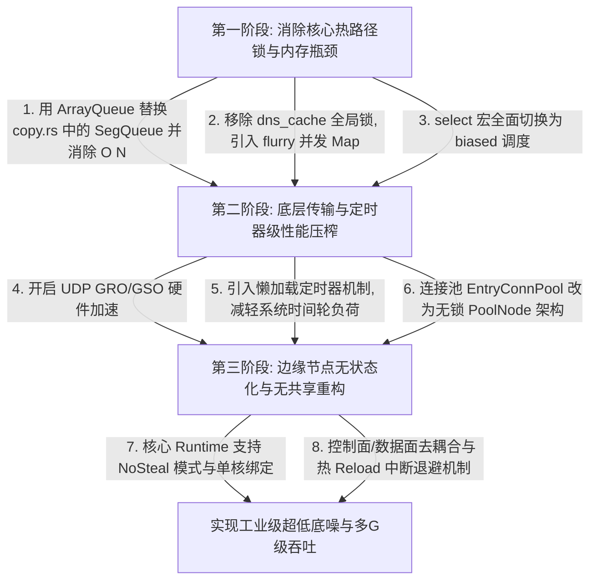

# DuoTunnel 宏观架构与高并发吞吐最佳实践评估报告

本报告对 **DuoTunnel** 项目的宏观设计、请求处理逻辑以及高带宽吞吐性能进行了深度架构级评估，并对比了现代工业级网络代理与开源高性能网络库（如 Cloudflare Pingora、wstunnel、rathole、zhenyi-base 等）的底层设计，指出了系统当前的优化空间与重构方向。

---

## 1. wstunnel: 极致 I/O 转发与零拷贝设计

wstunnel 作为基于 Rust 构建的高性能 WebSocket 隧道，其数据转发路径（`wstunnel/src/tunnel/transport/io.rs`）在压榨单核吞吐量和降低 I/O 延迟上，实现了多项网络编程的黄金法则：

### 1.1 `select! { biased; ... }` 偏向分支调度
- **设计精髓**：在双向中继（Relay）循环中，wstunnel 使用了 Tokio 的 `select! { biased; ... }`。
- **性能优势**：默认的 `select!` 在每次轮询时会生成一个伪随机数，用于随机化轮询分支的顺序，以确保任务调度的“公平性”。但是在超高频的数据中继热路径中，从 TCP/QUIC 读写数据（如 `socket.read_buf(...)`）是占绝对主导地位的事件，而定时器心跳或退出信号则是极低频事件。使用 `biased;` 偏向调度可以强制 Tokio 编译器按照书写顺序由上至下轮询，将热路径事件放在最前列，**直接省去了生成随机数的 CPU 周期开销**。
- **DuoTunnel 对照**：目前 DuoTunnel 在中继的双向 `loop` 中大多使用默认的 `select!` 或是并发式的等待，使得每次读写都需要承担随机数生成的底噪，累积起来在 Gbps 级别的带宽下损耗可观。

### 1.2 `BytesMut` 零拷贝缓冲区管理
- **设计精髓**：wstunnel 抛弃了传统“借出-归还”类型的全局缓冲池，直接利用底层协议栈自带的 `BytesMut` 进行无拷贝中转。通过 `socket.read_buf(ws.buf_mut())` 直接将网卡接收的数据写入到协议帧自带的 `BytesMut` 内存片中，并在完成协议头拼接后直接发出。
- **性能优势**：`BytesMut` 底层是基于 Arc 引用计数和虚拟内存借用的连续内存片，在写入网络后会自动复用容量，这**在用户态彻底消除了二次内存拷贝**，并省去了高频置零内存与多线程归还缓冲池的锁开销。
- **DuoTunnel 对照**：DuoTunnel 目前仍然依赖基于无界并发链表 `SegQueue` 的缓冲池机制（[copy.rs](file:///Users/sexy/Documents/GitHub/duotunnel/tunnel-lib/src/engine/copy.rs)），每次借还不仅有内存清零（`resize(..., 0)`）的开销，还会造成 CPU 缓存行失效。

### 1.3 紧凑循环内的定时器 Future 复用
- **设计精髓**：在高频的 propagate 循环中，wstunnel 不会在 loop 内部反复创建 `tokio::time::sleep` 定时器 Future（因为反复创建/销毁 Timer 任务会在 Tokio 内部时间轮上高频注册和注销节点，带来极高的锁竞争）。相反，它在 loop 外部一次性创建并使用 `pin_mut!` 固定一个 `Interval`，在 loop 内部通过 `.tick()` 复用同一个 Future。
- **性能优势**：完全规避了 Tokio 时间轮的锁争用，确保紧凑循环的纯净度。
- **DuoTunnel 对照**：DuoTunnel 部分流控制和超时逻辑在循环内部临时构建 Sleep/Timeout Future，增大了垃圾收集和调度压力。

---

## 2. Cloudflare Pingora: 无共享架构与高并发底噪消除

Cloudflare 开发的 Pingora 网关被用于承载每天数万亿次的 HTTP 请求。其架构设计致力于消除高并发环境下的多核同步成本和多线程运行时底噪：

### 2.1 `NoStealRuntime`：无共享单线程 Runtime 线程池
- **设计精髓**：Pingora 实现了自定义的 `NoStealRuntime`，底层是由多个**单线程的 Tokio Runtime**（`current_thread` 模式）组成的线程池，而不是使用标准的 Tokio 多线程 Work-Stealing 运行时（`multi_thread` 模式）。
- **性能优势**：
  - **规避窃取开销**：在多线程工作窃取（Work-Stealing）模式下，如果某个工作核心闲置，它会尝试跨线程抢占或窃取其他核心的任务队列。在大带宽、超多并发连接下，这种任务的频繁迁移和跨核心调度会带来剧烈的**锁竞争**，且会导致**CPU L1/L2 缓存行频繁失效**（Cache line bouncing）。
  - **Share-Nothing 闭环**：单核心独占一个单线程的 Tokio 运行时，任何连接的读、解析、转发和写操作均在同一个 CPU 核心线程内完成。各核心之间互不干扰，数据通路彻底单核化闭环，消除多核间的数据共享与锁同步成本，这在 Pingora 的测试中可**减少 50% 以上的 Tokio 运行时调度开销**。
- **DuoTunnel 对照**：DuoTunnel 采用默认的多线程 work-stealing Runtime，在 Gbps 级别吞吐下，伴随着连接的频繁迁移动作，CPU 会在内核态调度和跨核同步上浪费大量的时钟周期。

### 2.2 混合型 `PoolNode` 连接池设计
- **设计精髓**：Pingora-pool（`pingora-pool/src/connection.rs`）在维护复用连接时，设计了独特的混合存储模型：
  - **热路径（Hot Path）**：采用 lock-free 的无锁并发环形队列 `crossbeam_queue::ArrayQueue`。新释放的健康连接会被立即 Push 到 `hot_queue` 中；取连接时首先尝试从无锁的 `hot_queue` 进行无锁 Pop。
  - **冷路径（Cold Path）**：采用传统的 Mutex 锁保护的 `HashMap`，用于存放老旧、存量连接，并用于执行 LRU 驱逐策略。
- **性能优势**：大吞吐下 99% 的连接释放与获取动作都在无锁的 `ArrayQueue` 上完成，耗时仅为纳秒级，彻底解决连接池在并发高峰期沦为全局临界区锁瓶颈的问题。
- **DuoTunnel 对照**：DuoTunnel 的 `EntryConnPool` 目前通过一个专门的 background actor task，利用 `mpsc::channel` 来串行化处理 `Push`、`Remove` 和 `NextConn` 请求。在高频连接请求下，不仅有 Channel 的分配和上下文切换成本，且 actor task 本身可能面临排队瓶颈，无法做到真正的并发 $O(1)$ 级别极速分配。

### 2.3 `fast_timeout`：懒加载与无锁定时器管理器
- **设计精髓**：Pingora-timeout 弃用了在高频 I/O 中频繁调用 Tokio 默认 `timeout` 的做法，引入了 `fast_timeout`：
  - **懒加载定时器（Lazy Timer Initialization）**：当调用 `timeout(future)` 时，不立即在底层的系统定时器中注册。而是优先 Poll 一次内部的 Future，如果 Future 立即返回 `Poll::Ready`（这在网卡缓冲区已有存量数据的 busy-I/O 场景下极常见），则**完全不创建定时器对象**。
  - **10ms 粗粒度归并与无锁时钟线程**：当 Future 确实返回 `Poll::Pending` 时，定时器管理器将超时时间圆整到下一个 10ms 刻度。具有相同 10ms deadline 的 Future 会共享同一个定时器节点。该管理器通过一个独立的 `Timer thread` 驱动，并提供完全无锁的注册接口。
- **性能优势**：在海量连接的微秒级读写中，消除定时器轮频繁插入、删除导致的全局锁开销。
- **DuoTunnel 对照**：DuoTunnel 虽然实现了部分的懒加载机制，但底层依然依赖高频率创建 `tokio::time::sleep` 插入到 Tokio 默认的时间轮上，锁竞争隐患极大。

### 2.4 TinyUFO 缓存与 Lru 设计
- **设计精髓**：Pingora 使用 `flurry` 并发 HashMap 结合 crossbeam-skiplist 构建分片无锁存储，以及基于 `S3-FIFO` / TinyLFU 算法的缓存剔除策略（TinyUFO），规避了传统带锁 LRU 算法中，因“每次读操作都必须更新 LRU 双向链表节点位置”而产生的锁瓶颈。

---

## 3. rathole: 强控制面与轻量级数据连接池

rathole 是一款极其轻量且追求极致延迟与内存占用的 NAT 穿透工具：

### 3.1 单持久控制通道 + 客户端按需建连
- **设计精髓**：与 frp 或 DuoTunnel 自带的多合一长连接不同，rathole 严格执行“控制面与数据面分离”原则。客户端与服务端之间仅保持**一条**非常轻量的 TCP/TLS `ControlChannel` 用于心跳和命令投递。当服务端监听到访客连接（Visitor）时，会通过该控制通道下发一个 `ControlChannelCmd::CreateDataChannel`，通知客户端立即主动建立一条全新的 TCP `DataChannel`。
- **性能优势**：控制逻辑和数据中继互不干扰，数据通道是纯粹的裸 TCP/TLS 流，完全没有任何封装帧头（Header framing）的协议底噪，极利于压榨吞吐和降低协议编解码延迟。

### 3.2 预连接数据通道池（run_tcp_connection_pool）
- **设计精髓**：如果等访客建连后再通知客户端连接，会产生一个 RTT 的建连延迟。为此，rathole 实现了**预连接池**机制。服务端在控制通道建立后，会预先让客户端建立 $N$ 个（默认 8 个）`DataChannel` 并放入服务端的 `data_ch_rx` 管道中缓冲。
- **性能优势**：当访客到来时，服务端直接通过 `data_ch_rx.recv()` 弹出一个已经握手完成的、处于就绪状态的底层 TCP 套接字，写入命令并立刻开始 `copy_bidirectional` 转发。
- **DuoTunnel 对照**：DuoTunnel 虽然使用了 QUIC 连接池（`EntryConnPool`），但每次访客到来时，仍需在客户端执行 `conn.open_bi()` 异步打开新的 stream 并在流中交换 RoutingInfo 帧。如果在高并发或者 QUIC 流控制门限（Max Streams limit）受阻时，将引入额外的阻塞和协商延迟。

### 3.3 指数避退与中断重连机制
- **设计精髓**：在控制通道的重连循环中，rathole 结合了 `backoff::future::retry_notify` 和 `broadcast::Receiver` 广播通道。当客户端因配置变更（热重载）或网络中断进行重连时，避退定时器可以被广播退出信号瞬间中断并无缝拉起，既防止了重连请求风暴（Connection Storm），又保障了在网关重载时的零等待极速重联。
- **DuoTunnel 对照**：DuoTunnel 的 `run_supervisor` 重连机制采用相对简单的 loop 结构，在复杂的多边缘节点热reload中容易产生不必要的延迟或轻微的退避僵死。

### 3.4 细粒度 Socket 选项调优
- **设计精髓**：rathole 针对控制通道和数据通道的不同特性，使用 `socket2` 设置了差异化的底层参数（例如 `try_set_tcp_keepalive`、配置更高的 TCP 发送接收缓冲区、显式开启 `TCP_NODELAY` 以降低交互包延迟，或启用 `SO_REUSEPORT` 进行内核负载均衡）。

---

## 4. DuoTunnel 的现状对比与对标优化方案

根据上述三款优秀 Rust 网络软件的设计理念，针对 DuoTunnel 的整体优化思路与对标落地设计如下：

### 4.1 核心 I/O 转发层对标优化（对标 wstunnel / zhenyi-base）

#### 【改进 1】 biased 偏向选择调度
- **具体做法**：排查 DuoTunnel 中所有的双向中继循环（如 `relay_quic_to_tcp` 和 `relay_tcp_to_quic`），将 `tokio::select!` 全部改写为 `tokio::select! { biased; ... }`。
- **书写顺序**：将主要的网络 I/O 读写事件置于最上方，将 `CancellationToken` 取消信号或异常状态检测置于最下方。这样可确保在网络读写高频活跃时，Tokio 调度器不生成伪随机数，而是以 $O(1)$ 的开销优先消费就绪的网络包。

#### 【改进 2】 淘汰 copy.rs 缓冲池的 $O(N)$ 遍历，引入 ArrayQueue 与 BytesMut
- **具体做法**：
  - 彻底用有界的无锁环形队列 `crossbeam_queue::ArrayQueue<Vec<u8>>` 替代 [copy.rs](file:///Users/sexy/Documents/GitHub/duotunnel/tunnel-lib/src/engine/copy.rs) 中底层的 `crossbeam_queue::SegQueue`。
  - 由于 `ArrayQueue` 具有常数时间复杂度，其 `push` 与 `pop` 均为 $O(1)$ 操作。在归还缓冲区时，若队列已满，则直接丢弃（由垃圾回收器回收），规避了 `SegQueue::len()` 在并发冲突时由于不断遍历链表导致 CPU 暴涨的问题。
  - 更进一步地，对于可以直读直写的网络协议栈，仿照 wstunnel 重新设计转发流水线，将网络数据通过 `read_buf` 直接导入到 `BytesMut` 中，完全省去多线程借还 `Vec<u8>` 缓冲池的机制，达到零 CPU 一级缓存污染。

---

### 4.2 线程模型与并发控制层对标优化（对标 Pingora）

#### 【改进 3】 提供 Share-Nothing 运行模式
- **具体做法**：在 DuoTunnel 的 Runtime 初始化阶段，根据配置提供两种执行模式：
  1. **Work-Stealing 模式**：沿用默认的多线程 Tokio Runtime。
  2. **Share-Nothing 模式**：通过 `NoStealRuntime` 的设计思想，启动与物理核心数相等的单线程 Tokio Runtime（绑定特定 CPU 核心）。将入口 TCP/UDP 监听器通过 `SO_REUSEPORT` 让内核把连接均衡分发到各个 Runtime 的工作线程中。使得每个连接的 QUIC 握手、I/O 中继、DNS 缓存查找全在单线程内闭环，**消除线程间跨核心迁移的上下文切换底噪，实现极低延迟（< 0.1ms）**。

#### 【改进 4】 重构连接池，实现无锁混合型 PoolNode
- **具体做法**：
  - 替换 DuoTunnel 现有的 `EntryConnPool` 中使用 background actor 的结构。actor 通信在高频请求下，MPSC 管道和 oneshot 握手会成为延迟瓶颈。
  - 仿照 Pingora 的混合 Pool 结构，使用 `crossbeam_queue::ArrayQueue<Arc<PooledConnection>>` 作为无锁的“热连接池”存取队列；同时用一个带 Mutex 的 `HashMap` 仅保存用来处理闲置超时、保活包以及按 stable_id 进行剔除的“冷连接”。
  - 当访客到来时，直接从无锁 `ArrayQueue` 快速弹出就绪的 QUIC 连接，省去 Channel 投递和线程唤醒开销。

---

### 4.3 DNS 与定时器控制层对标优化（对标 Pingora / rathole）

#### 【改进 5】 移除 DNS Cache 全局异步互斥锁，改用 flurry/DashMap 并行结构
- **具体做法**：
  - 彻底重写 [dns_cache.rs](file:///Users/sexy/Documents/GitHub/duotunnel/tunnel-lib/src/infra/dns_cache.rs) 中的 `EgressDnsCache`。当前版本为了更新 DNS 记录使用了一个全局 `write_lock`，并且每次写更新都需要 `clone()` 整个底层 `HashMap`，这在高吞吐和 DNS 过期更新时会引发剧烈的锁冲突和高频堆内存分配。
  - 应该把底层改为并发读写的 `flurry::HashMap` 或 `DashMap`。
  - 针对**同一个域名**的并发解析请求，引入 `Single-Flight`（单飞合并）机制，仅由第一个发起解析的任务去执行外部 DNS 解析，其他相同域名的请求在内存中排队等待结果，解析完毕后一次性唤醒所有等待者，从而极大降低对外部 DNS 服务器的查询并发和查询延迟。

#### 【改进 6】 引入懒加载快定时器，降低系统级时间轮负载
- **具体做法**：
  - 优化 DuoTunnel 的 `infra/timeout.rs` 实现，将 `timer` 注册改写为类似于 Pingora 的 `fast_timeout`。
  - 只有当 I/O poll 真正处于 `Poll::Pending` 时才注册定时器。
  - 使用 coarse ticks（如 10ms 归并）将相同截止期限的连接超时归为同一个内部 timer 任务，减少高频微秒级连接下 Tokio 系统时间轮的负载。

#### 【改进 7】 具备 Cancel 中断的高容错指数避退重连
- **具体做法**：在客户端的 `run_supervisor` 流程中，采用 rathole 的设计方式，使 `JitterBackoff` 逻辑可以被 CancellationToken 的 Cancel 事件或热 Reload 配置事件**立即中断**。当重连退避还在 sleep 期间时，如果配置发生热变更，可以立刻唤醒退避任务并尝试建连，避免了由于硬性 Sleep 造成的网关响应“迟钝”感。

---

### 4.4 传输与硬件加速层对标优化

#### 【改进 8】 开启 UDP GRO / GSO 硬件加速选项
- **具体做法**：
  - QUIC 协议基于 UDP，大吞吐下的 CPU 开销很大一部分源自于 UDP 包发送与接收时的内核-用户态切换次数。
  - 在 DuoTunnel 初始化底层的 UDP 套接字时（如 [build_udp_socket](file:///Users/sexy/Documents/GitHub/duotunnel/tunnel-lib/src/transport/quic.rs)），利用 `socket2` 针对 Linux 平台设置 `UDP_SEGMENT` 与 `UDP_GRO` 选项。
  - 开启 GRO/GSO 后，网卡硬件和内核会批量组装多个连续的 UDP 报文作为一个大包发给用户态，在 multi-Gbps 带宽下，能将**系统调用频次和 CPU 的硬件中断消耗降低一个数量级**。

---

## 5. DuoTunnel 深度性能优化路线图

为了有计划地提升系统性能与稳定性，建议将上述改进按以下三个阶段实施：

这套重构方案不仅解决了当前 DuoTunnel 在核心中继路径上的算法复杂度问题（如 $O(N)$ 缓冲池队列计数），更是通过融合 wstunnel、Pingora 和 rathole 的工业级性能实践，使 DuoTunnel 的网络数据面设计能够对标世界级边缘网关的吞吐量与低底噪标准。
