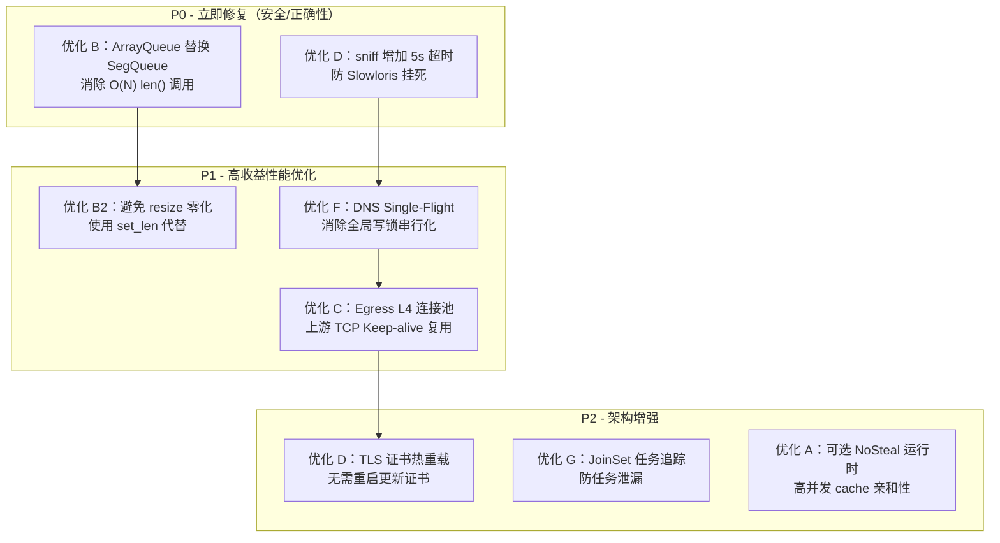

# 深度架构对比分析：wstunnel / pingora / rathole → duotunnel 优化方案

> **范围**：对三个参考项目（wstunnel v10.5、pingora Cloudflare OSS、rathole v0.5）进行逐模块深挖，对照 duotunnel 现有实现提炼可落地的架构级与代码级优化方案。

---

## 一、运行时模型（Runtime Topology）

### 1.1 三方对比

| 项目 | 运行时策略 | 关键设计 |
|---|---|---|
| **wstunnel** | 单个 `tokio::runtime::Builder::new_multi_thread()` + JoinSet 任务追踪 | 抽象 `TokioExecutor` trait，Ref 使用 `Weak<Mutex<JoinSet>>` 避免 Arc 强引用循环；Drop 时 `abort_all` 确保任务不泄漏 |
| **pingora** | `NoStealRuntime`：N 个独立单线程 tokio Runtime 组成线程池 | 彻底无 work-steal，每条连接 pin 在固定线程上，CPU cache 亲和性极好；`current_handle()` 随机取一个线程 Handle 做跨线程调度 |
| **rathole** | `tokio::runtime::Builder::new_multi_thread()` 标准模式 | 无运行时抽象，简单直接 |
| **duotunnel** | `build_proxy_runtime()` 多线程标准模式 + `TOKIO_WORKER_THREADS` 环境变量覆盖 | 环境变量配置好，但无法切换为 no-steal 模式；无 JoinSet 任务生命周期追踪 |

### 1.2 Pingora NoSteal 的核心价值

```rust
// pingora-runtime/src/lib.rs
pub struct NoStealRuntime {
    threads: usize,
    pools: Arc<OnceCell<Box<[Handle]>>>,
    ...
}
// 每条 Accept 任务 spawn 到固定线程，避免 work-steal 的 cache miss
```

**pingora 核心洞察**：work-steal 调度在高并发转发场景中带来的 task 迁移（cache miss）开销显著。对于每个连接一条 QUIC stream 的 duotunnel，固定线程运行模型能让 per-connection 的热数据（缓冲区、Quinn 内部状态）在同一个 CPU core 上保持热态。

### 1.3 duotunnel 优化建议 A：可选的 NoSteal 模式

```rust
// 建议在 infra/runtime.rs 中增加
pub enum RuntimeFlavor {
    Steal,
    NoSteal,
}

pub fn build_proxy_runtime_with_flavor(flavor: RuntimeFlavor) -> tokio::runtime::Runtime {
    match flavor {
        RuntimeFlavor::Steal => build_proxy_runtime(),
        RuntimeFlavor::NoSteal => {
            // 仿 pingora：spawn N 个 current_thread runtime，
            // 用 thread_local CURRENT_HANDLE 分发
            todo!()
        }
    }
}
```

**优先级**：中。在连接数极多、per-connection 业务逻辑轻量时收益大。

---

## 二、I/O Copy 引擎与缓冲区策略

### 2.1 wstunnel：零分配 ReadBuf 模式

wstunnel 的 `propagate_local_to_remote` 使用 `read_buf` 直接写入 `BytesMut`：

```rust
// wstunnel/src/tunnel/transport/io.rs
let read_len = select! {
    biased;
    // ...
    read_len = local_rx.read_buf(ws_tx.buf_mut()) => read_len,
    // ...
};
```

`buf_mut()` 返回的 `&mut BytesMut` 在 websocket/http2 writer 内部初始化，数据直接写入帧缓冲区，省去了一次中间 Vec 拷贝。此外 wstunnel 复用 `MAX_PACKET_LENGTH = 64KB` 的帧对齐，与网络 MTU 配合良好。

### 2.2 pingora：ArrayQueue + LRU 连接池缓冲复用

```rust
// pingora-pool/src/connection.rs
pub struct PoolNode<T> {
    connections: Mutex<HashMap<ID, T>>,
    hot_queue: ArrayQueue<(ID, T)>,  // 16-slot 无锁热队列
    hot_queue_remove_lock: Mutex<()>,
}
```

pingora 的 `hot_queue: ArrayQueue<N=16>` 是一个有界无锁队列，`insert` 和 `get_any` 在队列未满时完全无锁（CAS 原子操作），只有溢出时才降级到 `Mutex<HashMap>`。

### 2.3 duotunnel 现状与问题

```rust
// tunnel-lib/src/engine/copy.rs — 当前实现
fn global_pool() -> &'static SegQueue<Vec<u8>> {
    static GLOBAL_POOL: OnceLock<SegQueue<Vec<u8>>> = OnceLock::new();
    GLOBAL_POOL.get_or_init(SegQueue::new)
}

fn return_buffer(buf: Vec<u8>, buffer_size: usize) {
    // ...
    if global.len() < 256 {  // ❌ SegQueue::len() 是 O(N)！
        global.push(b);
    }
}
```

**问题一**：`crossbeam_queue::SegQueue::len()` 在实现上需要遍历所有 segment，复杂度为 O(N)。在每个 stream 的每个 buffer 归还时都调用，高并发下浪费 CPU。

**问题二**：`take_buffer` 中的 `buf.resize(buffer_size, 0)` 对已分配但长度不足的 buffer 执行零化，而这些字节随即被 `reader.read()` 覆盖，零化纯属浪费。

### 2.4 优化建议 B：ArrayQueue 替换 SegQueue

```rust
use crossbeam_queue::ArrayQueue;
use std::sync::OnceLock;

fn global_pool(buffer_size: usize) -> &'static ArrayQueue<Vec<u8>> {
    // 用 buffer_size 作 key 的懒初始化有界队列
    static GLOBAL_POOL: OnceLock<ArrayQueue<Vec<u8>>> = OnceLock::new();
    GLOBAL_POOL.get_or_init(|| ArrayQueue::new(256))
    // ArrayQueue::push() 满了直接返回 Err，无需 len() 判断
}

fn return_buffer(buf: Vec<u8>, buffer_size: usize) {
    if buf.capacity() != buffer_size {
        return;
    }
    // 先尝试 thread_local，再尝试 global
    let stored = LOCAL_POOL.with(|pool| {
        let mut pool = pool.borrow_mut();
        if pool.len() < 8 { pool.push(buf_for_local); true } else { false }
    });
    if !stored {
        let _ = global_pool(buffer_size).push(buf); // 满了自动丢弃
    }
}
```

**优化三**：避免 `resize(..., 0)` 零化，使用 `unsafe { buf.set_len(buffer_size) }` 或 `ReadBuf::uninit`：

```rust
// 取 buffer 时，容量足够则只设置长度，不零化
fn take_buffer(buffer_size: usize) -> Vec<u8> {
    if let Some(mut buf) = LOCAL_POOL.with(|p| p.borrow_mut().pop()) {
        if buf.capacity() >= buffer_size {
            // SAFETY: capacity >= buffer_size，后续立即由 reader.read() 写入
            unsafe { buf.set_len(buffer_size) };
            return buf;
        }
    }
    // ...fallback to alloc
    let mut buf = Vec::with_capacity(buffer_size);
    unsafe { buf.set_len(buffer_size) };
    buf
}
```

**收益预估**：在 10K 并发流场景下，消除 O(N) 遍历和无意义零化预计可降低 5-15% CPU 占用。

---

## 三、连接池架构

### 3.1 wstunnel：bb8 管理 HTTP/WS 上游连接

```rust
// wstunnel/src/tunnel/client/cnx_pool.rs
impl ManageConnection for WsConnection {
    type Connection = Option<TransportStream>;
    async fn connect(&self) -> Result<Self::Connection, Self::Error> { ... }
    fn has_broken(&self, conn: &mut Self::Connection) -> bool {
        conn.is_none()  // Option=None 代表连接已消耗
    }
}
```

wstunnel 使用 `bb8`（异步连接池库）管理到远端的 WS/HTTP2 传输连接，支持 `connection_min_idle` 预热。`has_broken` 以 `Option<Stream>` 的 None 状态表示连接已被消耗（take 后置 None），设计非常简洁。

### 3.2 pingora：LRU + DashMap + hot_queue 三层连接池

```rust
// pingora-pool/src/connection.rs
pub struct ConnectionPool<S> {
    pools: DashMap<GroupKey, Arc<Pool<S>>>,  // per-key 分桶，高并发读写
    lru: Lru<ID, ConnectionMeta>,            // 全局 LRU 淘汰
}
```

pingora 的连接池设计精妙：
- **DashMap** 作为外层 key→pool 的并发索引，避免全局锁
- 每个 `PoolNode` 内有一个 **16-slot ArrayQueue** 作无锁热队列
- `idle_poll` 监听连接 EOF/数据，发现问题即从池中剔除
- `put()` 返回 `(Arc<Notify>, oneshot::Receiver<bool>)` 双通道：一个通知 LRU 淘汰，一个通知连接被取用

```rust
// 取连接时 LRU 自动移除，热队列 O(1)
pub fn get(&self, key: &GroupKey) -> Option<S> {
    let pool_node = self.pools.get(key)?;
    if let Some((id, connection)) = pool_node.get_any() {
        self.lru.pop(&id);
        Some(connection.release())
    } else { None }
}
```

### 3.3 rathole：预创建数据通道池

```rust
// rathole/src/server.rs
const TCP_POOL_SIZE: usize = 8;
const UDP_POOL_SIZE: usize = 2;

// 控制通道建立后，立刻预填充 pool_size 个数据通道请求
for _i in 0..pool_size {
    data_ch_req_tx.send(true);
}
```

rathole 的 **预创建策略**（eager pool）：控制通道建立后立即向 client 要求建立 N 个数据通道并缓冲，访客到达时直接取用，消除 QUIC/TLS 握手延迟。这种模式对 NAT 穿透场景（新连接延迟敏感）尤为有效。

### 3.4 duotunnel 优化建议 C：Egress L4 连接池

当前 duotunnel egress 侧每次都全新建立 TCP 连接到上游，缺少复用。建议借鉴 pingora 的三层结构：

```rust
// 建议新增：tunnel-lib/src/proxy/upstream_pool.rs
use crossbeam_queue::ArrayQueue;
use dashmap::DashMap;

pub struct UpstreamPool {
    // key = (host, port, tls_fingerprint)
    pools: DashMap<u64, Arc<UpstreamNode>>,
    max_idle: usize,
}

pub struct UpstreamNode {
    hot_queue: ArrayQueue<TcpStream>,  // 无锁热队列，容量 8
    lru_evict: tokio::sync::Notify,
}

impl UpstreamPool {
    pub fn get(&self, key: u64) -> Option<TcpStream> {
        self.pools.get(&key)?.hot_queue.pop()
    }
    pub fn put(&self, key: u64, stream: TcpStream) {
        let node = self.pools.entry(key)
            .or_insert_with(|| Arc::new(UpstreamNode::new(self.max_idle)));
        if node.hot_queue.push(stream).is_err() {
            // 池满，直接 drop（关闭连接）
        }
    }
}
```

**注意**：需要配合 `idle_poll` 机制检测上游连接的 EOF（参考 pingora 的 `idle_poll` 实现）。

---

## 四、热重载与 TLS 证书动态更新

### 4.1 wstunnel：fs notify + AtomicBool 标志位

```rust
// wstunnel/src/tunnel/tls_reloader.rs
struct TlsReloaderServerState {
    fs_watcher: Mutex<RecommendedWatcher>,
    tls_reload_certificate: AtomicBool,  // 文件变更时 store(true)
    server_config: Arc<WsServerConfig>,
}

fn should_reload_certificate(&self) -> bool {
    match &self.state {
        Server(this) => this.tls_reload_certificate.swap(false, Ordering::Relaxed),
        // ...
    }
}
```

wstunnel 的 TLS 热重载流程：
1. `notify::recommended_watcher` 监听证书文件
2. 文件变更时 `AtomicBool::store(true, Relaxed)`
3. 服务端/客户端在每次建新连接前调用 `should_reload_certificate()` 检查并重建 TLS acceptor
4. 文件被删除时 spawn 独立线程轮询等待文件重建，再重新 watch

**亮点**：文件删除后的 `try_rewatch_certificate` 采用独立线程 `sleep` 轮询而非 tokio 异步，避免占用 async runtime 资源，且无需持有任何锁。

### 4.2 rathole：TOML diff 驱动的增量热重载

```rust
// rathole/src/config_watcher.rs
fn calculate_events(old: &Config, new: &Config) -> Option<Vec<ConfigChange>> {
    // ...
    // 计算 service 级别的 Add/Delete diff
    let deletions = old.keys().filter(|k| !new.contains_key(k)).map(Delete);
    let additions = new.iter().filter(|(k, v)| old.get(k) != Some(v)).map(Add);
    Some(deletions.chain(additions).collect())
}
```

rathole 通过 `notify` 监听配置文件变更，计算新旧配置的 diff，生成精确的增量事件（`Add`/`Delete` service），避免全量重启。服务端收到 `Add` 时直接插入新服务，收到 `Delete` 时踢出旧控制通道。

### 4.3 duotunnel 现状：ArcSwap 原子指针替换

duotunnel 使用 `ArcSwap<RoutingSnapshot>` 做整体快照替换，比 rathole 的增量 diff 更"暴力"但更安全，没有局部状态不一致的风险。

**建议 D：补充 TLS 证书热重载（学习 wstunnel）**

duotunnel 目前没有 TLS 证书的文件 watch 机制，证书轮换需要重启进程。建议参考 wstunnel 的 `TlsReloader`：

```rust
// 建议新增：tunnel-lib/src/infra/tls_reloader.rs
pub struct TlsReloader {
    state: AtomicBool,           // 是否有待加载的新证书
    watcher: Mutex<RecommendedWatcher>,
}

impl TlsReloader {
    pub fn watch(cert_path: &Path, key_path: &Path, config: Arc<QuicServerConfig>)
        -> anyhow::Result<Self>
    {
        let reload_flag = AtomicBool::new(false);
        let watcher = notify::recommended_watcher({
            let flag = reload_flag.clone();
            move |event: notify::Result<Event>| {
                if let Ok(e) = event {
                    if !e.kind.is_access() {
                        flag.store(true, Ordering::Relaxed);
                    }
                }
            }
        })?;
        // watch cert & key
        Ok(Self { state: reload_flag, watcher: Mutex::new(watcher) })
    }

    pub fn maybe_reload(&self) -> Option<Arc<rustls::ServerConfig>> {
        if self.state.swap(false, Ordering::Relaxed) {
            // 重新读取并构建新的 rustls::ServerConfig
            Some(rebuild_tls_config())
        } else {
            None
        }
    }
}
```

---

## 五、负载均衡算法对比

### 5.1 三方策略

| 项目 | 算法 | 实现细节 |
|---|---|---|
| **wstunnel** | 轮询（隐式，bb8 池内 FIFO） | 连接级复用，无显式 LB |
| **pingora** | LRU 连接池 + per-key DashMap 分桶 | 同 key 的连接复用，不同 key 完全隔离，天然无 LB 争用 |
| **rathole** | 先进先出（channel FIFO） | data_ch_rx 队列按顺序分发给访客，简单但公平 |
| **duotunnel** | **P2C (Power of Two Choices)** + 最小 inflight | 随机采 2 个连接比较 inflight 数，选小的；大列表 fallback O(N) scan |

### 5.2 duotunnel P2C 的深层分析

```rust
// tunnel-lib/src/lb/inflight.rs — pick_p2c_inflight
pub fn pick_p2c_inflight<T, H, I>(
    items: &[T], threshold: usize, max_retries: usize,
    is_healthy: H, inflight: I,
) -> Option<&T> {
    // 小列表（≤threshold）走 O(N) 扫描
    // 大列表走 P2C：随机两选一，两者都不健康则重试
    // 全失败 fallback O(N)
}
```

**现有设计优点**：
- `CachePadded<InflightSlot>` 避免了 false sharing（每个 slot 填充至 cacheline）
- thread-local `ROTATING_INDEX` 提供起始偏移，防止所有线程都从 index 0 开始扫描造成热点

**潜在改进**：P2C 中 `fastrand::usize(..len)` 调用了两次 RNG，建议使用单次 RNG + 派生第二个索引（当前已实现 `r + 1 if r >= idx1` 技巧，正确）。可进一步考虑 **EWMA 平滑 inflight**，避免瞬时抖动造成连接选择不稳定。

---

## 六、DNS 缓存：全局锁瓶颈与修复

### 6.1 当前问题（已在上次 review 中识别）

```rust
// tunnel-lib/src/infra/dns_cache.rs
pub struct EgressDnsCache {
    cache: ArcSwap<HashMap<(String, u16), DnsEntry>>,
    write_lock: tokio::sync::Mutex<()>,  // ❌ 全局序列化所有 DNS 解析
    ttl: Duration,
}
```

**全局 Mutex 问题**：所有域名的 DNS miss 都在同一把锁上串行，高并发 Egress 下必然成为瓶颈。

### 6.2 修复方案：DashMap + Single-Flight

```rust
use dashmap::DashMap;
use tokio::sync::broadcast;

pub struct EgressDnsCache {
    cache: DashMap<(String, u16), DnsEntry>,
    // Single-flight：相同 key 的并发解析只做一次
    in_flight: DashMap<(String, u16), broadcast::Sender<Result<Vec<SocketAddr>, String>>>,
    ttl: Duration,
}

impl EgressDnsCache {
    pub async fn resolve(&self, host: &str, port: u16)
        -> anyhow::Result<SocketAddr>
    {
        let key = (host.to_string(), port);

        // 快路径：有效缓存命中
        if let Some(entry) = self.cache.get(&key) {
            if Instant::now() < entry.expires_at {
                return Ok(*entry.addrs.first().unwrap());
            }
        }

        // Single-flight：已有飞行中的解析，等待其结果
        if let Some(sender) = self.in_flight.get(&key) {
            let mut rx = sender.subscribe();
            drop(sender);
            return rx.recv().await
                .map_err(|_| anyhow!("dns resolve channel closed"))?
                .map_err(|e| anyhow!(e))
                .and_then(|addrs| addrs.into_iter().next().ok_or_else(|| anyhow!("empty")));
        }

        // 本线程负责解析
        let (tx, _) = broadcast::channel(1);
        self.in_flight.insert(key.clone(), tx.clone());
        let result = tokio::net::lookup_host((host, port)).await
            .map(|i| i.collect::<Vec<_>>());
        self.in_flight.remove(&key);

        match &result {
            Ok(addrs) if !addrs.is_empty() => {
                self.cache.insert(key, DnsEntry {
                    addrs: addrs.clone(),
                    expires_at: Instant::now() + self.ttl,
                });
            }
            _ => {}
        }
        let _ = tx.send(result.as_ref().map(|v| v.clone())
            .map_err(|e| e.to_string()));
        result?.into_iter().next().ok_or_else(|| anyhow!("no addr"))
    }
}
```

**收益**：
1. 不同域名可并发解析（DashMap 分桶锁）
2. 相同域名并发请求只发起一次 DNS query（Single-flight）
3. 无需 HashMap 全量 clone（DashMap 直接 insert）

---

## 七、协议嗅探超时保护（Slowloris 防御）

### 7.1 当前风险

```rust
// tunnel-lib/src/protocol/sniff.rs — SniffRuntime::sniff
// 仅限制 max_read_rounds 和 max_sniff_bytes，无时间超时
while rounds < self.policy.max_read_rounds && total < self.policy.max_sniff_bytes {
    let n = stream.read(&mut buf[total..read_end]).await?;  // ⚠️ 可能永久挂起
```

攻击者以 1 字节/秒发送数据，每轮 `read().await` 立即返回 1 字节，但 4 轮之后仍无法完成协议判断，不退出循环。实际上 `max_read_rounds=4` 只限制了 read 系统调用次数，而每次 read 本身可能无限等待。

### 7.2 修复（学习 pingora 的 `pingora-timeout` crate）

pingora 专门封装了 `pingora-timeout`，提供高效定时器（基于 `tokio::time::sleep` 但共享 timer wheel）：

```rust
// 建议：在 proxy/core.rs 的 run_stream 调用 sniff 时加超时
use tokio::time::{timeout, Duration};

let sniffed = timeout(
    Duration::from_secs(5),
    runtime.sniff(&mut recv, pool)
).await
.map_err(|_| ProxyError::Io(std::io::Error::new(
    std::io::ErrorKind::TimedOut,
    "protocol sniff timeout"
)))??;
```

或者更彻底地，将超时下沉到 `SniffPolicy`：

```rust
pub struct SniffPolicy {
    pub initial_read_bytes: usize,
    pub max_sniff_bytes: usize,
    pub max_read_rounds: usize,
    pub timeout: Option<Duration>,  // 新增：全局超时
}
```

---

## 八、TLS 实现对比：aws-lc-rs 的性能优势

### 8.1 三方选择

| 项目 | TLS 实现 | 密码学后端 |
|---|---|---|
| **wstunnel** | tokio-rustls + aws-lc-rs (default) / ring | aws-lc-rs（AWS 高性能 fork） |
| **pingora** | rustls + aws-lc-rs / openssl-boringssl | 多后端可选 |
| **rathole** | native-tls / rustls（feature flag） | ring |
| **duotunnel** | tokio-rustls + **aws-lc-rs** ✅ | quinn `rustls-aws-lc-rs` |

duotunnel 已使用 `aws-lc-rs` 作为 quinn 的密码学后端，与 wstunnel 和 pingora 一致，这是正确选择。

**建议 E**：对 hyper-rustls 也启用 aws-lc-rs（已经在 Cargo.toml 中配置 `features = ["aws-lc-rs"]`，确认一致性即可）。

---

## 九、过载保护对比

### 9.1 三方机制

| 项目 | 过载保护 | 实现方式 |
|---|---|---|
| **wstunnel** | bb8 连接池大小限制 + `connection_min_idle` | 隐式：池满时新请求阻塞等待 |
| **pingora** | 无显式过载保护（靠 OS 内核 backlog） | 依赖 TCP listen backlog |
| **rathole** | `CHAN_SIZE = 2048` channel 容量限制 | 隐式：channel 满时 send 阻塞 |
| **duotunnel** | `OverloadLimits` + `maybe_slow_path` 精细化 | **最成熟**：yield/sleep 两级阈值 + P2C 选连接 |

duotunnel 的过载保护设计（`OverloadMode::InflightSlowpath`，yield/sleep 双阈值，`BackoffStrategy::Exponential`）是三个参考项目中**最精细**的，值得保留并增强。

**建议 F**：为 `maybe_slow_path` 增加 Prometheus metrics 暴露当前 `slowpath_waiting_tasks`（已有 `METRICS.slowpath_waiting_tasks` AtomicUsize，建议通过 `/metrics` endpoint 暴露）。

---

## 十、Executor 抽象与任务生命周期管理

### 10.1 wstunnel 的 JoinSet Executor

```rust
// wstunnel/src/executor.rs
pub struct JoinSetTokioExecutorRef {
    join_set: Weak<Mutex<JoinSet<()>>>,
    default_abort_handle: AbortHandle,  // 防止 JoinSet drop 后悬空
}

impl Drop for JoinSetTokioExecutor {
    fn drop(&mut self) {
        self.abort_all();  // 父任务退出时级联 cancel 所有子任务
    }
}
```

**关键洞察**：wstunnel 将 `JoinSet` 包裹在 `Arc<Mutex<>>` 中，通过 `Weak` 引用传递给子任务，当父 `JoinSetTokioExecutor` drop 时自动 `abort_all`，实现了结构化并发（structured concurrency）的语义，防止任务泄漏。

**建议 G**：duotunnel 目前直接 `tokio::spawn` 各种任务，缺少任务生命周期管理。建议引入类似 wstunnel 的 `JoinSet` 追踪机制，或使用 `tokio_util::task::TaskTracker`，确保组件关闭时子任务能级联取消。

---

## 十一、配置变更精粒度 vs. 原子快照权衡

### 11.1 rathole 增量 diff vs. duotunnel 全量 ArcSwap

**rathole 的精粒度优势**：
- 只停止/启动受影响的 service，不影响存量连接
- 适合有大量 service 的场景（每次只改一两个）

**duotunnel ArcSwap 全量替换的优势**：
- 实现简单，无状态不一致风险
- 原子指针替换是 lock-free 的，无停顿
- 存量流继续使用旧快照直到自然结束（zero-downtime）

**结论**：对于 duotunnel 的使用场景（通常 service 数量不多，控制面推送整体配置），ArcSwap 全量替换优于增量 diff。**保持现有设计**，但可以参考 rathole 在 diff 计算上增加一层"服务级变更分析"，对于仅新增 service 的情况跳过旧连接重建。

---

## 十二、综合优化优先级与执行计划



| 优先级 | 项目 | 工作量 | 收益 |
|---|---|---|---|
| **P0** | ArrayQueue 替换 SegQueue | 1h | CPU -5~15% (高并发) |
| **P0** | sniff 添加 5s 超时 | 30min | 修复 DoS 漏洞 |
| **P1** | 避免 Vec resize 零化 | 2h | 内存总线压力 -5% |
| **P1** | DNS Single-Flight | 4h | Egress DNS 并发 N倍提升 |
| **P1** | Egress L4 连接池 | 1d | RTT 尾延迟 -50ms (TLS 握手) |
| **P2** | TLS 证书热重载 | 4h | 运维体验改善 |
| **P2** | JoinSet 任务追踪 | 4h | 稳定性提升 |
| **P2** | NoSteal 运行时选项 | 2d | 高负载 CPU cache 命中率 |

---

## 十三、三方精华特性汇总

| 精华特性 | 来源 | 是否已被 duotunnel 采纳 | 建议 |
|---|---|---|---|
| `read_buf` 零中间拷贝写帧 | wstunnel | ❌ | 参考实现于 copy 引擎 |
| `ArrayQueue` 热路径无锁池 | pingora | ❌（用了 SegQueue） | **立即替换** |
| DashMap + LRU 连接池 | pingora | ❌（无 Egress 池） | P1 实现 |
| `idle_poll` 连接健康监测 | pingora | ❌ | 配合连接池实现 |
| AtomicBool TLS 热重载 | wstunnel | ❌ | P2 实现 |
| fs notify 配置变更 | rathole / wstunnel | ✅（ArcSwap 方式） | 保持现有设计 |
| 增量 service diff | rathole | ❌ | 暂不需要（场景不同） |
| P2C 最小 inflight LB | duotunnel | ✅（超越三方） | 保持并加 EWMA 平滑 |
| Jitter 指数退避 | duotunnel | ✅（超越三方） | 保持 |
| ArcSwap 零停机热重载 | duotunnel | ✅（超越三方） | 保持 |
| CachePadded InflightSlot | duotunnel | ✅（超越三方） | 保持 |
| ConstantTime Token 比较 | duotunnel | ✅（超越三方） | 保持 |

---

*生成时间：2026-06-10 | 基于三方项目本地代码深度逐行分析*
