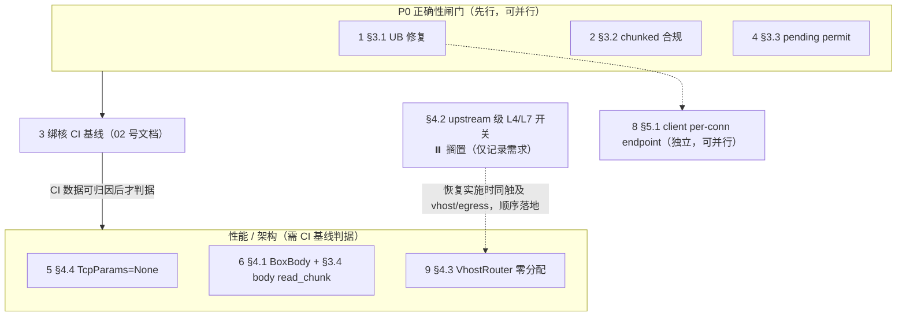

# 热路径与瓶颈分析（2026-07-26 代码审阅）

## 背景

DuoTunnel 是基于 QUIC 的隧道代理，性能目标是**多核下 8000 QPS**。本文把分析锚定在 CI
压测场景 `ingress_8000qps` / `egress_8000qps`（HTTP/1.1 GET，k6 keep-alive，
**server / client 各 1 CPU cgroup 配额**）——这是当前唯一有稳定数据、且最能暴露单核热
路径成本的口径。

方法：

- **以当前 HEAD 代码为唯一事实来源**，不转述历史文档；每条发现附 `file:line` 证据，结论
  可直接回到代码复核。
- 每条与 `docs/todo.md` 的关系在标题或末尾标注：`[已追踪 TODO-xx]`（既有条目，本次复核确认）
  / `[新发现]`（本次审阅新增）。
- §1 数据通路全景、§2 CPU 预算核算为**背景与证据基座**；§3/§4/§5 每条按「现象与证据 → 根因
  → 方案 → 论证/备选 → 场景覆盖 & Corner Cases → 取舍 → 收益/改动量/影响面」展开。

## 问题陈述

本文回答三个问题：

1. **成本在哪** —— 8k QPS 数据通路每一段（accept、sniff、QUIC 建流、L7 解析/重编码、relay、
   syscall）的每请求 CPU 成本各是多少，瓶颈落在哪一侧。
2. **有哪些正确性问题** —— 在冲性能之前，产线路径上还存在哪些 UB / 协议违例 / 并发语义缺陷。
3. **优化怎么排序** —— 在 1 核贴边、CI 噪声大的现实约束下，哪些改动应先做、依赖关系如何。

## 结论速览

| # | 发现 | 严重级别 | 一句话 |
| --- | --- | --- | --- |
| 1 | relay buffer 未初始化内存 UB（§3.1，`copy.rs:17-44`） | **P0 正确性** | 三条取 buffer 路径全用 `unsafe set_len` 暴露未初始化 `&mut [u8]`，覆盖所有 TCP→QUIC relay，`lto=fat + native` 下编译器最能利用 |
| 2 | 响应无条件改写 chunked（§3.2，`h1.rs:291/322-335`） | **P0 正确性+协议** | 204/304/HEAD 违反 RFC 9112 §6.1；keep-alive 下 `0\r\n\r\n` 被严格客户端误读为下一个响应起始 → 框架失步 |
| 3 | `open_bi` pending 竞态 + 全局/每连接语义混用（§3.3，`open_bi.rs:57-67`） | **P0 正确性** | check-then-act 可越限；250 额度是进程全局却按单连接派生，连接数越多越易误杀 |
| 4 | upstream 级 L4/L7 开关旁路 L7（§4.2） | **P1 架构·最大收益** ⏸️ **搁置（已记录需求，暂不实施）** | `mode: l4` 的 upstream 退化为字节转发，L7 侧每请求 ~25-55µs→~10-20µs，单核容量近似翻倍；开关挂在 upstream（`proxy_name` 两端共享）而非 vhost |
| 5 | body 零拷贝丢失 + 三重 BoxBody（§3.4 + §4.1） | **P1 性能** | request body 两次拷贝、每请求装箱 3 次；改 `read_chunk` + 泛型直通省 2 拷贝、2 allocs/req |

---

## 1. 数据通路全景（代码级）

### 1.1 Ingress（k6 → server:8080 → QUIC → client → 后端 echo）

```
k6 (N 个 keep-alive TCP 连接)
 │
 ▼ server 进程
 listener_mgr.rs:97-128   每 accept worker 独立 SO_REUSEPORT listener
 accept.rs:17-75          run_accept_worker → 每连接 tokio::spawn（detached）
 ─── 以下为【每连接一次】───
 tcp_params.rs:24-49      apply(): setsockopt ×4（含强制 4MiB SO_RCVBUF/SNDBUF）
 dispatcher.rs:32-56      sniff: 首读 512B → httparse 完整解析（authority → String 分配）
 dispatcher.rs:94-141     Phase2/3 admission（当前为空）
 dispatcher.rs:150-179    Phase4 vhost：VhostRouter::get（每次查找 1 次 String 分配，见 §4.6）
 h1/mod.rs:25-108         H1Handler：select_client_for_group（DashMap+P2C）
                          → maybe_slow_path → ConnectionHandle::open_stream
 connection_handle.rs:68-107  semaphore try_acquire + open_bi(now_or_never 快路径)
                          + rkyv 序列化 RoutingInfo + 写首帧
 base.rs:51-62            forward_prefixed_to_client：进入双向字节 relay
   TCP→QUIC: copy.rs:106-135 copy_buffered（64KiB 池化 buffer，见 §3.1 UB）
   QUIC→TCP: copy.rs:166-183 read_chunk 零拷贝
 ─── 【每请求】server 侧 = 纯字节转发，无 L7 逻辑 ✅ ───
 │
 ▼ client 进程
 client.rs:91-108         conn.accept_bi → 每 stream spawn handle_work_stream（detached）
 handler.rs:10-34         recv_routing_info（3 次顺序 await + rkyv 反序列化 ≈4 allocs）
 core.rs:53-101           ProxyEngine：RoutingInfo.protocol=H1 → 跳过二次 sniff ✅
 http.rs:19-90            HttpPeer::connect_inner → Http1Driver keep-alive 循环
 ─── 以下为【每请求】❗ client 侧 L7 全解析 ───
 h1.rs:110-159            httparse 完整解析（64 EMPTY_HEADER）
 h1.rs:117-118            format!("{scheme}://{authority}{path}") + Uri::parse（2+ allocs）
 h1.rs:121-131            HeaderMap 逐个 insert
 h1.rs:184-253            body 构造（Empty/StreamBody + BoxBody 装箱）
 http_connector.rs:173-178  再次 map_frame().boxed()（BoxBody 第二次装箱 ❗）
 hyper client（连接池）    H1 编码 → 后端 → 响应
 http_connector.rs:82-97  box_response 第三次装箱 ❗
 h1.rs:262-337            write_response：响应头重新序列化 + 无条件 chunked ❗（见 §3.2）
                          每 chunk 3 次 write_all（hex 前缀 / 数据 / CRLF）
```

### 1.2 Egress（k6 → client:8082 → QUIC → server → 外部 upstream）

与 ingress **完全对称**：client 侧是轻的字节转发（`crates/duotunnel-client/egress/listener.rs:95-253`
每连接 sniff → allowlist → P2C 选连接 → `open_stream` → `relay_quic_to_tcp`），
**每请求的 L7 全解析落在 server 侧**（`tunnel_handler.rs:6-29` → `ProxyEngine` →
`ServerEgressMap::upstream_peer`（`crates/duotunnel-server/egress/mod.rs:84-152`，每 stream 一次 vhost 查找 +
`next_healthy`）→ 同一个 `HttpPeer::connect_inner` / `Http1Driver` 循环）。

**关键结构性结论**：QUIC stream 与下游 TCP 连接是 1:1 映射（两个方向都是），
RoutingInfo 只在 stream 建立时发一次；k6 keep-alive 下**每请求的边际成本 =
一侧纯字节转发 + 另一侧完整 L7 解析/重编码**。做 L7 的那一侧（ingress 为 client、
egress 为 server）是 8k QPS 的 CPU 瓶颈所在。

> 注：`crates/duotunnel-core/src/egress/http.rs:91 forward_http` 并不在这条链路上——它已是
> **死代码**（全仓库仅 lib.rs:16 重导出，无调用方），详见 04 文档 §2.1。

---

## 2. 每请求 CPU 预算核算（1 core @ 8000 rps → 125 µs/req/进程）

L7 侧（ingress=client / egress=server）每请求成本估算（x86 现代核，release+LTO）：

| 环节 | 估算 | 依据 |
| --- | --- | --- |
| httparse 完整解析（~6 header） | 1–2 µs | h1.rs:110 |
| HeaderMap 构建 + sanitize | 0.5–1.5 µs | h1.rs:121-131,178 |
| URI format!+parse | 0.5–1 µs | h1.rs:117-118 |
| 堆分配 8–12 次（BoxBody×3、HeaderMap、Uri、header_buf…） | ~1 µs | 全链 |
| hyper pool checkout + H1 编解码 | 5–15 µs | hyper 内部 |
| 响应头重序列化 + chunked 重编码 | 0.5–1 µs | h1.rs:276-335 |
| QUIC：~4–8 packet 的 AEAD + 协议处理 | 8–20 µs | quinn+rustls |
| syscalls（GSO/GRO 摊薄后 sendmsg/recvmsg ×2–6） | 2–8 µs | quinn-udp |
| tokio 唤醒/调度/waker | 2–5 µs | — |
| **合计** | **≈25–55 µs/req** | |

理论单核上限 ≈ 18k–40k rps；叠加 endpoint driver、timer、连接建立摊销后
**实际 8k–15k rps/core 是合理区间**——即 8k QPS 在 1 核上"可达但贴边"，
任何 CFS 争抢/节流都会直接打爆 p99。这就是 4c runner 上 5+ 进程（k6 需 ≥2 核）
必然互相拖累的算术根源 → 解法见 02（绑核）与 06（方法论）。

纯转发侧每请求 ≈10–20 µs（2×read/write + QUIC 加解密 + relay copy）。

---

## 3. P0：正确性问题（先于一切性能工作）

### 3.1 relay buffer 未初始化内存 UB —— 确认仍在产线路径 `[已追踪 TODO-97（reopened）]`

**现象与证据**：`crates/duotunnel-core/src/engine/copy.rs:17-44` `take_buffer` 三条路径（thread-local
复用 / global 复用 / 新分配）全部以 `unsafe set_len(buffer_size)` 暴露未初始化字节，随后
`copy_buffered`（:127）把 `&mut [u8]` 交给 `AsyncReadExt::read`。该函数覆盖 **TCP→QUIC 方向
的所有 relay**（ingress/egress/TLS，经 `relay()` / `copy_buffered_then_finish`）。

**根因**：**构造指向未初始化内存的 `&mut [u8]` 本身即 UB**，与"读之前会被覆盖"无关；在
`lto=fat + codegen-units=1 + target-cpu=native` 下编译器最有能力利用这类 UB。三条路径共享同
一个 `#[allow(clippy::uninit_vec)]` 掩盖的模式，池化复用还让同一块未初始化内存反复进入热路径。

**方案**：todo 中的 `BytesMut + read_buf` 方案正确，建议立即执行——池里存 `BytesMut`，每次读
用 `AsyncReadExt::read_buf` 直接写入未初始化容量区，由 `ReadBuf` 按实际读入推进 `len`。

**论证/备选**：
- **继续 `set_len`**（现状）：始终要构造 uninit 的 `&mut [u8]`，UB 不消除，否决。
- **`Vec::with_capacity + resize`（即 `vec![0; n]` 零填充）**：安全，但每次取 buffer 都要
  memset 64KiB，热路径每方向每 relay 一次，白付 memset 税。
- **`BytesMut + read_buf`（选定）**：`read_buf` 从不构造 uninit 的 `&mut [u8]`，且**无 memset**
  ——性能上与当前方案等价，同时消除 UB。兼得安全与零填充，是唯一两全解。

**场景覆盖 & Corner Cases**：仅 TCP→QUIC 方向需改（反向 `copy_quic_to_shutdown`（:166）用
`read_chunk(usize::MAX, true)` 本已零拷贝、无 uninit）。EOF：`read==0` 跳出循环后 `finish`/
`shutdown`，语义不变；短读：只写 `&guard[..read]`，`read_buf` 同样只推进已读长度；任务取消：
future 被 drop 时 `PooledBufGuard::drop` 归还 buffer（容量保留、`len` 复位），换 `BytesMut`
后 `clear()` 归还即可，行为一致。

**取舍**：池的元素类型从 `Vec<u8>` 换成 `BytesMut`，`PooledBufGuard` 及 thread-local/global
两级池的类型签名随之改动；无功能取舍。

**收益 / 改动量 / 影响面**：消除产线 UB（不可量化但为 P0 硬约束）；性能中性（无 memset）；改动
集中在 `copy.rs`（~40 行）+ 池类型；回滚方式=还原 `copy.rs` 单文件。影响所有 relay 路径，需跑
一遍 ingress/egress/TLS 冒烟。

### 3.2 响应无条件改写为 `transfer-encoding: chunked` `[新发现]`

**现象与证据**：证据链 `http_utils.rs:112-115` `sanitize_response_headers` 无条件删除
`Content-Length` 与 `Transfer-Encoding` → `h1.rs:291` 无条件写入
`transfer-encoding: chunked` → `h1.rs:322-335` 无条件写终结块 `0\r\n\r\n`。

**根因（本次复核修正）**：`sanitize_response_headers` 全仓库**只有一个调用方**——
`Http1Driver::write_response`（`h1.rs:274`，grep 确认唯一）。而 driver 手里的响应体类型是
`BoxBody<Bytes, std::io::Error>`，即**类型擦除后的流式 body**：上游可能是 H1、也可能是 h2c
（`HttpConnector` 会探测 h2c），经 hyper 之后统一收敛成 BoxBody。因此真正的根因是
**保守 framing**——driver 无法确信头里那个 `Content-Length` 与擦除后的 body 一致，于是索性删掉
可能不准的长度、统一用 chunked（chunked 对任意长度都安全）。

**这个保守选择并非必要**：`http_body::Body` 提供了 `size_hint().exact()`，`BoxBody` 实现了它——
**长度是拿得到的，只是代码没用**。

> 需明确反驳的常见误解："删 Content-Length 是因为要把 H1 转 H2"。只沾一点边（上游确实可能是
> H2），但它**不构成删除 Content-Length 的正当理由**：无论上游是 H1 还是 H2，向下游 H1 写响应时
> 只要 body 长度可精确得知，就应透传 Content-Length。

**次要根因（仅对 HEAD 成立）**：`write_response` 看不到**原始请求方法**，无法判断"该响应不得带
body"。这是修复的前置条件，而非 chunked 改写的原因。

**方案**：
- **前置改动**：`Http1Driver` 在 `read_request` 阶段把请求方法记录到自身字段（一个字段、~5 行），
  供 `write_response` 判定 HEAD；
- 204/304/对 HEAD 的响应：不写 TE、不写 body、不写终结块；
- body 有精确长度时直接透传 `Content-Length`，chunked 只留给真正未知长度的流式响应：

  ```rust
  // write_response 内，sanitize 之后、写 framing 头之前
  let exact_len = response.body().size_hint().exact();
  match (no_body_status_or_head, exact_len) {
      (true, _)      => { /* 只写头 + 空行，无 TE、无 body、无终结块 */ }
      (false, Some(n)) => { headers.insert(CONTENT_LENGTH, n.into()); /* 直写 body，不分块 */ }
      (false, None)    => { headers.insert(TRANSFER_ENCODING, "chunked"); /* 现有 chunked 路径 */ }
  }
  ```

- chunk 写入合并为单次 `write_all`（prefix+data+CRLF 拼在 header_buf 或用
  `write_all_chunks`），减少 2/3 的 SendStream 调用。

**论证/备选**：
- **维持无条件 chunked**（现状）：违反 RFC 9112 §6.1，否决。
- **一律改写 Content-Length**：需要缓冲整个 body 才能算长度，破坏流式/未知长度响应，且会丢掉
  chunked trailer 能力（见下），否决。
- **按 `size_hint().exact()` + 状态码/方法分流（选定）**：精确长度走 Content-Length、未知长度
  与带 trailer 的响应保留 chunked、无 body 状态直接空响应——既合规又保住流式与 trailer。

**场景覆盖 & Corner Cases**：
1. **204/304**：RFC 9112 §6.1 禁止携带 Transfer-Encoding → 改为只写头 + 空行，无终结块。
2. **HEAD 响应**：不得有 body；但 `write_response` 当前**看不到请求方法**，修复需在 `read_request`
   里把方法（或"无 body"标志）记为 `Http1Driver` 的一个字段再传到 `write_response`——这是本项唯一
   的 plumbing 前置（~5 行）。
3. **keep-alive / pipelining 失步**：现状把 `0\r\n\r\n` 终结块写进流里，严格客户端在 keep-alive
   下会把这 5 字节当作下一个响应的起始 → **框架失步**（偶发解析错误/连接被杀）；修复后消失。
4. **trailer**：`h1.rs:324-335` 的 `accumulated_trailers` 路径仅 chunked 支持，故切 Content-Length
   前必须确认 `size_hint().exact()` 命中（无 trailer 的定长响应才切）。
5. **`Connection: close`**：:267-272 的 `should_close` 判定与本改动正交，保留。

**取舍**：需在 driver 内多传一个请求方法/无 body 标志到写响应处；chunked 编码路径保留（不是删除），
仅在可精确定长时旁路。

**收益 / 改动量 / 影响面**：协议合规（消除偶发失步）；正常响应省 chunked 重编码税（每 chunk
~10 字节 + 从 3 次 `write_all` 降到 1 次，即 **-3 写调用/chunk** 的 2/3）；改动在 `h1.rs`
write_response + `http_utils.rs` sanitize，~50-80 行；回滚=还原这两处。影响所有 H1 响应，需覆盖
204/304/HEAD/大 body/流式回归。

### 3.3 `open_bi` pending 上限：check-then-act 竞态 + 全局/每连接语义混用 `[已追踪 TODO-80（reopened）+ 新增语义问题]`

**现象与证据**：`open_bi.rs:57-64` 先读全局计数再判断，`:65-67` 才 `fetch_add`——并发下可越限
（todo 已知）。**代码里还有一个 todo 未记录的语义问题**：计数器
`METRICS.stream_pending_queue_depth`（`infra/metrics.rs:7,24`）是**进程全局**的，而上限
`max_pending_streams` 默认派生自**单连接** `max_concurrent_streams/4`（`overload.rs:53`，默认
250）。

**根因**：一个"按单连接语义设定的阈值"被套在一个"进程全局计数器"上；check 与 act 之间无原子性，
且 N 条 QUIC 连接 + 同进程 ingress/egress 两个方向共享同一个 250 全局额度——连接数越多越容易被
误杀，与 per-connection 语义相悖。

**方案**：per-connection `Semaphore`（todo 方案）替换 check-then-act 的全局计数；全局预算另设一层，
对应 TODO-142 的分层模型。

**论证/备选**：
- **给全局计数加锁/CAS 重试**：能修竞态，但修不了"全局额度冒充每连接额度"的语义错配，否决。
- **per-connection Semaphore + 分层全局预算（选定）**：`try_acquire` 天然原子（消除竞态），额度
  归属每连接（语义正确），全局层单独限总量（防进程级过载）——一次解决竞态与语义两个问题。

**场景覆盖 & Corner Cases**：多连接（N>1）下每连接独立额度不再互相挤兑；ingress + egress 同进程
不再共享同一池；permit 在 stream 建立失败/取消时随 guard drop 释放（不泄漏）；突发排队时由每连接
semaphore + 全局层双闸控制，`Retry-After`/503 语义可信（见 §4.7）。

**取舍**：引入每连接 semaphore 的持有/传递（open_stream 路径多一个 permit 生命周期），略增状态；
全局分层需与 TODO-142 协同设计。

**收益 / 改动量 / 影响面**：过载语义从"不可信/会误杀"变为可信；改动在 `open_bi.rs` + `overload.rs`
+ 连接握手处放置 semaphore，~1 天；回滚=恢复全局计数分支。影响所有 open_stream 快/慢路径。

### 3.4 请求 body 读取丢失零拷贝 + 双重拷贝 `[新发现]`

**现象与证据**：`h1.rs:208,231-234`：request body 流用 `vec![0u8; 8192]` scratch（每个带 body 的
请求分配一次）+ `recv.read(&mut scratch)` + `Bytes::copy_from_slice`——两次拷贝。同文件 header
阶段（:86）已经在用 `read_chunk` 零拷贝，body 反而退化。

**根因**：body 循环沿用了 `AsyncRead::read` + 临时 scratch 的老写法，而 QUIC `RecvStream` 本身能
`read_chunk` 直接产出 `Bytes`（引用底层缓冲，零拷贝），当前多了一次 scratch 分配 + 一次
`copy_from_slice`。

**方案**：body 循环改 `read_chunk(min(remaining, 64KiB), true)`，`chunk.bytes` 直接 `Frame::data`，
scratch 整个删除。

**论证/备选**：header 阶段（:86）已是 `read_chunk` 的既有范式，body 复用同一范式最小改动、语义
一致；相比"扩大 scratch"或"复用池化 buffer"，`read_chunk` 直出 `Bytes` 连拷贝本身都省掉，是更彻
底的解。

**场景覆盖 & Corner Cases**：GET 压测不受影响（无 body / `is_end_stream`）；POST/上传路径受益明显。
EOF：`read_chunk` 返回 `None` 结束 body；短读：返回当前可用 chunk，`remaining` 递减控制读取上限；
`ordered=true` 保序；取消：drop recv 即可。带 Content-Length 与 chunked 请求体均由 `remaining`
上限约束单次读取长度。

**取舍**：无功能取舍；仅把一次拷贝路径换成零拷贝路径。

**收益 / 改动量 / 影响面**：省 1 次 scratch 分配 + 1 次 `copy_from_slice`/body 读；改动在 `h1.rs`
body 循环，~15-20 行；回滚=还原该循环。影响所有带 body 的 H1 请求（GET 无感）。

### 3.5 既有 P0/P1 修复项——代码复核结论与 todo 一致

以下为既有追踪项，本次审阅**复核确认现象仍在、方案沿用 todo 既定条目**，不重复展开模板：

- `EntryConnPool::new` 容量乘法未检查（`conn_pool.rs:76`）`[已追踪 CR-AUDIT-5]`
- `apply_transport_params` 的 `try_into().unwrap()`（`quic.rs:38-45`）`[已追踪 CR-AUDIT-6]`
- Server registry slot 硬编码 4096（`registry.rs:89`）`[已追踪 TODO-146]`
- detached `tokio::spawn` 遍布 accept/stream/H2 driver（`accept.rs:39`、
  `handlers/quic.rs:47,205`、`client.rs:97`、`h2_proxy.rs:89`）`[已追踪 TODO-96 / CR-AUDIT-21]`
- 鉴权失败把内部错误文本回给未认证方（`handlers/quic.rs:152-157`）`[已追踪 CR-AUDIT-22]`

---

## 4. P1：性能优化（按预期收益排序）

### 4.1 L7 侧三重 BoxBody 装箱/请求 `[新发现]`

**现象与证据**：每请求 body 被装箱 3 次：driver 构造（h1.rs:186/198/252）→
`http_connector.rs:173-178` 请求侧再装 → `:82-97` 响应侧再装。每次装箱 = 1 次堆分配 + 后续每个
frame poll 一次动态分发。

**根因**：`HttpConnector::request`（`http_connector.rs:152`）虽已是泛型 `request<B>`，却在
:174-177 无条件 `map_frame(...).boxed()` 再包一层才交给 hyper client；driver 侧先构造好的
`BoxBody` 又被这里二次装箱，纯为统一类型而付 alloc + 间接调用。

**方案**：`HttpConnector::request` 改成泛型直通（`B: Body` 直接交给 hyper client，只在需要统一
返回类型的边界装一次），省 2 allocs/req + 间接调用。

**论证/备选**：hyper client 本就接受任意 `Body`，请求侧的 `.boxed()`（:174-177）纯属多余；保留
的唯一必要装箱是响应侧 `box_response`（:82-97）用于统一返回类型。相比"到处保留 BoxBody 图省事"，
泛型直通把装箱压到最小集合，收益直接。

**场景覆盖 & Corner Cases**：h2c 重试路径（`build_retry_request` :65-80）构造 `Empty` 轻量 body，
不受影响；`Empty`（GET 无 body）与 `StreamBody`（带 body）两种 driver 构造体都能作为泛型 `B`
直通；响应侧仍装一次以统一 `BoxBody` 返回，行为不变。

**取舍**：`request` 及调用链的类型签名泛型化（编译期单态化，代码体积略增），换掉运行时装箱。

**收益 / 改动量 / 影响面**：**-2 allocs/req** + 少两跳动态分发；改动在 `http_connector.rs` 签名 +
调用点，~30-50 行；回滚=恢复 `.boxed()`。影响所有 L7 请求路径，建议与 §3.4 一并落地（都在 body
构造链上）。

### 4.2 「纯转发」旁路 L7：**upstream 级 L4/L7 开关** `[新发现] ⏸️ 搁置（已记录需求，暂不实施）`

> **状态：搁置。** 本节仅记录需求与设计结论，本轮**不实施**。收益判断（单核容量近似翻倍）不变，
> 但落地时机待定；下文的 schema 与落点是搁置时点的设计定稿，恢复实施时直接沿用。

**现象与证据**：当前 `mode: http` 的每个请求都要"解析→重建→重序列化"（§1.1 client 侧、§1.2
server 侧全链），但对不需要改写 header/按请求路由的转发目标（压测场景、以及大量实际内网穿透场景），
连接级路由已在 sniff/首请求确定。

**根因**：L7 抽象把"连接级路由"和"请求级 L7 处理"绑在一起；对只需连接级路由的转发目标，后续每请求
的 httparse/URI/HeaderMap/BoxBody/chunked 全是无用功。

**方案（设计修正：开关挂在 upstream 而非 vhost）**：初版设想的"vhost 级 `passthrough: true`"是**错**
的落点——vhost 只是 server 侧的入口匹配规则，client 侧并不认识它；两端**共同认识的标识是
`proxy_name`**，而 `proxy_name` 对应的正是 upstream（代理）定义。因此开关应挂在 **upstream 定义**上：

```yaml
client_configs:
  groups:
    group-a:
      upstreams:
        grpc_service:
          mode: l4          # l4(纯字节) | l7(HTTP 感知，默认)
          servers: [{ address: "127.0.0.1:9090" }]
```

落点：`IngressClientApp::upstream_peer`（`crates/duotunnel-client/ingress/app.rs:104`）读取该 upstream 的 `mode`——
`l4` 直接返回 `PeerSpec::Tcp`（**忽略 sniff 出的 protocol**），`l7` 维持现有行为；egress 侧
`ServerEgressMap::upstream_peer`（`crates/duotunnel-server/egress/mod.rs:84`）同构。

**论证/备选**：
- **vhost 级 flag**（初版）：标识只存在于 server 一侧，client 侧无从获知同一转发目标该走 L4 还是
  L7，否决。
- **upstream 级 `mode`（选定）**：`proxy_name` 是两端共享的标识，配置落在 upstream 上时**两侧语义
  天然一致**；且连接级路由已定，后续退化为字节转发等价 frp 行为，不推翻现有抽象（只改
  `upstream_peer` 的返回分支，复用现成 relay）。相比在更低层做透明拦截，改 `upstream_peer` 仍是
  最小侵入点。

**场景覆盖 & Corner Cases**：仅 `mode: l4` 的 upstream 旁路，其余仍走 L7（不改写 header/按请求路由
的场景不受影响）；`l4` 下无 chunked 重编码、无 §3.2 失步风险；覆盖 ingress（client 侧）与 egress
（server 侧）两向。**与 `mode: tcp` 监听器的关系**见 11§4：TCP 监听器进来的流量若是 HTTP，当前**仍会
在 client 侧被完整 L7 重建**——本开关正是消除该反直觉行为的手段。压测口径上建议**两种模式都测**，
分别回答"转发容量"与"L7 代理容量"。

**取舍**：
- 放弃 hyper 到后端的连接复用——**每条隧道 stream = 一条新建的后端 TCP 连接**（后端连接数 = 下游
  连接数；内网场景通常可接受，但后端连接建立成本与 fd 占用需按场景评估）；
- 失去该 upstream 上的全部 L7 能力：XFF 注入、header/路径改写、按请求路由、请求级可观测。

**收益 / 改动量 / 影响面**：L7 侧每请求成本从 **~25-55µs 降到 ~10-20µs，单核容量近似翻倍**；改动
在两处 `upstream_peer` + `UpstreamDef` 加一个 `mode` 字段，1-2 天；回滚=移除配置分支（默认 `l7`，
天然安全）。影响 `mode: l4` 的 upstream，其余零影响。**当前不排期。**

### 4.3 `VhostRouter::get` 每次查找分配 + 无意义 unsafe（见 04 §1.2）

**现象与证据**：`listener.rs:156-163`：`canonicalize_egress_host` 先 `to_lowercase()` 分配 String，
然后又把它拷进 256B 栈缓冲并 `from_utf8_unchecked`——分配已经发生，栈拷贝纯属浪费。egress 方向此
函数**每 stream 调用**（allowlist + 路由各一次）。

**根因**：为"避免分配"而写的栈缓冲 + `unsafe`，却在其之前已经 `to_lowercase()` 分配了 String，
优化前提不成立，unsafe 白担风险。

**方案**：ASCII 快速路径直接在栈缓冲上做 lowercase + 端口剥离（0 分配），非 ASCII 慢路径才走现有
canonicalize；顺带删除 unsafe。

**论证/备选**：绝大多数 host 是 ASCII，快速路径覆盖热点且真正 0 分配；非 ASCII 保留现有正确路径。
相比"直接返回 `Cow<str>` 借用"，栈缓冲 ASCII 化对下游 `&str` 查找同样 0 分配且不改签名。

**场景覆盖 & Corner Cases**：带端口 host（`example.com:8443`）剥离端口；大小写混合走 ASCII 快
路径；含非 ASCII（IDN/punycode 前）走慢路径 canonicalize；空 host 由既有校验兜底。allowlist 与
路由两次调用同样受益。

**取舍**：多一条 ASCII/非 ASCII 分支判断（极廉价），换掉一次 String 分配 + unsafe。

**收益 / 改动量 / 影响面**：删 1 处 unsafe + 省 egress 每 stream 1 次 String 分配（×2 调用点）；
改动在 `listener.rs`，~20 行；回滚=还原该函数。影响 egress 路由/allowlist 热路径。

### 4.4 TcpParams 默认强制 4MiB socket buffer `[已追踪 TODO-105，建议立即做]`

**现象与证据**：`tcp_params.rs:15-16` 默认 `Some(4MiB)`，每条接入/上游 TCP 连接 setsockopt 固定
8MiB 上限、关闭内核 autotuning。

**根因**：把一个本应"未设则由内核自适应"的旋钮硬编码成了固定大值默认。

**方案**：改 `None` 默认 + 显式覆盖语义（todo 方案成熟，实现半天）。

**论证/备选**：`None` 让内核 autotuning 接管（loopback 省内存、生产按 BDP 自适应）；需要固定大
buffer 的场景仍可显式配置。相比"下调固定值"，`None` 恢复自适应更普适。

**场景覆盖 & Corner Cases**：CI loopback 纯粹浪费内存带宽预算 → 改后回收；高并发生产原本是 OOM
风险（每连接 8MiB 上限）→ 改后随 BDP 自适应；显式配置路径保留（覆盖语义）。

**取舍**：放弃"无脑大 buffer"的默认，交给内核自适应（个别高 BDP 场景需显式配置）。

**收益 / 改动量 / 影响面**：内存/自适应恢复（高并发下显著降内存、去 OOM 风险）；改动在 `tcp_params.rs`
默认值 + 覆盖语义，0.5 天；回滚=改回 `Some(4MiB)`。影响所有接入/上游 TCP 连接。

### 4.5 CI 场景 BBR → Cubic

**现象与证据**：`quic.rs:29` 默认 `congestion: "bbr"`。BBR 的带宽/最小 RTT 采样在 loopback 无收
益，只有 CPU 开销；配置已支持 `cubic`。

**根因**：默认拥塞控制按 WAN 生产选了 BBR，但 CI 是 loopback，采样开销纯浪费。

**方案**：**CI 配置建议显式设 cubic**（生产 WAN 保持 BBR）。

**论证/备选**：无需改代码（配置已支持），仅切 CI 配置项；相比在代码里按环境自动选择，显式配置更
透明、不影响生产默认。

**场景覆盖 & Corner Cases**：仅 CI/loopback 切 cubic；生产 WAN 保留 BBR（真实 RTT/带宽下 BBR 有
收益）；两种拥塞控制均为既有代码路径，无新增分支。

**取舍**：CI 与生产用不同拥塞控制配置（需在压测口径文档中记录，避免误读结果）。

**收益 / 改动量 / 影响面**：去掉 loopback 上 BBR 采样的 CPU 开销；改动=CI 配置一行；回滚=删配置。
仅影响 CI 压测进程。

### 4.6 RoutingInfo 编解码开销（每 stream ~6-8 allocs）

**现象与证据**：`msg.rs:119-165`：发送侧 rkyv AlignedVec + frame Vec 两次分配；接收侧
`read_u8`/`read_u32`/`read_exact` 三次顺序 await + AlignedVec + deserialize 出 `String` 字段。

**根因**：通用 rkyv 消息编解码用在了固定小结构上，每 stream 建立时多次分配 + 三次顺序 await。

**方案**：**低优先级**——等 TODO-140 基线证明后再考虑定长二进制头。

**论证/备选**：对连接复用型压测无感（每连接只发一次），只有短连接/高建流率场景可见；定长头能省
分配与 await，但改协议线格式属破坏性变更，须先有基线数据支撑（避免无证据优化）。

**场景覆盖 & Corner Cases**：k6 keep-alive（低建流率）几乎无收益 → 不应先做；短连接/高建流率场景
才是候选；`host: Option<String>` 字段的分配是接收侧主要开销点。

**取舍**：暂不动（避免在无基线时改线格式）；等 TODO-140。

**收益 / 改动量 / 影响面**：潜在 -6~8 allocs/stream + 省 3 次顺序 await（仅高建流率可见）；改动涉及
线格式，须版本兼容；当前**不排期**，列为基线后再评估。

### 4.8 批处理（writev / io_uring / SIMD）在本项目的实际适用性 `[2026-07-26 补录]`

**背景**：外部资料常把 `writev`、`io_uring`、SIMD 归纳为同一条哲学——"拒绝零售、只做批发"，
用批量化摊薄交互成本。这条原则本身正确，本节记录它在**本代码库**逐项核对后的落点，
避免按哲学平均用力。

**已经在用的（不是待办）**：
- **向量化写**：M1 已把 chunked 响应从"每 chunk 三次 `write_all`（hex 前缀 / 数据 / CRLF）"
  合并为一次 `write_all_chunks`。**注意这与 `docs/guide/counter_intuitive_network_practices.md`
  §1.4 的字面建议相反**，取舍与未决之处见该节的补注。
- **SIMD**：`httparse` 内部已用 SSE4.2/AVX2 扫描 header，L7 请求解析这一步**已经是**
  向量化的。剩余候选（`canonicalize_egress_host` 的 ASCII 小写化、vhost 查找）字符串仅
  ~20 字节，SIMD 设置成本吃掉收益——该处的正解是消除那次 `String` 分配（§4.3），不是向量化。
- **UDP 收发批量化**：quinn 的 GSO/GRO 已覆盖，见 [03](./03-io-uring-assessment.md)。
- **io_uring**：**已否决**（决策 D-12）。否决理由不是忽视批处理收益，而是生态契约：
  tokio/quinn/hyper 全为 readiness 模型、pingora 亦未采用、QUIC 的 UDP 已批量化，
  且需重写 I/O 层并牺牲 seccomp 部署自由度。此前引用的 5–15% 是外部理论区间，
  没有 DuoTunnel 实测依据，已由 14/D10 撤回，不参与优先级排序。

**量级校准（决定该不该做的关键）**：1 核 8k QPS 的预算是 125 µs/req，L7 侧实测估算
25–55 µs/req（§2）。合并几次流写量级在 **1–3 µs/req**。相比之下同一份分析里的
S0（listener runtime 归属，[02 §2.0](./02-scalability-and-cpu-affinity.md)）决定的是整条公网
ingress 跑在 1 个线程还是 N 个线程，§3.4 + §4.1 的 body 双拷贝 + 三重装箱是每请求
~2 次分配 + 2 次拷贝。**结论：批处理是二阶项**；先解结构性串行点与每请求分配，再谈批处理。

**尚未做、值得做的候选（均为 benchmark-gated）**：

| # | 候选 | 位置 | 判据 / 风险 |
| --- | --- | --- | --- |
| B1 | **relay 读侧批量化**：`read_chunk`（单数）→ `read_chunks(&mut [Bytes])`（quinn 0.11.9 `recv_stream.rs:215` 已提供，全仓 4 处均用单数） | `engine/copy.rs`、`driver/h1.rs`、`egress/http.rs` | relay 是全系统频次最高的循环，但 64 KiB buffer 已摊薄大部分开销，且单次能否取到多个 chunk 取决于对端发送模式——**必须先用 microbench + profile 验证 chunk 到达分布**，否则可能零收益 |
| B2 | **响应头与首个 body 帧合并写**：Content-Length / close-delimited 分支目前 header 用 `write_all`、body 每帧 `write_chunk`，小响应实际是 2 次流写 | `driver/h1.rs` write_response | 压测用例（GET 小响应）正好命中；与 §1.4 的"拼接 vs 向量化"未决问题同源，应一并测 |
| B3 | **UDP 每包分配 + 每包 `send_datagram`** | 见 [11 §6](./11-passthrough-modes.md) | 已并入 TODO-144；批量化空间比 TCP relay 更明确（每包一次分配是确定的浪费） |
| B4 | **per-core 计数消 K1** | [02 Phase A](./02-scalability-and-cpu-affinity.md) | 同一哲学在**缓存行**层面的应用：共享原子的每连接/每流 ±1 是"零售交互"。已在 Phase A，本节视角支持提高其优先级 |

**顺序纪律**：以上全部受 [06](./06-bench-methodology.md) 的基线纪律约束。**此刻尤其不能启动**
——S0 修复后我们才知道此前所有多核数字都是在 ingress 被锁在单线程时测得的。正确顺序是
cpuset 隔离 → 重测建立可信基线 → 按 profile 挑目标，而不是按哲学挑目标。

### 4.7 其余确认项

以下为微优化/确认项，保留紧凑列表（现象 + 证据 + 一句方案 + 标注）：

- 每连接 4 次 `metrics::counter!/gauge!` 宏（registry 哈希查找）`[已追踪 TODO-CR4]`；
- `hint.clone()` 在 dispatch 阶段发生 3 次（dispatcher.rs:85,89,157），每次克隆
  `authority: Option<String>`——合并为 Arc 或借用可省 2-3 allocs/连接 `[新发现，微]`；
- 慢路径参数默认 yield=80%、sleep=95%（duotunnel-store config/mod.rs:98-103）：
  CI `connections=1` 时 800 inflight 才触发，8k 用例 maxVUs≤2000 且短请求，
  正常不会命中——**排除了它作为 CI 噪声源的嫌疑**，但 8k 突发排队时
  `max_concurrent_streams=1000` + pending=250 会成为硬闸（表现为 503/`Retry-After`），
  压测配置里应按 rate 显式调参并在启动日志确认（TODO-140 的诉求）。

---

## 5. P2：架构级（多核扩展性）

### 5.1 单 quinn Endpoint = 单 UDP socket（两端皆是）

**现象与证据**：Server：`handlers/quic.rs:23-28`；Client：`endpoint.rs:24-31` + `pool.rs:23`
（所有 supervisor 共享同一 endpoint clone）。多核机器上 endpoint driver 的 UDP 收发是最终单点。
`[已追踪 TODO-24（研究态）]`

**根因**：单 Endpoint = 单 UDP socket，其 driver 任务的收发在多核上无法水平扩展，成为吞吐上限。

**方案**：**新增建议——client 侧无需等 eBPF**：client 是发起方，每条连接可以拥有**独立 Endpoint
（独立 UDP socket、独立源端口）**，内核按四元组天然分流。改动集中在 `build_quic_endpoint` 调用处
（per supervisor slot 建一个）。Server 侧维持 todo 的"证据驱动 + CID-aware eBPF"立场不变。

**论证/备选**：client 作为发起方没有 server 侧 `SO_REUSEPORT` + CID 迁移的路由问题，独立 Endpoint
让内核四元组分流即可扩展，代价极小；server 侧因存在 CID 迁移/连接可路由性约束，仍需 eBPF 方案，
不宜同法照搬——故 client 先行、server 保持研究态。

**场景覆盖 & Corner Cases**：client 每 supervisor slot 一个 Endpoint，随 `connections` 数横向扩展
QUIC I/O；连接迁移/重连仍在各自 Endpoint 内；server 侧不变（避免 CID 路由破坏）。

**取舍**：client 侧多个 UDP socket/源端口（少量 fd 与内存），换 QUIC I/O 可扩展；server 侧暂不动。

**收益 / 改动量 / 影响面**：client QUIC I/O 随连接数可扩展；改动在 `build_quic_endpoint` 调用处，
一小时级（0.5 天内）；回滚=恢复共享 endpoint clone。仅影响 client 侧，server 侧零影响。

### 5.2 其它

- **TLS ingress sender 缓存降级为 `OnceCell`**：per-connection `Mutex<HashMap>` 实际只有 1 个 key
  （`tls/mod.rs:93-107`，route_target 在连接期固定）——结构降级为 `OnceCell` 即可去掉每请求的锁 +
  哈希查找。现象+证据明确，改动局部（单文件，~20 行），无功能取舍，回滚=还原该结构。
- **`ClientRegistry`/`EntryConnPool` 的 actor+ArcSwap 快照读是对的方向**，分片 actor（TODO-106/111）
  维持证据驱动即可，本次审阅**无新增反例**（保持现状，不排期）。

---

## 实施顺序与依赖（结合 CI 现状）

| 顺序 | 项 | 类型 | 工作量 | 预期效果 |
| --- | --- | --- | --- | --- |
| 1 | §3.1 UB 修复（TODO-97） | 正确性 | 1–2 天 | 消除产线 UB |
| 2 | §3.2 chunked 正确性 + Content-Length 透传 | 正确性+性能 | 1 天 | 协议合规；-3 写调用/chunk |
| 3 | 02 号文档的绑核方案（CI 先行） | 测试有效性 | 1 天 | p99 噪声大幅下降，结果可归因 |
| 4 | §3.3 pending permit 化（TODO-80） | 正确性 | 1 天 | 过载语义可信 |
| 5 | §4.4 TcpParams=None（TODO-105） | 性能 | 0.5 天 | 内存/自适应恢复 |
| 6 | §4.1 BoxBody 去重 + §3.4 body read_chunk | 性能 | 1 天 | -2 allocs/req、body 零拷贝 |
| — | §4.2 upstream 级 L4/L7 开关 | 架构 | 1–2 天 | 转发容量近似 ×2 —— ⏸️ **搁置（已记录需求，暂不实施，不占顺序位）** |
| 8 | §5.1 client per-connection endpoint | 架构 | 0.5 天 | client QUIC I/O 可扩展 |
| 9 | §4.3 VhostRouter 零分配 | 质量+微性能 | 0.5 天 | 删 unsafe |

**依赖关系**（哪些前置阻塞哪些）：

- **正确性闸门（1、2、4）先行**：这三项是 P0 正确性，**在它们完成前不建议投入任何
  benchmark-gated 微优化**（与 todo.md 的 "evidence-driven" 原则一致）——否则在 UB / 协议失步 /
  过载误杀之上测出来的数是不可信的。三者相互独立，可并行。
- **CI 基线（3）是 5–9 的判据前置**：只有绑核（02 号文档）落地后，CI 的 p99 噪声下降、结果可归
  因，**3 完成后 CI 数据才值得作为 6–9 收益的判据**。§4.6、§4.7、§5.2 的排期同样等 3 的基线
  （TODO-140）证明后再评估。
- **同文件耦合**：6 = §4.1 + §3.4 打包（同在 body 构造链）；§4.2（改 `upstream_peer` 返回）与
  9（§4.3 改 `canonicalize_egress_host`）都触及 vhost/egress 路径——§4.2 已搁置，故 9 可独立落地；
  若日后恢复 §4.2，仍应与 9 顺序落地避免冲突。
- **8（client endpoint）独立**：不依赖前述任何项，可与 5–7、9 并行。


