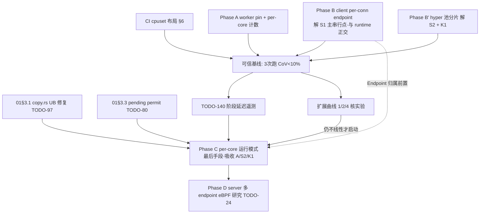

# 多核线性扩展与绑核设计（2026-07-26）

## 背景

好的网络应用应当满足两条工程标准：**QPS 随核数近似线性增长**、**延迟波动小**（高分位平稳）。DuoTunnel 的目标是在多核机器上稳定支撑 **8k QPS** 的多核吞吐。用户在本轮 review 中明确提出两个方向性疑问：**actor mode 是否是达成该目标的合适手段**，以及**绑核（CPU affinity）具体怎么做**。本文先建立线性扩展的判定框架，再落到 DuoTunnel 的代码证据与分阶段路线。

## 问题陈述

具体拆成三个问题——**线性扩展还差什么**、**actor mode 是否正确手段**、**绑核如何设计（CI 隔离 + 进程内 pin）**：

> 回答三个问题：
> 1. 「好的网络应用应当 QPS 随核数线性增长、延迟波动小」——DuoTunnel 距离这个目标差什么？
> 2. Actor mode 是否是达成该目标的正确手段？
> 3. 绑核（CPU affinity）如何设计：进程内自动绑核 + CI 4c runner 的最佳配比。

## 结论速览

| 问题 | 一句话答案 |
| --- | --- |
| 线性扩展差什么？ | **主串行点是 quinn 单 Endpoint 的收包（S1），不是 tokio 调度器**；其次是共享 hyper 池（S2）与全局计数（K1）。解掉这三个即可，**不必先换运行时模型**。 |
| Actor mode 是否正确手段？ | **管写对、推广到数据面错**：actor 管控制面状态突变（registry/conn pool）是对的，把 actor 铺到数据面（per-request、channel 传数据块）不能带来线性扩展，正确抓手是 per-core 分片所有权。 |
| 绑核如何设计？ | **cpuset 隔离 + 进程内 pin**：CI 用 `AllowedCPUs`（cpuset）替代 `CPUQuota` 消除节流毛刺，进程内用 `on_thread_start` + `sched_setaffinity` 让 worker 1:1 定核（tokio **不默认**绑核）。 |

> **2026-07-26 二轮修正**：初版把 per-core 运行模式（Phase C）列为线性扩展的主要
> 抓手。经 §3.5 的 tokio 争抢分析与 §2 的 quinn 内部分工核对后修正为：
> **tokio work-stealing 不是主因，单 Endpoint 收包才是**。因此
> **Phase B（多 Endpoint）优先级提到最前，Phase C 降为最后手段**（见 §4）。

---

## 1. 线性扩展的判定框架

用 USL（Universal Scalability Law）视角：`Throughput(N) = λN / (1 + σ(N-1) + κN(N-1))`。

- **σ（争用）**：任何被所有核共享且串行化的资源——锁、单 task、单 socket、单队列。
- **κ（一致性开销）**：跨核共享缓存行的写——全局原子计数、共享池、伪共享。

线性扩展（`QPS(N) ≈ N × QPS(1)`，p99 平稳）等价于把 σ 和 κ 压到近零，即
**shared-nothing per-core 架构**：每核拥有自己的事件循环、监听 socket、连接、
上游连接池、缓冲池、统计计数；跨核只读共享不可变快照（配置/路由）。
nginx worker、envoy worker thread、pingora `NoSteal` runtime 都是这个形态。

**延迟波动小**的另一半来自消除两类抖动：
- 调度抖动：work-stealing 的任务迁移（冷缓存重放）+ CFS 跨核迁移 + cgroup CFS
  节流（`CPUQuota` 用完当期配额时整进程停 ~1 个 period，默认 100ms —— 这正是
  CI p99 毛刺的机制之一，见 §6）；
- 资源共享抖动：锁排队、共享池竞争在高分位放大。

## 2. DuoTunnel 当前的 σ/κ 清单（代码证据）

下表是问题一的**现象与证据**：逐条列出当前被所有核共享或串行化的点、对应代码位置与影响等级，作为后续路线的事实基础。

| # | 共享/串行点 | 位置 | 影响等级 |
| --- | --- | --- | --- |
| S1 | **每进程单 quinn Endpoint（单 UDP socket）**：所有 QUIC 包**收包**经一个 endpoint driver task（详见 §2.1） | server `handlers/quic.rs:23-28`；client `endpoint.rs:24-31`（`pool.rs:23` 全部 supervisor 共享同一 clone） | **最高**——不可分割的串行段，决定扩展上限 |
| S2 | hyper 共享连接池：`HttpsClient`/`H2cClient` 各一个进程级实例，per-host idle 列表内部有锁；8k rps 全打同一 host 时 checkout/checkin 全核过同一把锁 | `egress/http.rs:51-89`（进程级构建）、`LocalProxyMap`/`ServerEgressMap` 各持一份 | 中-高（QPS 越高越陡） |
| K1 | 全局原子计数在热路径写共享缓存行：`accepted_connections_active`（每连接 ±1）、`stream_pending_queue_depth`（每排队 stream ±1） | `infra/metrics.rs:5-39`、`accept.rs:37`、`open_bi.rs:65-73` | 中（核数↑线性放大一致性流量） |
| K2 | relay buffer 全局回退池 `ArrayQueue(1024)`（thread-local 满 8 个后跨核 push/pop） | `copy.rs:11-14,46-68` | 低-中 |
| K3 | `metrics::counter!` 宏 registry（分片锁/哈希） | `runtime/metrics.rs` 各调用点 | 低 |
| — | ArcSwap 路由快照、DashMap registry/dns/prefer_h1、每 worker 独立 SO_REUSEPORT listener、thread-local PeekBufPool | 多处 | ✅ 已是无锁/分片正确形态 |
| — | actor（registry/EntryConnPool 突变） | `registry.rs:93`、`conn_pool.rs:87` | ✅ 仅冷路径，不在 σ 里 |

**结论**：数据面读路径的无锁化（ArcSwap/DashMap/P2C/thread-local pool）已经做得
相当好；剩下的线性扩展障碍集中在 **S1（单 endpoint）、S2（共享 hyper 池）、
K1（全局计数）**——注意 tokio work-stealing 的迁移抖动影响**小于**这三项（§3.5）。

### 2.1 S1 展开：quinn 内部哪部分并行、哪部分串行（关键区分）

多 Endpoint 常被误解为"让多个 Connection 跑在不同核"。核对 quinn 0.11.9 的分工后，
**这个理解是错的**——Connection 的处理本来就是并行的：

| quinn 组件 | 数量 | 职责 | 是否并行 |
| --- | --- | --- | --- |
| **Endpoint driver** | **1 个 task / Endpoint** | `recvmmsg` 批量收包 → 解析 header → 按 CID 查表 → 投递给对应 Connection | ❌ **单点串行** |
| **Connection driver** | 每 Connection 一个 task | 该连接的状态机、AEAD 加解密、流管理、拥塞控制 | ✅ **已并行**（tokio 调度到不同 worker/核） |

**推论**：
1. **QUIC 协议本身没有"绑核"概念**，这纯粹是实现层面的事；quinn 的 Connection
   处理已经天然分散到多个 worker，**不需要多 Endpoint 来实现这一点**；
2. **多 Endpoint 唯一要解决的是"收包并行"**——消除那一个 endpoint driver task 的单点。

**当前 client 实际拓扑**（`connections: 0` → auto → `min(核数, cgroup 配额)`）：

```
client（4 核 → 4 个 Connection）
 └─ 1 个 quinn::Endpoint   ← 1 个 UDP socket / 1 个源端口 / 1 个 driver task
      ├─ Connection 1 ┐
      ├─ Connection 2 ├─ 处理已并行，但收包全部挤在上面那一个 task
      ├─ Connection 3 │
      └─ Connection 4 ┘
```

**量级估算**：8k QPS × 约 4-8 个 UDP 包/请求（请求/响应/ACK），双向 ≈ 50k-100k pps
全部过这一个 task。GRO 批量化后每包分发成本约 1-2 µs → **约占 0.1-0.2 核**。
不算立即饱和，**但它是不可分割的串行段**——按 Amdahl 定律，占 20% 就把最大加速比
压到 5×。这就是它排在 S1 的原因。

## 3. Actor mode 评估：适合什么，不适合什么

本节是问题二的**论证**：先说明**为何 actor 不是线性扩展的抓手**，再给出备选对比（shared-nothing 分片、pingora `NoSteal`）。

你考虑的 actor mode 需要拆开评估：

**✅ 现在的用法是对的**——registry / conn pool 的**状态突变**走单 actor +
`ArcSwap` 快照读（`registry.rs:93-261`、`conn_pool.rs:87-143`）。这是
"actor 管写、快照管读"的经典形态：写串行化保证正确性，读零争用。它解决的是
**正确性**问题（DashMap 死锁 CR-AUDIT-17 正是被它修掉的），不是扩展性问题。

**❌ 把 actor 推广到数据面（per-connection/per-request actor、经 channel 传递
数据块）不能带来线性扩展**，原因：

1. actor 队列本身是共享点：mpsc 的生产端跨核写同一队列 → κ 上升；
2. 每跳一次 channel = 一次唤醒 + 一次调度 + 一次冷缓存，热路径每请求多 2-4 跳，
   p99 反而变差；
3. 单 actor 是串行段（σ=1/actor），要扩展就得分片——**分片后真正起作用的是
   "分片所有权"而不是"actor 消息传递"**。

**线性扩展的正确抓手是 shared-nothing 分片（per-core ownership）**，actor 只是
分片内管理突变的一种实现细节。这与 todo.md 里 TODO-106/111（"每 shard 独立
actor + slot 所有权，证据驱动"）的方向一致：**分片先行，actor 跟随分片走**。
换句话说：你要的不是 "more actors"，而是 "per-core shards, with an actor per
shard for mutations"。数据面继续用直接 `.await` 调用链（现在的做法），不要引入
消息跳。

对照 pingora：它没有用数据面 actor，靠的是 `NoSteal`（N 个独立 current-thread
runtime）+ 每 runtime 自己的资源 —— 正是 shared-nothing。它连绑核都没做
（`pingora-runtime` 无 affinity 代码，仅 `threads`/`work_stealing` 两个开关），
说明**先做分片、绑核是锦上添花**这个顺序。

## 3.5 tokio multi_thread 到底有没有争抢？（决定要不要换运行时）

这是"要不要做 per-core runtime"的前置判断题。逐层拆开 tokio 1.52 的争抢点：

| 机制 | 争抢程度 | 对 DuoTunnel 场景的实际影响 |
| --- | --- | --- |
| local run queue（每 worker 一个，256 容量） | 无锁 | 无影响 |
| LIFO slot（ping-pong 优化） | 无锁 | **有利**——请求-响应模式正好命中 |
| work-stealing（队列空时偷 victim 一半） | 原子 CAS，**有竞争但轻** | 任务粒度不算极短（每个都有多次 I/O await），偷取频率不高 |
| global inject queue | Mutex，仅跨线程 spawn / 每 61 次 poll 检查一次 | 轻微 |
| **I/O driver（单 epoll fd）** | worker 争抢 driver 所有权 | **存在**，但 tokio 有批量 poll + 所有权轮转优化 |

**结论：tokio 调度器的争抢真实存在，但不是 DuoTunnel 的主因。**work-stealing 成为
瓶颈的典型场景是"百万个纳秒级任务"；而这里每个 task 都是"一个请求/一条 stream，
中间多次 await I/O"，粒度大得多。

**与 S1/S2/K1 的量级对比**（这是重排 Phase 顺序的依据）：

| 障碍 | 性质 | 相对影响 |
| --- | --- | --- |
| **S1 单 Endpoint 收包** | **不可分割的串行段**（Amdahl 分母） | **最大** |
| S2 共享 hyper 池 | 锁竞争，QPS 越高越陡 | 中-高 |
| K1 全局计数 | 缓存行一致性流量，核数↑线性放大 | 中 |
| tokio work-stealing/调度 | 迁移抖动 + 轻度 CAS 竞争 | **小** |

**推论（重要）**：**先解 S1 + S2 + K1，这三个都不需要更换运行时模型**——解完之后
仍保留 work-stealing 的自动负载均衡与动态性。只有在这三个解完、压测**仍然**显示
tokio 调度本身是瓶颈时，才值得付 per-core runtime 的代价（失去 work-stealing 的
兜底：某个核上的连接突然变重时，其他核帮不上忙）。

### 3.5.1 自定义 runtime 池的可行性（若最终决定走 Phase C）

**技术上完全可行，且 quinn / hyper 零改动。**pingora 的 `NoSteal` 就是这个形态：

```rust
// 本质：N 个 current_thread runtime，各自跑在一条（可绑核的）std::thread 上
struct NoStealRuntime {
    runtimes: Vec<tokio::runtime::Runtime>,  // 每个 = Builder::new_current_thread()
    threads:  Vec<std::thread::JoinHandle<()>>,
}
```

**为什么依赖不用改**：quinn / hyper 只依赖 `tokio::spawn` 与 `AsyncRead`/`AsyncWrite`
trait，**不关心自己跑在哪个 runtime 实例上**——在哪个 runtime 里 `block_on`/`spawn`，
它们就在哪里跑。

**改动量的真实构成**（runtime 池本身反而最简单）：

| 部分 | 改动量 | 难点 |
| --- | --- | --- |
| runtime 池本身 | ~200-300 行 | 低（可直接对照 pingora-runtime） |
| listener 归属各 runtime | ~50 行 | 低——**SO_REUSEPORT 每 worker 独立 bind 已实现**（`listener_mgr.rs:97-146`） |
| **Endpoint 归属各 runtime** | ~100 行 | 中——**依赖 Phase B 的多 Endpoint 先落地** |
| hyper client 改 per-runtime（顺带解 S2） | ~100 行 | 中 |
| 跨 runtime 共享状态 | ~50 行 | 低（ArcSwap 路由快照本就只读） |
| **合计** | **~500-800 行 / 3-5 天** | |

**Phase A/B/C 的重合关系**（决定要不要单独做 A）：

| | 与自定义 runtime 的关系 | 结论 |
| --- | --- | --- |
| **A 绑核** | **重合**——`sched_setaffinity` 封装可复用，只是接线位置从 tokio `on_thread_start` 挪到自建线程 | 若确定做 C，**A 不必单独做** |
| **B 多 Endpoint** | **完全正交**——两种运行时模型下收包单点都存在 | **无论如何都要做，且最先做** |
| **C runtime 池** | 即其本身，会吸收 A；**S2/K1 在 C 里自然解决**（per-runtime client / 计数） | 最后手段 |

若确定要走自定义 runtime，路径可简化为两步：**B（多 Endpoint）→ C（吸收 A + S2 + K1）**。

## 4. 通往线性扩展的分阶段路线

> **2026-07-26 二轮修正**：依据 §2.1（quinn 分工）与 §3.5（tokio 争抢量级），
> **顺序由 A→B→C 改为 B 优先、C 降为最后手段**。理由：主串行点是收包而非调度，
> 解 S1/S2/K1 都不必更换运行时模型。

按修正后的优先级排序，每阶段可独立验收：

### Phase B（0.5 天）【**优先级最高**】：client 每连接独立 Endpoint（解 S1 的 client 侧）
**解的是主串行点**（§2.1：收包单点），且**与运行时模型完全正交**——无论将来是否
换 per-core runtime，这一步都要做。
client 是发起方——每条 QUIC 连接用独立 UDP socket（独立源端口），内核按四元组
分流到不同 socket，**没有** server 侧 SO_REUSEPORT+CID 迁移的路由问题。
改动点：`client/runtime/app.rs:38` 的单 endpoint 构建改为 per-supervisor-slot
构建（`pool.rs:21-39` 循环里各建一个，不再 `endpoint.clone()`）。`connections = cores`
时 client 的 QUIC 收包即随核扩展。

### Phase A（1 天）：worker 绑核 + 消除 K1（详见 §5）
multi-thread runtime 保留，worker 1:1 绑核消除迁移抖动；全局计数改 per-core
聚合。**预期：p99 波动显著收窄，QPS 小幅提升（5-15%）。**
> 注意：tokio **不默认**绑核——multi_thread 的 worker 线程可被 OS 在核间迁移，
> 需自行在 `on_thread_start` 调 `sched_setaffinity`（§5.2）。worker 线程数本来
> 就是 `build()` 时固定、运行期不可变，**故绑核不损失任何现有动态性**；真正动态的
> blocking pool 由 `idx < workers` 排除在外，继续动态增长且不绑核。
> 若已确定要做 Phase C，本阶段可并入 C 一起实现（§3.5.1 的重合关系）。

### Phase B′（1 天）：解 S2 + K1（不换运行时）
hyper client 按 shard/worker 分片持有（消除 per-host idle 列表的单锁），
全局原子计数改 per-core 聚合。这两项与 Phase A 同批，合起来把 §3.5 表里
"中"和"中-高"两档障碍清掉。

### Phase C（3-5 天）【**最后手段**，需压测证据】：per-core 运行模式（NoSteal 等价物）
**触发条件**：B + A + B′ 全部落地后，压测**仍然**显示 tokio 调度本身是瓶颈。
若未满足此条件，不建议启动——代价是失去 work-stealing 的自动负载均衡兜底。
实现形态见 §3.5.1（自定义 runtime 池，quinn/hyper 零改动）。
新增 `runtime.mode: steal | per_core` 配置：
- `per_core`：N 条 pinned 线程 × current-thread runtime；每 runtime 拥有：
  自己的 SO_REUSEPORT TCP listener（**代码已具备**：`listener_mgr.rs:97-146` 本来
  就 per-worker 独立 bind，只需把 worker 的 accept loop 落到对应 runtime）、
  自己的 hyper Client（解 S2：`LocalProxyMap`/`ServerEgressMap` 的 http client
  从进程级改为 per-runtime 构建）、自己的 relay/peek 缓冲（已是 thread-local，
  天然契合）、per-core metrics。
- 跨 runtime 仍共享：ArcSwap 路由快照（只读）、控制面 actor。
- 客户端 QUIC：Phase B 的 per-connection endpoint 直接归属各 runtime。
- **验收指标：`QPS(N) / (N×QPS(1)) ≥ 0.8`（TODO-140 已定义此比值）。**

### Phase D（研究，维持 TODO-24 的证据门槛）：server 多 endpoint
server 单 UDP socket 的 CID 路由问题需要 eBPF `SO_REUSEPORT` steering，
只有在 Phase C 后 profiling 证明 server endpoint driver 单核打满时才值得做。
过渡替代：server 多进程 + `SO_REUSEPORT`（QUIC 连接级分流，牺牲连接迁移）。

> ⚠️ 顺序警告：Phase C 之前先完成 01 文档 §3.1（copy.rs UB）与 §3.3（pending
> permit）——在带 UB 的代码上做架构改造与压测对比没有意义。

## 5. 进程内绑核实现设计（Phase A 详案）

### 5.1 亲和性来源与并行度锚点

现状：`effective_runtime_parallelism()`（`infra/runtime.rs:119-125`）=
`min(TOKIO_WORKER_THREADS || available_parallelism, cgroup quota)`。
`std::thread::available_parallelism()` 在 Linux 上**已同时考虑
`sched_getaffinity`（cpuset）与 cgroup 配额**，所以 CI 改用 `AllowedCPUs`
后锚点无需改动即可正确收敛。需要新增的是**具体核的枚举**：

```rust
// tunnel-lib/src/infra/affinity.rs (新文件, Linux-only, 其它平台 no-op)
pub fn allowed_cpus() -> Vec<usize> {
    // SAFETY: 标准 sched_getaffinity 用法，只读内核返回的位图
    let mut set: libc::cpu_set_t = unsafe { std::mem::zeroed() };
    let ok = unsafe { libc::sched_getaffinity(0, size_of::<libc::cpu_set_t>(), &mut set) };
    if ok != 0 { return (0..available_parallelism()).collect(); }
    (0..libc::CPU_SETSIZE as usize)
        .filter(|&i| unsafe { libc::CPU_ISSET(i, &set) })
        .collect()
}

pub fn pin_current_thread(cpu: usize) -> std::io::Result<()> {
    let mut set: libc::cpu_set_t = unsafe { std::mem::zeroed() };
    unsafe { libc::CPU_SET(cpu, &mut set); }
    let ok = unsafe { libc::sched_setaffinity(0, size_of::<libc::cpu_set_t>(), &set) };
    if ok == 0 { Ok(()) } else { Err(std::io::Error::last_os_error()) }
}
```

### 5.2 runtime builder 接线

```rust
// infra/runtime.rs — build_proxy_runtime() 扩展
pub fn build_proxy_runtime_with(pin: PinMode) -> tokio::runtime::Runtime {
    let workers = effective_runtime_parallelism();
    let mut b = tokio::runtime::Builder::new_multi_thread();
    b.worker_threads(workers).enable_all().thread_name("proxy-worker");
    if pin != PinMode::Off {
        let cpus = std::sync::Arc::new(affinity::allowed_cpus());
        let next = std::sync::Arc::new(std::sync::atomic::AtomicUsize::new(0));
        b.on_thread_start(move || {
            let idx = next.fetch_add(1, std::sync::atomic::Ordering::Relaxed);
            // 只绑前 `workers` 条线程：multi_thread runtime 在 build 时先行创建
            // 全部 worker，blocking 线程晚于它们启动，因此 idx < workers 即 worker。
            if idx < workers {
                let cpu = cpus[idx % cpus.len()];
                if let Err(e) = affinity::pin_current_thread(cpu) {
                    tracing::warn!(cpu, error = %e, "worker pin failed, continuing unpinned");
                }
            }
        });
    }
    b.build().expect("proxy runtime")
}
```

**已知限制（必须写进文档/日志）**：`on_thread_start` 对 blocking pool 线程同样
触发，靠 "worker 先创建" 的启动顺序把它们排除；这是 tokio 生态的通行做法，但
若未来 tokio 改变启动顺序需要回归验证（用启动日志打印实际 pin 映射兜底）。
`dial9` 路径（`server/runtime/mod.rs:63-66`）使用同一 builder 注入，行为一致。

### 5.3 配置与可观测

```yaml
# server.yaml / client.yaml
runtime:
  pin_workers: auto     # off(默认) | auto | "0,2,4,6"(显式核列表)
```

- `auto`：绑到 `allowed_cpus()` 顺序前 N 个；显式列表用于隔离 HT sibling 或
  避开 IRQ 核；
- 启动日志必打：`workers=N pin=auto map=[worker0→cpu0, ...]`（对齐 TODO-140
  “最终生效配置遥测”要求）；
- `/metrics` 增加 `duotunnel_worker_pinned{worker,cpu}` gauge，压测报告可归因。

### 5.4 per-core 计数（消 K1，随 Phase A 一起做）

`METRICS` 三个全局原子改为 `CachePadded<[AtomicU64; MAX_CORES]>` 或
`thread_local` 计数 + scrape 时求和；`wait_for_resource_drain` 读求和值。
每连接/每 stream 的 `fetch_add` 从跨核共享行变成本地行。

## 6. CI 4c runner 的绑核配比（立即可做，解决“争抢”）

### 6.1 根因：CPUQuota 是时间片不是隔离

`run-trace-8k.sh:13-14,77-104` 用 `systemd-run -p CPUQuota=100%`：
- CFS bandwidth control 按 100ms period 记账，配额烧完**整进程冻结到下一周期**
  —— 高峰期每 100ms 一次 up-to-100ms 的停顿，直接制造秒级 p99/超时；
- 进程仍可在 4 个核间迁移，与 k6（无任何约束，`run-trace-8k.sh:133` 裸跑）、
  echo backend、ctld、psutil collector 互相踩缓存；
- 需求算术：k6@8k ≈2 核 + server ≈1 + client ≈1 + echo ≈0.5 + collector ≈0.2
  ⇒ **> 4 核，物理上不够**。

### 6.2 方案：`AllowedCPUs`（cpuset）替代 `CPUQuota`

```bash
# ci-helpers/lib-cpuset.sh —— 通用分配器
# 用法: alloc_cpusets <total_cores>；输出 SERVER_CPUS/CLIENT_CPUS/LOAD_CPUS 环境变量
alloc_cpusets() {
  local n=${1:-$(nproc)}
  case "$n" in
    2)  SERVER_CPUS=0    CLIENT_CPUS=1    LOAD_CPUS=0-1 ;;      # 退化：仅隔离 SUT
    3)  SERVER_CPUS=0    CLIENT_CPUS=1    LOAD_CPUS=2 ;;
    4)  SERVER_CPUS=0    CLIENT_CPUS=1    LOAD_CPUS=2-3 ;;      # 默认 runner
    8)  SERVER_CPUS=0-1  CLIENT_CPUS=2-3  LOAD_CPUS=4-7 ;;
    16) SERVER_CPUS=0-3  CLIENT_CPUS=4-7  LOAD_CPUS=8-15 ;;
    *)  # 通用权重: server:client:load = 1:1:2, 至少各 1 核
        local s=$(( n>=8 ? n/4 : 1 )); local c=$s
        SERVER_CPUS="0-$((s-1))"; CLIENT_CPUS="$s-$((s+c-1))"; LOAD_CPUS="$((s+c))-$((n-1))"
        ;;
  esac
}

# server/client scope（替换现有 CPUQuota 参数）
sudo systemd-run --scope --unit=duotunnel-server --collect \
  -p AllowedCPUs=$SERVER_CPUS -p MemoryMax=2G ... -- ./target/release/server ...
sudo systemd-run --scope --unit=duotunnel-client --collect \
  -p AllowedCPUs=$CLIENT_CPUS ... -- ./target/release/client ...

# k6 + echo + ctld + collector 全部圈进 load cpuset（关键：把噪声关进笼子）
sudo systemd-run --scope --unit=bench-load -p AllowedCPUs=$LOAD_CPUS --collect \
  -- bash -c 'cd ci-helpers/k6 && k6 run ...'
# echo/ctld/collector 启动同样包 systemd-run -p AllowedCPUs=$LOAD_CPUS
```

要点：
1. **`AllowedCPUs` 之后不再叠加 `CPUQuota`**（消除 100ms 冻结毛刺）。需要模拟
   "半个核"场景时才单独加 quota，且要在报告里注明 throttle 次数
   （`/sys/fs/cgroup/<scope>/cpu.stat` 的 `nr_throttled`）。
2. 进程内并行度自动对齐：`available_parallelism()` 感知 cpuset ⇒ workers /
   accept_workers / shards / connections 全部自动=cpuset 大小，无需再传
   `TOKIO_WORKER_THREADS`。
3. 配合 §5 的 `pin_workers: auto`，worker 在 cpuset 内 1:1 定核。
4. loopback 流量的 softirq 在发送核就地处理，无 NIC IRQ 需要引导；
   真机/分布式压测时再扩展 `tune-os.sh` 做 IRQ affinity（绑到 LOAD_CPUS）。
5. `warmup.sh` / `run-bench-case.sh`（frp 对照组）做同样替换，保证对照公平。

### 6.3 4c 上 8k 用例的定位修正

即便完美绑核，4c 也不满足 8k 闭环的总需求（§6.1 算术）。建议：

| 用例 | 4c runner 定位 | 大 runner（8c+）/nightly |
| --- | --- | --- |
| 3k | 延迟基准（SUT 各 1 核，load 2 核充裕） | 回归门槛 |
| 6k | 容量边界观测（接近 1 核上限） | 延迟基准 |
| 8k | **仍是最高 QPS 基准**（目的不变，D-6）：cpuset 隔离后数字才可信；须接受"4c 上限 ≠ 系统上限" | 容量/延迟基准 + `QPS(N)/N·QPS(1)` 扩展曲线 |

扩展曲线实验（Phase A-C 的验收）：同一 runner 上 `AllowedCPUs` 取 1/2/4 核
三档跑同一负载扫描，产出 `QPS(N)` 与 p99 曲线——这比在 4c 上硬顶 8k 更能
回答"是否线性"。

## 7. 备选方案论证（为什么选 cpuset + 进程内 pin）

### 7.1 CI 隔离手段对比

| 方案 | 隔离粒度 | p99 毛刺 | 并行度自动对齐 | 实现成本 | 判定 |
| --- | --- | --- | --- | --- | --- |
| `CPUQuota`（现状） | 时间片 | **差**（100ms 冻结周期） | ✅（已读 cgroup quota） | 已有 | ❌ 保留仅用于"分数核"实验 |
| **`AllowedCPUs`（cpuset）** | 物理核 | **优**（无节流，缓存独占） | ✅（`available_parallelism` 感知 affinity） | 改 3 个脚本参数 | ✅ **选用** |
| `taskset` 包装 | 物理核 | 优 | ✅ | 与 systemd scope 组合别扭（子进程继承但 systemd 记账丢失） | 备选（非 systemd 环境用） |
| `nice`/`SCHED_IDLE` 压制噪声进程 | 优先级 | 中（仍有迁移+缓存踩踏） | ❌ | 低 | ❌ 不解决核间干扰 |
| 直接换 8c/16c runner | 无隔离 | 中 | ✅ | 费用 | 与 cpuset **组合**使用（§6.3），不是替代 |
| server/client 分离到两台 runner | 机器级 | 优 | ✅ | 需引入真实网络（延迟不再可比）+ 编排复杂 | 远期，做 WAN 场景时再上 |

### 7.2 进程内绑核手段对比

| 方案 | 覆盖 | 风险/corner | 判定 |
| --- | --- | --- | --- |
| **`on_thread_start` + `sched_setaffinity`** | worker 线程 1:1 | blocking 线程误绑（靠启动顺序规避，见 §5.2） | ✅ **Phase A 选用**（pingora 之外的 Rust 网络栈如 foundationdb-rs、部分 seastar 移植均此做法） |
| 外部 `taskset -c` 整进程 | 进程级（所有线程共享核集） | 无 1:1 映射，worker 仍互相迁移 | CI 里与 cpuset 等价已覆盖；不满足 per-worker 定核 |
| `core_affinity` crate | 同上 on_thread_start | 依赖+许可审查，功能等同 20 行 libc | ❌ 不引依赖 |
| per-core current-thread runtime（自建 NoSteal） | 彻底（线程=核=资源域） | 改造量大；quinn endpoint 归属需重构 | ✅ 但放 **Phase C**，不作为第一步 |

**为什么不直接跳到 Phase C**：Phase A/B 各一天内可落地、独立可回滚、
且 Phase C 的收益判定需要 Phase A 之后的干净基线（否则调度噪声淹没对比）。

## 8. 场景覆盖与 Corner Cases

| 场景/边界 | 行为与对策 |
| --- | --- |
| 非 Linux（macOS 开发机） | `affinity` 模块编译为 no-op + debug 日志；`pin_workers: auto` 静默降级 |
| cpuset 核数 < 配置 workers | 锚点=min 已保证 workers≤cpuset；显式 `TOKIO_WORKER_THREADS>cpuset` 时 pin 取模复用核并 warn |
| 显式核列表含不允许的核 | `sched_setaffinity` 返回 EINVAL → warn + 不 pin 该线程（不 panic，服务可用性优先） |
| 超线程 sibling（物理核共享） | 4c CI runner 即 2 物理核 ×2HT：server/client 各占一个 **物理核的两个 HT**（0-1 vs 2-3 按 `lscpu -e` 的 core id 分组）比按逻辑号 0/1 切分更优；`alloc_cpusets` 增加 `--by-physical-core` 选项，GitHub runner 上先用 `lscpu` 探测再分配 |
| cgroup v1 runner | `AllowedCPUs` 由 systemd 落到 cpuset v1 控制器，`available_parallelism` 读 affinity 仍正确；已有 v1 quota 解析（runtime.rs:73-90）不受影响 |
| 运行期 cpuset 被外部修改 | 不支持动态重绑（tokio worker 不可重启）；文档声明"改核集需重启进程" |
| blocking pool 线程被误 pin | §5.2 用 `idx < workers` 门槛规避；启动日志打印实际映射作为回归信号 |
| k6 容器化执行 | 当前 k6 直跑 host；若未来容器化，`bench-load` scope 的 cpuset 对容器 runtime（docker cgroup 父子关系）仍生效，但需验证 cgroupsPath 委派 |
| frp 对照组 | `run-bench-case.sh:95-112` 的 frp scope 用同一 `alloc_cpusets` 输出，保证对照公平 |
| 单核环境（cpuset=1） | pin 无意义但无害；Phase B/C 自动退化为 1 连接/1 runtime |

## 9. 取舍、预期收益与改动量汇总

| 阶段 | 取舍（付出什么） | 预期收益 | 改动量 | 影响面/回滚 |
| --- | --- | --- | --- | --- |
| CI cpuset（§6） | 放弃"分数核"模拟能力（需要时单独加 quota）；8k 在 4c 上改为过载测试定位 | p99 变异系数从"不可用"降到 <10%；结果可归因 | 3 个 shell 脚本 + 1 个新 lib 脚本，~100 行 | 仅 CI；git revert 即回滚 |
| Phase A pin + per-core 计数 | on_thread_start 顺序假设；每 worker 失去内核负载均衡的自由度（个别不均衡负载下单核先饱和——但 SO_REUSEPORT 已按连接分流，短请求场景近似均匀） | 消除迁移抖动：p99 收窄；QPS +5~15%；K1 一致性流量随核数不再增长 | `infra/affinity.rs` 新文件 ~60 行 + runtime.rs ~30 行 + 配置字段 ×2 + metrics 改造 ~80 行 | 默认 `off`，配置开关灰度；不改数据面语义 |
| Phase B client per-conn endpoint | 每连接一个 UDP socket/FD（connections≤cores，可忽略）；失去"多连接共享一次 NAT 绑定"（NAT 场景多 socket = 多映射，穿透行为不变，仅条目数+） | client QUIC 收发随 connections 横向扩展，消除 client 侧 S1 | `client/runtime/app.rs`+`pool.rs` ~40 行 | 配置 `endpoint_per_connection`（默认 on 也安全）；回滚=共享 endpoint 旧路径保留 |
| Phase C per-core 模式 | 双运行模式的维护成本；跨核负载不均时无 work-stealing 兜底（缓解：连接级 rebalance 或仅在专用部署启用） | 扩展曲线 0.8→0.9+；延迟方差进一步收窄（pingora 实证方向） | runtime/engine + listener 归属 + per-runtime hyper client，~500-800 行 | 大；必须在 Phase A/B 基线与 TODO-140 指标齐备后启动 |

## 10. 步骤顺序与依赖关系



**关键依赖（二轮修正后）**：
- **Phase B 优先且无前置**——它解的是主串行点（S1 收包），且与运行时模型正交，
  无论将来是否上 Phase C 都要做；
- **Phase A / B′ 与 CI cpuset 同批**，均无前置、可立即做；
- **Phase C 是条件触发**：必须 B + A + B′ 全部落地、且扩展曲线**仍不线性**才启动；
  启动前还需两个 P0 正确性修复（UB、pending 竞态）+ 可信基线 + 阶段遥测，否则
  收益无法归因。若确定要走 C，Phase A 可并入 C 实现（§3.5.1）。

## 11. 验收清单

- [ ] CI：server/client/load 三 cpuset 隔离，`cpu.stat` 无 throttle 记录；
- [ ] 同一 commit 连续 3 次 3k 用例 p99 变异系数 < 10%（当前明显做不到）；
- [ ] 启动日志输出 pin 映射与最终并行度（对齐 TODO-140）；
- [ ] 扩展曲线：1→2→4 核 `QPS(N)/(N×QPS(1)) ≥ 0.8`，p99(4核) ≤ 1.3×p99(1核)@等效单核负载；
- [ ] Phase C 后：同曲线 ≥ 0.9。
