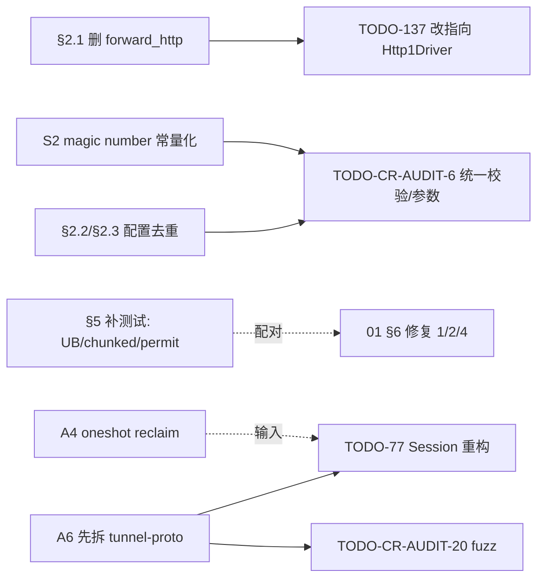

# 代码质量、抽象与规范审查（2026-07-26）

## 背景

~21k 行 Rust / 157 文件 / 6 crate。本文覆盖**性能之外**的工程质量维度：unsafe 审计、死代码、重复、抽象边界、错误处理、测试覆盖、风格一致性。方法：**以 HEAD 代码为准**，每条附 `file:line`，并按「现象与证据 → 根因 → 方案 → 论证/备选 → 场景覆盖/Corner Cases → 取舍 → 收益/改动量/影响面」展开。正确性/性能类问题见 01，安全类见 07，此处不重复展开。

## 问题陈述

代码是否达到**可长期维护、可演进**的质量水准？现存哪些具体、可指名的工程债务，各自的最小闭合改法、改动量与影响面是多少？哪些债务互为前置、必须排序？

## 结论速览

| 优先 | 项 | 类型 | 一句话 |
| --- | --- | --- | --- |
| 1 | 删 `forward_http`（§2.1） | 卫生 | 175 行死代码，且 TODO-137 还在其上规划优化——文档与热路径已脱节，先清账止损 |
| 2 | listener 去 unsafe（§1.2） | 卫生+微性能 | 无收益 unsafe：`String` 分配没省掉、白多一次栈拷贝，还平添 UB 风险面 |
| 3 | `cargo fmt` + CI 门禁（S1） | 卫生 | `supervisor.rs` 已被压成长串，一次 fmt 不够，须补 `--check` 门禁防回归 |
| 4 | 先补热路径测试（§5） | 测试 | `copy_buffered`/`Http1Driver`/`open_bi_guarded` 核心零覆盖，01 的 bug 本该被这组测试拦住 |
| 5 | 配置去重下沉（§2.2/2.3） | 结构 | 三重逐字复制，且是 TODO-CR-AUDIT-6（统一校验）的前置 |

---

## 1. unsafe 审计（全仓 4 处使用点）

| 位置 | 用途 | 评定 |
| --- | --- | --- |
| `engine/copy.rs:22,33,41` | `Vec::set_len` 暴露未初始化内存 | 🚨 **UB**（详见 §1.1 / 01 §3.1，TODO-97） |
| `transport/listener.rs:163` | `from_utf8_unchecked` 栈缓冲 | ❌ **无收益 unsafe**（详见 §1.2） |
| `tcp_params.rs:50-77` | `setsockopt` FFI | ✅ 合理，封装完整、错误处理规范，不动 |
| `infra/affinity.rs`（02 提案新增） | `sched_{get,set}affinity` FFI | 按 `tcp_params` 同标准封装即可 |

### 1.1 `copy.rs` 的 `Vec::set_len` —— UB（TODO-97；修复主体见 01 §3.1）

- **现象与证据**：`engine/copy.rs:22,33,41` 用 `Vec::set_len` 把未初始化容量纳入长度并暴露给读取路径；`:16` 一行 `#[allow(clippy::uninit_vec)]` 把本应报警的 lint 静音了。
- **根因/为什么是问题**：`set_len` 后、写入前若被读取即为未初始化内存读取——语言级 UB，优化器可据此假设做任意变换；被静音的 lint 让它在 CI 里“看起来干净”。
- **方案**：按 01 §3.1 修复读写次序（或用 `read_buf`/`MaybeUninit` 安全封装）；**修复后把该 lint 从 `allow` 提为 `deny`**，锁死回归入口。
- **论证/备选**：`deny` 而非删注释——删注释只是恢复默认 `warn`，仍可能被后续 `allow` 重新静音；`deny` 让任何再次引入 `uninit_vec` 的改动直接编译失败。
- **场景覆盖 & Corner Cases**：miri 可稳定复现该 UB（见 §5 对 `copy_buffered`/`take_buffer` 的补测要求）；短读、`n < 容量` 的部分填充路径是最易触发未初始化读的分支。
- **取舍**：`deny` 会拦下未来任何“图省事”的 `set_len`，属预期约束，无实质负面。
- **收益 / 改动量 / 影响面**：消除全仓最高危 UB；lint 改动为 1 行 + 修复主体在 01 计量；回滚 = 单行 revert。

### 1.2 `listener.rs` 的 `from_utf8_unchecked` —— 无收益 unsafe

- **现象与证据**：`transport/listener.rs:163` 用 `from_utf8_unchecked` 把已 `to_lowercase()` 的字节拷进 256B 栈 buffer；`canonicalize_egress_host`（:157）此前已 `to_lowercase()` 分配了一个 `String`。两个分支 `:159-178` 与 `:180-194` 逻辑重复。
- **根因/为什么是问题**：**分配根本没省掉**——`to_lowercase()` 已经堆分配 `String`，随后又拷进栈 buffer 做 unchecked 转换，净效果是「多一次拷贝 + 一处 unsafe + 两段重复分支」。unsafe 在这里零收益、纯负债。
- **方案**：ASCII 快路径**直接在栈上做 ASCII lowercase**（真正零分配、无 unsafe）；非 ASCII 走 `String` 路径。删除 `from_utf8_unchecked`，合并两个重复分支。
- **论证/备选**：为何“栈上 ASCII lowercase”而非其它——
  - 保留 unsafe「省一次分配」的初衷本就落空（上游已分配），故直接去 unsafe；
  - 用 `str::to_ascii_lowercase()` 仍会分配，达不到零分配目标，故走**栈上原地**折叠；
  - 非 ASCII 不能用 ASCII 折叠（会改变 Unicode 大小写语义，如土耳其 `I`、`ß`），必须回退 `String`——这正是“ASCII 快路径 + 非 ASCII 走 String”分流的理由，而非一刀切。
- **场景覆盖 & Corner Cases**（结合 `canonicalize_authority_host` :64-124 实际分支）：
  - **空 header/空 host**：`host.trim().is_empty()`（:66）、括号内空 `[]`（:103-105）、剥端口后空（:120-122）三处 bail 必须在重构后保留，栈快路径不能吞掉。
  - **非 ASCII host**：栈快路径须先探测非 ASCII 字节，命中即回退 `String`，否则改变折叠语义。
  - **超长 host**：256B 栈 buffer 对超长输入会溢出/截断——快路径需带长度上界，超界回退 `String`。
  - **IPv6 与端口**：括号形 `[::1]:443`（:91-107）与无括号多冒号形（:109-118 的 `colon_count` 判定）两条端口剥离逻辑不可破坏；已有单测覆盖 `Example.COM:443`/`[::1]:443`/`*.Example.COM:443`（:256-266），改后必须仍绿。
  - **wildcard**：`*.` 前缀（:73-80）单独出现要 bail，lowercase 只作用于 suffix。
- **取舍**：新增一条 ASCII/非 ASCII 分流判断，换取去 unsafe + 去重复 + 真零分配，净正。
- **收益 / 改动量 / 影响面**：删 unsafe、合并分支、快路径真零分配；~40 行（含单测）；影响面限于该函数，回滚 = 单文件 revert，且现有单测即回归护栏。

## 2. 死代码与重复

### 2.1 `forward_http` 是死代码（175 行）`[新发现]`

- **现象与证据**：`crates/duotunnel-core/src/egress/http.rs:91-266` 在全仓库**无任何调用方**（仅 `lib.rs:16` 重导出）；真实 egress H1 路径走 `Http1Driver`（01 §1.2）。此外 `egress/http.rs:21-33` 的 `read_into_bytes_mut` 与 `driver/h1.rs:81-93` 完全重复。
- **根因/为什么是问题**：不只是体积——**`todo.md` 的 TODO-137 还在追踪对它的优化**。在死代码上规划优化任务，说明“文档跟踪对象”与“实际热路径”已脱节（印证“不要信文档、以代码为准”）。
- **方案**：删除 `forward_http` 及其重导出与重复的 `read_into_bytes_mut`；**把 TODO-137 的对象改指向 `Http1Driver::write_response`**。
- **论证/备选**：不保留“以备将来复用”——死代码持续误导跟踪与 review 成本，真需要时从 git 历史取回即可；重复 helper 保留哪一份取决于 `h1.rs` 为真实路径，故删 `egress/http.rs` 侧。
- **场景覆盖 & Corner Cases**：删前用调用图确认零调用方（codegraph 已确认仅重导出）；确保重导出移除后无外部 crate 依赖该符号。
- **取舍**：无功能取舍，纯减负。
- **收益 / 改动量 / 影响面**：-190 行；同步修正 TODO-137 指向；影响面为死代码，回滚风险极低。

### 2.2 Overload 配置三重复制

- **现象与证据**：`OverloadMode`/`OverloadConfig`/`resolve()` 在 `crates/duotunnel-store/src/config/mod.rs:35-123` 与 `crates/duotunnel-client/bootstrap/config.rs:86-174` **逐字重复（连注释一致）**；server 经 duotunnel-store 用第一份，另有 duotunnel-core 的 `OverloadLimits::resolve` 第三处。
- **根因/为什么是问题**：任何阈值语义调整须同步改两处 serde 定义 + duotunnel-core 的 resolve，**漂移是已知类型的风险**（三份手工同步早晚失配）。
- **方案**：serde 结构挪进 `duotunnel-core::config`（或独立 `tunnel-config` 模块），两个二进制引用同一定义。
- **论证/备选**：下沉到公共 crate 而非“加注释提醒同步”——注释挡不住漂移；独立 `tunnel-config` 模块可避免 store/client 反向依赖 duotunnel-core 引入不必要耦合，若耦合可接受则直接进 `duotunnel-core::config` 更省。
- **场景覆盖 & Corner Cases**：确认 server（经 store）与 client 两侧 serde 默认值与字段名在合并前**逐字段等价**，否则合并会静默改变某侧默认；`resolve()` 语义须保持一份权威。
- **取舍**：一次搬移引入跨 crate 依赖方向决策，但换来单一事实源。
- **收益 / 改动量 / 影响面**：消除双份 serde 漂移；~1 小时纯搬移；影响面为配置解析，回滚 = revert 搬移 commit。

### 2.3 duotunnel-server + duotunnel-client bootstrap 平行结构（§2.2 同向）

- **现象与证据**：`crates/duotunnel-server/bootstrap/config.rs`（609 行）与 `crates/duotunnel-client/bootstrap/config.rs`（601 行）存在大量同构段（quic/tcp/http_pool/proxy_buffers/overload/timeout 的解析与默认值）。
- **根因/为什么是问题**：与 §2.2 同一漂移风险，且**是 TODO-CR-AUDIT-6（统一参数校验边界）的实施前提**——校验逻辑只能在合并后写一份。
- **方案**：公共段下沉，二进制侧只留各自差异（listener/entry 等）。与 §2.2 共用同一下沉方向。
- **论证/备选**：先合并再统一校验，避免在两份平行结构上各写一遍校验又要保持一致。
- **取舍 · 收益 · 影响面**：合并触及两个 bootstrap，diff 面较大但为 CR-AUDIT-6 铺路；改动量与 §2.2 同批推进。

## 3. 抽象与组合评审

### 3.1 做得好的（值得保持的模式）

- **6-phase `IngressDispatcher`**（`plugin/dispatcher.rs:71-205`）：sniff/admission/route/protocol/logging 分相清晰，handler 以 `ProtocolKind` 注册，新协议不动 accept 循环——标准的可扩展 ingress 形态；
- **actor 管写 + `ArcSwap` 快照读**（registry/conn_pool）：正确性与读性能兼得；
- **`ProxyEngine` + `UpstreamResolver` trait**（`proxy/core.rs:25-101`）：duotunnel-server + duotunnel-client 双侧复用同一引擎，`impl Trait in trait` 静态分发无 Box；
- **newtype ID**（`models/id.rs`，TODO-64 完成）与 `RouteTarget` 替代匿名元组；
- **错误分类**：`ProxyError { kind, retry() }` 有类型语义（`error.rs` 434 行），边界用 anyhow，方向正确。

### 3.2 需要修的抽象问题

| # | 问题 | 证据 | 修复 / 改动量 |
| --- | --- | --- | --- |
| A1 | TLS handler 的 sender 缓存是 per-connection `Mutex<HashMap>`，但 `route_target` 连接期恒定 ⇒ 永远只有 1 个 key，锁+哈希白付 | `plugins/tls/mod.rs:93-107` | `OnceCell<CachedSender>`；~30 行 |
| A2 | `ServerCtx::new` 每连接 `Arc::new(state.tcp_params().clone())` 重新装箱 | `handlers/http.rs:53` | `ServerState` 直接持 `Arc<TcpParams>`；~10 行 |
| A3 | `PeerKind::Http/H2` 仍 Box | `proxy/peers.rs:54-58` | TODO-36；内联进 enum，~20 行 |
| A4 | `Http1Driver` recv 所有权用 oneshot “reclaim” 往返 | `driver/h1.rs:56-78,200-207` | 维持现状，作为 TODO-77 输入 |
| A5 | `hint.clone()` 在 dispatch 阶段 3 次深拷贝（含 `authority: Option<String>`） | `dispatcher.rs:85,89,157` | 字段改 `Arc<str>`/`Bytes` 或传引用；~40 行 |
| A6 | `duotunnel-core` 单 crate 承载 proto+engine+plugin+infra（21 个模块） | 全库 | TODO-83；先拆 `tunnel-proto` |

**A1 · TLS sender 缓存锁+哈希白付**
- **现象/证据**：`plugins/tls/mod.rs:93-107`，per-connection `Mutex<HashMap<RouteTarget, CachedSender>>`。
- **根因**：`route_target` 在连接期恒定 ⇒ map 永远只有 1 个 key，锁与哈希开销全是死重。
- **方案**：换 `tokio::sync::OnceCell<CachedSender>`。
- **论证/备选**：对比 h2c handler 的同型 map（`h2c/mod.rs:96` 的 `get_or_create_sender`）**是合理的**——它按每请求 `:authority` 重解析，map 可持多 key；TLS 无此需求，故 `OnceCell` 恰当而非 map，二者不可一刀切。
- **Corner**：连接期上游失效需重建 sender——`OnceCell` 方案须支持失效重取（`get_or_try_init` + 显式清除），否则失去 map 的 `remove`+重插能力。
- **取舍 · 收益 · 改动量**：`OnceCell` 失效语义略繁于 `map.remove`；换来去掉每请求锁+哈希；~30 行，回滚为单文件。

**A2 · 每连接重装箱 TcpParams**
- **现象/证据**：`handlers/http.rs:53` 每连接 `Arc::new(state.tcp_params().clone())`。
- **根因**：`TcpParams` 连接期只读且全局同一份，逐连接 clone+装箱纯浪费。
- **方案**：`ServerState` 直接持 `Arc<TcpParams>`，连接侧 clone `Arc`（引用计数）。
- **论证/备选**：改存 `Arc` 而非传 `&`——handler 需跨 await/跨 task 持有，`Arc` 比借用更省心。
- **Corner**：需一并把访问器 `ServerState::tcp_params(&self) -> &TcpParams`（`bootstrap/mod.rs:208`）改为返回 `Arc<TcpParams>`（或加一个 `arc` 版），调用点同步。
- **取舍 · 收益 · 改动量**：无实质取舍；去每连接堆分配；~10 行。

**A3 · PeerKind::Http/H2 仍 Box**
- **现象/证据**：`proxy/peers.rs:54-58`，`HttpPeer` 经 Box 装箱（TODO-36 已跟踪）。
- **根因**：`HttpPeer` 仅 2 个 `String` + `Arc`，Box 无必要。
- **方案**：直接内联进 enum。
- **论证/备选**：内联省一次堆分配与一次指针解引用；替代是保持 Box 以压小 enum，但此处 payload 本就小，收益倒挂。
- **Corner · 取舍**：内联使 enum 尺寸取最大变体——须确认其余变体不会因此显著膨胀（否则得不偿失）。
- **收益 · 改动量**：去每 peer 装箱；~20 行。

**A4 · Http1Driver 的 oneshot “reclaim” 往返**
- **现象/证据**：`driver/h1.rs:56-78,200-207`，recv 所有权在 body 流与 driver 间用 oneshot 往返归还。
- **根因**：为绕开借用检查而生的机制，是 TODO-77（Session 抽象）要解决的**核心症状**。
- **方案**：**维持现状**，作为 TODO-77 的输入，不做局部修补。
- **论证/备选**：局部改写会与即将到来的 Session 抽象冲突、大概率白做——留作重构输入是最省的选择。
- **取舍**：暂留一处复杂机制，换取不返工。

**A5 · dispatch 阶段 3 次深拷贝 hint**
- **现象/证据**：`dispatcher.rs:85,89,157` 三处 `hint.clone()`，含 `authority: Option<String>` 的堆拷贝。
- **根因**：`ProtocolHint` 值语义 + 跨 phase 传递导致重复深拷。
- **方案**：字段改 `Arc<str>`/`Bytes`，或跨 phase 传引用。
- **论证/备选**：`Arc<str>`/`Bytes` 比传引用更稳——若改传 `&` 需保证不跨 await 持有跨 phase borrow；`Arc` 无此约束。
- **Corner**：确认三处 clone 均在同一 dispatch 生命周期内，改 `Arc` 后语义等价。
- **取舍 · 收益 · 改动量**：`Arc` 引入原子 refcount，换掉 3 次含堆 `String` 的深拷；~40 行。

**A6 · duotunnel-core 单 crate 过载（21 模块）**
- **现象/证据**：`duotunnel-core` 单 crate 承载 proto+engine+plugin+infra 共 21 个模块（TODO-83）。
- **根因**：编译不可并行、层次耦合、难以对纯协议层独立 fuzz/测试。
- **方案**：**先拆 `tunnel-proto`**（msg/id/error，无 tokio 依赖、可独立 fuzz），engine/plugins 后置。
- **论证/备选**：先拆无 tokio 依赖的 proto 层风险最小、且立即解锁独立 fuzz（呼应 TODO-CR-AUDIT-20）；engine/plugins 依赖面广，后置。
- **Corner · 取舍**：拆分触发大面积 `use` 路径改动并可能暴露循环依赖，须先理清依赖方向；proto 层最干净故先行。
- **收益 · 改动量 · 影响面**：编译并行度 + 可独立测试/fuzz；2-3 天；**在大重构（TODO-77）之前完成收益最大**。

## 4. 一致性与风格

| # | 问题 | 证据 | 说明 |
| --- | --- | --- | --- |
| S1 | `select!` 被压成数行长串，与全仓风格断裂 | `crates/duotunnel-client/tunnel/supervisor.rs:72-87` | fmt + 补 CI 门禁 |
| S2 | magic number 未常量化 | 见 §S2 | 常量化 + 归 CR-AUDIT-6 |
| S3 | README 与实现漂移 | `README.md` | 纠偏 |
| S4 | healthz 手写 HTTP 单读即判 | `crates/duotunnel-client/runtime/app.rs:155-158`（server 同构） | 低危，读全再判 |
| S5 | 注释语言/密度克制、意图注释质量高 ✅ | — | 保持 |

**S1 · fmt 破坏 + 缺 fmt 门禁**
- **现象/证据**：`supervisor.rs:72-87` 整个 `tokio::select!` 被压成数行长串，与全仓风格断裂，疑似生成/合并事故。
- **根因**：CI 已有 clippy 但**缺 `cargo fmt --check` 门禁**，风格回归无人拦。
- **方案**：`cargo fmt` 全仓过一遍；CI 补 `cargo fmt --check`。
- **论证/备选**：一次 fmt 不够——没有门禁下次仍会漂；门禁是根治。
- **Corner · 取舍**：全仓 fmt 产生大 diff，须**单独 commit** 与功能改动隔离，便于 review。
- **收益 · 改动量**：消除风格漂移并防回归；脚本级改动。

**S2 · magic number 未常量化**
- **现象/证据**：`8192`（`h1.rs` 4 处）、`1024`（`copy.rs` 全局池/actor 队列）、`4096`（registry slot 与 `SNIFF_LIMIT` **重复定义**）、`300s`（`prefer_h1` TTL）。
- **根因**：分散字面量既难统一调优也易漂移——`SNIFF_LIMIT` 已被重复定义即是证据。
- **方案**：常量化，并归入 TODO-CR-AUDIT-6 的统一参数模型。
- **论证/备选**：单一 `const` 权威定义而非各处复制常量；`4096` 两处若语义本应一致，须收敛为一个 const 才能防未来分叉。
- **收益 · 影响面**：可调、防漂移；与 §2.2/§2.3 共同喂 CR-AUDIT-6。

**S3 · README 与实现漂移**
- **现象/证据**：README 声称 jemalloc（`README:377`）实为 mimalloc（`crates/duotunnel-server/main.rs:2`）；“项目结构”段列的 `crates/duotunnel-server/handlers/`、`registry.rs` 等路径早已重构。
- **根因/为什么是问题**：文档失真会误导后续优化判断，allocator 选型讨论首当其冲。
- **方案**：纠正 README 的 allocator 与结构段。
- **收益 · 改动量 · 影响面**：~1 小时；纯文档，回滚无风险。

**S4 · healthz 手写 HTTP 单读即判**
- **现象/证据**：`crates/duotunnel-client/runtime/app.rs:155-158`（server 同构）单次 `read(256B)` 即响应，长 header 或分包请求会误判 400。
- **根因**（结合同构实现 `crates/duotunnel-ctld/src/runtime/app.rs:142-164`）：`read(&mut [0u8;256]).unwrap_or(0)` + `from_utf8(..).unwrap_or("")` + `starts_with` 判定——任何不在首个 256B 段内完整到达的请求行都会误判。
- **方案**：读到 `\r\n\r\n` 或 EOF 再判定（带总量上限防滥用）。
- **场景覆盖 & Corner Cases**：
  - **分包**：`GET /healthz` 跨 TCP 段，首段仅 `GET /heal` → `starts_with` 失败；
  - **读错误/EOF**：`unwrap_or(0)` → `n=0` → 空串 → 落错误分支；
  - **非 UTF-8 首字节**：`unwrap_or("")` → 空串 → 同上；
  - **长 header/长 URL**：请求行被推出 256B 窗口的极端 client 同样误判。
- **取舍**：低危（healthz/内网面），故优先级低；修复无副作用。
- **收益 · 改动量**：消除误判；~15 行。

**S5 · 注释质量** ✅ 整体克制、意图注释质量高（如 `listener_mgr` 的 reconcile 语义），保持现状。

## 5. 测试覆盖评审

- **现象（现状）**（结合 codegraph 调用图与 `#[cfg(test)]` 分布）：
  - ✅ **有覆盖**：bridge relay 语义（`bridge.rs:76-211`）、shard/P2C（`shard.rs`）、vhost 匹配（`listener.rs:252+`）、egress allowlist（`conn_pool.rs:223+`、`listener.rs:272+` 两个端到端 reject 用例）、runtime 解析（`runtime.rs:172+`）、`http_utils`、`msg` 部分。
  - ❌ **热路径核心零覆盖**（codegraph blast-radius 对以下符号报 “no covering tests”）：`copy_buffered`/`take_buffer`、`open_bi_guarded`、`SniffRuntime::sniff`、`Http1Driver`、`forward_h2_request`、registry/pool actor。
- **根因/为什么是问题**：最危险的路径恰好最缺护栏——`copy_buffered`/`take_buffer` 的 UB（§1.1）修复**必须带 miri/loom 级测试**才能证明；`open_bi_guarded` 的并发越限正是 TODO-80 要补的 barrier 测试；`Http1Driver` 的 **keep-alive 循环、pipelining、204/304/HEAD 正是 01 §3.2 的 bug——本该由这组测试拦住**。
- **方案（测试形态）**：`Http1Driver` 用 quinn 内存对连（tests 里已有 duplex 模式可参考 bridge tests）；codec 用 roundtrip + 畸形帧（配合 TODO-CR-AUDIT-20 fuzz）；registry/pool actor 补重复注册/移除/purge 不变量。
- **场景覆盖 & Corner Cases**：`SniffRuntime::sniff`（多轮读/超时/prefix advance）、`forward_h2_request`（sender 失效竞态）、`Http1Driver`（204/304/HEAD 无 body、pipelining、keep-alive 边界）、codec（畸形/截断帧）。
- **收益 / 优先级**：优先级排序 = **先给要动的代码补测试**（UB 修复、chunked 修复、permit 化），与 01 §6 的 1/2/4 项配对，使修复自带回归护栏。

## 实施顺序与依赖

| 顺序 | 项 | 类型 | 改动量 | 依赖 |
| --- | --- | --- | --- | --- |
| 1 | §2.1 删除 `forward_http` 死代码 + 重复 helper | 卫生 | -190 行 | 无（解锁 TODO-137 改指向） |
| 2 | §1.2 `listener.rs` 去 unsafe + 合并分支 | 卫生+微性能 | ~40 行 | 无 |
| 3 | S1 `cargo fmt` 全仓 + CI fmt 门禁 | 卫生 | 脚本级 | 无 |
| 4 | §5：为 UB/chunked/permit 修复先行补测试 | 测试 | ~300 行 | 与 01 §6 的 1/2/4 项配对 |
| 5 | §2.2/§2.3 配置去重下沉 | 结构 | ~1 天 | 为 CR-AUDIT-6 铺路 |
| 6 | A1/A2/A5 小抽象修正 | 结构 | 各 <1 小时 | 无 |
| 7 | S3 README 纠偏 | 文档 | ~1 小时 | 无 |
| 8 | A6 crate 拆分（先 `tunnel-proto`） | 结构 | 2-3 天 | 在大重构（TODO-77）之前完成收益最大 |

**依赖说明（哪项解锁哪项）：**

- **§2.2/§2.3 配置去重 → TODO-CR-AUDIT-6**：统一参数校验只能在配置合并为单一事实源后写一份，故去重是 CR-AUDIT-6 的**前置**；S2 的 magic number 常量化同样汇入 CR-AUDIT-6 的统一参数模型。
- **§5 补测试 ↔ 01 的修复**：`copy_buffered`/`take_buffer`（UB，§1.1）、chunked、permit 化三项的测试须与 **01 §6 的 1/2/4 项修复配对**——测试先落地，修复自带回归护栏；miri/loom 级用例是 UB 修复能否验收的门槛。
- **§2.1 删死代码 → TODO-137**：删除 `forward_http` 后，TODO-137 的优化对象改指向 `Http1Driver::write_response`，否则继续在死代码上跟踪。
- **A6 先拆 `tunnel-proto` → TODO-77**：proto 层（无 tokio 依赖）先独立可解锁独立 fuzz（呼应 TODO-CR-AUDIT-20），并在 Session 抽象大重构（TODO-77）之前完成收益最大；**A4 的 oneshot reclaim 作为 TODO-77 的输入**，不单独修补。

