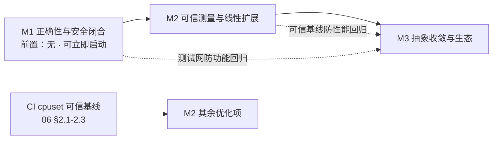

# 项目成熟度评估（2026-07-26）

## 背景

本文回答一个问题：**DuoTunnel 是否达到"成熟、高水平网络应用"的标准**（架构、代码、抽象、设计、稳定性等维度）。做法是分维度打分，给出与 pingora（生产级参照）、frp（同类参照）的差距，并列出到达"生产可用"的关键路径。

- **评分口径**：`1=原型 / 2=可用有硬伤 / 3=工程化良好但有 gap / 4=生产级 / 5=业界标杆`。
- **证据基础**：打分基于本次代码审阅证据（01/04/07 文档中的具体条目与 TODO 编号），**非文档自述**。每一维度的评分在下文"证据指向"列给出可核验的文档坐标。

---

## 问题陈述

1. **分维度水平**：架构 / 代码 / 抽象 / 性能 / 稳定性 / 安全 / 可观测 / 测试 / 文档九个维度，当前各处于什么水平（1–5）？
2. **差距定位**：与 pingora（生产级参照上限）、frp（同类内网穿透）相比，差距具体在哪、本质是什么、可收敛性如何？
3. **到生产级的路径**：从当前状态到"敢承载生产不可信流量"的 4.0，需要哪些里程碑、前置依赖与验收标准？

---

## 结论速览

- **加权总评：≈ 2.9 / 5。**
- **定位：** "工程化良好的高级原型 / 准生产"——生产级架构/抽象骨架 + 正确性尾巴 + 安全硬伤 + 测试盲区。
- **可否上线：** 当前不宜直接承载生产不可信流量；仅内网可信流量口径下门槛显著放宽（见"场景覆盖与风险"）。
- **到生产级（4.0）：** M1 正确性/安全 → M2 可信测量/线性扩展 → M3 抽象收敛，路径清晰且已被 pingora 实证，无需 io_uring / thread-per-core 重写。

---

## 分维度评分

| 维度 | 分数 | 依据（强项 / 短板） | 证据指向 |
| --- | --- | --- | --- |
| **架构设计** | **3.5** | 强：控制面/数据面分离、ctld 集中路由 + 热重载、QUIC 原生多路复用、双向 ingress/egress 同引擎复用、6-phase 可扩展 dispatcher。短：单 endpoint 限制多核扩展、L7 每请求重建无旁路 | 02 S1（单 endpoint 限多核）、01 §4.2（L7 每请求重建） |
| **代码质量** | **3** | 强：newtype ID、ProxyError 分类、无锁读路径、注释克制且到位。短：1 处 UB、1 处无收益 unsafe、175 行死代码、配置三重复制、局部 fmt 破坏、缺 fmt 门禁 | 01 §3.1（UB）、04（死代码 / 配置三重复制 / fmt 门禁） |
| **抽象/组合** | **3.5** | 强：UpstreamResolver/PeerSpec/IngressProtocolHandler trait 边界清晰，静态分发。短：H1 body 的 oneshot-reclaim 是缺 Session 抽象的症状、duotunnel-lib 过大 | TODO-77（oneshot-reclaim / 缺 Session）、TODO-83（duotunnel-lib 过大） |
| **性能工程** | **3** | 强：零拷贝 read_chunk、池化、P2C、BBR、GSO/GRO、PGO 脚本、target-cpu=native+LTO。短：线性扩展未达成、CI 不可信基线、benchmark-gated 项因缺 microbench/基线停在 research | 06（CI 基线 / microbench 缺失 / benchmark-gated 停 research） |
| **稳定性/HA** | **2.5** | 强：重连退避+jitter、健康检查、过载快失败框架、证书/快照本地 fallback。短：优雅停机不完整（drain 只看 TCP+pending，漏 QUIC/stream/UDP/H2）、孤儿 spawn 无 JoinSet、pending 上限竞态 | TODO-CR-AUDIT-21（drain 不完整）、TODO-96（孤儿 spawn 无 JoinSet）、TODO-80（pending 上限竞态） |
| **安全性** | **2.5** | 强：token 只存摘要、日志脱敏、sniff/login 超时、egress 双层防御、CheckBytes 反序列化。短：未认证连接无限流、CA 私钥落盘无权限、认证错误边界未闭合、无 fuzz | 07 §3.1（未认证限流）、07 §3.3（CA 私钥权限）、CR-AUDIT-22（认证错误边界）、CR-AUDIT-20（无 fuzz） |
| **可观测性** | **3** | 强：Prometheus 全面、dial9 trace 集成、资源采样 dashboard、slowpath 队列深度指标。短：热路径 metrics 宏开销、缺阶段延迟与有效配置遥测、per-core 归因缺失 | TODO-CR4（热路径 metrics 宏开销）、TODO-140/145（阶段延迟 / 有效配置遥测） |
| **测试** | **2.5** | 强：LB/vhost/codec/egress-reject/runtime 有单测，集成矩阵覆盖多协议。短：**热路径核心零覆盖**（copy/open_bi/sniff/Http1Driver/h2 sender），无 fuzz、无 loom、无 miri | 04 §5（热路径核心零覆盖） |
| **文档/可维护** | **3** | 强：spec/ 架构文档体系完整、todo 追踪细致且有证据栏。短：README 与实现漂移（allocator/路径）、todo 自身跟踪死代码 | 04 S3（README allocator/路径 漂移）、TODO-137（死代码跟踪指向 forward_http） |

**加权总评 ≈ 2.9 / 5**：**"工程化良好的高级原型 / 准生产"**——架构与抽象已达
生产级骨架水准，但正确性尾巴（UB、优雅停机、过载竞态）、安全硬伤（未认证限流、
私钥权限）、测试盲区三项决定了**当前不宜直接承载生产不可信流量**。补齐后可达
稳定的 3.5-4。

---

## 对标分析

### vs frp（同类：内网穿透）

| 维度 | DuoTunnel | frp |
| --- | --- | --- |
| 传输 | QUIC 原生多路复用，~0-RTT 新流 | TCP+yamux，≥1.5 RTT 新流 |
| 路由管理 | ctld 集中 + 热重载 + token 生命周期 | 客户端 YAML，手工同步 |
| 双向 | ingress+egress 同引擎 | 仅 ingress 为主 |
| 成熟度/生态 | 准生产、单团队 | 多年生产验证、社区庞大、文档完善 |
| **结论** | **架构更先进**（QUIC 红利真实存在），**成熟度/生态明显落后** | — |

**差距本质与可收敛性**：DuoTunnel 的设计优势（QUIC）是真的；差距不在设计理念，
而在"经过时间和规模验证"的稳定性与生态。**可收敛性低且缓**——生态与生产验证靠
时间、采用与社区积累，无法通过一次重构或几个里程碑收敛（对照"工程成熟度"可由
M1–M3 收敛，见"场景覆盖与风险"的 corner case）。

### vs pingora（生产级代理框架，参照上限）

| 维度 | DuoTunnel | pingora |
| --- | --- | --- |
| 多核模型 | 单 endpoint + work-steal，未线性 | NoSteal shared-nothing，接近线性（02 §3 实证） |
| Session 抽象 | H1 driver 各自为政（TODO-77 未做） | 统一 `Session`（H1/H2/WS） |
| 优雅停机/热升级 | 部分（drain 不完整） | 完整（fd 传递、零停机热升级） |
| 生命周期管理 | 散落 spawn（TODO-96 未做） | 结构化 |
| 测试/fuzz | 热路径盲区 | 大规模生产 + 完整测试 |
| **结论** | pingora 是**目标形态**，DuoTunnel 在多核模型（02 Phase C=NoSteal 等价）、Session 抽象、生命周期三处直接对标其做法即可收敛 | — |

**差距本质与可收敛性**：差距集中在多核模型、Session 抽象、生命周期、测试四处，
**全是工程实现而非设计理念**，**可收敛性高**。**关键洞察**：pingora 不用 io_uring、
不绑核也做到生产级线性扩展（03、02 §3 实证），说明 DuoTunnel 的提升路径是
**清晰且已被验证的**——不需要激进的内核旁路，而是补齐 shared-nothing 运行时 +
结构化生命周期 + 测试。

---

## 到达生产级（4.0）的路径

分三个里程碑，每个可独立交付、可验收。

### M1 — 正确性与安全闭合（"敢上不可信流量"）
> 目标：消除已知 UB/DoS/凭证硬伤。全部不依赖压测、不依赖架构改造。

**前置依赖**：无。仅需当前代码库；不依赖压测环境、不依赖架构改造——故机会成本
最低、可立即启动。

**动作**：
1. copy.rs UB 修复（01 §3.1 / TODO-97）+ 覆盖测试
2. chunked/Content-Length 协议正确性 + CL/TE 走私防护（01 §3.2 / 07 §4.7）
3. 未认证连接限流 + 每 IP 惩罚（07 §3.1，并入 TODO-142 入口层）
4. CA 私钥 0600（07 §3.3）
5. 认证错误边界（CR-AUDIT-22）
6. pending permit 化（01 §3.3 / TODO-80）
7. 优雅停机补全（TODO-CR-AUDIT-21 + TODO-96 结构化 JoinSet）
8. 热路径核心补单测（04 §5）+ sniff/codec fuzz 靶（CR-AUDIT-20）

**验收标准**：miri 过 copy 路径；SIGTERM 下活跃会话零截断；未认证洪泛不 OOM；
关键路径有测试。

**预期成熟度变化**：加权 2.9 → **~3.5**；主要抬升安全性、稳定性/HA、测试三维
（消除其硬伤），代码质量因 UB / 死代码清除亦受益。

### M2 — 可信测量与线性扩展（"性能可证明"）
> 目标：让性能可归因、可比较，并达成近线性扩展。

**前置依赖**：M1 闭合（UB / 竞态未除会污染测量，且未闭合即做微优化违反
evidence-driven 原则）；其内部第一步 CI cpuset 隔离基线（06 §2.1-2.3）是其余优化项
的前置——无可信基线则所有 benchmark-gated 项无从验证。

**动作**：
1. CI cpuset 隔离 + 度量口径修正（06 §2.1-2.3）→ 可信基线
2. worker 绑核 + per-core 计数（02 Phase A）
3. client per-connection endpoint（02 Phase B）
4. criterion microbench + 阶段延迟遥测（06 §2.4 / TODO-140/145）
5. TcpParams=None、CI cubic、BoxBody 去重等基于基线的确定性优化（01 §4）
6. per-core 运行模式（02 Phase C = NoSteal 等价）

**验收标准**：`QPS(N)/(N·QPS(1)) ≥ 0.8`（Phase C 后 ≥0.9），p99 CoV <10%。

**预期成熟度变化**：~3.5 → **~3.8**；主要抬升性能工程与可观测性，per-core / 绑核
亦改善稳定性的 per-core 归因。

### M3 — 抽象收敛与生态（"可长期演进"）
> 目标：收敛核心抽象、降低维护成本，为长期演进与生态扩展铺路。

**前置依赖**：M1（动核心抽象需测试网防功能回归，否则重构无网）；M2 可信基线
（Session 统一 / duotunnel-lib 拆分等重构须能被证明无性能回归）。

**动作**：
1. 统一 Session 抽象（TODO-77，含 H1 keep-alive、body reclaim 简化）
2. 配置去重 + 统一参数校验（04 §2.2-2.3 / CR-AUDIT-6）
3. duotunnel-lib 拆分（先 tunnel-proto，TODO-83）
4. passthrough vhost 模式（01 §4.2，L4 快路径）
5. 文档纠偏、fmt 门禁、README 与实现对齐（04 S3/S1）
6. 事件驱动控制面同步（TODO-84）

**验收标准**：新协议/新路由模式可插拔不动核心；单一配置定义源。

**预期成熟度变化**：~3.8 → **~4.0**；主要抬升抽象/组合、文档/可维护，passthrough
与 Session 收敛回馈架构设计。

---

## 场景覆盖与风险

**评估的锚定前提**：全部分维度分数与 2.9 总评锚定于"承载生产**不可信**流量"这一最严
口径。安全性（2.5）、稳定性/HA（2.5）、测试（2.5）三项的低分，及其对"当前不宜直接
承载生产不可信流量"的否决权，正是在此前提下成立。

**场景一：仅承载内网 / 受控可信流量。** 针对"对抗不可信输入"的短板——未认证限流
（07 §3.1）、CA 私钥权限（07 §3.3）、认证错误边界（CR-AUDIT-22）、fuzz 缺失
（CR-AUDIT-20）——其决策**权重显著下降**：安全维度不再是上线否决项，M1 第 3/4/5 项
可从"阻塞"降级为"非阻塞加固"。**但注意区分**：正确性与稳定性硬伤（M1 的 1/2/6/7：
UB、走私、pending 竞态、优雅停机）与流量是否可信无关，任何场景下仍必须做。另需
强调：分维度分数衡量的是**绝对工程状态**，不随场景变化；变化的只是各维度在"能否
上线"判断中的权重。故此口径下项目的"可用性"判断上移，而 2.5/2.5/2.5 的原始评分不变。

**场景二：面向公网 / 多租户不可信流量（默认口径）。** 评估如实成立，M1 全部为阻塞项。

**Corner case：单团队维护 vs 社区生态。** 对标 frp 已点明 DuoTunnel"准生产、单团队"
而 frp"社区庞大、多年生产验证"。含义：M1–M3 能收敛的是**工程成熟度**（正确性、性能、
抽象——可由代码与测试证明）；但**生态成熟度**（大规模生产暴露、第三方验证、社区插件
与安全响应）不在评分模型的可收敛范围内，需时间与采用积累，且单团队维护意味着
bus factor 与长期安全响应的结构性风险。即便 M1–M3 全数达成、工程分抵 4.0，生态
成熟度仍是这套评分未完全覆盖、也非重构可短期收敛的维度。

**评估自身的有效边界**：本结论是 2026-07-26 代码快照的静态审阅 + 既有基准的产物，
未包含大规模生产运行数据（这一缺口本身即测试 2.5 / CI 基线 06 短板的体现）；随代码
演进，本评分需重新校准。

---

## 取舍与建议顺序

**核心取舍：M1（正确性/安全）必须先于 M2（性能）。** 理由：

1. **门槛先于优化**：正确性与安全是"能不能上"的准入门槛，性能是"上了跑得好不好"的
   优化；门槛未过时，任何性能提升都不可交付，投入即沉没。
2. **测量依赖正确**：M2 的可信基线要求运行时先无 UB 与竞态——否则 UB / pending 竞态
   会污染测量，基线不可信，benchmark-gated 项无从验证。
3. **原则一致**：在未闭合 M1 的前提下投入 benchmark-gated 微优化，直接违反 todo.md
   反复强调的 evidence-driven 原则。
4. **机会成本**：M1 不依赖压测、不依赖架构改造，可立即启动；M2 多项需先有可信基线
   （06 §2.1-2.3）。故先做 M1 无等待成本。

**M3 靠后**：M3 动核心抽象（Session 统一、duotunnel-lib 拆分），必须站在 M1 的测试网
（防功能回归）与 M2 的可信基线（防性能回归）之上；且其收益是长期可维护性而非上线
阻塞，优先级最低。**M2 内部亦有序**——CI 可信基线（06 §2.1-2.3）是其余所有优化项
的前置。

**依赖关系**：

有序依赖（等价文字版）：

1. **M1 全部**（无前置，立即启动）→ 达 ~3.5
2. **M2.1 CI 可信基线**（06 §2.1-2.3）→ 解锁 M2 其余项
3. **M2.2–2.6** 绑核 / per-connection / microbench / 确定性优化 / per-core（02 Phase A→B→C）→ 达 ~3.8
4. **M3** 抽象收敛（依赖 M1 测试网 + M2 基线）→ 达 ~4.0

**收尾定位**：DuoTunnel 是一个**架构选型先进（QUIC 红利真实）、抽象骨架已达生产
水准、但带着一条正确性尾巴和若干安全硬伤的准生产项目**。它距离"成熟高水平网络
应用"不远，且路径清晰——**M1（正确性/安全）是硬门槛，M2（可信测量+线性扩展）是
性能兑现，M3（抽象收敛）是长期可维护性**。参照 pingora 的实证，达成线性扩展无需
激进手段（io_uring/thread-per-core 重写），按 02 的 shared-nothing 分阶段路线即可
收敛。当前**最不该做的是在未闭合 M1 的前提下投入 benchmark-gated 微优化**——这与
todo.md 反复强调的 evidence-driven 原则完全一致。
