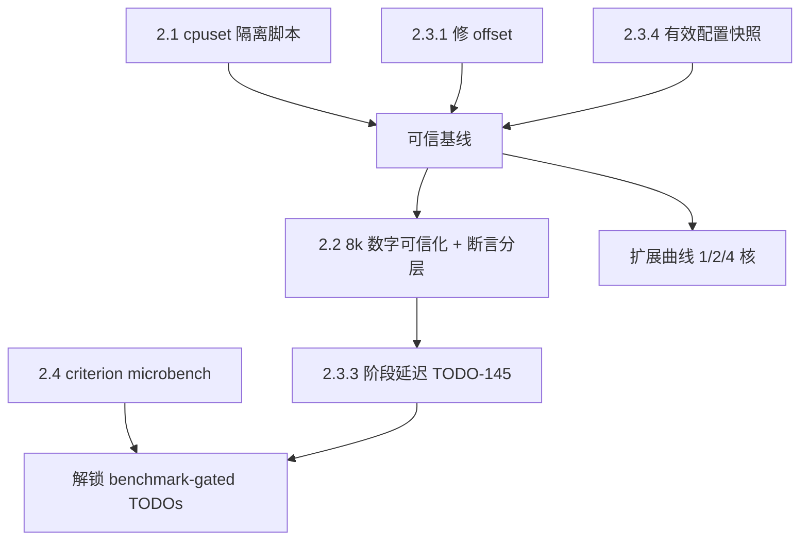

# CI 压测方法论评审与改进（2026-07-26）

> **当前状态（2026-07-30）**：本文保留改造前的问题分析和方案推导。当前实现以
> [BENCHMARK_SPEC](../../ci-helpers/BENCHMARK_SPEC.md) 和
> [任务拆分](./15-task-breakdown.md) 为准：isolate 模式已按 server/client/load
> 分配 `AllowedCPUs`，FRPS/FRPC 分别跟随 server/client CPU 集合，K6/echo/ctld/
> collector 使用 load 集合；8K 保留原有 dial9 trace，basic/3K/6K 不启用 dial9。

## 背景

用户反馈"CI GitHub Actions 4c 不够测 8000 QPS，会争抢"。CI 压测跑在 GitHub-hosted
`ubuntu-latest`（4 vCPU）runner 上（`ci.yml:123` 等，全部 stress job `runs-on:
ubuntu-latest`）。本文的目标是让压测结果**可复现、可归因、可比较**：同一 commit
多次跑数字要稳（可复现），慢/退化能定位到进程或阶段（可归因），DuoTunnel 各版本间、
以及对 frp 的横比要公平（可比较）。

本文与 02 号文档（绑核）**互补**：02 讲隔离手段本身（cpuset/CPUQuota/pin 的机制），
本文讲**测量方法与用例设计**——同一负载点该断言什么、绝对数字该在哪测、口径怎么对齐。
两者共用同一套 cpuset 分配器（见 2.1、02 §6）。

## 问题陈述

1. **4c 为何测不了 8k？** 是"再调调就能过"，还是根本的容量/机制问题？
2. **如何让结果可信可比？** 现在 CI 数字能不能作为"优化生效/退化发生"的判据？
3. **8k 数字为何不可信？** 用例目标（测最大 QPS）没问题，问题是 4c 上测出来的数意味着什么、
   真正的"系统上限"该在哪测？

## 结论速览

**根因一句话**：4c runner 上并存进程的核需求 >4 核（物理超订），叠加 `CPUQuota=100%`
的 CFS 100ms period 周期性整进程冻结——"不够"叠"更差"，且度量口径（offset、阈值、
配置快照）不足以让结果可归因。这不是调优能解决的。

**核心解法三条**：
1. **cpuset 隔离替代 CPUQuota**：`AllowedCPUs` 把 duotunnel-server + duotunnel-client/负载关进不重叠物理核集，
   移除周期冻结与核间争抢（2.1）。
2. **8k 数字可信化（目标不变）**：3k 测延迟回归、6k 测容量边界、8k **仍然是测最大 QPS** ——
   缺陷不在用例目标而在隔离缺失，cpuset 到位后数字才可复现；但必须承认
   **"4c 上测得的上限" ≠ "系统上限"**，真正的系统最大 QPS 需 8c+/nightly 大机产出（2.2）。
3. **口径可归因**：修 offset + 有效配置快照 + 完整分位 + 阶段延迟打点，外加 criterion
   microbench 解锁 benchmark-gated TODO 群（2.3、2.4）。

---

## 1. 问题定位：为什么 4c 测不了 8k

### 1.1 资源需求 vs 供给的算术

单台 4c runner 上并存的进程（`run-trace-8k.sh`）：

| 进程 | 8k 负载下的核需求 | 约束方式 |
| --- | --- | --- |
| k6（负载生成，8k 闭环 + JSON 指标） | ~1.5-2 核 | **无任何约束**，裸跑（:133） |
| duotunnel server | ~1 核（`CPUQuota=100%`） | CFS 时间片 |
| duotunnel client | ~1 核（`CPUQuota=100%`） | CFS 时间片 |
| http/ws/grpc echo backend | ~0.3-0.5 核 | 无约束 |
| ctld + psutil collector + ss loop | ~0.3 核 | 无约束 |
| **合计** | **> 4 核** | — |

**供给 4 核 < 需求 >4 核 ⇒ 物理超订**。这不是调优能解决的，是容量问题。

### 1.2 CPUQuota 放大了抖动（不只是不够，还更差）

`run-trace-8k.sh:13-14` 用 `-p CPUQuota=100%`：
- CFS bandwidth 按 100ms period 记账，duotunnel-server + duotunnel-client 烧完当期配额后**整进程冻结
  到下个 period 边界**。8k 突发时每 100ms 一次 up-to-100ms 停顿 → 直接产生
  秒级 p99 与 k6 dropped iterations；
- duotunnel-server + duotunnel-client 仍可在 4 核间自由迁移，和无约束的 k6/echo/collector 争同一批
  物理核、互踩 L1/L2、触发跨核迁移（冷缓存重放）；
- 结论：`CPUQuota` 在超订环境下**既限死了 SUT 上限、又引入了周期性冻结**，
  是"争抢 + 毛刺"的双重来源。

### 1.3 度量对齐缺陷（结果不可比）

- 资源采样 (`bench-tool.py collect`) 早于 k6 启动，旧实现用 `--k6-offset 0` 会造成
  **资源曲线与延迟窗口错位**。当前 `run-trace-8k.sh` 与 `run-bench-case.sh` 已记录
  `K6_START_MS/K6_END_MS` 并按绝对时间窗口过滤；本节其余关于 cpuset、阈值和配置
  artifact 的缺口仍然有效。
- 阈值宽松：`defaults.json` `p(95)<60000ms`、`http_req_failed<0.05`——60s p95
  形同虚设，等于"只要不大面积失败就算过"。**CI 实际上没有在守护延迟**，
  所以退化不会被拦住（BENCHMARK_SPEC §2.2 也承认不 enforce p99）。

---

## 2. 改进方案

> 每条方案统一按 **现象/证据 → 根因 → 方案 → 论证/备选 → 场景&Corner Cases → 取舍 → 收益/改动量/影响面** 展开。

### 2.1 隔离：cpuset 替代 CPUQuota（详见 02 §6）

**现象/问题 + 证据**
- duotunnel-server + duotunnel-client 各 `-p CPUQuota=100%`（`run-trace-8k.sh:13-14`，同 `run-bench-case.sh:14-16`），
  经 systemd scope 启动（`run-trace-8k.sh:77-78`、`:100-101`；`-p CPUWeight=1024` 亦已在用）；
- k6 负载生成器**裸跑、不在任何 scope 内**（`run-trace-8k.sh:133`），echo/ctld/collector 也无约束；
- 全局默认 `STRESS_CPU_QUOTA=100%`（`ci.yml:109`，input 定义 `ci.yml:81-84`：`100%`=1 CPU、`400%`≈4 CPUs）。

**根因**
CPUQuota 走 CFS bandwidth（100ms period）记账，超额即整进程冻结到 period 边界（§1.2）；
且被限进程仍可在 4 核间自由迁移，与无约束进程互踩缓存。**既限死 SUT 上限，又制造周期性冻结。**

**方案**
- 用 `AllowedCPUs`（cpuset）把 **server / client / 负载**三组关进互不重叠的物理核集；
  移除 `CPUQuota`（仅"分数核"专项实验保留，并记录 `nr_throttled`）；
- 落地 = 改 `run-trace-8k.sh` / `run-bench-case.sh` / `warmup.sh` 三个脚本 + 新增 `lib-cpuset.sh` 分配器。
  **这是"争抢"的直接解药。**

**论证/备选**（为何 cpuset 优于其它手段）

| 手段 | 隔离效果 | 为何不选 / 局限 |
| --- | --- | --- |
| `CPUQuota` | 限总量、不限位置 | 100ms period 周期冻结；仍跨核迁移互踩缓存（§1.2） |
| `taskset` 绑核 | 能绑逻辑核 | 一次性、非 cgroup 持久；对 scope 内后续 fork/新线程覆盖不全；k6 裸跑需单独 taskset |
| `nice` / `CPUWeight` | 软优先级 | 超订时只改竞争排序，不隔离缓存、不防迁移；当前已 `CPUWeight=1024` 仍抖 |
| 换大 runner（8c+） | 消除超订 | 成本/排队；不解决"位置"隔离；且 GitHub-hosted 4c 是既定基线，仍要能在其上稳定测 |
| **cpuset (`AllowedCPUs`)** | 绑定物理核集 + cgroup 持久 + 覆盖 scope 全部子进程 | 需 cgroup v2；k6 裸跑需额外纳管（见下） |

**场景覆盖 & Corner Cases**
- **k6 不在 scope 内**（`run-trace-8k.sh:133`、`run-bench-case.sh:198`、`ci.yml:885/913`）：
  `-p AllowedCPUs` 只覆盖 systemd-run 起的 duotunnel-server + duotunnel-client/frp，**覆盖不到裸跑的 k6**。
  必须 `taskset -c <load-set>` 或把 k6 单独包一个 scope，否则负载生成器会漂进 SUT 核集，隔离白做。
- **HT sibling**：`ubuntu-latest` 4 vCPU 的逻辑核不保证映射到不同物理核；`AllowedCPUs=0,1,2,3`
  只隔离 guest 内调度域，**无法防 HT 兄弟线程共享执行端口的争用**。分配器应尽量按 `lscpu -e`
  拓扑成对分配；拿不到真实拓扑（共享虚机常见）时记录并降级为"逻辑核隔离"。
- **cgroup v1**：`AllowedCPUs` 是 systemd 属性，需 cgroup v2 unified 层级（Ubuntu 22.04+ 的
  `ubuntu-latest` 满足）。上线前 `stat -fc %T /sys/fs/cgroup` 断言 `cgroup2fs`，否则 cpuset 属性静默无效。
- **worker/shard 自动派生**：`worker_threads=0` 的 auto 值 = "min(host CPUs, cgroup CPUQuota)"
  （`ci.yml:73-74`）。移除 CPUQuota 后该派生失去锚点，**必须改为按 cpuset 宽度派生**
  workers/accept_workers/shards/connections，否则 auto 会退回 host 4 核、与单核集自相矛盾。
- **共享虚机 steal**：`ubuntu-latest` 是共享 VM，hypervisor 层 steal（`bench-tool.py:126` 已采
  `cpu_steal`）guest 内 cpuset 无法消除，只能监控——steal 高时数字本就不可信。

**取舍**
换来隔离，代价是 8k 绝对吞吐会低于"4 核自由争抢"的偶发高水位；但那个高水位本就不可复现、
不能当基线。分数核实验退回 CPUQuota 时**必须显式记 `nr_throttled`**，避免节流被误读为引擎瓶颈。

**收益 / 改动量 / 影响面**
消除周期冻结与核间争抢，目标 3k p99 变异系数 <10%；3 脚本 + 1 lib，约 100 行；仅 CI，可回滚。

### 2.2 8k 用例：目标不变（测最大 QPS），问题是数字不可信

**现象/问题 + 证据**
8k 用例的目的就是**测最大 QPS**，这个目的**不变、也不该改**。问题不在目标，而在
**测出来的数不可信**：duotunnel-server + duotunnel-client 与 k6/echo/collector 抢同一批 4 核（§1.1 物理超订），
量到的是"**争抢条件下的吞吐**"，不是系统能力；叠加 CPUQuota 的 100ms 周期冻结（§1.2），
同一 commit 多次跑的数字散开，既拦不住退化也证明不了改进（阈值 `p(95)<60000ms` 形同虚设，§1.3）。

**根因**
**测量环境未隔离**，不是用例定位错。负载生成器与被测系统共享物理核 ⇒ 测得的"上限"是
"SUT 实际拿到多少核"的函数，而不是引擎能力的函数。

**方案**
**唯一的修法就是 §2.1 的 cpuset 隔离**：给 duotunnel-server + duotunnel-client 各自的核集，把 k6 + echo + collector
关进另一组核集。**8k 这个目标值本身不改**，用例仍是延迟/吞吐基准。
同时必须明确接受一个事实：**"4c 上测得的上限" ≠ "系统上限"**——隔离后 SUT 只拿到其中一部分核，
测出的是"**该核数下的最大 QPS**"。要测真实系统最大 QPS，只能换更大的 runner（8c+/nightly 大机），
这是 runner 规模问题，不是断言口径问题。

用例分层（三档都是**延迟/吞吐基准**，区别只在可断言的严格度）：

| 用例 | 4c runner 断言 | 目的 |
| --- | --- | --- |
| 3k | p99 + 完成率 + 资源曲线（SUT 各 1 核充裕） | 延迟回归基准 |
| 6k | 完成率 + p99 观测（接近单核容量上限） | 容量边界 |
| 8k | 达成 QPS（achieved rps）+ 完成率 + p99 观测；隔离后要求同 commit 多次跑可复现 | **最大 QPS 基准（该核数下）** |
| 扩展曲线 | 同负载在 `AllowedCPUs`=1/2/4 三档跑，记录 `QPS(N)/(N·QPS(1))` 与 p99 | 线性度验收（对齐 02、TODO-140） |

绝对延迟/容量的"官方系统上限数字"迁移到 8c+ runner 或 nightly 大机专测。

**论证/备选**
- 为何**不**把 8k 改成"过载行为测试"——那是换目标，不是解问题。8k 存在的意义就是量最大 QPS，
  改成只断言过载形态等于把这个测点废掉，此后再无任何用例回答"能扛多少"。
- 为何"再调调让 8k 在 4c 出高数"也不行——见 §1.1，供给不足是容量问题，调参改不了 >4 核的需求；
  隔离能让数字**稳**（可复现、可比较），但不能把它变成系统上限。
- 迁大机通路已存在且成本低：`workflow_dispatch` 已参数化 `stress_cpu_quota`（`ci.yml:81-84`），
  扩展成 `stress_cpus`（CPUQuota 参数化 → cpuset 宽度参数化）即可复用同一 job。

**场景覆盖 & Corner Cases**
- **3k**：SUT duotunnel-server + duotunnel-client 各 1 核充裕——这是可作 p99 绝对断言的层；
- **6k**：接近单核容量上限，完成率 + p99 观测（不硬断言绝对值）；
- **8k**：隔离后产出"该核数下的最大 QPS"，**前提**是 `nr_throttled=0`（2.3.5），
  否则分不清"引擎到顶"与"被 CPUQuota 节流出来的假顶"；报告中必须标注核数，
  不得与大机数字混列；
- **过载时系统不会"无限等待"**（已验证）：`max_pending_streams` 默认取
  `max_concurrent_streams / 4`（`duotunnel-lib/src/lb/overload.rs:53`，默认配置下 = 250），
  超过即**快速失败**（`duotunnel-lib/src/transport/open_bi.rs:58-62` →
  `quic_open_rejected_overloaded`，`duotunnel-server/ingress/tunnel_service.rs:39` 归类，H1 侧回 503）；
  阈值以内的等待由 `open_stream_timeout` 封顶 5s（`duotunnel-server/bootstrap/config.rs:426`）。
  因此 8k 打满时的形态是"**有界排队 + 快失败**"，完成率下降可直接归因到拒绝计数，
  **不需要另设一个过载用例**来验证这件事；
- **扩展曲线**：`AllowedCPUs`=1/2/4 三档，产出 `QPS(N)/(N·QPS(1))` 线性度（对齐 02、TODO-140）。

**取舍**
接受"4c 的 8k 数字只是**该核数下**的上限、不是系统上限"，换来同一 commit 多次跑可复现、
版本间与对 frp 横比可比；"系统最大 QPS"的官方数字另在 8c+ 大机产出。

**收益 / 改动量 / 影响面**
8k 从"不可复现的高水位"变成可复现基准；改动 = 复用 2.1 的 cpuset 分配（把 k6/echo/collector 纳管）
+ 收紧 k6 阈值 + workflow 参数；**用例目的不变**，但 dashboard 需标注数字对应的核数。

### 2.3 度量口径修正（对齐 TODO-140）

**现象/问题 + 证据**
- **offset 错位**：旧实现曾在 `run-trace-8k.sh`、`run-bench-case.sh` 硬编码
  `--k6-offset 0`。当前两者已改为传递 k6 的绝对开始/结束时间，解析器只保留采样窗口内的
  资源样本；不再依赖秒级 offset。`bench-basic` 也已统一使用该窗口；
- **阈值宽松**：`defaults.json` `p(95)<60000ms`、`http_req_failed<0.05` → CI 不守护延迟
  （BENCHMARK_SPEC §2.2 承认不 enforce p99）；
- **配置不透明**：TODO-140 要求快照有效配置，当前已由 `benchmark-env.sh` 和
  `bench-tool.py snapshot/attach` 生成脱敏配置/CPU contract artifact；真实 runner
  权限和重复运行证据仍待验收。

**根因**
采样窗口与负载窗口无共同时间原点；断言口径宽到无区分力；生效配置不落盘。三者叠加 → 结果**不可归因、不可比**。

**方案**
1. **修 offset**：已由 `run-trace-8k.sh`/`run-bench-case.sh` 记录 k6 的绝对开始/结束时间，
   由 `parse` 在绝对时间窗口内过滤资源样本；`k6_offset` 仅保留为旧 artifact 字段，不再作为
   当前脚本的时间对齐依据；
2. **完整分位**：k6 summary 输出 p50/p95/p99/p99.9 + achieved-vs-target rps + dropped iterations + 错误分类；
3. **阶段延迟**：接 TODO-145（hotpath）在 sniff/route/open_stream/first-byte/relay 打点，
   回答"慢在哪一段"而非只有端到端；
4. **有效配置快照**：`benchmark-env.sh` 记录 duotunnel-server/client、echo、load、collector
   的 cpuset/cgroup/环境和配置文件脱敏 hash；进程日志中的最终 workers/accept_workers/shards/
   connections/QUIC 窗口/buffer/pending 上限由 snapshot evidence 收集，真实 runner 仍需确认日志覆盖率；
5. **资源归因**：`nr_throttled`（确认无节流）、per-core 利用率（确认 SUT 单核是否打满 = 判断是否受限于
   单 endpoint S1）、UDP `RcvbufErrors`/drop。

**论证/备选**
offset 用**绝对时间戳差**而非"估一个固定延迟"——collect 启动到 k6 启动的间隔随 runner 负载浮动，
固定值必错窗。解析侧 `bench-tool.py` 已把 `k6_offset` 写进输出（`:312`，默认 0 见 `:450`），
只是 8k/case 路径没喂真值，改动面极小。

**场景覆盖 & Corner Cases**
- collector 口径其实**已具备**：per-core（`bench-tool.py:108-120`、`:309-310`）、cgroup cpu/mem/io
  （`:61`，`nr_throttled` 即来自 cpu.stat）、UDP `InErrors`/`RcvbufErrors`（`:55`）、net drop
  （`:184-195`）、`cpu_steal`（`:126`）——缺的是"把真 offset 传进去 + 把有效配置落盘 + 把断言用起来"；
- **per-core 归因用途**：若 SUT 单核已打满 = 受限于单 endpoint（S1），此时 8k 测出的是
  **单 endpoint 上限**，必须如此标注，不能当作系统最大 QPS；
- **闭环模型陷阱**：k6 dropped iterations 必须与 achieved rps 一起看——闭环下 VU 阻塞会压低实际发压、
  **掩盖真实降级**，只看 rps 会误判"没过载"。

**取舍**
更多 artifact 体积与启动日志噪音，换来每个数字都能归因到进程/阶段/配置。

**收益 / 改动量 / 影响面**
结果可归因、可比较；约 50 行 python/shell + 启动日志；仅 CI。

### 2.4 组件级 microbench（补端到端盲区）

**现象/问题 + 证据**
端到端压测无法定位单函数成本；一批 benchmark-gated TODO（97/136/137/138/139/141/143/144）
因缺函数级基线只能停在 "research"。

**根因**
只有端到端口径，没有函数级基线——改一个函数是快了还是慢了，端到端噪声里看不出来。

**方案**
`cargo bench`（criterion）覆盖：

| bench 目标 | 回答的问题 | 关联 |
| --- | --- | --- |
| `Http1Driver::read_request`/`write_response` 单请求 | L7 每请求 µs（01 §2 预算表的实测化） | 01 §4.1、§3.2 |
| `copy_buffered` 吞吐（修复前后） | UB 修复是否零回归 | 01 §3.1 |
| `SniffRuntime::sniff` 每连接成本 | sniff 是否值得优化 | TODO-136 |
| `VhostRouter::get` exact/wildcard | 路由查找成本 + 零分配改造收益 | 01 §4.3 |
| rkyv `RoutingInfo` roundtrip | codec 是否进热点 | 01 §4.6 |
| P2C 选择（不同 pool size） | 选连接成本 | — |

**论证/备选**
选 criterion 而非"复用端到端"——microbench 与 CI 环境解耦，可在任意 runner 稳定复现，
正是那批 benchmark-gated TODO 的**决策依据来源**；没有它，那些 TODO 只能停在 "research"。

**场景覆盖 & Corner Cases**
- 六个 bench 各自定位一个热点函数（见上表），彼此独立可增量落地；
- **微架构可移植性**：CI 用 `-Copt-level=3` 且**不** `target-cpu=native`（`ci.yml:106-108`，因 runner
  微架构不一）。microbench 若追求绝对可比需锁定 runner 型号；否则只做 **head/base 同机相对比较**
  （同一次跑内对比基线与改动），规避跨机不可比。

**取舍**
新增 bench crate 的维护成本，换一批 research TODO 从"拍脑袋"变"有据可依"。

**收益 / 改动量 / 影响面**
解锁一批 research TODO 的决策；约 1-2 天，新增 bench crate；纯新增，不影响产线。

### 2.5 对照公平性

**现象/问题 + 证据**
frp 对照组 frps + frpc 各自 systemd scope 启动（`run-bench-case.sh:95-112`），各带 `-p CPUQuota`
（`:96`、`:113`）。若 cpuset 只加到 DuoTunnel 侧、frp 侧仍旧配置，两侧资源约束不对称，横比失真。

**根因**
两层不对称：**资源约束不对称**（cpuset 只给一边）+ **工作量语义不对称**——DuoTunnel 默认做 L7
重建，frp 是 L4 转发（01 §4.2），两者根本不是同一份活。

**方案**
- frp 对照组必须走**同一 cpuset 分配**（与 DuoTunnel duotunnel-server + duotunnel-client 逐字一致的 `AllowedCPUs`）；
- 同台对比时**让 DuoTunnel 也跑 passthrough 模式**，或明确标注"L7 代理 vs L4 转发"是不同工作量，避免误读。

**论证/备选**
为何不"各自最优配置各跑各的再比"——那测的是配置调优、不是引擎本身。只有**对齐 cpuset + 对齐工作量层级**
（都 L4，或都标注清楚）才能把差异归因到引擎。

**场景覆盖 & Corner Cases**
- frps+frpc（2 进程）与 server+client（2 进程）进程数对称，`AllowedCPUs` 必须逐字一致；k6 对两者用同一负载；
- **对照可能缺席**：frp 就绪探测/端口重试（`run-bench-case.sh:137-176`）失败会 **skip 该用例并 `exit 0`**
  （`:167` 警告、`:174` 退出）。对照缺失时，**不能把 DuoTunnel 的单独数字当成"对比结论"**发布。

**取舍**
passthrough 模式弱化了 DuoTunnel 的 L7 卖点展示，但换来可归因的引擎对比；要 L7 卖点另出专项、不与 frp 混比。

**收益 / 改动量 / 影响面**
对比有意义、不误读；改动 = `run-bench-case.sh` 注入 cpuset + 文档标注工作量层级；仅 CI。

---

## 3. 落地顺序与依赖

依赖顺序（显式标注哪步无依赖、哪步依赖可信基线）：

- **无依赖 · 并行第一步（合成"可信基线"）**：2.1 cpuset + 2.3.1 修 offset + 2.3.4 配置快照。
  三者互不依赖、可同时改；三者合成"可信基线"。**在此之前所有 CI 数字都不可作为优化判据。**
- **无依赖 · 可完全并行**：2.4 criterion microbench——独立于 CI 环境，**不依赖基线**，随时可起。
- **依赖可信基线**：
  - 2.2 8k 可信化——测最大 QPS 必须先有 cpuset 隔离（否则量的是争抢），且需 `nr_throttled=0`
    （2.3.5）排除节流造成的假顶，故依赖 2.1/2.3；
  - 扩展曲线——需 cpuset 才能定义 1/2/4 核档，依赖 2.1；
  - 2.5 对照公平——需 cpuset 分配器就位，依赖 2.1。
- **依赖基线 + 依赖 2.2**：2.3.3 阶段延迟（TODO-145）→ 与 2.4 microbench 汇合，共同解锁 benchmark-gated TODO 群。

## 4. 预期收益与改动量

| 项 | 预期收益 | 改动量 | 影响 |
| --- | --- | --- | --- |
| cpuset 隔离 | 消除周期性冻结与核间争抢；CoV 需 runner 验证 | benchmark-env + scope 配置 | 仅 CI，可回滚 |
| offset/配置快照/分位/gate | 结果可归因、可比较；baseline 回归可 fail-closed | Python/shell + artifact | 仅 CI |
| 8k 可信化 + 断言分层 | 8k（仍测最大 QPS）数字可复现；系统上限数字迁大机 | 复用 cpuset 分配 + k6 阈值配置 + workflow 参数 | 用例目的不变；dashboard 需标注数字对应核数 |
| microbench | 解锁一批 research TODO 的决策 | ~1-2 天，新 bench crate | 新增，不影响产线 |

## 5. 验收

- [ ] 同 commit ×3 的 3k 用例：p99 变异系数 <10%，`nr_throttled=0`；
- [x] 资源曲线与延迟窗口对齐（绝对时间窗口）；
- [x] artifact 含配置 hash + cpuset/CPU contract 映射；最终运行时日志覆盖率仍需 runner 验收；
- [ ] 8k 用例（目标仍为最大 QPS）在 cpuset 隔离下同 commit ×3 的达成 QPS 变异系数 <10%，
  且 artifact/dashboard 明确标注"该核数下的上限，非系统上限"；
- [ ] 扩展曲线数据可产出 `QPS(N)/(N·QPS(1))`；
- [ ] criterion microbench 进 CI artifact，head/base 可对比。
