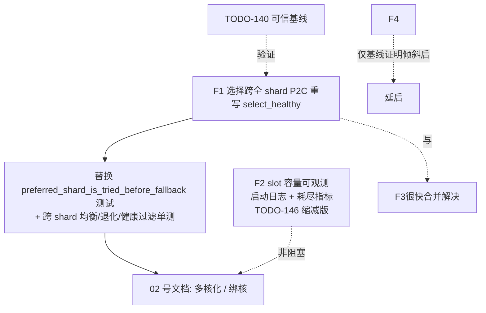

# Server 一对多（1-to-many）设计审查（2026-07-26）

> 用户诉求：server 预期支持"一对多"——一个 server 同时服务**同一 group 内的多个
> client 连接**（HA 冗余 + 后端容量横向扩展），并在它们之间做负载均衡。
> README/architecture 也明确把 "client groups with round-robin load balancing"
> 列为特性。
>
> 本文回答：**当前代码设计能否正确支撑 1-to-many？** 结论：**能建立多连接、故障切换
> 也正常，但选择（负载均衡）路径存在一个在多核下才暴露的分发缺陷**——它造成的是
> **负载不均**而非不可用；另有一处 slot 容量不可观测（按实际规模不构成天花板），
> CI（shard_count=1）对两者均无法发现。方法：以 HEAD 代码为准，附 file:line。

---

## 结论速览

| # | 发现 | 严重级别 | CI 可见性 | todo 关系 |
| --- | --- | --- | --- | --- |
| F1 | **注册分片 vs 选择分片语义错配**：一个 group 的多个 client 被全局轮询分散到各 shard，但选择只从 group 哈希出的**单一** shard 取，其余 shard 的 client 变成纯故障备份而非负载分担 | **高**（正是 1-to-many LB 目标所在）；实际危害是**负载不均 / 单 client 成瓶颈**，**不是**可用性损失 | ❌ 不可见（CI shard_count=1） | 新发现 |
| F2 | registry inflight slot 表硬编码 4096，全 server 存活 client 连接上限 4096，超出后鉴权成功但注册失败 | **低-中**（按实际规模 2-3 crates/duotunnel-client/group，4096 远非约束；属可观测性卫生项） | ❌ 不可见 | TODO-146 |
| F3 | P2C 只在被选中的单一 shard 内比较两者，过载时不会外溢到其它 shard 的空闲 client | 中（F1 的推论） | ❌ 不可见 | 随 F1 修 |
| F4 | ingress 侧按**连接**而非按**请求**选择 client（keep-alive 连接一旦选定即固定），LB 粒度偏粗 | 低-中 | 部分 | 新发现 |

**规模前提（用户确认）**：一个 client group 预期只有 **2-3 个 client**（少量副本；
client 无状态、只承担隧道角色，不会横向扩到很多实例）。下文的严重性判断以此为准——
它把 F2 从"规模天花板"降为卫生项，同时让 F1 的危害面收敛为"负载不均"而非"容量不足"。

**一句话**：1-to-many 的"建立"与"故障切换"都没问题，但在 `shard_count > 1`（生产多核）下，
group 里的 2-3 个 client 会被撒到 N=核数 个 shard，而选择只认其中一个 ⇒ **通常只有 1 个
client 在扛流量、另外 1-2 个空转**：这是**负载不均 / 单 client 先成为瓶颈**（该 client 的
QUIC 连接 inflight/stream 上限先被打满），**不是**可用性问题（preferred shard 空时
`pick_from_preferred_shards` 仍会 fallback，故障切换照常工作）。CI 因 shard_count=1 永远测不到。

---

## 1. 背景：1-to-many 在当前架构中的数据模型

```
ClientRegistry
 └─ groups: DashMap<GroupId, ClientGroup>          // 多 group（多租户）
      └─ ClientGroup { shards: Vec<ArcSwap<Vec<SelectedConnection>>> }  // 每 group 内按 shard 分区
           └─ 每 shard 一份 client 连接快照（ArcSwap 无锁读）
```

- **注册**：client QUIC 登录成功 → `registry.register(client_id, group_id, conn)`
  （`handlers/quic.rs:166-169`）。
- **选择**：ingress 请求 → `select_client_for_group(group)`
  （`plugins/h1/mod.rs:57-60`、`plugins/tls/mod.rs:36`）→ 在 group 内挑一个健康
  连接，`open_bi` 开新流转发。

分片（shard）在 server 侧的**唯一实际收益**是：突变（注册/注销）时只需重建
**一个 shard** 的快照 `Vec`（`registry.rs:152` `group.shards[shard_id].store(...)`），
而不是整组重建——即"有界快照重建成本"。**注意 server 侧的 shard 不带 CPU 亲和
收益**：ingress 请求在任意 accept-worker 核上到达，`preferred_shard_for_group`
是 group_id 的**固定哈希**（`registry.rs:271-273`），与调用核无关。

---

## 2. F1：注册分片与选择分片语义错配（核心缺陷）

### 2.1 现象与证据

**注册端**——分片由**进程级全局轮询**决定，与 group 无关：
```rust
// registry.rs:282
let shard_id = self.next_register_shard.fetch_add(1, Ordering::Relaxed) % self.shard_count;
```
于是一个 group 的 M 个 client 会被均匀撒到各 shard（期望每 shard ≈ M/N 个）。

**选择端**——只认 group 哈希出的**单一固定 shard**：
```rust
// registry.rs:308-311
pub fn select_client_for_group(&self, group_id: &str) -> Option<Arc<SelectedConnection>> {
    let group = self.groups.get(group_id)?;
    group.select_healthy(self.preferred_shard_for_group(group_id)) // = stable_shard_index(group_id)
}
// registry.rs:44-59  ClientGroup::select_healthy
pick_from_preferred_shards(self.shards, preferred_shard, |shard| { P2C within that shard })
```
而 `pick_from_preferred_shards`（`lb/shard.rs:35-54`）**从 preferred shard 开始，
返回第一个非空 shard 的结果**——即只要 preferred shard 有 ≥1 个健康 client，
就永远从它里面选，其它 shard 的 client 根本不参与。

**代码自带的测试正好固化了这个行为**（`lb/shard.rs` tests）：
`preferred_shard_is_tried_before_fallback` 断言 2 个 shard、preferred=1 时选中
shard 1 的候选，哪怕 shard 0 也有候选且负载更适合。

### 2.2 根因

server 把两个**本应分离**的关注点绑成了同一个 shard 维度：
1. **快照分区**（突变成本）：希望分片，减小每次注册/注销的快照重建。
2. **选择的 LB 域**（一个 group 请求可落到哪些 client）：**应当是整个 group 的
   全部健康 client**，却被窄化成"group 哈希出的那一个 shard"。

注册端用全局轮询打散（利于快照重建均衡），选择端用固定哈希收窄（只看一个 shard）
——两者叠加，导致一个 group 只有约 1/N 的 client 实际承载流量。

### 2.3 影响（量化）

设 group 有 M 个 client、shard_count = N（生产 = 核数）：
- 期望只有 M/N 个 client（落在 `stable_shard_index(group_id)` 那个 shard 的）
  承载全部该 group 流量；其余 (N-1)/N 的 client **纯空闲**、仅在 preferred shard
  全部不健康时才接管。
- **代入真实规模 M=2~3、N=核数（≥4 常见）⇒ M<N 是常态**：2-3 个 client 大概率
  落在不同 shard，其中只有 1 个恰好落在 `stable_shard_index(group_id)` 上，
  于是**典型形态就是"1 个 client 扛全部流量、另外 1-2 个完全空转"**；
  也存在 preferred shard 一个 client 都没有的情况，此时 fallback 到下一个非空 shard，
  仍是"某一个 client 独扛"。
- **危害性质：负载不均 / 单 client 成为性能瓶颈，不是可用性损失。**
  - **会坏的**：横向扩展与均摊失效——流量集中的那个 client 会**先撞到它自己 QUIC 连接的
    inflight / `max_concurrent_streams` 上限**，触发 pending 排队与
    `quic_open_rejected_overloaded`，而旁边 1-2 个 client 完全空闲；p99 与吞吐上限
    由**单条隧道连接**决定，而非全组之和。
  - **不会坏的**：**故障切换仍然正常**——`pick_from_preferred_shards`（`lb/shard.rs:35-54`）
    在 preferred shard 为空或全不健康时会继续遍历其余 shard，因此挂掉一个 client
    流量会切到别的 client 上。HA 冗余**有效**，只是平时不分担负载。
- 表现症状：用户加了 2-3 个 client 到一个 group，却发现流量压在其中一个上，
  "server 没有在我的多个 client 间均衡"——但拔掉那个 client 服务不中断。

### 2.4 为什么 CI 测不到

CI `shard_count=1`（BENCHMARK_SPEC：push 到 main 时 shards 解析为 1，
`bootstrap/mod.rs:320` `resolve_shard_count(quic.shards=None)` 在 1 核 cgroup 下
= 1）。shard_count=1 时所有 client 都在 shard 0，`select_healthy` P2C 覆盖全部
client——**行为完全正确**。缺陷只在 `shard_count>1`（生产多核、未显式
`quic.shards:1`）时出现。这也是"绑核/多核化"工作（02 号文档）落地后**必然会
撞上**的问题——所以应在多核化之前修掉。

### 2.5 优化方案

**推荐方案 A：选择跨 group 全部 shard 做 P2C，保留快照分区用于突变成本。**

`ClientGroup::select_healthy` 改为：加载全部 N 个 shard 的 ArcSwap 快照，在
**并集**上做 P2C（随机取两个不同的全局候选比 inflight），而非"preferred shard
优先返回"。突变路径（`register`/`unregister` 仍按 shard 重建单个快照）不变，
因此"有界快照重建"的收益保留。

```rust
// 伪代码：registry.rs ClientGroup::select_healthy 重写
pub fn select_healthy(&self, _preferred: usize) -> Option<Arc<SelectedConnection>> {
    // 读取全部 shard 快照（N 个 ArcSwap guard，N=核数，量级小）
    let guards: Vec<_> = self.shards.iter().map(|s| s.load()).collect();
    // 在并集上做 P2C：随机两个不同全局下标，取健康且 inflight 更小者；
    // 全集 <2 时退化为取唯一健康者。复用 pick_p2c 的核心逻辑，输入改为
    // 一个"跨 shard 的逻辑视图"（可用 index 映射避免真正 flatten 分配）。
    pick_p2c_across(&guards, |c| c.handle.close_reason().is_none(),
                             |c| inflight_load(c.handle.inflight_table(), c.handle.slot_id(), Relaxed))
}
```

### 2.6 方案论证 / 备选对比

| 方案 | 做法 | 优点 | 缺点 | 判定 |
| --- | --- | --- | --- | --- |
| **A（选用）** 选择跨全 shard P2C | 读 N 个快照并集做 P2C | LB 覆盖 group 全部 client；保留突变分区收益；改动小、局部 | 选择读 N 个 guard（N=核数，可忽略） | ✅ **推荐** |
| B 取消 group 内分片 | 每 group 一份扁平 `ArcSwap<Vec>` | 最简单，选择天然全覆盖 | 单 group 有数千 client 时，每次注册/注销 O(group) 重建快照 | 备选（若确定单 group 规模小） |
| C preferred_shard 改按请求轮询 | 选择时轮转 shard 而非固定哈希 | 改动极小 | 单 shard 内仍只有 M/N client，P2C 质量差；失去确定性；治标 | ❌ |
| D 注册按 group 哈希进 preferred shard | 让一个 group 的 client 都进它的 preferred shard | 选择端不用改 | 一个 group 的全部连接与快照写压力集中到一个 shard，突变成本 O(group) 且写热点 | ❌（把问题搬到写侧） |

A 在"选择覆盖全组"与"突变成本有界"之间取得最优平衡，且不改变突变路径语义，
回滚只需还原 `select_healthy` 一函数。

### 2.7 场景覆盖 & Corner Cases

| 场景/边界 | A 方案行为 |
| --- | --- |
| `shard_count=1`（CI/单核） | 只有 1 个 guard，P2C 覆盖全部——与现状完全一致，零行为变化 ✅ |
| group 只有 1 个 client | 全集=1，退化为取该唯一健康者 ✅ |
| group 全部 client 不健康 | 返回 None（同现状），上层走 `no_client_available`/重试 |
| P2C 需要两个不同候选而全集=1 | 退化取唯一者，不 panic |
| 选择与并发注册/注销 | 读的是各 shard 的 ArcSwap 瞬时快照；跨 shard 非原子，可能读到"注册中"的偏差一个，与现有单 shard 读的弱一致性同级，LB 近似不影响正确性 |
| 大 group（数千 client） | A 读 N 个 guard 仍 O(N)，P2C O(1)；不受 group 规模影响（优于方案 B） |
| 客户端侧同名原语 | `crates/duotunnel-client/tunnel/conn_pool.rs` 的 `next_conn_for_shard_excluding` 也用 `pick_from_preferred_shards`，但**语义不同且可接受**：那里是"在 client 自己的多条隧道连接间为某条流选一条"，preferred=hash(host,"entry") 是把流散布到不同本地连接的亲和策略，且其调用点带 `excluding` 重试循环会在失败时遍历所有连接（`egress/listener.rs:165-169`）。故 client 侧**不需要**同样改动——本缺陷是 server 特有 |

### 2.8 取舍

- 放弃"选择只读 1 个 shard 快照"的微小读优势（N 个 guard load，N=核数，纳秒级）。
- 换取：group 内全部 client 参与 LB，1-to-many 语义正确。
- 不改突变路径，不引入写热点（相对方案 B/D 的关键优势）。

### 2.9 收益 / 改动量 / 影响面

- **收益**：多核 server 上，一个 group 的 M 个 client 真正均摊流量（M=2-3 时从
  "1 个扛全部"恢复到"2-3 个各分一份"），单 client 的 inflight/stream 上限不再成为
  全组吞吐天花板；HA 冗余从"只在故障时接管"变为"平时也分担"。
- **改动量**：`ClientGroup::select_healthy` 重写 + 一个 `pick_p2c_across` 辅助
  （~40-60 行）+ 单测（跨 shard 均衡、退化、健康过滤）。
- **影响面**：仅选择读路径；`shard_count=1` 零行为变化；突变路径与 ArcSwap
  结构不变；回滚=还原一函数。
- **必须补测试**：现有 `preferred_shard_is_tried_before_fallback` 测试语义会
  改变——需替换为"跨 shard 均衡分布"断言（多 client 多 shard 时选择应覆盖全部）。

---

## 3. F2：registry slot 表硬编码 4096（**降级为可观测性卫生项**）

### 3.1 现象与证据
`registry.rs:89` `let inflight_table = new_inflight_table(4096);`——与配置的
`max_concurrent_streams`、核数、预期 client 数、shard 数、部署规模**无关**的
固定值。每个存活 client 连接占 1 slot（`registry.rs:137` `alloc_slot()`）；
满 4096 后鉴权仍成功但 `register` 返回 `"inflight slot table exhausted"`
（`registry.rs:140`），`handlers/quic.rs:171-179` 回 client "registration failed"。

### 3.2 影响（按实际规模重估）
按用户确认的规模——**每 group 2-3 个 client**、client 无状态且不会横向扩到很多实例——
4096 的全局上限**远非约束**：即使 100 个 group 也只占 ~300 slot，离 4096 有一个数量级余量。
因此本条**不是规模天花板**，降级为**卫生项**：真正的问题只剩"这个上限**不在配置、
不在启动日志、不在 /metrics**"，一旦真的撞到（更可能是被 07 §3.1 的连接洪泛提前吃掉槽位，
而非正常业务增长），运维**无法预知也无法观测**，只会看到 client 侧 "registration failed"。

### 3.3 方案 / 论证 / 取舍（相应缩减 TODO-146）
**只做两件事**（合计很小）：
1. **启动日志打印生效容量**——把 4096 这个 resolved capacity 连同 shard 数、
   `max_concurrent_streams` 一起打进启动配置快照（与 06 §2.3.4 的"有效配置快照"同批）；
2. **暴露耗尽指标**——capacity / allocated / high-water / exhaustion 计数进 /metrics，
   耗尽时可告警、可归因。

**明确不做**：**不实现可增长表 / 分段表**（TODO-146 原选项 (c)）。在 2-3 crates/duotunnel-client/group 的
真实规模下，为一个有一个数量级余量的常量引入"slot 引用稳定性 + 扩容期并发"的复杂度不划算；
显式 `max_client_connections` 配置项（原选项 (a)）同样**暂不需要**——4096 已是事实上的
安全默认，配置化只是把一个不构成约束的数搬到 yaml 里，徒增配置面。
**若**日后定位真的变成大规模多租户（单 server 千级 client），再回到 TODO-146 的 (a)+(c)。
与 TODO-111 的 slot allocator 所有权改造仍需协调（指标读取路径）。

### 3.4 corner case
- 观测项本身几乎无边界情况；原 TODO-146 的边界测试清单（恰好满容量 / 超一个 /
  注销复用 / 重复注册 / purge / actor 关闭时的 guard 存活）**随"不做可增长表"一并缩减**，
  只保留"耗尽时计数 +1 且日志可定位"一条。

---

## 4. F3：过载时不外溢（F1 的推论）

`pick_p2c_inflight` 只在被选中 shard 内比较两个候选（`lb/shard.rs`）。即便
preferred shard 的 client 全部**高负载但仍健康**（`close_reason().is_none()`），
选择也不会外溢到其它 shard 里**空闲**的 client——因为 `pick_from_preferred_shards`
只在 preferred shard 返回 None（空或全不健康）时才 fallback。
**随 F1 的方案 A 一并解决**：跨全 shard P2C 后，过载比较天然覆盖所有 client。

---

## 5. F4：ingress 按连接而非按请求选择 client（LB 粒度）

### 5.1 现象
- H1：`plugins/h1/mod.rs:57` 每个 ingress **TCP 连接**调用一次
  `select_client_for_group`，随后 `forward_prefixed_to_client` 字节转发——该
  连接生命周期内固定同一 client。
- TLS/H2：`plugins/tls/mod.rs:24-43` 按 `route_target` 缓存 sender，连接期内固定。

### 5.2 影响与取舍
keep-alive/H2 长连接把多请求压在初次选中的 client 上。若 ingress 侧是少量
长连接 + group 内多 client，分发粒度偏粗，与 F1 叠加会进一步失衡。
**但**：per-connection 选择是反向代理常规取舍（避免每请求重选的开销与
连接亲和收益）。**建议**：F1 修复后，per-connection 粒度通常已足够；仅当
TODO-140 基线证明长连接导致显著倾斜时，再评估 H2 每请求/每 N 请求重选。
**不建议**在 F1 未修前动 F4——粒度问题在错配缺陷面前是次要项。

---

## 6. 实施顺序与依赖



- **F1 是前置**：任何"绑核/多核化"（02）落地前必须先修 F1，否则多核化会立刻
  放大分发失衡，且压测结论不可信。
- **F2 与 F1 独立且不阻塞多核化**：按 2-3 crates/duotunnel-client/group 的实际规模，4096 不构成约束，
  只需补启动日志 + 耗尽指标，可搭 06 §2.3.4 配置快照那批一起做。
- **F3 随 F1 自然消解**。
- **F4 延后**，依赖 TODO-140 基线证据。

## 7. 验收

- [ ] `shard_count>1` 下，一个 group 的 2-3 个 client 收到的流量近似均匀
  （变异系数 < 20%），而非集中在其中一个；
- [ ] 故障切换回归：kill 掉承载流量的 client 后，流量切到同 group 其余 client
  （改动前后一致——fallback 语义不得退化）；
- [ ] `shard_count=1` 回归：选择与故障切换语义等价，不要求随机序列逐字节一致；
- [ ] 单 client group、全不健康、并发注册下选择正确、不 panic；
- [ ] 启动日志打印 slot 表生效容量，/metrics 暴露 allocated/high-water/exhaustion，
  耗尽时计数可见（F2，不含可增长表）；
- [ ] 新增跨 shard 均衡单测替换旧的 preferred-first 测试。
