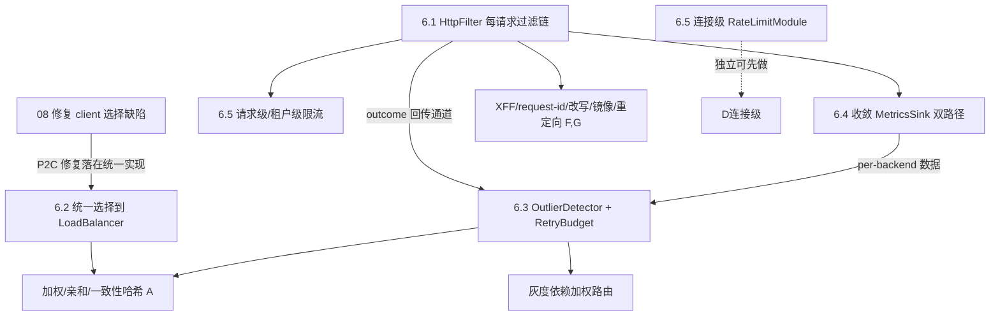

# LB 适配能力的抽象充分性评估（扩展点分析，2026-07-26）

## 背景

09 号文档列出了 DuoTunnel 对标顶级 LB 的能力缺口（健康/重试/限流/客户端 IP 透传/
可观测…）。用户的进一步问题是：**这些缺口能不能"加适配项"就补上，当前是否有足够
的抽象（trait / 插件 seam）承接？还是要先补抽象、甚至重构才能加？**

这决定了每个缺口的**真实成本**：如果扩展点已就位，补能力 = 写一个 impl（低成本、
可增量）；如果 seam 缺失或形状不对，则要先动骨架（高成本、需排期与回归）。本文
逐能力评估现有 seam 的充分性，并给出需要新增的抽象及其插入点。方法同前，代码为准。

## 问题陈述

1. 现有插件/trait 体系提供了哪些扩展点（seam）？各自能承接什么？
2. 09 的每个 LB 能力落到哪个 seam？该 seam **充分（✅ 加 impl 即可）/ 部分
   （🟡 seam 在但形状不对或没接通）/ 缺失（❌ 需先加抽象）**？
3. 需要引入哪些新抽象，插在哪里，改动量与依赖如何？

## 结论速览

**一句话**：DuoTunnel 的插件体系在**连接级 + 协议分发 + 选路 + DNS + 指标后端**
这几层抽象**充分**（照着 `LoadBalancer`/`Resolver`/`RouteResolver`/`MetricsSink`/
`ConnectionModule` 加 impl 即可）；但**缺三类关键抽象**，导致 09 里最重要的几个
LB 能力无处插入：

| 缺失抽象 | 挡住的能力 | 现状根因 |
| --- | --- | --- |
| **每请求 HTTP 过滤链（HttpFilter）** | 客户端 IP 透传(XFF)、header/路径改写、镜像、重定向、每请求可观测 | `ConnectionModule` 只有连接级 `pre_admission`，**无请求/响应级 hook**；L7 转发在 `Http1Driver`/H2 service 内**硬编码** sanitize，无插入点 |
| **统一的选择(LoadBalancer)接入** | 加权/一致性哈希/亲和/P2C 一致化、outlier 感知选择 | `LoadBalancer` trait 存在，但**三处选择只有一处走它**：server egress 是内联 RR、client 连接选择是内联 P2C（08 缺陷所在） |
| **健康/outlier + 重试预算组件** | brownout 剔除、慢启动、重试预算、熔断 | `UpstreamGroup` 健康**内联**（仅 TCP connect 信号）、重试 `max_attempts=3` **内联硬编码**，请求结果**不回传**给任何健康/预算组件 |

**关键判断**：插件体系明显参照 Pingora（源码注释自陈 "Analogous to Pingora's
`HttpModule`/`ProxyHttp`"），但**只落地了连接级 cross-cutting，没有落地 Pingora
`ProxyHttp` 的每请求过滤 hook**（`upstream_request_filter`/`response_filter`…）。
这正是 L7 LB 能力的承接层——它的缺失是本文最核心的结论，且与 **TODO-77（统一
Session）/ TODO-68（请求生命周期收敛）** 是同一件事。

---

## 4. 现有扩展点清单（seam inventory）

| Seam | 位置 | 粒度 | 现有实现 | 可承接 |
| --- | --- | --- | --- | --- |
| `IngressProtocolHandler` | `plugin/ingress.rs:88` | 每连接·按 ProtocolKind | H1/H2c/TLS/TcpPass | 新协议处理 |
| `ConnectionModule` | `plugin/module.rs:14` | **连接级**（`pre_admission` + `on_complete`） | （registry 默认空） | 连接级 allow/deny、连接级限流、访问日志 |
| `TunnelService` | `plugin/service.rs:15` | 连接级（`admission` + `logging`） | `DefaultTunnelService` | 连接准入策略 |
| `RouteResolver` | `plugin/route.rs:12` | 每连接 | `VhostPlugin`（exact+wildcard） | 路由策略（可加 regex/path/static） |
| `MetricsSink` | `plugin/metrics.rs:11` | 后端抽象（`incr`/`observe`+labels） | Prometheus / Noop | 指标后端切换 |
| `LoadBalancer` | `plugin/egress.rs:15` | `pick(targets, ctx)->idx` | `RoundRobinLb` | **仅 client 本地 upstream 选择** |
| `Resolver` | `plugin/egress.rs:55` | DNS | `CachedResolver`/`System` | DNS 策略（可加 DoH） |
| `UpstreamResolver` | `proxy/core.rs:25` | 每流（`upstream_peer`/`connect_peer`） | `IngressClientApp`/`ServerEgressMap` | 上游解析与连接 |
| `UpstreamDialer` | `plugin/egress.rs:40` | — | **无（`#[doc(hidden)]`、明确未接线）** | 预留名，死 seam |

**两个信号**：(a) `UpstreamDialer` 是**保留但未接线的死 seam**（注释自陈 "Currently
unused… reserve the name"）；(b) 死代码 `forward_http` 里有个 `Rewriter` 参数
（04 §2.1）——说明"header 改写"曾被设想过，但**从未接入 live 路径**。两者共同
表明：抽象层有"想做但没通"的痕迹，正是本文要补齐的方向。

---

## 5. 能力 → seam 充分性矩阵

| 09 能力 | 目标 seam | 充分性 | 判据（代码证据） | 补法 |
| --- | --- | --- | --- | --- |
| **客户端 IP 透传 XFF/Forwarded**（F/4.1） | 每请求 HttpFilter | ❌ **缺失** | `ConnectionModule` 无请求 hook；`Http1Driver`/`tls` H2 service 内联 sanitize（`http_utils.rs:75-111` 硬编码，只删不加） | **新增 HttpFilter 链**（见 §6.1） |
| header/路径改写、镜像、重定向（G） | 每请求 HttpFilter | ❌ **缺失** | 同上；`Route` 单目标无改写字段 | 同 §6.1 |
| 每后端/每路由 RED + 分位（F/4.1） | MetricsSink | 🟡 **部分** | trait 足够（`observe`+labels），但请求计数走**另一套** `runtime/metrics.rs` 宏直调（双路径）、且不带 upstream/route label、上游调用处无计时 | 统一到 MetricsSink + 在 upstream 调用处加计时/label（§6.4） |
| 加权/P2C/亲和/一致性哈希（A） | `LoadBalancer` | 🟡 **部分** | trait 在，但 **server egress = 内联 RR**（`upstream.rs:90`）、**client 连接选择 = 内联 P2C**（`registry.rs`，08 缺陷）；只有 client 本地 upstream 走 `LoadBalancer::pick` | 统一三处选择到 `LoadBalancer`，widen `Target`/`PickCtx`（§6.2） |
| outlier 剔除/慢启动（B/4.2） | 健康/OutlierDetector | ❌ **缺失** | `UpstreamGroup` 健康内联、仅 connect 信号（`upstream.rs:23-88`）；HTTP 错误**不回传** | **新增健康/outlier 抽象 + 结果回传**（§6.3） |
| 重试预算/熔断（C/4.3） | RetryPolicy + Budget | ❌ **缺失** | 各 handler 内联 `max_attempts=3`（`h1/mod.rs:54`、`tls/mod.rs:148`）；无共享预算 | **抽 RetryPolicy + 全局 RetryBudget**（§6.3） |
| 连接级限流（D） | `ConnectionModule::pre_admission` | ✅ **充分** | seam 可返回 `PhaseResult::Reject`（`module.rs:25`） | 直接加 `RateLimitModule`（§6.5） |
| 每请求/每租户限流（D） | 每请求 admission | ❌ **缺失** | `pre_admission` 是**连接级**；H2/keep-alive 单连接多请求只准入一次；无租户预算 | per-request admission hook + 租户预算（并入 TODO-142，§6.5） |
| 路由 vhost/regex/path（—） | `RouteResolver` | ✅ **充分** | trait 可扩展（`route.rs:12`） | 加新 resolver 实现 |
| 灰度/金丝雀加权路由（G） | `RouteResolver` | 🟡 **部分** | `resolve` 返回**单个** `Route`（`ctx.rs:111`），无权重/多目标 | widen 返回加权目标集（§6.2 顺带） |
| DNS/DoH（H） | `Resolver` | ✅ **充分** | trait 足够（`egress.rs:55`） | 加 DoH resolver |
| happy-eyeballs/IPv6（H） | `connect_peer` | 🟡 **部分** | `Resolver` 已返回多地址；connect 单地址顺序试 | 在 connect 处并发竞速，无需新抽象 |
| 服务发现 EDS（H） | 控制面 → RoutingSnapshot | 🟡 **部分** | ctld 已推 Snapshot/Patch；缺发现源接入 | 接发现源到 snapshot 构建，无需新数据面抽象 |
| 到后端 mTLS/cipher（J） | `connect_peer`/TLS 构建 | 🟡 **部分** | TLS 配置内联构建；无策略面 | 配置化，非 seam 问题 |

---

## 6. 需要引入的抽象（设计 + 插入点）

### 6.1 每请求 HTTP 过滤链 `HttpFilter`（解 F/G 全部）

> **定位说明（2026-07-26 复审）**：目标场景是**企业内部服务，不暴露到公网**。
> 因此本层的正当性**不再是"安全暴露四件套的公共地基"**，而是三条：
> **① XFF 客户端 IP 透传**（内网后端必须看到真实来源 IP）、
> **② 每请求可观测**（按后端/路由归因的计时挂载点）、
> **③ 未来认证/限流的插件插入点**（默认不启用，只保证"插得进去"）。
> ①② 是现在就要的功能缺口，③ 只是**抽象义务**——因此本层的紧迫性相应下调：
> 它不再 gate 一个"必须有"的安全故事，而是 gate XFF 与可观测。下文全部技术分析
> （为何 `ConnectionModule` 不够、三个 L7 分叉点、seam 形状）**不变**。

**问题**：L7 转发路径（ingress=client 的 `Http1Driver` / H2 service；egress=server
的同链路）把"清洗 header→转发→写响应"写死，**没有任何per-请求插入点**。
`ConnectionModule` 是连接级、且只有 `pre_admission`（准入）与 `on_complete`
（收尾），**看不到 `Request`/`Response`**。

**方案**：新增一个每请求过滤 trait（对齐 Pingora `ProxyHttp` 的 filter 家族），
由 L7 handler 在**请求构造后、发上游前**与**收到响应后、写下游前**调用：

```rust
// crates/duotunnel-core/src/plugin/http_filter.rs (新)
#[async_trait]
pub trait HttpFilter: Send + Sync + 'static {
    /// 发往上游前改写请求（注入 XFF/请求ID、path 改写、镜像分叉…）
    async fn on_upstream_request(&self, req: &mut RequestParts, ctx: &ReqCtx) -> FilterAction { FilterAction::Continue }
    /// 写回下游前改写响应（加安全头、改状态、记录分位…）
    async fn on_downstream_response(&self, resp: &mut ResponseParts, ctx: &ReqCtx) {}
}
pub enum FilterAction { Continue, ShortCircuit(Response) } // 支持重定向/本地应答
```

`ReqCtx` 携带 `client_addr`（现成于 `RoutingInfo.src_addr`）、route、upstream、
计时起点。过滤链在 `PluginRegistry` 注册（`Vec<Arc<dyn HttpFilter>>`，按 order）。

**能一次性解锁**：客户端 IP 透传（内置 `XForwardedForFilter`）、request-id/trace
注入、header/path 改写、镜像（`on_upstream_request` 分叉一份到 shadow upstream）、
重定向（`ShortCircuit`）、每请求可观测（filter 里 `observe` 延迟）。

**论证/备选**：为何是"filter 链"而非"在 Http1Driver 里加 XFF 参数"——单加 XFF 只
解一个点，改写/镜像/重定向仍无处放；filter 链是 Pingora/Envoy 的通用承接层，一次
到位。为何请求+响应两个 hook——XFF 在请求侧，安全头/分位在响应侧，缺一不可。

**Corner Cases**：TCP passthrough/WS **无 HTTP 语义**，filter 不适用——这类走
PROXY protocol（见 11 号文档）；H2 多路复用下 filter 按流调用；`ShortCircuit`
要正确终止上游（不建流）。

**取舍/改动量/影响**：引入 filter 链需改造两处 L7 handler 的请求/响应构造点，
把内联 sanitize 变成"内置 filter"；~2-3 天（trait + ctx + 两处接线 + XFF/request-id
两个内置 filter）。**这是 09 第一批（F/G）的公共前置**，且与 TODO-77/68 合流。
**v1 只需交付 XFF + request-id + 计时挂载这三个内置 filter**；认证/限流 filter 是
后续可选 impl，不在 v1 范围（空链快路径保证未启用时零开销）。

### 6.2 统一选择到 `LoadBalancer`（解 A + 08 落点 + 灰度前置）

**问题**：三处"从候选里选一个"各写各的——client 本地 upstream 走 `LoadBalancer`
（RR），server egress 走 `UpstreamGroup` 内联 RR，client 连接选择走 registry 内联
P2C（08 缺陷）。加权/亲和/一致性哈希要在三处各实现三遍。

**方案**：把选择统一到 `LoadBalancer` seam，widen 输入让策略能看到决策所需信号：
```rust
pub struct Target { /* + */ weight: u32, inflight: usize, healthy: bool, key: u64 /* 亲和/一致性哈希 */ }
pub struct PickCtx { client_addr: SocketAddr, /* + */ affinity_key: Option<u64> }
```
提供内置策略：`RoundRobin`/`P2CInflight`/`Weighted`/`ConsistentHash`/`Sticky`。
**08 的修复（跨 shard P2C）就落在 `P2CInflight` 这个统一实现里**，而不是在 registry
再补一处内联逻辑。

**论证/备选**：为何统一而非各自加——三处内联会让"加一个加权策略"变成三处改动 +
三套测试，长期漂移（就像现在 RR 与 P2C 各写一份）；统一后策略是一份、可测、可换。

**Corner/取舍**：widen `Target` 需在三处构造点填 weight/inflight/health——egress 的
health 来自 §6.3 的 outlier，client 连接的 inflight 来自 `inflight_table`（现成）。
改动量中（~2-3 天），但消除三套选择逻辑、并为加权/亲和/灰度铺一条路。

### 6.3 健康/outlier + 重试预算（解 B/C）

**问题**：健康（`UpstreamGroup` 内联、仅 connect 信号）与重试（handler 内联
`max_attempts=3`）都**看不到请求结果**，且无共享状态。

**方案**：
- 抽 `OutlierDetector`（喂入每请求 outcome：status/超时/连接错误；产出 eject/恢复
  决策 + 慢启动权重），健康状态供 §6.2 的 `Target.healthy/weight` 读取。
- 抽 `RetryPolicy`（是否可重试 + 每尝试超时）+ 进程级 `RetryBudget`（全局重试率
  上限），handler 的重试循环改为**查预算**再重试。
- **公共前置**：请求 outcome 必须从 L7 handler / relay 回传到这两个组件——这正好
  复用 §6.1 的 `on_downstream_response`（filter 能拿到 status 与耗时）与
  `on_complete`（连接收尾）。

**论证**：outlier/retry-budget 是"状态 + 决策"组件而非纯 trait，但对外仍以 trait
暴露策略（可换 Envoy 式阈值/自适应）。先做 budget（全局、简单）再做 per-upstream
熔断（状态更多）。

**Corner/取舍/改动**：全局预算计数是热路径原子→per-core 近似（同 02 K1）；~2-3 天；
依赖 §6.1 的 outcome 回传通道。

### 6.4 收敛双指标路径到 `MetricsSink`（解 F 可观测）

**问题**：`MetricsSink`（trait，plugin 侧用）与 `runtime/metrics.rs` 的
`metrics::counter!` 宏（请求/连接计数直调）**并存**，导致 per-backend RED 无处
统一挂载。

**方案**：请求/上游相关指标统一走 `MetricsSink`，在 §6.1 的 filter/handler 边界
带 `upstream`/`route` 低基数 label + 计时；`runtime/metrics.rs` 保留进程级 gauge。
**无需新抽象**，是"接通 + 统一调用点"。

**Corner**：label 基数——per-upstream/route 有界（安全），**禁 per-host/per-IP**。

### 6.5 限流：连接级用现有 seam，请求级/租户级需新 hook（解 D）

- **连接级限流 = ✅ 直接加 `RateLimitModule: ConnectionModule`**（`pre_admission`
  里查每 IP 令牌桶，`Reject`）——seam 已足够，~0.5 天。这也顺带覆盖 07 §3.1 的
  未认证连接限流的一部分。
- **请求级 / 每租户公平 = ❌ 需 per-request admission hook**（`pre_admission` 是
  连接级，H2/keep-alive 多请求只准入一次）+ 共享租户预算。建议实现为 §6.1
  filter 链上的一个 `AdmissionFilter`（请求级天然位置）+ 每 group 预算组件。
  **并入 TODO-142** 的分层 admission（入口全局 / group / 连接三层）。

---

## 7. 实施顺序与依赖



**顺序理由**：
- **`HttpFilter`（6.1）是最高杠杆的公共前置**：它一次解锁 F/G 一整批能力，且为
  6.3 提供请求 outcome 回传通道、为 6.4 提供计时挂载点、为 6.5 请求级限流提供位置。
  **应最先做**——内网定位下它的驱动力是 **XFF + 可观测**（09 §4.1），认证/限流只是
  它顺带留出的插入点（默认不启用）。
- **6.2 统一选择**与 **08 修复**合流：08 的跨 shard P2C 应直接实现为统一
  `LoadBalancer` 的 `P2CInflight`，避免再造内联逻辑；加权/亲和/灰度都依赖它。
- **6.3 outlier/retry** 依赖 6.1 的 outcome 通道 + 6.4 的 per-backend 数据（否则
  无信号可判）。
- **6.5 连接级限流**用现有 `ConnectionModule` seam，**无依赖、可最先落地**；
  请求级/租户级依赖 6.1。
- **6.4** 依赖 6.1 的边界计时点。

## 8. 取舍与总结

- **好消息**：连接级、选路、DNS、指标后端、协议分发这些抽象**已经到位**，对应能力
  （连接级限流、路由策略、DoH、指标后端）是"加 impl"的低成本增量。
- **需要补抽象的是 L7 请求级这一层**——`HttpFilter` 链是缺失的承接层，它一旦补上，
  09 里 F/G 的大部分（客户端 IP 透传、改写、镜像、重定向、每请求可观测、请求级
  限流）都变成"加内置 filter"；健康/重试再借它的 outcome 通道接通。
- **本质**：当前抽象**参照 Pingora 但只做到连接级**，缺 `ProxyHttp` 的每请求过滤
  层——这与 TODO-77（统一 Session）/TODO-68（请求生命周期收敛）是同一块骨架。
- **定位修订后的理由排序（企业内网、不暴露公网）**：`HttpFilter` 层的**必要性来自
  ①XFF 客户端 IP 透传 + ②每请求/每后端可观测**这两项现在就缺的功能；
  **③ 认证/限流是"预留插入点"义务，不是要现在实现的能力**（认证默认关闭、按需插件）。
  换言之：**建它是为了让后端看到真实来源 IP、让指标可归因，顺带让以后想加认证的人
  有地方加**——而不是为了一个"安全暴露"套餐。紧迫性因此从"P0 地基"降为
  "与 09 第一批 F1/F2 同档"，但**做法与设计一字不改**（见 `design/01-httpfilter-layer.md`）。

## 9. 验收

- [ ] 存在 `HttpFilter` 链，XFF/request-id 以内置 filter 形式接入，可配置增删；
- [ ] 三处选择统一走 `LoadBalancer`，08 的 P2C 修复即其内置策略之一；
- [ ] 请求 outcome（status/耗时/错误）经统一通道回传，outlier 与 retry-budget 可
  消费；
- [ ] per-backend/route 指标统一经 `MetricsSink`，无第二套直调宏承载请求指标；
- [ ] 连接级限流作为 `ConnectionModule` 落地、请求级作为 `AdmissionFilter` 落地。
