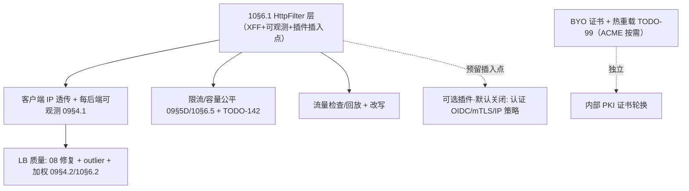

# 商业反向隧道产品对比与能力缺口（2026-07-26）

## 背景

用户点名了 **cloudflared（Cloudflare Tunnel）** 与 **ngrok** 两个海外商业反向隧道
产品，问"还有别的吗"以及"对比之下 DuoTunnel 还缺哪些能力"。本文给出：该领域的
产品全景、DuoTunnel 的定位、与商业产品的能力缺口矩阵、以及哪些缺口值得补 / 哪些
属于不同产品形态（自托管 vs SaaS）不必强求。

> 时效声明：产品能力以**截至 2026 年初的公开、稳定特性**为准，按**能力类别**对比
> （非逐一功能名/定价，后者变动快）。DuoTunnel 一侧的判断以本仓 HEAD 代码为准，
> 引用前序文档结论。

## 问题陈述

1. 反向隧道 / 内网穿透领域，除 cloudflared、ngrok **还有哪些产品**？如何归类？
2. 以商业产品为标尺，DuoTunnel **缺哪些能力**？
3. 这些缺口里哪些是**该补的**（对标价值高），哪些是**产品形态差异**（自托管注定不同）？

## 结论速览

**DuoTunnel 的缺口几乎全部集中在"边缘产品层"，而非"隧道传输层"**：
- **传输层**：DuoTunnel 用 QUIC（0-RTT 建流、连接迁移、原生多路复用），**领先于**
  frp（TCP+yamux）、ngrok/cloudflared（TCP）的隧道传输——这是它的真实优势。
- **边缘产品层**：**最终用户认证/零信任、公网可信 TLS（ACME）+ 自定义域名 + DNS
  集成、限流/IP 策略/WAF、流量检查回放、全球边缘/Anycast/DDoS**——这些
  cloudflared/ngrok 作为 SaaS 的核心卖点，DuoTunnel **基本缺失**。
- **LB/L7 层**：健康/重试/加权/客户端 IP 透传/可观测等（09/10 已详述）——介于两者
  之间，是"该补但需先补抽象"的部分。

**一句话**：DuoTunnel ≈ "**自托管的 QUIC 版 frp，带 Envoy 级 L7 野心**"。它对标
frp/rathole（自托管 OSS）时传输更强、控制面更集中；对标 cloudflared/ngrok 时，
缺的是 SaaS 边缘产品那一整层（零信任接入 + 可信 TLS/DNS + 安全策略 + 全球边缘）。

> **定位修订（2026-07-26 复审，覆盖本文原有的优先级判断）**：目标场景是
> **企业内部服务，不暴露到公网**。上述"边缘产品层"缺口因此**大部分不构成缺口**：
> 零信任接入/最终用户认证 → **可选插件、默认关闭**（§6.2⑤）；公网可信 TLS/DNS 集成
> → 内网自签或内部 PKI 已够（§6.2④）；全球边缘/DDoS → 本就不做。
> **真正要补的是 L7/LB 那一层**（客户端 IP 透传、每后端可观测、健康剔除、限流），
> 即§6.2①②。"自托管的 ngrok/cloudflared 替代"这一目标**限定在内网用得上的能力面**。

---

## 4. 产品全景（landscape）

按形态分四类：

### 4.1 SaaS 边缘型（agent 出站连边缘，服务端不可自托管或以 SaaS 为主）
- **Cloudflare Tunnel（cloudflared）**：agent 出站连 Cloudflare 边缘；零信任
  Access（OIDC/SAML/策略）、托管 TLS、DNS 自动管理、LB + 健康检查、多副本 HA、
  私有网络（WARP-to-Tunnel 的 L3 子网路由）、无入站端口、全球 Anycast + DDoS。
  **服务端 = Cloudflare（不可自托管）**。
- **ngrok**：HTTP/TCP/TLS/SSH 端点、自定义域名、托管 TLS、**最终用户认证
  （OAuth/OIDC/SAML/mTLS）**、IP 限制、**限流、熔断**、**流量检查/回放**、
  Webhook 校验、请求/响应 Header 改写、k8s ingress operator。SaaS 为主。
- **Microsoft Dev Tunnels / VS Code 端口转发**：开发者场景 SaaS。
- **Cloudflare Spectrum**：边缘 L4（TCP/UDP）代理（偏 DDoS 防护，非 agent 隧道）。

### 4.2 自托管 OSS 型（服务端可自托管，DuoTunnel 的直接同类）
- **frp**（DuoTunnel 的灵感来源）：TCP/UDP/HTTP/HTTPS/STCP/SUDP/XTCP(p2p)、
  token+OIDC、Dashboard、插件、group LB + 健康检查、带宽限制、范围端口。
  TCP+yamux。社区极大、非常成熟。
- **rathole**：Rust、高性能 frp 替代；TCP/UDP、token、TLS/Noise、极简、快；
  **无 L7/无 Dashboard**。传输层同类，定位更"瘦"。
- **inlets / inlets-pro**：OSS + 商业；TCP/HTTP over websocket/TLS、自托管 exit
  server、k8s、LB。
- **boringproxy**：自托管、HTTP(S) + 自动 Let's Encrypt、简单。
- **zrok / OpenZiti**（NetFoundry）：零信任 overlay、可自托管、ngrok 式分享 +
  Ziti 零信任网络。
- **chisel**（TCP/UDP over HTTP/SSH）、**bore**（Rust 极简 TCP）、**sish**
  （SSH 式，类 serveo）：传输极简型。

### 4.3 网状 VPN + 公开暴露型（不同范式）
- **Tailscale（+ Funnel）/ NetBird / ZeroTier**：WireGuard/自研网状 VPN，Funnel
  把节点服务暴露到公网；身份为中心、托管 TLS。**L3 网状**范式，与"应用级反向隧道"
  不同但有重叠。

### 4.4 云厂商原生
- **Azure Relay（Hybrid Connections）**、**GCP IAP TCP forwarding**、
  **AWS**（无直接对等，靠 PrivateLink/NLB 组合）。

**DuoTunnel 落点**：4.2 自托管 OSS，传输用 QUIC（比 frp/rathole 的 TCP 更先进），
控制面比 frp 更集中（ctld 热重载 token/路由），并带 Envoy/pingora 式 L7 野心
（06/09/10 的分析对象）。

---

## 5. 能力缺口矩阵

✅ 有 / 🟡 部分 / ❌ 无。DuoTunnel 一侧附证据或文档指向。

| 能力 | cloudflared | ngrok | frp | **DuoTunnel** | 关键度 |
| --- | --- | --- | --- | --- | --- |
| QUIC 传输（0-RTT/迁移/原生多路复用） | ❌(TCP) | ❌(TCP) | ❌(TCP+yamux) | ✅ **领先**（`transport/quic.rs`） | — |
| 自托管服务端 + 控制面 | ❌(仅 CF) | 🟡(企业有限) | ✅ | ✅（ctld + server 全自托管） | — |
| 双向（ingress + egress 正向代理） | 🟡 | 🟡 | 🟡 | ✅（一隧道双向，README/架构） | — |
| **最终用户认证 / 零信任接入** | ✅(Access) | ✅(OAuth/OIDC/SAML/mTLS) | 🟡(基础) | ❌ **仅隧道 agent token**（`token.rs`） | **可选**（内网定位下非必需，默认关闭；只要求抽象可插入，§6.2⑤） |
| **公网可信 TLS（ACME/LE）+ 自定义域名** | ✅ | ✅ | 🟡 | ❌ **自签 MITM 证书**（`pki.rs`，非浏览器可信）、无 ACME | 中（内网自签/内部 PKI 已够；**该补的是 BYO 证书+热重载**，ACME 按需） |
| **DNS 集成 / 自动记录** | ✅ | ✅ | ❌ | ❌ | 中 |
| **限流 / IP 策略 / 熔断 / WAF** | ✅(WAF) | ✅ | 🟡(带宽限制) | ❌（09§5 D / 无实现） | **高** |
| **请求/响应 Header 改写** | ✅ | ✅ | 🟡 | ❌（仅 host 改写；无 filter seam，10§6.1） | 中 |
| **流量检查 / 回放**（开发 UX） | 🟡 | ✅(inspector) | 🟡(dashboard) | ❌（仅 Prometheus） | 中 |
| 后端 LB + 健康检查 | ✅ | ✅ | ✅(group) | 🟡 有但**08 选择缺陷 + 弱健康**（09§4.2） | 高 |
| 多副本 / 隧道 HA | ✅(replicas) | ✅ | ✅ | 🟡（多 duotunnel-client/group，受 08 影响） | 中 |
| **全球边缘 / Anycast / DDoS** | ✅ | ✅ | ❌ | ❌（自托管单点，形态差异） | 形态 |
| **L3 私有网络 / 子网路由（VPN 式）** | ✅(WARP) | 🟡 | 🟡(p2p) | ❌（仅 L4/L7 按服务） | 中 |
| 协议广度 | HTTP/TCP/UDP/SSH/RDP/SMB/L3 | HTTP/TCP/TLS/SSH | TCP/UDP/HTTP/STCP/XTCP | HTTP/H2/WS/TCP/UDP（11） | — |
| k8s ingress operator | 🟡 | ✅ | 🟡 | ❌ | 低 |
| Webhook 校验 | ❌ | ✅ | ❌ | ❌ | 低 |
| Dashboard / 审计日志 | ✅ | ✅ | ✅ | 🟡（Prometheus + bench 面板） | 中 |
| 优雅停机 / 零停机热升级 | ✅ | ✅ | 🟡 | 🟡（drain 不完整 CR-AUDIT-21；无热升级 TODO-37） | 中 |

---

## 6. 缺口分组：该补什么、不必强求什么

### 6.1 与产品形态强绑定（自托管注定不同，**不必强求**）
- **全球边缘 / Anycast / DDoS 吸收**：这是 SaaS（有全球 POP）的结构性优势，自托管
  单点/少点无法复制。DuoTunnel 的对策是**部署形态**（多地域自建 + 前置 Anycast/
  CDN/清洗），而非在产品里造边缘网络。
- **零配置 / 托管上手体验**：SaaS 的便利来自托管控制面；自托管的价值主张本就是
  "自己掌控"，二者取舍不同。

### 6.2 对标价值高、且技术上该补（**建议纳入路线**）

> **定位前提（2026-07-26 复审，覆盖本节原排序）**：目标场景是**企业内部服务，
> 不暴露到公网**。因此"对标价值"要按**内网是否真的需要**重算：
> **LB 质量 + 客户端 IP 透传 + 每后端可观测 > 限流（容量公平）> 可信 TLS
> > 最终用户认证（可选插件、默认关闭）**。
> "自托管的 ngrok/cloudflared 替代"这个野心随之**收窄到内网真正用得上的能力**——
> 我们要的是 ngrok/cloudflared 的 **L7 反代质量与运维能力**（多后端 LB、健康剔除、
> 真实来源 IP、按后端指标、改写），**不是**它们的公网边缘能力（零信任门户、
> 托管可信证书、DNS 集成、WAF/DDoS）。对标动作只保留前者。

**① LB 质量 + 客户端 IP 透传 + 每后端可观测（本定位下的第一优先）**：09/10 已详述。
XFF 让内网后端的访问日志/审计/按 IP 策略重新生效；每后端 RED 让故障可归因；
outlier/重试预算防 brownout 与重试雪崩。**这一组是内网 LB 的生产底线，最高价值**。

**② 限流 / IP 策略 / 熔断**：09§5(D) + 10§6.5，连接级用现有 `ConnectionModule`
seam 即可起步，请求级/租户级并入 TODO-142。内网定位下它的理由从"抗攻击"变为
**容量公平**（防单 group 饿死全体）。**高价值、抽象部分就位**。

**③ 请求/响应改写 + 流量检查**：依赖 10§6.1 的 HttpFilter 层；检查/回放是开发 UX，
中价值。

**④ 可信 TLS（ACME）+ 自定义域名**：当前 TLS 终止用**自签 MITM 证书**（`pki.rs`），
浏览器不信任。**纯内网部署下优先级下调**——自签证书或**企业内部 PKI**（把内部 CA
分发进终端信任库）已经满足内网信任模型，ACME/Let's Encrypt 不是必需。**仍该补的
是"自带证书加载 + 热重载（TODO-99）"这一半**（内部 PKI 签发的证书要能装进来、能轮换）；
**ACME 自动签发降为按需**（仅当出现对公网发布的部署形态时才需要）。

**⑤ 可选插件（默认关闭）——企业内网定位下非必需：最终用户认证 / 零信任接入**
（对标 Access/ngrok auth）：当前只认隧道 agent token，对访问者零鉴权。
**在"内部服务不暴露公网"的定位下，这不构成缺口**：内网访问者已在企业边界内，
默认强制鉴权只增加配置负担。因此：
- **默认行为 = 不认证**（保持现状，零配置开销）；
- **认证作为用户按需启用的可选插件**（IP 策略走 `ConnectionModule`、OIDC/JWT 走
  `HttpFilter`、mTLS 走 TLS 层）；
- **唯一的硬要求是抽象层要能把它插进去**——即 10§6.1 的 filter 层要预留位置，
  **而不是现在就实现 OIDC/JWT/mTLS**。
- 完整蓝图保留在 `design/03-end-user-auth.md`，作为**将来 opt-in 时的实施依据**。

### 6.3 中低价值 / 按需
- L3 私有网络（VPN 式子网路由）：与 DuoTunnel 的"按服务反代"范式不同，是一个大方向
  （更接近 Tailscale/WARP），按产品定位决定是否进入。
- k8s operator、Webhook 校验、DNS 自动管理：生态便利项，按目标用户排期。

---

## 7. DuoTunnel 的真实优势（对标时应保持/放大）

1. **QUIC 传输**：0-RTT 建流、连接迁移、原生多路复用——对 frp/rathole/ngrok/
   cloudflared 的 TCP 传输是**代际优势**（README 的 QUIC vs TCP 对比属实）。
2. **全自托管 + 集中控制面**：server + ctld 都自托管，无 SaaS 依赖/计费；ctld 热
   重载 token/路由比 frp 的 per-client YAML 更集中。
3. **双向**：一条隧道同时 ingress（反代）+ egress（正向代理），多数工具仅 ingress。
4. **Envoy/pingora 式 L7 骨架**：6-phase dispatcher + 插件体系（虽有 10 指出的抽象
   缺口），比 frp/rathole 的"纯转发"更有 L7 演进空间。

**定位建议（2026-07-26 复审后修订）**：目标场景是**企业内部服务、不暴露到公网**，
因此不与 Cloudflare 在"全球边缘/DDoS/零信任门户"上竞争（既是结构性劣势，也不是内网
需求）。应把 **QUIC 传输优势 + 自托管掌控 + 集中控制面**做成主卖点，能力补齐按
**内网 L7 反代质量**排序：
1. **LB 质量 + 客户端 IP 透传 + 每后端可观测**（§6.2①，最高优先）；
2. **限流/容量公平**（§6.2②）；
3. **改写/流量检查**（§6.2③）；
4. **BYO 证书 + 热重载**（§6.2④，ACME 按需）；
5. **最终用户认证 = 可选插件、默认关闭**（§6.2⑤，只保证抽象可插入）。

即原"安全暴露四件套"的提法在本定位下**解体**：其中的"LB 质量+XFF"与"限流"升为
主线，"可信 TLS"部分保留（BYO+热重载），"最终用户认证"退为可选项。
"自托管的 ngrok/cloudflared 替代"这一目标随之**限定在内网用得上的能力面**上。

---

## 8. 实施顺序与依赖（定位：企业内网自托管 L7 隧道网关）

- **`HttpFilter` 层（10§6.1）先做**，但理由已修订：它是 **XFF 客户端 IP 透传 +
  每请求可观测**的承接层，**并顺带作为未来认证/限流的插件插入点**——不再被表述为
  "安全暴露四件套的地基"。
- **LB 质量**依赖客户端 IP 透传/可观测提供的按后端数据（同 09/10 的顺序）。
- **证书**：内网只需 BYO 证书加载 + 热重载（TODO-99）；ACME 自动签发按需（仅当出现
  对公网发布的形态）。
- **最终用户认证**不在主线上：它是 opt-in 插件，只要 filter 层留好位置即可（虚线）。

## 9. 验收（按"企业内网 L7 隧道网关"目标）

- [ ] **后端可见真实客户端 IP**、可按后端/路由观测 RED（第一优先）；
- [ ] LB 在多后端间均衡（08 修复）且能剔除 brownout 后端（09§4.2）；
- [ ] 可对入站施加限流 / 容量公平（单 group 暴增不饿死其余）；
- [ ] 自带（内部 PKI 签发）证书可加载并热重载；
- [ ] **认证保持默认关闭**且**抽象层可插入**：能以插件形式加上 IP 策略 /
  mTLS / OIDC 之一而不改动核心转发路径（能力本身不在本轮交付范围）；
- [ ] 保持并宣传 QUIC/自托管/双向的差异化优势。
