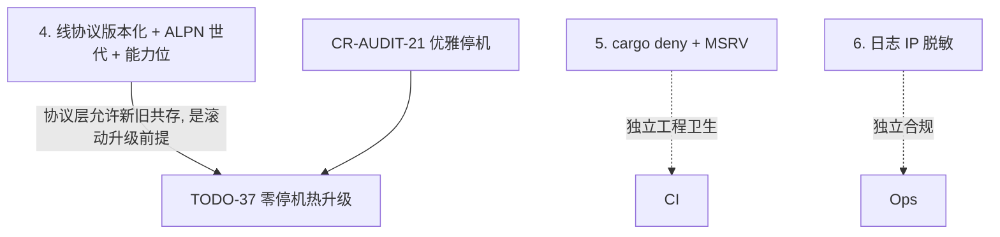

# 协议演进、兼容性与运维补遗（2026-07-26）

## 背景

前 12 篇覆盖了性能/扩展/安全/LB/透传/产品对比。本文是**完整性补遗**——审阅
过程中识别出的、**尚未被任何前序文档专门分析**的维度，主要是**线协议版本化 /
滚动升级兼容性**，以及依赖/供应链、日志隐私等运维面。方法同前，代码为准。

## 问题陈述

1. client 与 server 跨版本（滚动升级、灰度）时，线协议**有没有版本协商 / 兼容
   保证**？破坏性变更会怎样？
2. 依赖与供应链、日志隐私等运维面是否有未覆盖的风险？

## 结论速览

| # | 补遗项 | 现状 | 严重级别 |
| --- | --- | --- | --- |
| 1 | **线协议无版本协商**：登录握手与帧格式无 protocol version，rkyv 结构演进即破坏兼容 | ❌ 无 | **中-高**（阻碍滚动升级/灰度） |
| 2 | 依赖/供应链：`cargo audit` 在 CI，但无 MSRV/SBOM/依赖 unsafe 面盘点 | 🟡 部分 | 中 |
| 3 | 日志/指标隐私：token 已脱敏，但客户端 IP 入日志、指标 label 基数 | 🟡 部分 | 低-中 |
| 4 | DR/状态持久化、时钟依赖、端到端背压 | 已在别处触及 | 低 |

---

## 4. 线协议版本化与滚动升级兼容性（主项）`[新发现]`

### 4.1 现象与证据

- **登录握手无版本字段**：`Login { token: String }`（`msg.rs:41-42`）、
  `LoginResp { success, config, client_group, error }`（`msg.rs:56-`）——**均无
  protocol/handshake version**。client 发 `Login` → server 回 `LoginResp`
  （`crates/duotunnel-client/tunnel/client.rs:34-65`、`crates/duotunnel-server/ingress/handlers/quic.rs:101-190`），
  中间**无能力/版本协商**。
- **帧格式无版本**：wire frame = `[MessageType u8][len u32][rkyv payload]`
  （`msg.rs:119-137`）；`MessageType`（`msg.rs:19`）是无版本的枚举。
- **ALPN 是固定串**：`b"tunnel-quic"`（`quic.rs:83`），非 `tunnel-quic/v1`——
  无法在 ALPN 层区分协议世代。
- **payload 是 rkyv archived 结构**：`RoutingInfo`/`Login`/`LoginResp`/
  `UdpDatagramEnvelope` 直接 rkyv 序列化；`recv_message` 用 `rkyv::access`
  （CheckBytes 校验，`msg.rs:160`）。
- **有的只是 `config_version`**：`ClientConfig.config_version`（`msg.rs:82`）是
  **路由配置版本**（业务数据），**不是线协议版本**——两者常被混淆，需澄清。

### 4.2 根因与影响

rkyv archived 结构的二进制布局**与字段定义强绑定**：增删/重排字段、改类型都会
改变布局。由于握手无版本协商：
- **滚动升级 / 灰度**：升级 server 到含新字段的 `LoginResp` 后，旧 client 的
  `rkyv::access`（CheckBytes）大概率**校验失败 → 登录失败**（幸而是 error 而非
  UB，属"fail-safe 但不兼容"）；反向亦然。**升级窗口内新旧混跑会批量断连**。
- **无法平滑演进协议**：任何 wire 变更都是破坏性的，只能"同时替换两端"，与
  TODO-37（零停机热升级）、CR-AUDIT-21（优雅停机）的目标冲突——就算进程能优雅
  重启，**协议层也不允许新旧共存**。
- **无能力协商**：不能按对端能力开关特性（如新协议模式 TODO-100、UDP 扩展），
  只能全局假设两端同版本。

### 4.3 方案

1. **握手加版本 + 能力位**：`Login` 增 `protocol_version: u16` 与
   `capabilities: u64`（bitflags）；`LoginResp` 回 server 选定的
   `negotiated_version` 与 `capabilities`。双方按协商结果启用特性。
2. **ALPN 世代化**：`tunnel-quic/v1`，破坏性大版本用新 ALPN，天然拒绝不兼容对端
   （在 QUIC 握手即失败，早于登录）。
3. **帧/结构演进规则**：确立"只追加、不重排/删字段；未知字段忽略"的兼容纪律；
   rkyv 下用**显式版本化枚举**（`enum LoginV1/LoginV2`）或在 payload 前加版本字节，
   使旧端能识别并优雅拒绝而非崩解析。
4. **N-1 兼容窗口**：文档化"server 支持 client 的 N 与 N-1 版本"，给滚动升级留窗。

### 4.4 论证 / 备选

- **握手版本 + ALPN 世代双保险**：ALPN 挡"大版本不兼容"（握手即断，清晰）；
  握手版本/能力位处理"小版本特性协商"。单靠其一不够：只有 ALPN 无法协商特性，
  只有握手版本则不兼容对端已经建立了 QUIC 连接、错误更晚更糊。
- **为何不靠 rkyv 的 CheckBytes 兜底**：它只保证"不 UB"，不提供兼容——失败表现是
  登录报错，运维看到的是"升级即断连"，不可接受。
- **备选（版本化 enum vs 版本字节）**：enum 更类型安全但每次加版本要改代码；
  版本字节 + "只追加字段"更轻。建议握手用显式版本字段，数据帧用"只追加"纪律 +
  能力位门控新字段。

### 4.5 场景覆盖 & Corner Cases

- **首次引入版本**：当前无版本 = 隐含 v0；引入时 server 须兼容"无版本字段的旧
  client"一段时间（按 `Login` 是否带新字段判定），或用新 ALPN 一刀切并公告。
- **client 比 server 新**（先升 client）：server 应按自身支持的最高版本降级协商，
  不能因 client 报更高版本就拒。
- **能力位未来耗尽**：`u64` 能力位留足；或用 `Vec<Cap>`。
- **UDP datagram**：`UdpDatagramEnvelope` 也是 rkyv，同受影响；能力位应覆盖"是否
  支持 UDP 扩展"。
- **控制面（ctld watch）协议**：ctld↔server 的 Snapshot/Patch 亦是 wire 协议，同样
  需版本化（本条主要针对 client↔server，但 ctld 链路应一并纳入纪律）。

### 4.6 取舍 / 改动量 / 影响

- **取舍**：握手多几字节 + 一套协商逻辑；换取可滚动升级/灰度/能力演进。
- **改动量**：`Login`/`LoginResp` 加字段 + 协商函数 + ALPN 世代常量 + 演进纪律
  文档，~1-2 天；关键是**尽早做**——协议一旦有外部部署，再引入版本要背"v0 兼容"包袱。
- **影响**：握手路径；与 TODO-37/CR-AUDIT-21 的升级目标协同。**建议纳入近期**——
  它是"能否安全滚动升级"的前提，越晚做包袱越重。

---

## 5. 依赖与供应链（补遗）

- **现状**：`cargo audit` 已在 CI（BENCHMARK/CI 提及）；`.cargo/audit.toml` 存在。
  TODO-102 关注 `aws-lc-rs` 在 hyper-rustls/Quinn 的重复。
- **未覆盖**：无显式 **MSRV**（README 说 1.80+ / rust-toolchain.toml 固定）盘点、
  无 **SBOM**、无"依赖引入的 unsafe/许可"面盘点、无 `cargo deny`（许可/来源/重复）。
- **建议**：加 `cargo deny`（licenses+bans+advisories）到 CI；固定并文档化 MSRV；
  周期性 `cargo audit` + 依赖更新流程。低-中优先，属工程卫生。

## 6. 日志 / 指标隐私（补遗）

- **现状**：token 已脱敏（07 §2，CR-AUDIT-8）✅。
- **未覆盖**：**客户端 IP（`src_addr`）入 debug/info 日志**（多处 `debug!`/`info!`
  带 addr）——GDPR/隐私敏感场景下客户端 IP 属 PII；指标 label 基数（09 §4.1 已警告
  禁 per-IP label）。
- **建议**：提供"日志脱敏 IP（截断/哈希）"开关；确认无 per-IP/per-host 高基数 label。
  低优先，按合规需求。

## 7. 其余（已在别处覆盖，仅登记）

- **DR / 状态持久化**：ctld SQLite + server 本地快照 fallback（07 §2 TODO-82 提及）✅
  已覆盖。
- **时钟依赖热路径**：`SystemTime::now`/`Instant::now`（UDP 每包、metrics）——
  TODO-88 / 11 §6 已登记。
- **端到端背压**：QUIC flow-control 窗口（`quic.rs` 4/32MB）+ relay；01/02 已触及。

---

## 8. 实施顺序与依赖

**顺序理由**：**线协议版本化（4）应尽早**——它是"能否滚动升级/灰度"的**协议层
前提**，且越晚引入越背 v0 兼容包袱；它与 TODO-37（进程热升级）互补（一个解进程、
一个解协议，缺一不可真正零停机）。依赖/日志两项是独立的工程卫生/合规项，可并行、
低优先。

## 9. 验收

- [ ] 握手协商 protocol version + capabilities；ALPN 世代化；
- [ ] server 支持 N/N-1 client，滚动升级窗口内不批量断连（集成测试：新旧混跑）；
- [ ] rkyv 结构演进有"只追加 + 能力位门控"纪律与测试；
- [ ] CI 有 `cargo deny`，MSRV 固定并文档化；
- [ ] 可选开启日志 IP 脱敏，无高基数指标 label。
