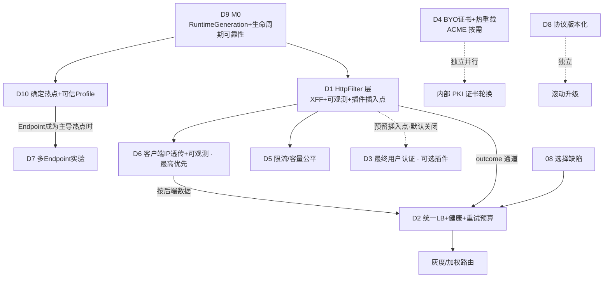

# DuoTunnel 方案设计系列（Solution Design）

> 与 `../`（01–14 现状分析）的区别：分析文档回答"**是什么、缺什么**"；本目录回答
> "**怎么建**"——给出具体 trait/类型签名、精确集成点（file:line）、config schema、
> 分阶段实施步骤（每步涉及文件 + 测试）、corner case 与安全考量。
>
> **工作模式**：设计/分析，**暂不落地代码**（用户 2026-07-26 指示）。本系列是
> 实施前的可评审蓝图。
>
> ## 📌 当前状态：全部**已记录、待定，未排期**
>
> D1–D10 均已完成设计并记录在此，作为将来动手时的依据。**没有任何一项进入实施
> 排期**。2026-07-27 第三轮复核新增 D9/D10，并把 D7（Phase B 多 Endpoint）从
> “无前置、可最先启动”修订为 **完成 M0 和可信 profile 后的条件实验**。
> 重新启动时建议先做两件事：
> 1. **复核代码是否已漂移**（这些设计基于 2026-07-26 的 HEAD，`file:line` 引用需重新核对）；
> 2. **确认定位与优先级是否仍成立**（见下方"定位"与主 README 的决策记录 D-1…D-12）。
>
> **2026-07-27 更新**：PR #58 已完成当批 01/07 P0，但第三轮复核又发现 control
> delivery、listener/slot ownership、readiness/drain 等新阻断项。它们统一进入
> **D9/M0**；D1–D7 在逻辑上仍可评审，但不应先于 M0 实施。同时提示两点漂移风险：
> - **`file:line` 已确定漂移**：M1 改动了 `h1.rs` / `http_utils.rs` / `msg.rs` /
>   `listener_mgr.rs` / `handlers/quic.rs` / `open_bi.rs` 等本系列频繁引用的文件，动手前必须重新定位；
> - **D8（协议版本化）已实施**：握手版本+能力位与 ALPN 世代化已落地，能力位机制现在是
>   **可用的**特性门控通道——D1/D3/D5 引入新协议字段时应通过它协商，而不是再加破坏性字段。

## 定位（用户确认：1 + 2；**2026-07-26 复审修订**）

**目标场景：企业内部服务，不暴露到公网。**

DuoTunnel 同时对标两个方向：
1. **更好的自托管 QUIC 隧道**（vs frp/rathole）——保持 QUIC 传输/自托管/集中控制面
   的差异化优势；
2. **自托管的 ngrok/cloudflared 替代，但范围限定在内网用得上的能力面**——要的是
   它们的 **L7 反代质量与运维能力**（多后端 LB、健康剔除、真实来源 IP、按后端指标、
   改写），**不是**公网边缘那一层（零信任门户、托管可信证书、DNS 集成、WAF/DDoS）。

**内网定位下的优先级（明确排序）**：
**XFF（后端要看到真实来源 IP）> 每后端可观测 > 认证（可选插件，默认关闭）**。

原"安全暴露四件套"的提法**在本定位下解体**：
- **LB 质量 + 客户端 IP 透传 + 每后端可观测** → 升为主线第一优先（D6 + D2）；
- **限流/IP 策略** → 保留，理由由"抗攻击"改为**容量公平**（D5）；
- **可信 TLS** → 内网自签/内部 PKI 已够；只保留 **BYO 证书 + 热重载**，
  **ACME 自动签发降为按需**（D4）；
- **最终用户认证** → **降为可选插件、默认关闭**（D3）：默认行为**不认证**（零配置
  开销），只要求**抽象层能把它插进去**，而不是现在实现 OIDC/JWT/mTLS。

**明确不做**：全球边缘 / Anycast / DDoS 吸收（自托管结构性劣势，靠部署形态解决）。

## 设计原则

1. **一层地基、多能力挂载**：09/10/12 的结论——每请求横切能力（XFF/可观测/改写，
   以及**可选的**认证/限流）应挂在**统一的 HttpFilter 层**上，而非各打补丁。
   该层的正当性 = **XFF 客户端 IP 透传 + 每请求可观测 + 未来认证/限流的插件插入点**。
2. **复用现有 seam，缺则补**：连接级/选路/DNS/指标后端抽象已够（加 impl）；只补
   缺失的请求级 filter 与统一 LB（10 号结论）。
3. **正确性/稳定性先行**：D9/M0 先闭合 control 一致性、listener/slot ownership、
   readiness 与 drain；不在存在配置撕裂和生命周期竞态的底座上叠特性。
4. **证据驱动的性能取舍**：热路径新增（filter/计时）以 06 的 microbench + TODO-140
   基线验证，避免无据劣化。
5. **与既有 TODO 合流**：HttpFilter = TODO-77（统一 Session）/TODO-68；LB 统一含
   08 修复；限流含 TODO-142；协议版本化含 TODO-37。

## 设计文档索引

| # | 文档 | 承接的能力 | 优先级（内网定位） | 依赖 |
| --- | --- | --- | --- | --- |
| D1 | [HttpFilter 层](./01-httpfilter-layer.md) | **XFF 客户端 IP 透传 + 每请求可观测**，并作为改写/镜像/重定向与**可选**认证/限流的**插件插入点** | 高（由 D6 驱动） | **D9/M0** |
| D2 | [统一 LB + 健康/outlier + 重试预算](./02-lb-quality.md) | LB 质量；**08 选择修复落此**；brownout 剔除；防重试雪崩 | 高 | **D9 owned state** + D1 outcome 通道 |
| D3 | [最终用户认证（OIDC/mTLS/IP 策略）](./03-end-user-auth.md) | **可选插件（默认关闭）**：访问者鉴权。本轮**只要求 D1 留出插入点**，不实现 | **可选 / opt-in**（内网非必需） | D1（插入点）+ D4（mTLS 时） |
| D4 | [可信 TLS（ACME + BYO + 热重载）](./04-trusted-tls-acme.md) | 内网只需 **BYO 证书 + 热重载**；**ACME 按需**（对公网发布才要） | 中（BYO/热重载）/ 低（ACME） | 独立（TODO-99） |
| D5 | [限流/IP 策略/分层 admission](./05-rate-limit-admission.md) | **容量公平**（防单 group 饿死全体），非抗攻击 | 高 | D1 + ConnectionModule + TODO-142 |
| D6 | [客户端 IP 透传 + 每后端可观测](./06-client-ip-and-observability.md) | 能力线第一优先：后端看到真实来源 IP + 按后端归因 + LB 判据 | **能力线最高（M0 后）** | D9 + D1 + MetricsSink |
| D7 | [Phase B：client 多 Endpoint](./07-multi-endpoint.md) | 候选 endpoint 收包扩展实验；附资源预算与 runtime 约束 | **P2 / profile-gated** | **D9 M0 + D10 可信 profile** |
| D8 | 协议版本化 —— 已在分析 [13 §4](../13-protocol-versioning-and-ops-addendum.md) 详细设计 | 滚动升级前提 | 中 | 独立 |
| **D9** | [**RuntimeGeneration 与运行时可靠性**](./09-runtime-reliability.md) | 完整 Snapshot、配置事务、listener actor、owned ConnectionState、readiness/stale/drain | **M0 / 最高** | D8 capability；control v1/v2 双栈与持久 revision 是其 rollout 前置 |
| **D10** | [**性能加固与证据门槛**](./10-performance-hardening.md) | UDP HOL、确定分配/内存、buffer 接线、profile 门槛、多 Endpoint 决策 | **M0 后性能主线** | D9 + 06 可信基线 |

> D1–D7、D9–D10 已完成设计；D8 的详细设计已包含在分析文档 13 §4（握手版本+能力位、
> ALPN 世代化、只追加纪律），不再单列。
>
> **统一前置 + 两条后续线**：先完成 **D9/M0**；随后
> **性能线** = D10 确定热点 → 可信 profile → 条件触发 D7/运行时实验；
> **能力线** = D1（HttpFilter）→ D6（XFF+可观测）→ D2（LB 质量）。

## 依赖与推进顺序

**推进逻辑（内网定位修订版）**：
- **D9/M0 最先做**：它修复配置一致性和资源生命周期，也是 D1/D2/D7 不把现有竞态
  放大的前提。
- **D10 是性能主线入口**：先处理 UDP HOL、owned counters、buffer 接线和高基数，
  再用 profile 决定是否进入 D7。
- **D1（HttpFilter）是能力线首项**，驱动力是 **D6 的 XFF + 每请求可观测**，而不是"安全
  暴露四件套的地基"；它同时**为 D3/D5 预留插入点**——预留是抽象义务，实现是可选项。
- **D6 是能力线第一优先**：后端看不到真实来源 IP 是当前最痛的功能缺失，且它产出的
  按后端数据是 D2 设阈值的前置。
- **D2（统一 LB）**与 08 修复合流，依赖 D6 的按后端数据。
- **D5（限流）**保留在主线，理由是容量公平。
- **D3（认证）不在主线**：默认关闭、按需 opt-in；本轮只验收"抽象插得进去"。
- **D4** 内网只做 BYO 证书 + 热重载，ACME 按需；**D7** 仅在 D10 门槛满足后实施。
