# Tunnel TODO

> Last synced against code: 2026-05-20.
>
> This file is the source of truth for unfinished work. Completed or stale items were moved to `docs/archive/donelist.md`. Detailed design notes remain in the topical docs, especially `docs/archive/pingora-tasks.md` and `docs/spec/parameters.md`.

---

## 📌 全量 TODO 赛道分类与依赖关系治理规范

### 1. ⚠️ 后续增加 TODO 的规范准则
> [!IMPORTANT]
> 任何开发人员或智能 Agent 在本文件中新增 TODO 时，必须强制遵循以下规则：
> 1. **赛道归类**：新增的 TODO 必须明确归入本节定义的五大技术赛道之一。
> 2. **声明依赖**：必须明确梳理并声明新 TODO 与现有 TODO 之间的依赖关系或并联耦合关系。
> 3. **更新依赖图**：如新增了关键依赖，需按需同步更新下方的 `Mermaid` 依赖关系图。

---

### 2. 五大技术赛道分类清单

#### 赛道一：核心代理、会话与协议控制 (Core Proxy & Protocol)
聚焦于底层中继、协议嗅探、高并发多路复用与会话生命周期管理。
- **关联 TODO**：`[TODO-64]`, `[TODO-67b]`, `[TODO-68]`, `[TODO-71]`, `[TODO-62]`, `[TODO-76]`, `[TODO-77]`, `[TODO-78]`, `[TODO-81]`, `[TODO-89]`, `[TODO-86]`

#### 赛道二：控制面、安全凭证与动态配置 (Control Plane & Config)
聚焦于控制面去状态化设计、敏感凭证脱敏安全、高效率的增量差分推送。
- **关联 TODO**：`[TODO-82]`, `[TODO-84]`, `[TODO-53D]`, `[TODO-51]`, `[TODO-CR5]`, `[TODO-PARAM-1]`, `[TODO-CR-AUDIT-8]`, `[TODO-CR-AUDIT-9]`, `[TODO-CR-AUDIT-10]`, `[TODO-CR-AUDIT-14]`, `[TODO-CR-AUDIT-15]`

#### 赛道三：高可用、防雪崩与系统可观测性 (HA, Overload & Observability)
聚焦于极限并发下的过载保护（退避与熔断降级）与高精度系统透明度指标。
- **关联 TODO**：`[TODO-75]`, `[TODO-80]`, `[TODO-CR4]`, `[TODO-88]`, `[TODO-CR-AUDIT-3]`, `[TODO-CR-AUDIT-12]`

#### 赛道四：传输性能、连接 management 与底层吞吐优化 (Transport & Performance)
消除 CPU 锁竞争、减少用户态-内核态切换开销、支持更广泛的传输特征（UDP/0-RTT等）。
- **关联 TODO**：`[TODO-20]`, `[TODO-22/34]`, `[TODO-52]`, `[TODO-36]`, `[TODO-ENTRY-POOL]`, `[TODO-83]`, `[TODO-85]`, `[TODO-94]`, `[TODO-26]`, `[TODO-27]`, `[TODO-32]`, `[TODO-73]`, `[TODO-79]`, `[TODO-CR-AUDIT-1]`, `[TODO-CR-AUDIT-2]`, `[TODO-CR-AUDIT-4]`, `[TODO-CR-AUDIT-5]`, `[TODO-CR-AUDIT-6]`, `[TODO-CR-AUDIT-7]`, `[TODO-CR-AUDIT-13]`

#### 赛道五：未来架构、硬件加速与集成机制 (Future/Research & CI)
前瞻性极客优化（零拷贝、内核旁路、HugePages）、基准测试体系增强。
- **关联 TODO**：`[TODO-28]`, `[TODO-29]`, `[TODO-30]`, `[TODO-31]`, `[TODO-35]`, `[TODO-37]`, `[TODO-38]`, `[TODO-44]`, `[TODO-39]`, `[TODO-40]`, `[TODO-42]`, `[TODO-43]`, `[TODO-45]`, `[TODO-46]`, `[TODO-47]`, `[TODO-CI-1]`, `[TODO-15]`

---

### 3. 全量依赖关系网络图 (Mermaid)

```mermaid
graph TD
    %% 赛道一
    TODO-67b[TODO-67b keep-alive下沉至Session] -->|前置依赖| TODO-36[TODO-36 消除PeerKind动态分派]
    TODO-64[TODO-64 ID类型安全Newtype] -->|提升边界安全性| TODO-77[TODO-77 Pingora式统一会话]
    TODO-77 -->|决定Hyper客户端集成方式| TODO-78[TODO-78 L7 Hyper 注入DNS缓存]
    TODO-81[TODO-81 ProxyEngine 零拷贝]
    TODO-77 -->|收敛协议握手边界| TODO-CR-AUDIT-18[CR-AUDIT-18 协议嗅探硬超时]
    
    %% 赛道二
    TODO-82[TODO-82 边缘节点去 SQLite 状态] -->|前置依赖 - 消除/平移DB逻辑| TODO-84[TODO-84 CP 选路同步]
    TODO-82 -->|平移 SQLite 瓶颈到控制面| TODO-CR-AUDIT-9[CR-AUDIT-9 WAL 并发连接数限制]
    TODO-82 -->|定义同步协议边界| TODO-CR-AUDIT-15[CR-AUDIT-15 增量/差分配置推送]
    TODO-82 -->|前置控制面API整合| TODO-CR-AUDIT-19[CR-AUDIT-19 CP重连限流]
    TODO-64 -->|提供强类型安全边界| TODO-CR-AUDIT-17[CR-AUDIT-17 DashMap死锁修复]
    TODO-53D[TODO-53D 移除静态Token Map] -->|简化Token源| TODO-51[TODO-51 Token本地增量更新]
    TODO-51 -->|流式基础| TODO-CR5[TODO-CR5 配置流式模型]

    %% 赛道三
    TODO-75[TODO-75 实时资源Gauge指标] -->|提供过载触发阈值| TODO-80[TODO-80 主动限流降级/503]
    TODO-CR-AUDIT-12[CR-AUDIT-12 open_bi 阻塞Span监控] -->|增强阻塞等待观测| TODO-80
    TODO-86[TODO-86 消除split锁竞争] <-->|修改同一中继物理层| TODO-CR-AUDIT-16[CR-AUDIT-16 engine全局Mutex优化]

    %% 赛道五
    TODO-CR-AUDIT-21[CR-AUDIT-21 SIGTERM优雅排空] -->|前置进程信号排空机制| TODO-37[TODO-37 进程平滑替换]
```

---

## 1. Active Mainline: Pingora-Inspired HTTP / Proxy Refactor

Recommended order: `64 -> 67b -> 68 -> 71 -> 76 -> 77 -> 78 -> 79 -> 80`.

Completed: `TODO-54`, `TODO-65`, `TODO-66`, `TODO-69`, `TODO-72`, `TODO-87`, `TODO-90`, `TODO-91`, `TODO-92`, `TODO-93`, `TODO-95` moved to completed.

### [TODO-64] ClientId / GroupId / ProxyName / ReuseHash newtypes
**Priority**: Medium | **Status**: TODO

**Problem**:
Hot paths still use bare `String` / `Arc<str>` for IDs. There is no `tunnel-lib/src/ids.rs` and no `ReuseHash` type.

**Fix**:
1. Introduce `ClientId`, `GroupId`, `ProxyName`, and `ReuseHash` as cheap cloneable newtypes.
2. First apply them to in-memory hot paths: `server/registry.rs`, `client/conn_pool.rs`, `server/plugins/h2c/mod.rs`.
3. Keep wire/config/storage schemas as strings initially; convert at boundaries.

### [TODO-67b] Move keep-alive loop into Session layer
**Priority**: Medium | **Status**: TODO

**Problem**:
H1 keep-alive is still in `HttpPeer::connect_inner`, which mixes upstream description, connection reuse, and session loop behavior.

**Fix**:
Create `H1Session` / `H2Session` style ownership around request loops and reused connection metadata. This also gives TODO-65 a natural place to apply `RetryType::ReusedOnly`.

### [TODO-68] Ingress request lifecycle convergence
**Priority**: Medium | **Status**: TODO

**Problem**:
h2c still carries per-connection request lifecycle state inside the handler (`first_authority`, `route_cache`, `sender_cache`). Error classification, retry, and failover are not yet aligned with TLS/H1 paths.

**Fix**:
Keep per-request routing for h2c, but centralize request lifecycle state and response mapping. Do not introduce a single selected-client fast path that would break multi-authority h2c connections.

### [TODO-71] P2C pick algorithm
**Priority**: Low | **Status**: Completed

**Fix**:
Implemented generic bounded P2C routing in `tunnel-lib/src/inflight.rs` via `pick_p2c_inflight`. Extracted $O(1)$ fast paths for `Server::ClientGroup::select_healthy` and `client::EntryConnPool::next_conn_excluding`, avoiding $O(N)$ scanning degradation and eliminating related CPU spikes during load balancing.

### [TODO-62] Full per-peer protocol capability memory
**Priority**: Medium | **Status**: Partially covered by TODO-66

**Remaining beyond TODO-66 Phase 1**:
1. Track upstream protocol capability per peer/reuse key, not only cleartext h2c fallback.
2. Decouple downstream H1/H2 from upstream H1/H2 across both server egress and client egress.
3. Decide how to observe TLS ALPN outcome if hyper does not expose enough connection-level detail.

**Closed-Loop & Resilience Paradigm Analysis**:
- **前因后果 (Context & Background)**: Currently, cleartext HTTP h2c would attempt an empty-body request and fallback to H1 upon error, marking `prefer_h1` with a TTL (implemented in `TODO-66`). However, protocol selection is not memorized or synchronized comprehensively across distinct connection-reuse keys. This means the gateway repeatedly falls back on new connections, inducing transient errors and increasing latency on downstream requests. Also, we lack deep mapping between downstream protocols (H1/H2) and upstream protocols (H1/H2) at both egress and ingress boundaries.
- **如何改造 (Refactoring Strategy)**:
  - *Error Classification & Memory*: Distinguish transient handshake/ALPN protocol negotiation failures from fatal network connectivity drops. Store dynamic protocol capability in a local thread-safe TTL-based cache mapped by reuse keys (e.g. `ArcSwap<HashMap<PeerKey, ProtocolCapability>>`).
  - *Failure Probing & Self-Healing*: Actively probe peer capabilities. If an upstream's TLS ALPN outcome degrades or changes, evict the stale capability cache entry immediately to prevent black-holing.
  - *Graceful Fallback*: If ALPN negotiation is uncertain or fails, fallback gracefully to safe default protocols (e.g., standard HTTP/1.1) rather than hard-failing or panicking.
- **影响 (Architectural Impact)**:
  - Eliminates repeated protocol negotiation penalties.
  - Decreases downstream request latency by memorizing capability.
  - Prevents downstream timeouts under high load by caching negotiation outcomes.

### [TODO-74] Egress Path DNS Cache & L4 Connection Pool
**Priority**: High | **Status**: Partially Completed (Egress DNS Cache implemented)

**Problem**:
Egress (client-to-server) path latency is significantly higher under the same QPS due to un-cached WAN DNS resolution on the hot path (for TCP/WebSocket) and lack of L4 upstream connection pooling.

**Fix**:
1. Implement a system-resolver wrapper with a TTL-based cache for raw TCP/WS egress target resolution (Completed - `EgressDnsCache` fully integrated).
2. Introduce a lightweight, lock-free upstream TCP connection pool for L4 egress to reuse WAN connections (Remaining).
3. Optimize ProxyEngine to avoid serializing hostname resolution behind reading the first client data chunk when the protocol is already declared in RoutingInfo (Completed).

**Closed-Loop & Resilience Paradigm Analysis**:
- **前因后果 (Context & Background)**: While `EgressDnsCache` is implemented to cache WAN DNS queries, L4 egress still has no connection pooling. Every TCP/WS egress request establishes a brand-new WAN TCP connection to the upstream. This incurs 3-way handshake overhead for every single transaction, resulting in severe latency spikes under high QPS. Additionally, if the upstream server is down or sluggish, the client has no connection pool eviction, leading to requests timing out inside the engine's serialization queues.
- **如何改造 (Refactoring Strategy)**:
  - *Resource Closed-Loop*: Build a lightweight, lock-free L4 connection pool (e.g. `ArcSwap` with RCU or lock-free queues of idle sockets). Establish strict maximum connection caps and idle timeouts (`idle_timeout`). Ensure that idle sockets are closed symmetrically and their file descriptors are guaranteed to be released upon shutdown or error.
  - *Active Health Checking & Self-Healing*: Background tasks must actively send empty-byte probes or TCP keepalive/heartbeat packets on pooled idle connections. If a peer drops or fails, proactively evict the dead connection from the pool.
  - *Differentiated Retries & Fallback*: Classify pool acquisition failures: if connection fails due to local slot exhaustion (transient), block or retry using exponential backoff; if the connection fails due to remote connection reset/auth failure (fatal), fail-fast immediately without polluting the pool or retrying.
- **影响 (Architectural Impact)**:
  - Eliminates TCP handshakes on hot egress paths, dramatically reducing latency.
  - Prevents resource leaks (file descriptor exhaustion) through strict pool capacity management and symmetric teardown.

### [TODO-75] Real-Time Bottleneck Observability & Load-Shedding
**Priority**: High | **Status**: Partially Completed (Observability implemented)

**Problem**:
Synchronous accept loop sleep on EMFILE and blocking open_bi waits under resource pressure lack visibility, appearing as silent hangs/blackboxes.

**Fix**:
1. Implement active atomic gauges for accepted connections, pending QUIC stream queue depth, and slow-path waiting tasks (Completed - Lock-free metrics registered).
2. Implement in-code FD limit (`rlimit`) pre-validation at application startup with high-visibility warn logs, and enrich EMFILE error reports in `run_accept_worker` with system optimization instructions (Completed).
3. Implement pluggable load-shedding to fail-fast (drop connections with 503) when pending queues exceed limits (Tracked separately in TODO-80).

**Closed-Loop & Resilience Paradigm Analysis**:
- **前因后果 (Context & Background)**: While live observability counters (gauges for accepted connections, pending QUIC queues, and rlimit validation) are now implemented, the system lacks dynamic closed-loop load-shedding. When resource capacity is exceeded, the server blindly accepts new streams only to block them indefinitely inside the stream allocator, resulting in request pileups, high tail latency, and eventual out-of-memory (OOM) crashes.
- **如何改造 (Refactoring Strategy)**:
  - *Transactional Integrity & Graceful Degradation*: Define explicit connection/stream admission limits. When the atomic gauges (implemented in Phase 1) exceed the high-watermark threshold, the proxy should immediately reject incoming streams.
  - *Graceful Fallback*: Instead of dropping streams silently or crashing, immediately respond with a `503 Service Unavailable` (or TCP Reset for raw layers), keeping the server's resource queue bounded.
  - *Hysteresis and Self-Healing*: The load-shedder must use hysteresis (e.g., lower and upper watermarks) to dynamically recover from degraded states and resume normal admission once resources drop below safe thresholds.
- **影响 (Architectural Impact)**:
  - Establishes a highly resilient guardrail against traffic spikes, protecting the server from memory exhaustion and cascaded connection drops.

### [TODO-76] Client-side local egress rule evaluation and early truncation
**Priority**: High | **Status**: TODO

**Problem**:
Currently, egress outbound routing rules are resolved entirely on the server side (`ServerEgressMap::upstream_peer`). If a host does not match the egress rules, the client still establishes a QUIC connection/stream and relays data, only for the server to reject the stream with `route_not_found`. This wastes QUIC streams and WAN bandwidth.

**Fix**:
1. Synchronize or distribute the egress outbound rules down to the client configuration.
2. In `client/egress/listener.rs`, evaluate the matching rules *locally* right after sniffing the host/protocol.
3. If no matching rule exists, immediately truncate/reject the request locally (e.g. close local TCP stream or respond with 502/404) and avoid opening a QUIC stream.
4. Keep server-side egress rule enforcement active as a security boundary (Defense in Depth) to prevent bypasses from modified or malicious clients.

### [TODO-77] Unified multi-protocol session handling inspired by Pingora
**Priority**: Medium | **Status**: TODO

**Problem**:
Downstream traffic can be H1, H2, WebSockets, or potentially UDP in the future. The current driver approach (`Http1Driver`, etc.) is tightly coupled to specific protocol types and uses heavy L7 engines (Hyper) which makes multi-protocol extensions complex and computationally expensive on the server.

**Proposed Architectural Directions (To be decided):**

#### Direction A: Pingora-Inspired Stateful Decoupled Pipeline
* **Design**:
  1. **DownstreamSession Enum**: Wrap H1, H2, and WS protocol streams. Expose unified static dispatch methods (`read_request_header()`, `read_body_chunk()`, etc.) avoiding virtual dispatch.
  2. **Channel-based Async Dual-Task Relay**: Set up a bidirectional bounded `mpsc::channel::<HttpTask>()` between two concurrent tasks (`Task Downstream` and `Task Upstream`). Use hyper's low-level `http1::handshake` for upstream connection and headers modification.
  3. **WebSocket Hand-off**: Gracefully dismantle H1/L7 task state machines upon receiving `101 Switching Protocols` and hand the raw sockets to a pure L4 `bridge::relay`.
* **Pros**: Standardized, clean multi-protocol encapsulation (easily supports H2 upstreams, transparent retries on connection pool stale FINs, and cookie/CORS/response header modifications).
* **Cons**: Higher code complexity, channel scheduling overhead, and minor memory allocations.

#### Direction B: DuoTunnel-Optimized Single Streamlined Async Function (Direct Relay)
* **Design**:
  1. **Single async fn handler**: Define a streamlined `async fn proxy_h1_quic_stream(...)`.
  2. **Direct Pipeline**: Read headers from QUIC stream $\rightarrow$ zero-copy parse via `httparse` $\rightarrow$ rewrite headers $\rightarrow$ fetch TCP socket from custom pool $\rightarrow$ write headers $\rightarrow$ immediately call `bridge::relay_with_first_data(...)` (L4 raw bytes relay).
  3. **Simplification**: No `mpsc::channel` buffer pipes, no `DownstreamSession` driver structs, no task spawning. Leverage the 1-to-1 QUIC Stream-to-Upstream connection invariant (no multi-stream load balancing required).
* **Pros**: Ultimate zero-copy performance, minimum latency, tiny memory footprint, and extremely low code complexity.
* **Cons**: Cannot easily intercept/rewrite HTTP Response Headers once L4 copy begins, and scaling to complex protocol upgrades (like nested HTTP/2 multiplexed connections) or transparent stale connection retries will lead to a nested spaghetti of async code.

---

## 2. Control Plane, Auth, and Config

### [TODO-53D] Remove legacy static token map
**Priority**: High | **Status**: TODO

Milestones A-C are done. Remaining work is Milestone D: remove the legacy static token map from server config, or keep it behind an explicit read-only compatibility window.

### [TODO-51] LocalTokenCache incremental updates
**Priority**: Low | **Status**: TODO

**Current code state**:
`LocalTokenCache::update()` rebuilds and atomically swaps the whole `HashMap<[u8; 32], CacheEntry>` on every snapshot/patch.

**Fix**:
1. Add a compatible `WatchEvent::TokenDelta { added, removed }`.
2. Add `LocalTokenCache::patch(added, removed)`.
3. Emit token deltas only for token-only changes; keep full routing snapshots for routing changes.

### [TODO-CR5] Config stream model
**Priority**: Low | **Status**: TODO

Move from pull-style `ConfigSource::load()` snapshots toward a stream model such as `Stream<Item = RoutingSnapshot>`, so file/db/ctld/dynamic config sources share one update contract.

### [TODO-PARAM-1] Unified parameter configuration schema
**Priority**: Medium | **Status**: TODO

Tracked in detail in `docs/spec/parameters.md`.

**Steps**:
1. Add top-level schema version.
2. Clean dead config fields such as unused `max_connections` / `max_tcp_connections` comments.
3. Normalize timeout naming and units.
4. Split timeout semantics out of `reconnect.*`.
5. Add per-upstream overrides for TCP, HTTP pool, timeout, H2 stream limits, and H2 ping behavior.
6. Consider server-to-client delivery of recommended `overload.*` / `quic.*` values.

### [TODO-82] Decouple SQLite from Edge Server (Stateless Edge)
**Priority**: High | **Status**: TODO

**Problem**:
The edge `server` directly compiles sqlite drivers (`tunnel-store`), preventing horizontal scaling.

**Fix**:
Transform `server` to be completely state-free, fetching dynamic rules and authenticating clients via a thin gRPC/HTTP Control Plane client interface rather than querying the local SQLite database.

### [TODO-84] Event-driven Control Plane DB Synchronization
**Priority**: Medium | **Status**: TODO

**Problem**:
`tunnel-service` uses a 1500ms db polling reactor (`db_poll_task`) to detect database changes.

**Fix**:
Enable SQLite WAL mode and transition from active polling to file-system lock notifications or database change triggers to publish updates.

## 3. Code Quality and Maintainability

### [TODO-CR4] Decouple observability from business hot paths
**Priority**: Low | **Status**: TODO

**Current code state**:
The plugin `MetricsSink` exists, but many server handlers still call `metrics::xxx()` directly.

**Fix**:
Emit tracing events or a thin async telemetry event, then aggregate metrics out of band. If using a tracing subscriber, `on_event` must only enqueue through a non-blocking channel; do not update Prometheus counters under subscriber locks.

### [TODO-20] Bytes::copy_from_slice -> split_to().freeze()
**Priority**: Medium | **Status**: TODO

Remaining copy paths still exist in request/body handling, especially around H1 driver scratch buffers and initial bytes. Replace with ownership-preserving `BytesMut::split_to().freeze()` where lifetimes and buffer reuse make it safe.

### [TODO-22 / TODO-34] Remove relay split overhead where possible
**Priority**: Medium | **Status**: TODO / Partial

**Current code state**:
Some production paths use `into_split()`, but generic relay helpers still use `tokio::io::split()` where type constraints require it.

**Fix**:
1. Keep `tokio::io::split()` for stream types that do not support owned halves.
2. Replace remaining concrete TCP/QUIC relay paths with `into_split()` where safe.
3. Update or retire obsolete generic helpers that are only used in tests.

**Closed-Loop & Resilience Paradigm Analysis**:
- **前因后果 (Context & Background)**: While `relay_with_first_data` currently utilizes concrete split structures like `tcp_stream.into_split()`, some generic proxy helper paths still fall back to `tokio::io::split()`. Because `tokio::io::split()` relies on internal `Arc<Mutex<...>>` locks to simulate duplex capability over generic types, it imposes severe CPU overhead and lock contention on concurrent read/write polling.
- **如何改造 (Refactoring Strategy)**:
  - *Resource Closed-Loop & Symmetric Teardown*: Replace software-lock generic streams with explicit concrete wrappers where possible (e.g. `TcpStream` splitting via `into_split`, `QuinnStream` splitting via owned read/write halves). Ensure that split halves are symmetrically tracked: if one half encounters an error or cancellation, the error must immediately propagate to terminate the other half (`tokio::try_join!`), triggering symmetric socket and buffer resource deallocation.
- **影响 (Architectural Impact)**:
  - Complete elimination of user-space mutex locks on all production data paths.
  - Significant reduction in CPU contention and latency tail-spikes, while guaranteeing zero socket or file descriptor leaks.

### [TODO-52] Route snapshot connection-level cache for H2
**Priority**: Low | **Status**: TODO

Cache `Arc<RoutingSnapshot>` at H2 connection scope when hot reload semantics allow old long-lived connections to keep using their initial routing snapshot.

### [TODO-36] Finish static dispatch cleanup
**Priority**: Low | **Status**: Partial

`PeerKind::Dyn` / `UpstreamPeer` are gone from the live path, but `PeerKind::{Http,H2}` still box peer structs as a transitional execution enum. After TODO-66/67b, either remove `PeerKind` entirely or make it a pure enum with no heap boxing.

**Closed-Loop & Resilience Paradigm Analysis**:
- **前因后果 (Context & Background)**: Previously, dynamic dispatch (`Box<dyn UpstreamPeer>`) was heavily used, which introduced heap allocation and dynamic routing overhead. Although `PeerKind::Dyn` has been removed, the runtime execution enum `PeerKind` still contains boxed peer implementations for specialized protocols, which means connecting to HTTP/H2 upstreams still suffers from dynamic heap allocation overhead.
- **如何改造 (Refactoring Strategy)**:
  - *Resource Allocation Safety*: Redesign the connection pipeline to bypass heap allocations. Make `PeerKind` a pure, non-boxing enum or replace it entirely with static compile-time generics. Ensure all protocol-specific peer specs (e.g. `HttpPeerSpec`, `H2PeerSpec`) are resolved statically to eliminate runtime pointer chasing and dynamic heap allocations during connection establishment.
- **影响 (Architectural Impact)**:
  - Achieves absolute zero heap-allocation connection dispatch, reducing CPU L1 instruction cache misses and GC pressure.

### [TODO-ENTRY-POOL] Remove redundant EntryConnPool mutable Vec
**Priority**: Low | **Status**: TODO

`EntryConnPool` still stores a writer-side `PoolState { conns, ids }` plus an `ArcSwap` snapshot. Since N is small this is not urgent, but it can be simplified to `ArcSwap` plus a write mutex if it stays useful.

### [TODO-81] Optimize Peek Buffer Copy in ProxyEngine (Zero-Copy)
**Priority**: High | **Status**: TODO

**Problem**:
`ProxyEngine::run_stream` executes heap-allocated `Bytes::copy_from_slice` on every incoming stream where protocol is not pre-defined, causing significant GC pressure.

**Fix**:
Perform zero-copy slice peeking directly from `PeekBufPool` and avoid allocating intermediate `Bytes` wrappers on TCP/passthrough paths.

### [TODO-83] Deconstruct tunnel-lib into targeted sub-crates
**Priority**: Medium | **Status**: TODO

**Problem**:
`tunnel-lib` is a bloated monolithic utility crate blending low-level Relays, QUIC wire types, and Client/Server-specific abstractions.

**Fix**:
Deconstruct it into smaller, decoupled packages: `tunnel-proto` (wire formats), `tunnel-engine` (relays & ring buffers), and `tunnel-plugins` (extensible plugin interfaces).

### [TODO-85] Async Listener Reconciliation
**Priority**: Low | **Status**: TODO

**Problem**:
`sync_listeners` in `server/listener_mgr.rs` uses synchronous Mutex locks and blocks the configuration orchestration thread during massive reloads.

**Fix**:
Build a dedicated event-driven `AsyncListenerReconciler` executing reconciliation commands asynchronously via command queues. Also resolve the port reuse/binding race condition: ensure that when a port is reloaded or removed, the new socket binding waits for the old listener task to gracefully exit and release the file descriptor, avoiding SO_REUSEPORT traffic splitting and `EADDRINUSE` errors.

### [TODO-94] Improve JitterBackoff Jitter Range Bounds
**Priority**: Low | **Status**: Completed

**Fix**:
已在 `client/tunnel/supervisor.rs` 中通过 `random_delay_range(min_delay, cap)` (其中 `min_delay = cap / 2`) 实现了指数退避的下限控制，从而彻底消除了重试后期的瞬时高频重试风暴问题。

---

## 4. QUIC, Transport, and Major Features

### [TODO-26] Native UDP proxy over QUIC Datagram
**Priority**: High | **Status**: TODO

**Problem**:
Currently, UDP proxying is a complete feature gap. While Quinn (QUIC) provides native unreliable Datagram (RFC 9221) support for WAN transport, DuoTunnel lacks both Client-side UDP socket binding/multiplexing and Server-side upstream UDP socket proxying and session tracking.

**Fix**:
1. **Client-side UDP Listener (Ingress/Entry)**:
   - Implement `UdpListener` binding to configured local UDP ingress ports.
   - Demultiplex incoming raw UDP packets, map them to an internal session key `(Client_Addr, Target_Addr)`.
   - Wrap payload with metadata and send them via `quinn::Connection::send_datagram()`.
2. **Server-side Stateful UDP Session Tracker (Upstream UDP)**:
   - Implement `UdpSessionManager` storing active ephemeral upstream UDP sockets mapped by `(Client_QUIC_ID, Target_UDP_Addr)`.
   - On incoming Datagram, reuse or bind a new ephemeral `tokio::net::UdpSocket` and relay via `send_to()`.
   - For each ephemeral socket, spawn a background tokio task to loop on `recv_from()`, wrap responses, and send them back downstream via QUIC Datagrams.
3. **UDP Session Idle Eviction (FD leak prevention)**:
   - Track `last_active` timestamps on sessions.
   - Run a periodic tick task to evict sessions inactive for > 30 seconds (evicting mapping and closing background sockets to prevent file descriptor leaks).

### [TODO-27] QUIC certificate and 0-RTT persistence
**Priority**: Medium | **Status**: TODO

Persist server identity material and session ticket encryption keys so restarts do not break trust or disable 0-RTT. Include rotation strategy.

### [TODO-32] Root CA signing mode for generated certs
**Priority**: High | **Status**: TODO

Current generated/self-signed certificate behavior is expensive and not persistence-friendly. Move to persistent root CA + per-host signing/caching.

### [TODO-24] Multi-endpoint + thread-per-core architecture
**Priority**: Medium | **Status**: Research

Potential fix for `open_bi()` cross-thread wakeups and endpoint contention at very high QPS. This is an architectural change and should only start after profiling confirms the current runtime layout is the bottleneck.

### [TODO-57] quinn stream-level lock research
**Priority**: Low | **Status**: Research

Research whether `quinn-proto` stream state can be sharded by stream ID without breaking connection-level flow control and congestion control.

### [TODO-25] io_uring instead of epoll
**Priority**: Low | **Status**: Deferred

Deferred until native Tokio/io_uring support is mature enough to avoid disrupting the current `Send` task model.

### [TODO-55] quinn ConnectionDriver debug_span per-poll overhead
**Priority**: Low | **Status**: Deferred pending evidence

Only patch or upstream this if a current flamegraph confirms the span construction is still a real hotspot.

### [TODO-73] Plugin-based IPv6 support and DNS Hijacking connection interceptor
**Priority**: Medium | **Status**: TODO

**Problem**:
The core transport lacks pluggable IPv6-first routing or dynamic DNS intercepting/hijacking, making environment-specific networking setups rigid.

**Fix**:
1. Implement a pluggable `Resolver` trait (e.g., `Ipv6FirstResolver`) prioritizing AAAA (IPv6) addresses over A (IPv4).
2. Build a DNS Hijacking `ConnectionModule` that intercept and redirects traffic destined for standard DNS ports during `pre_admission`.
3. Support enabling/disabling these modules dynamically via YAML configurations.

### [TODO-78] L7 HTTP Connector integration with EgressDnsCache
**Priority**: High | **Status**: TODO

**Problem**:
While L4 TCP/WebSocket uses EgressDnsCache, Hyper's L7 HttpConnector still blocks on un-cached synchronous resolver queries during new connection handshakes.

**Fix**:
1. Create a custom Hyper resolver wrapper utilizing EgressDnsCache.
2. Inject EgressDnsCache into Hyper's HttpsClient and H2cClient setups.

### [TODO-79] Wildcard Certificate Pre-signing & Handshake Cache for MITM
**Priority**: Medium | **Status**: TODO

**Problem**:
Real-time certificate generation using rcgen during the TLS MITM handshake is CPU-intensive and can cause client timeouts under high load.

**Fix**:
1. Implement a pre-signing wildcard CA certificate mechanism.
2. Pre-generate and cache wildcard certificates asynchronously in the background.

### [TODO-80] Active Load-Shedding & Fast-Fail (Shedding / Fast-Fail)
**Priority**: High | **Status**: TODO

**Problem**:
High concurrency peaks can cause requests to hang indefinitely in open_bi queue waits, leading to upstream connection pileups and memory exhaustion.

**Fix**:
1. Enforce a configurable maximum pending queue depth.
2. Instantly fast-fail excess incoming streams with a 503 or TCP reset when queue limit is exceeded.

### [TODO-89] Support DNS Round-Robin and Fallback in Egress Dns Resolution
**Priority**: Medium | **Status**: TODO

**Problem**:
The DNS resolution in `client/ingress/app.rs` (`resolve_addr`) biasedly picks only the first resolved IP address: `addrs.into_iter().next()`. This completely ignores subsequent A/AAAA records returned by DNS servers, eliminating any capability for DNS-level round-robin load balancing or failover when the first IP is down.

**Fix**:
1. Retrieve and store all resolved IP addresses.
2. Implement a fallback loop that tries subsequent IPs if the primary connection attempt fails.
3. Add optional randomized round-robin selection of the target IP to balance load across upstream records.

---

## 5. Performance Ideas and Future Architecture

These are not on the immediate implementation path. Pull one forward only with a benchmark/profile that justifies it.

### [TODO-28] Kernel-level zero-copy relay
**Priority**: Medium | **Status**: TODO

Evaluate splice/sendfile-style relay on Linux for TCP-heavy paths.

### [TODO-29] Dynamic buffer/window tuning
**Priority**: Medium | **Status**: TODO

Tune relay buffers and QUIC/TCP windows for high-BDP links.

### [TODO-30] Upstream pre-warming
**Priority**: Low | **Status**: TODO

Open upstream connections while protocol detection is in progress when the route is predictable enough to avoid wasted dials.

### [TODO-31] VhostRouter wildcard trie/radix tree
**Priority**: Medium | **Status**: TODO

Move wildcard matching from linear scan to a trie/radix structure if wildcard count becomes large enough to show up in profiles.

### [TODO-35] Two-tier upstream connection pool
**Priority**: High | **Status**: TODO

Use a small lock-free hot queue plus global pool for local egress TCP connections if upstream connection churn becomes a bottleneck.

### [TODO-37] Seamless graceful handover / hot upgrades
**Priority**: Medium | **Status**: TODO

Explore listener fd transfer and graceful process replacement for long-lived deployments.

### [TODO-38] Vectorized IO relaying / writev
**Priority**: High | **Status**: TODO

Combine header/body slices with vectored writes where the parser can preserve source-buffer references safely.

### [TODO-44] Generalized lazy timers
**Priority**: Medium | **Status**: Partial

H1 keep-alive already has lazy timeout behavior. Generalize only where profiles show timer registration overhead remains meaningful.

**Closed-Loop & Resilience Paradigm Analysis**:
- **前因后果 (Context & Background)**: High-frequency connections (like H1 keep-alive or transport level timeout trackers) register thousands of active timers per second inside the global runtime timer wheel. This creates massive timer lock contention and scheduling overhead under high load. Although H1 keep-alive uses lazy timeout updates, the rest of the proxy (e.g. general read/write timeouts, keep-alive loops, session timers) still registers aggressive active timers on every transaction.
- **如何改造 (Refactoring Strategy)**:
  - *Resource Closed-Loop & Smart Timer Management*: Generalize the "lazy timer" pattern. Instead of registering and canceling a distinct `tokio::time::sleep` on every request/transaction, maintain a single, long-running coarse ticking task per connection or thread. Waiting tasks register their deadline onto a lock-free link-list or ring buffer. The tick loop scans the collection at coarser intervals (e.g. 500ms), and cancels expired sessions. Symmetrically clear and drop registered timers when a connection is dropped or closed.
- **影响 (Architectural Impact)**:
  - Shrinks the number of active timer registrations inside Tokio's time wheel by orders of magnitude, completely eliminating timer thread spinlocks and scheduler bottlenecks under heavy concurrent load.

### [TODO-39] TCP Fast Open for egress connections
**Priority**: Medium | **Status**: TODO

Evaluate TFO on local/remote upstream dials.

### [TODO-40] Buffer slab allocator / arena
**Priority**: Medium | **Status**: TODO

Consider fixed-size thread-local buffer pools beyond current peek buffer reuse if allocation remains hot.

### [TODO-42] Kernel bypass for QUIC
**Priority**: Low | **Status**: Research

AF_XDP/eBPF experiments only; high complexity and not on the current path.

### [TODO-43] HugePages support
**Priority**: Low | **Status**: TODO

Evaluate only after memory profiles show TLB/cache pressure from buffers.

### [TODO-45] Zero-copy HTTP header serialization
**Priority**: Medium | **Status**: TODO

Represent header fields as offsets into the original buffer and pair with vectored writes. Depends on a careful ownership model.

### [TODO-46] Dynamic TCP congestion control and socket tuning
**Priority**: Low | **Status**: TODO

Expose per-connection/per-upstream socket tuning only if real deployments need it.

### [TODO-47] Memory-efficient load balancing ring
**Priority**: Low | **Status**: TODO

Only relevant if DuoTunnel grows multi-replica upstream selection where consistent hashing is useful.

### [TODO-86] Eliminate Generic tokio::io::split Lock Contention in Relay Paths
**Priority**: Medium | **Status**: TODO

**Problem**:
Generic stream relays use `tokio::io::split()`, which relies on `Arc<Mutex<...>>` to simulate duplex capability. In high-throughput hot paths, this introduces unnecessary lock contention under concurrent read/write polling.

**Fix**:
1. Leverage physical, lock-free split mechanisms (like `into_split()` for `TcpStream` and owned halves for `QuinnStream`) across all concrete relay paths.
2. Minimize or retire generic helpers that force software-lock `tokio::io::split()` in production paths.

### [TODO-88] Coarse Monotonic Clock for High-Frequency Telemetry
**Priority**: Medium | **Status**: TODO

**Problem**:
Although `Instant::now()` is optimized via vDSO on Linux/macOS, high-frequency telemetry (millions of calls per second on hot data relay paths) still incurs significant CPU time/call overhead.

**Fix**:
Introduce a thread-local or global coarse monotonic clock cache that updates at coarser microsecond intervals to serve as a low-overhead time source for non-strict duration and metrics telemetry.

---

## 6. Bench, CI, and Observability Follow-Ups

### [TODO-CI-1] CI connection matrix
**Priority**: Low | **Status**: TODO

Run key benchmark cases with `connections=1/2/4` to validate whether multiple QUIC connections actually improve throughput and tail latency.

### [TODO-15] egress_http_post phase boundary annotation
**Priority**: Low | **Status**: TODO

Fix benchmark chart annotation: `egress_http_post` extends beyond the "Basic" phase box. This affects chart readability, not raw data accuracy.

## 7. Outstanding Code Review / Audit Tasks (From Archive Reviews)

### [TODO-CR-AUDIT-1] 共享 Arc<TcpListener> 与 SO_REUSEPORT 概念背离
**Priority**: Low | **Status**: TODO
**Problem**:
The cloning of `Arc<TcpListener>` across multiple workers only shares the same underlying socket file descriptor (concurrent polling). True system-level `SO_REUSEPORT` load balancing requires each worker thread to own and bind to its own independent file descriptor.

### [TODO-CR-AUDIT-2] 缓存行填充与堆内存分离的开销权衡 (False Sharing vs Heap Allocation)
**Priority**: Low | **Status**: TODO
**Problem**:
Using `CachePadded<AtomicUsize>` with `Arc` avoids CPU cache invalidation due to false sharing, but forces individual heap allocations. In million-PPS scenarios, these scattered pointer lookups could cause cache misses. Consider flat allocation in contiguous slots.

### [TODO-CR-AUDIT-3] QuicConnectionFatal 的宏观责任划分缺陷
**Priority**: Medium | **Status**: TODO
**Problem**:
`QuicConnectionFatal` is currently hardcoded under `ErrorSource::Internal`. Since QUIC connection drops are often caused by network routing drops or firewall blockades, they should be dynamically categorized as `Upstream`/`Downstream` depending on the request flow direction.

### [TODO-CR-AUDIT-4] 高频 BufReader 用户态双重拷贝 (BufReader Double-Copy) 与内存压力
**Priority**: Medium | **Status**: TODO
**Problem**:
`TcpStream` split read/write and `quinn::RecvStream` are wrapped in `BufReader`, forcing double copying (socket buffer -> heap buffer -> target socket buffer). For plain byte passthroughs, direct read/write loops should bypass user-space caching to reduce instruction cycles.

### [TODO-CR-AUDIT-5] 潜在的整型乘法溢出漏洞
**Priority**: Low | **Status**: TODO
**Problem**:
Standard `mb * 1024 * 1024` multiplication in configuration parsing can overflow and panic or truncate. Ensure all size parameter conversions utilize `saturating_mul` and pre-validation bounds.

### [TODO-CR-AUDIT-6] 高并发连接管理器/线程池配置健壮性检验
**Priority**: Low | **Status**: TODO
**Problem**:
The client configuration allows arbitrary settings for `pool_max_idle_per_host` and thread configurations without safe margins, which could crash the engine on startup or under high load.

### [TODO-CR-AUDIT-7] 高频请求生命周期内 Engine 对象的动态实例化开销
**Priority**: Low | **Status**: TODO
**Problem**:
`handle_work_stream` dynamically instantiates `ClientApp` and `ProxyEngine` on every incoming TCP passthrough request, causing garbage collection pressure. The forwarding engine should be shared/reused as a long-lived service.

### [TODO-CR-AUDIT-8] 敏感凭证泄漏风险 (Security/Log Leakage in AuthError)
**Priority**: High | **Status**: TODO
**Problem**:
`AuthError::Internal` wraps raw `anyhow::Error` which can leak plaintext tokens in trace logs during auth failures. Implement SHA-256 hashing or truncation/masking before logging or propagating auth errors.

### [TODO-CR-AUDIT-9] 池化连接数限制与 WAL 读写并发上限瓶颈
**Priority**: Medium | **Status**: TODO
**Problem**:
The maximum connection pool size for SQLite WAL mode is hardcoded to 5. Under high traffic, this can quickly deplete connection capacity and block incoming authentication requests, creating substantial tail latency.

### [TODO-CR-AUDIT-10] 无条件堆分配的转换行为开销
**Priority**: Low | **Status**: TODO
**Problem**:
The server configuration mapping helper executes extensive `clone()` calls on every HashMap iteration during reload, generating transient memory churn.

### [TODO-CR-AUDIT-11] 极度低效的“Peek + Read_exact 丢弃”双重 I/O 系统调用开销
**Priority**: High | **Status**: Completed

**Fix**:
已通过重构 `SniffRuntime::sniff` 消除该开销。当前直接使用原生 `stream.read()` 读取并缓存前缀，无多余系统调用。并在首段完成 `initial_bytes` 的 QUIC 发送，省去了不必要的 `PrefixedReadWrite` 包装与复杂零拷贝机制。

### [TODO-CR-AUDIT-12] Tracing Span Instrument for Blocked Futures in open_bi
**Priority**: Medium | **Status**: Completed

**Fix**:
已在 `tunnel-lib/src/open_bi.rs` 的 `open_bi_guarded` 中，对 `conn.open_bi()` 的等待期注入了 `waiting_for_stream_credit` 的 tracing debug span，使得外部调试工具如 `tokio-console` 能清晰观测挂起协程。

### [TODO-CR-AUDIT-13] Asymmetric Window Coupling in QUIC Configuration
**Priority**: Medium | **Status**: Completed

**Fix**:
已在 `tunnel-lib/src/config/quic.rs` 和 `client/config.rs` 中移除了 `send_window_bytes` 向 `connection_window_mb` 的强制回退对齐，完全解耦了两端的滑动窗口大小，使发送与接收窗口可以根据广域网特性实施不对称独立参数调优。

### [TODO-CR-AUDIT-14] TokenListEntry String Heap Allocation & Type Safety
**Priority**: Low | **Status**: Completed

**Fix**:
`TokenListEntry` 已经使用强类型轻量级枚举 `ClientStatus` 和 `TokenStatus`。为进一步消除反序列化热路径上的 String 堆分配，我们重构了 `tunnel-store/src/sqlite.rs` 中的字段读取机制，将原本的 `row.get::<String>` 和 `try_get::<String>` 全部优化为直接读取零拷贝的借用型 `row.get::<&str>` / `try_get::<&str>`，完全避开了状态解析中的堆内存分配开销。

### [TODO-CR-AUDIT-15] Incremental / Delta Configuration Push (WatchEvent::Patch)
**Priority**: High | **Status**: TODO
**Problem**:
`WatchEvent::Patch` is currently defined but maps internally to a full `Snapshot` re-push. In large clusters, small routing or token updates force re-sending megabytes of configurations, leading to high CPU and network load spikes.
**Fix**:
Implement incremental updates using differential patching or version-pruned updates for `WatchEvent::Patch`.

### [TODO-CR-AUDIT-16] False Global Bottleneck in Forwarding Engine Buffer Pool
**Priority**: High | **Status**: TODO

**Problem**:
In `engine/copy.rs`, the thread-local buffer pool `LOCAL_POOL` falls back to `global_pool().lock()` when empty or if the capacity does not match. Under massive concurrent forwarding workloads, this `parking_lot::Mutex` becomes a central bottleneck, causing serious CPU thread starvation and high latency spikes.

**Fix**:
1. Remove the global `Mutex<Vec<Vec<u8>>>` buffer pool.
2. Use a lock-free concurrent queue (such as `crossbeam_queue::SegQueue`) for global fallback buffers, or increase the local capacity limit to 256.

**Closed-Loop & Resilience Paradigm Analysis**:
- **前因后果 (Context & Background)**: Thread-local buffering is designed to avoid locks in the hot data relay path. However, when the local pool of 8 elements is exhausted, falling back to a standard global Mutex creates a false illusion of scalability, transferring the contention directly to a single CPU lock.
- **如何改造 (Refactoring Strategy)**: Shift from lock-based sharing to a completely lock-free segment queue (`SegQueue`) or thread-local expansion to guarantee wait-free buffer allocation under maximum concurrent streams.
- **影响 (Architectural Impact)**: Eliminates thread contention on global buffer allocation, ensuring linear scaling of data plane throughput across multiple CPU cores.

### [TODO-CR-AUDIT-17] DashMap Lock Ordering Inversion in Client Registry
**Priority**: Critical | **Status**: TODO

**Problem**:
In `server/registry.rs`, `replace_or_register` acquires a write lock on the `groups` DashMap bucket via `.entry()`, and while holding it, attempts to acquire a write lock on the `clients` DashMap entry. This lock ordering inversion can easily lead to a fatal runtime deadlock under concurrent client registration and unregistration.

**Fix**:
Avoid nesting locks on distinct `DashMap` or `Mutex` structures. Extract required fields from `groups`, drop the entry write lock explicitly, and then perform operations on `clients`.

**Closed-Loop & Resilience Paradigm Analysis**:
- **前因后果 (Context & Background)**: DashMap bucket locks are held implicitly as long as `Entry` references (`RefMut`) are in scope. Doing cross-map operations inside the scope of another map's entry lock naturally results in circular lock dependencies.
- **如何改造 (Refactoring Strategy)**: Strictly isolate the scopes of different DashMap operations. Fetch/rebuild values in localized scopes, drop locks immediately, and execute consecutive updates sequentially rather than nested.
- **影响 (Architectural Impact)**: Guaranteed deadlock-free client registration and unregistration, securing high system availability under massive connection churn.

### [TODO-CR-AUDIT-18] Sniffer Slowloris Vulnerability in Protocol Detection
**Priority**: High | **Status**: TODO

**Problem**:
In `sniff.rs`, the `SniffRuntime::sniff` loop reads incoming data stream chunks to detect protocols (HTTP/1, H2c, TLS SNI). However, it lacks an absolute temporal timeout constraint. A slow-sending malicious client can keep the sniffer task indefinitely `Pending` on `stream.read()`, causing resource exhaustion (Slowloris attack).

**Fix**:
Wrap the sniffing operation in `client/egress/listener.rs` and `server` in a hard timeout (e.g., `Duration::from_secs(3)`) using `tokio::time::timeout`.

**Closed-Loop & Resilience Paradigm Analysis**:
- **前因后果 (Context & Background)**: Sniffer restricts only read byte count and round limits, but not time. Slow networks or slow-rate attackers can easily leverage this to tie down worker threads and exhaust connection slots.
- **如何改造 (Refactoring Strategy)**: Enforce a strict edge admission timeout. Any connection that fails to present a recognizable protocol preamble within 3 seconds is immediately dropped.
- **影响 (Architectural Impact)**: Significantly hardens the edge proxy against slowloris resource-exhaustion attacks, ensuring resilience under hostile network conditions.

### [TODO-CR-AUDIT-19] Control Plane DB Connection Storm Rate-Limiting
**Priority**: High | **Status**: TODO

**Problem**:
The control plane lacks rate-limiting mechanisms on client registration and query routing. During wide-area network reconnect storms, thousands of edge nodes querying SQLite databases simultaneously will quickly exhaust SQLite connection pools and WAL limits, leading to gateway query failures.

**Fix**:
Implement an active rate-limiting filter or token bucket on the control plane gRPC/HTTP API interface before executing database queries.

**Closed-Loop & Resilience Paradigm Analysis**:
- **前因后果 (Context & Background)**: Edge stateless nodes offload database pressure to the control plane, but without admission control, reconnect storms will push the database to its concurrency limits.
- **如何改造 (Refactoring Strategy)**: Establish a token-bucket rate limiter at the ingress of control plane APIs, rejecting excess sync requests with structured backoff instructions.
- **影响 (Architectural Impact)**: Protects SQLite database pools from cascading failures, ensuring the control plane remains stable during cluster-wide network recoveries.

### [TODO-CR-AUDIT-20] Fuzz Testing for Sniffing and Lock-Free Structures
**Priority**: Medium | **Status**: TODO

**Problem**:
DuoTunnel parses raw application preambles (HTTP/1, H2c, TLS SNI) and uses lock-free `ArcSwap`/`InflightTable` registry structures. These hot components are prone to subtle parsing panics or lock-free concurrency memory safety bugs, yet they completely lack fuzzing validation.

**Fix**:
Integrate `cargo-fuzz` and write target fuzzer test suites for `sniff.rs` protocol parsers and concurrent `SelectedConnection` registry loops.

**Closed-Loop & Resilience Paradigm Analysis**:
- **前因后果 (Context & Background)**: Hand-crafted byte-level sniffers are highly vulnerable to malicious payloads. Standard unit tests cannot explore the space of malformed byte structures.
- **如何改造 (Refactoring Strategy)**: Implement LibFuzzer targets feeding arbitrary byte sequences into `detect_protocol_and_host` and concurrent registry write loops.
- **影响 (Architectural Impact)**: Discovers edge parsing panics and concurrency state mismatches proactively, securing robust production deployments.

### [TODO-CR-AUDIT-21] SIGTERM Graceful Connection Draining
**Priority**: High | **Status**: TODO

**Problem**:
The server and client binaries lack standard signal handling and graceful connection draining. A `SIGTERM` kills processes abruptly, cutting off thousands of active client streams and causing immediate transaction failures.

**Fix**:
Implement signal traps for `SIGTERM`/`SIGINT`, invoke graceful shutdown, stop accepting new connections, and wait for existing streams to complete or reach a maximum draining timeout.

**Closed-Loop & Resilience Paradigm Analysis**:
- **前因后果 (Context & Background)**: Abrupt process termination damages service reliability and transactional integrity. Edge nodes need symmetric connection draining before restarts.
- **如何改造 (Refactoring Strategy)**: Capture system signals, use `CancellationToken` to stop accept loops immediately, allow ongoing streams to finish, and force-kill remaining connections after a 30-second grace window.
- **影响 (Architectural Impact)**: Achieves zero-downtime rolling deployments, ensuring client traffic is completely uninterrupted during edge server upgrades.

