# Tunnel TODO

> Last synced against code: 2026-06-15.
>
> This file is the source of truth for unfinished work. Completed or stale items were moved to [donelist.md](file:///Users/sexy/Documents/GitHub/duotunnel/docs/archive/donelist.md). Detailed design notes remain in the topical docs, especially [pingora-tasks.md](file:///Users/sexy/Documents/GitHub/duotunnel/docs/archive/pingora-tasks.md) and [parameters.md](file:///Users/sexy/Documents/GitHub/duotunnel/docs/spec/parameters.md).

---

## 📌 实施路线图与优先级划分 (Roadmap & Implementation Sequence)

为了提高系统的安全性、稳定性与超高并发吞吐，DuoTunnel 的待办事项（TODO）被重新梳理并归纳为以下四个实施阶段：

1. **Phase 0: 关键安全防御、死锁修复与日志脱敏 (Critical Security & Stability)**
   - 立即修复可能导致网关挂起的 `DashMap` 死锁，以及可能被恶意客户端利用的协议嗅探慢速攻击（Slowloris）。治理敏感 Token 的日志泄露风险。
2. **Phase 1: 核心用户态零拷贝、并发无锁缓冲与连接重用 (High Priority: Performance & Zero-Copy)**
   - 专注于消除底层复制引擎的全局 Mutex 争用、避免 memset 置零开销、实现 Quinn L7 用户态零拷贝（使用 `read_chunk`），以及建立 Egress 端 L4 连接池与无锁并发 DNS 缓存（DashMap + Single-Flight）。提供 UDP (QUIC Datagram) 代理原生支持。
3. **Phase 2: 协程与局部性优化、长连接生命周期与架构重构 (Medium Priority: Architecture & Sessions)**
   - 实施任务绑定缓冲区（Task-Bound Buffer）解决协程跨核调度导致的 CPU 缓存局部性变冷问题。消除 Generic `split` 带来的 Bilock 锁竞争，并落地类似 Pingora 的统一多协议 Session 管理架构。
4. **Phase 3: 前瞻性性能实验与长尾微调 (Low Priority & Research)**
   - 包括粗粒度单调时钟遥测、配置流式模型演进以及其他的内核旁路（io_uring/AF_XDP）前瞻性探索。

---

## 🗺️ 全量依赖与阶段流转图 (Mermaid)

```mermaid
flowchart TD
    subgraph Phase 0: Security & Stability
        CR-AUDIT-17[TODO-CR-AUDIT-17 DashMap 死锁修复]
        CR-AUDIT-18[TODO-CR-AUDIT-18 协议嗅探 5s 超时]
        CR-AUDIT-8[TODO-CR-AUDIT-8 敏感凭证日志脱敏]
    end

    subgraph Phase 1: High Priority Performance & Core Features
        CR-AUDIT-16[TODO-CR-AUDIT-16 消除全局缓冲池锁竞争]
        TODO-97[TODO-97 缓冲池宽松匹配与免 memset]
        TODO-104[TODO-104 DNS 缓存去全局锁 DashMap+SingleFlight]
        TODO-81[TODO-81 Peek 探测零拷贝]
        TODO-74[TODO-74 Egress 路径 L4 连接池与 DNS]
        TODO-76[TODO-76 客户端本地规则评估与截断]
        TODO-82[TODO-82 边缘去 SQLite 状态]
        TODO-26[TODO-26 QUIC Datagram 原生 UDP 代理]
        TODO-64[TODO-64 ID 强类型 Newtype 封装]
        
        L7-ZC-1[performance §1: L7 Zero-Copy Body Streaming]
        L7-ZC-2[performance §2: L7 Zero-Copy Response Writer]
    end

    subgraph Phase 2: Medium Priority Architecture & Sessions
        TODO-98[TODO-98 缓冲区生命周期绑定到 Async Task]
        TODO-22_34_86[TODO-22/34/86 消除 Generic split Bilock 锁竞争]
        TODO-77[TODO-77 统一多协议 Session 处理]
        TODO-67b[TODO-67b H1 Keep-Alive 下沉至 Session]
        TODO-68[TODO-68 Ingress 请求生命周期收敛]
        TODO-62[TODO-62 Peer 协议记忆与 fallback 机制]
        TODO-99[TODO-99 TLS 证书监听与热重载]
        TODO-96[TODO-96 JoinSet 协程生命周期生命管控]
    end

    %% Dependencies
    CR-AUDIT-17 -->|安全强类型设计依赖| TODO-64
    CR-AUDIT-18 -->|嗅探超时阻断| TODO-80[TODO-80 主动限流降级/503]
    CR-AUDIT-16 -->|物理半流转发特化前置| TODO-22_34_86
    TODO-97 -->|提升任务缓冲区局部性前置| TODO-98
    TODO-64 -->|ID 强类型统一| TODO-77
    TODO-77 -->|需要 keepalive session| TODO-67b
    TODO-82 -->|去 DB 瓶颈| TODO-84[TODO-84 CP 选路同步]
```

---

## 🚨 Phase 0: 关键安全防御、死锁修复与日志脱敏 (Critical Security & Stability)

### [TODO-CR-AUDIT-17] DashMap Lock Ordering Inversion in Client Registry
* **Priority**: Critical | **Status**: TODO | **Track**: Control Plane & Config
* **Problem**: 
  在 [registry.rs](file:///Users/sexy/Documents/GitHub/duotunnel/server/src/registry.rs) 中，`replace_or_register` 函数通过 `.entry()` 获取了 `groups` DashMap 桶上的写锁，在持有该锁的同时，又尝试获取 `clients` DashMap 条目的写锁。这种嵌套锁的顺序在并发注册和注销时极易造成严重的运行时死锁，导致整个控制面服务挂起。
* **Fix**:
  避免嵌套锁住不同的 `DashMap` 或互斥结构。先从 `groups` 提取所需字段并显式释放该桶的写锁 guard，之后再对 `clients` 进行后续的写操作，确保锁级别平铺。

### [TODO-CR-AUDIT-18] Sniffer Slowloris Vulnerability in Protocol Detection (5s Timeout)
* **Priority**: High | **Status**: TODO | **Track**: HA, Overload & Observability
* **Problem**: 
  在协议探测模块中，`SniffRuntime::sniff` 循环读取入站数据流块来探测应用层协议（HTTP/1.1, H2c, TLS SNI）。然而，该过程缺乏绝对的时间超时限制。恶意客户端可以通过无限慢的速度发送极少字节（Slowloris 慢速攻击），让探测协程无限期 `Pending` 在 `stream.read()`，从而耗尽服务器的所有接收 Worker 资源。
* **Fix**:
  在 [listener.rs](file:///Users/sexy/Documents/GitHub/duotunnel/client/src/egress/listener.rs) 与服务端的 Ingress 调度中，使用 `tokio::time::timeout(Duration::from_secs(5), ...)` 对嗅探操作包裹硬超时逻辑，超时未判定则立即断开。

### [TODO-CR-AUDIT-8] 敏感凭证泄漏风险 (Security/Log Leakage in AuthError)
* **Priority**: High | **Status**: TODO | **Track**: Control Plane & Config
* **Problem**:
  `AuthError::Internal` 内部直接包裹了 `anyhow::Error` 的原始上下文。当客户端授权失败触发异常日志时，敏感的明文 Auth Token 会伴随调用栈或者错误信息被直接输出到 Trace/Error 日志中，产生凭证泄露风险。
* **Fix**:
  在输出日志或向外部传播 Auth 错误之前，对 Token 执行 SHA-256 哈希或前缀截断掩码（如 `Token: abc...xyz`），禁止打印原始敏感明文。

---

## 🚀 Phase 1: 核心用户态零拷贝、内存池与高并发连接管理 (High Priority: Performance & Zero-Copy)

### [TODO-CR-AUDIT-16] 消除复制引擎全局缓冲池锁竞争
* **Priority**: High | **Status**: TODO | **Track**: Zero-Copy & Buffer Pooling
* **Problem**:
  在 [copy.rs](file:///Users/sexy/Documents/GitHub/duotunnel/tunnel-lib/src/engine/copy.rs) 中，Thread-local 的 `LOCAL_POOL` 在空或容量不匹配时会退退到全局的 `global_pool()`。目前 `global_pool()` 虽然是无锁的 `crossbeam_queue::SegQueue`，但代码中加入了 `global.len() < 256` 限制判断。**在 `SegQueue` 上调用 `len()` 是 $O(N)$ 复杂度的操作（需要遍历链表）**，高并发下这会导致严重的 CPU 缓存行争用和毛刺。
* **Fix**:
  彻底废除基于全局 SegQueue 且带有 $O(N)$ `len()` 判定限制的缓冲池，改用有界的、`len()` 为 $O(1)$ 的无锁并发 MPMC 队列 `crossbeam_queue::ArrayQueue<Vec<u8>>`。如果队列满则直接 drop 交给 GC，消除全局临界区争用。

### [TODO-97] Buffer pool capacity lax matching & uninitialized allocation
* **Priority**: High | **Status**: TODO | **Track**: Zero-Copy & Buffer Pooling
* **Problem**:
  [copy.rs](file:///Users/sexy/Documents/GitHub/duotunnel/tunnel-lib/src/engine/copy.rs) 中的 `take_buffer` 使用了 `buf.capacity() == buffer_size` 强对齐匹配，造成不同 buffer_size 容器在池中大量失效并重新分配。另外，`resize` 操作无意义地对缓存 Vec 进行了 memset 置零，增加了总线吞吐负担。
* **Fix**:
  1. 将匹配条件放宽到 `buf.capacity() >= buffer_size`。
  2. 取出后使用 `unsafe { buf.set_len(buffer_size) }` 替代 `resize(..., 0)`（后续读系统调用会立即覆盖这片内存，无安全泄露风险）。

### [performance_optimization_proposal.md §1] L7 Zero-Copy Body Streaming
* **Priority**: High | **Status**: TODO | **Track**: Zero-Copy & Buffer Pooling
* **Problem**:
  L7 HTTP/1.x 转发中，网关需要将 Quinn 的 QUIC 数据流读取并写入 TCP 接口。目前仍然通过多步带内存拷贝的 Buffer 方式中转。
* **Fix**:
  在 `h1.rs` 和 `egress/http.rs` 的 Body 转发中，将 `recv.read()` 改为 `recv.read_chunk()`。Quinn 的 `read_chunk` 直接返回 RC 引用计数的 `bytes::Bytes`，可以绕过用户态缓冲区中转，实现真正的零拷贝网络数据中转。

### [performance_optimization_proposal.md §2] L7 Zero-Copy Chunked Response Writer
* **Priority**: High | **Status**: TODO | **Track**: Zero-Copy & Buffer Pooling
* **Problem**:
  在序列化 HTTP 分段响应（Chunked Response）时，由于需要计算并拼接十六进制的 Chunk 长度以及 `\r\n`，系统常会创建额外的中间缓冲区进行拷贝拼接。
* **Fix**:
  消除中间缓冲区拷贝。直接使用 stack-allocated 的前缀数组（约 32 字节）写入 hex 长度与 `\r\n`，随后直接 `write_all(chunk)` 写入主体负载，由 Quinn 在更底层自动拼包发送，实现 Payload 部分的零拷贝。

### [TODO-81] Optimize Peek Buffer Copy in ProxyEngine (Zero-Copy)
* **Priority**: High | **Status**: TODO | **Track**: Zero-Copy & Buffer Pooling
* **Problem**: 
  `ProxyEngine::run_stream` 在判断应用层协议时，如果协议不是预定义的，会在每一条入站 Stream 上执行一次堆分配的 `Bytes::copy_from_slice` 拷贝，增加了 GC 压力。
* **Fix**: 
  改为直接从 [peek_buf.rs](file:///Users/sexy/Documents/GitHub/duotunnel/tunnel-lib/src/infra/peek_buf.rs) 的 `PeekBufPool` 借出 raw slice 进行探测，避免在 TCP/Passthrough 路径上为了打包而创建和分配中间 `Bytes` 包装。

### [TODO-104] EgressDnsCache global Mutex lock removal via DashMap & Single-Flight
* **Priority**: High | **Status**: TODO | **Track**: Transport & Performance
* **Problem**:
  在 [dns_cache.rs](file:///Users/sexy/Documents/GitHub/duotunnel/client/src/dns_cache.rs) 中，`EgressDnsCache` 使用了单一全局异步锁 `write_lock: tokio::sync::Mutex<()>` 来协调所有 DNS 未命中的解析，导致不同域名的并发查询全部串行化。此外，每次缓存更新都需要 clone 整个 `HashMap` 以便用 `ArcSwap` 替换，在大量域名解析时造成高内存分配开销。
* **Fix**:
  1. 移去全局 `write_lock`，将内部的 `ArcSwap<HashMap<...>>` 替换为并发安全的 `DashMap`。
  2. 实现 Single-Flight 机制（基于 `broadcast::channel`），使对于同一个域名的 concurrent 查询仅发起一次真实外发 DNS 查询，其余并发请求共同等待该结果，但不同域名解析互不干扰地并行运行。

### [TODO-74] Egress Path DNS Cache & L4 Connection Pool
* **Priority**: High | **Status**: TODO | **Track**: Transport & Performance
* **Problem**:
  Egress（客户端到服务器）路径在同一 QPS 下时延迟明显偏高，主要是因为 TCP/WebSocket 的热路径上缺乏 upstream TCP 连接复用池，导致每次都进行完整的物理连接握手。
* **Fix**:
  1. 引入轻量级、无锁的 TCP 连接池，供 L4 Egress 复用。
  2. 设置最大空闲连接数与 `idle_timeout`。通过后台协程定期发送空包探测或 Keepalive，及时从连接池中剔除已死物理连接。

### [TODO-76] Client-side local egress rule evaluation and early truncation
* **Priority**: High | **Status**: TODO | **Track**: Core Proxy & Protocol
* **Problem**:
  目前 Egress 出站路由规则是在服务端（`ServerEgressMap`）进行最终判定的。如果某个 Host 不匹配出站规则，客户端仍然会建立 QUIC 连接/流发送数据，然后被服务端以 `route_not_found` 拒绝，这浪费了 WAN 带宽与 QUIC 连接流资源。
* **Fix**:
  1. 将 Egress 规则下发到客户端的配置中。
  2. 在 [listener.rs](file:///Users/sexy/Documents/GitHub/duotunnel/client/src/egress/listener.rs) 中，于嗅探出 Host 后，立即在客户端本地匹配出站规则。
  3. 若不匹配，则本地直接截断并断开 TCP 连接（返回 502/404 等），拒绝发起 QUIC Stream；同时服务器端保留最终防御判定（防篡改）。

### [TODO-82] Decouple SQLite from Edge Server (Stateless Edge)
* **Priority**: High | **Status**: TODO | **Track**: Control Plane & Config
* **Problem**:
  边缘节点 `server` 仍然需要直接编译 SQLite 驱动并查询 local `tunnel-store` 数据库，阻碍了边缘节点的去状态化横向伸缩。
* **Fix**:
  彻底解耦边缘节点的 SQLite 依赖，使其变成无状态节点。通过轻量级的 gRPC/HTTP 客户端，向中心控制面动态获取路由策略与鉴权凭证。

### [TODO-26] Native UDP proxy over QUIC Datagram
* **Priority**: High | **Status**: TODO | **Track**: Transport & Performance
* **Problem**:
  目前缺乏 UDP 代理的支持。虽然 Quinn 支持底层的不可靠 Datagram (RFC 9221)，但 DuoTunnel 尚未实现客户端 UDP 监听解包与服务端 UDP 会话保持与老化淘汰。
* **Fix**:
  1. **客户端 UDP 监听**：实现 `UdpListener`，将接收到的 UDP 数据包映射为会话键并打包送入 `quinn::Connection::send_datagram()`。
  2. **服务端会话管理器**：绑定临时 `tokio::net::UdpSocket` 投递给 Upstream，并起后台 Task 监听回包转发给客户端。
  3. **老化淘汰机制**：对 >30 秒无流量的 UDP socket 执行超时清理。

### [TODO-32] Root CA signing mode for generated certs
* **Priority**: High | **Status**: TODO | **Track**: Transport & Performance
* **Problem**:
  当前自签证书逻辑在每次请求时消耗大量 CPU，且对持久化不友好。
* **Fix**:
  将生成逻辑改造为：一次性建立持久化的 Root CA，后续根据不同 Host 异步动态生成、签署并缓存二级证书。

### [TODO-53D] Remove legacy static token map
* **Priority**: High | **Status**: TODO | **Track**: Control Plane & Config
* **Problem**:
  阶段 A-C 已经完成。剩余阶段 D 需要清理并彻底移除 server 配置中遗留的静态 token map。

### [TODO-80] Active Load-Shedding & Fast-Fail (Shedding / Fast-Fail)
* **Priority**: High | **Status**: TODO | **Track**: HA, Overload & Observability
* **Problem**:
  在并发高峰期，请求可能会在 open_bi 队列上无限期排队等待，引起 upstream 协程淤积和内存爆满。
* **Fix**:
  限制配置的最大排队深度。超过该队列阈值时，直接快速失败（Fast-Fail）丢弃或响应 503。

### [TODO-CR-AUDIT-21] SIGTERM Graceful Connection Draining
* **Priority**: High | **Status**: TODO | **Track**: HA, Overload & Observability
* **Problem**:
  Server 和 Client 均缺乏优雅停机机制，SIGTERM 信号会引发粗暴的进程退出，瞬间掐断成千上万个活跃会话。
* **Fix**:
  接入 `tokio::signal`，捕获 SIGTERM/SIGINT，停止接受新连接，并给存量会话设定最长可能如 30 秒的优雅漏斗释放时长。

### [TODO-35] Two-tier upstream connection pool
* **Priority**: High | **Status**: TODO | **Track**: Performance Ideas
* **Fix**:
  本地 Egress 侧采用“无锁热队列”加“全局冷池”的两级长连接连接池模型，减少连接竞争。

### [TODO-64] ClientId / GroupId / ProxyName / ReuseHash newtypes
* **Priority**: Medium | **Status**: TODO | **Track**: Core Proxy & Protocol
* **Problem**:
  系统热路径（例如 registry、连接池、h2c）上依然使用裸 `String` / `Arc<str>` 作为 ID 标识，在多核处理器并发哈希和克隆时造成高开销，且缺乏强类型约束。
* **Fix**:
  引入专门的强类型 Newtype 封装（如 `ClientId`、`GroupId`、`ProxyName`、`ReuseHash`）。在内存热路径中使用轻量级包装，只在输入/输出的边界层做 String 编解码转换。

---

## 🧱 Phase 2: 协程与局部性优化、长连接生命周期与架构重构 (Medium Priority: Sessions)

### [TODO-98] Bind buffer lifecycle to async tasks (Cache hit improvement)
* **Priority**: Medium | **Status**: TODO | **Track**: Zero-Copy & Buffer Pooling
* **Problem**:
  在多线程 Tokio 协程调度下，中继 Task 经常会被 work-stealing 窃取到其他 CPU 核心执行。而目前的 `LOCAL_POOL`（`copy.rs`）是严格绑定在 Thread Local 上的。一旦 Task 被窃取到新线程，它在原线程 TLS 归还的 buffer 就会变成“冷池”，而在新线程需要重新从 TLS 获取，这会导致 **CPU L1/L2 缓存局部性变差**。
* **Fix**:
  重构 `relay_inner`，将两个方向的中继缓冲区生命周期直接通过 struct/Future 字段与中继 Task 绑定。让 Buffer 实体作为状态机一部分，随着 Task 本身在核心间调度转移，彻底解决 Thread-Local 缓冲池冷化问题。

### [TODO-20] Bytes::copy_from_slice -> split_to().freeze() (消减 HTTP 驱动拷贝)
* **Priority**: Medium | **Status**: TODO | **Track**: Zero-Copy & Buffer Pooling
* **Problem**:
  HTTP 转发在部分 H1 驱动中仍然执行了冗余的 `copy_from_slice` 动作，生成了新的堆分配。
* **Fix**:
  在保证生命周期和 Buffer 回收安全的前提下，将其全部改写为引用计数的 `BytesMut::split_to().freeze()`。

### [TODO-22 / TODO-34 / TODO-86] 消除中继路径上的 Generic tokio::io::split 锁竞争
* **Priority**: Medium | **Status**: TODO | **Track**: Zero-Copy & Buffer Pooling
* **Problem**:
  中继核心接口使用的是 Tokio 提供的通用 `tokio::io::split(stream)`。该通用接口在内部使用 `BiLock<Mutex>` 锁来在 Generic 抽象上模拟全双工，高负载下会导致严重的多核 CPU 锁争用。
* **Fix**:
  针对具体的套接字类型进行直接的类型特化。TCP 连接直接使用 `stream.into_split()`（操作系统层面的 FD 拆分），QUIC 连接直接使用拥有的 `SendStream` 和 `RecvStream`。避免引入任何用户态包装级互斥锁。

### [TODO-77] Unified multi-protocol session handling inspired by Pingora
* **Priority**: Medium | **Status**: TODO | **Track**: Core Proxy & Protocol
* **Proposed Architectural Directions**:
  * **方案 A**: 使用类似 Pingora 的 `DownstreamSession` Enum 封装 H1, H2, WS。利用 hyper 的底层 `http1::handshake` 获取 Upstream，用 low-level API 控制写入，支持灵活重试及 WebSockets 降级。
  * **方案 B**: 极度简化的、针对 DuoTunnel 特化的 L4 级透传 async 方法。

### [TODO-67b] Move keep-alive loop into Session layer
* **Priority**: Medium | **Status**: TODO | **Track**: Core Proxy & Protocol
* **Problem**:
  H1 Keep-Alive 逻辑与 upstream 描述和建连代码耦合严重。
* **Fix**:
  创建 `H1Session` / `H2Session` 等生命周期宿主，使重试判定与会话逻辑拥有清晰的作用域。

### [TODO-68] Ingress request lifecycle convergence
* **Priority**: Medium | **Status**: TODO | **Track**: Core Proxy & Protocol
* **Fix**:
  收敛 h2c per-connection request 生命周期的异常重试逻辑，与 TLS/H1 通路对齐。

### [TODO-62] Full per-peer protocol capability memory
* **Priority**: Medium | **Status**: TODO | **Track**: Core Proxy & Protocol
* **Problem**:
  对上游节点的协议能力缺乏可靠的缓存记忆。遇到 ALPN 或 h2c 回退时，每次新请求都会试探并出错，带来严重的瞬时延迟和请求毛刺。
* **Fix**:
  实现一个全局 TTL 协议记忆组件（例如 `ArcSwap<HashMap<PeerKey, ProtocolCapability>>`），记录可用 ALPN 结果。当下游/上游 TLS 降级时立即刷新，避免再次探测产生黑洞。

### [TODO-78] L7 HTTP Connector integration with EgressDnsCache
* **Priority**: High | **Status**: TODO | **Track**: Core Proxy & Protocol
* **Fix**:
  让 Hyper 的 L7 HttpConnector 在建连时不再阻塞进行同步解析，改用自定义解析器注入 `EgressDnsCache`。

### [TODO-79] Wildcard Certificate Pre-signing & Handshake Cache for MITM
* **Priority**: Medium | **Status**: TODO | **Track**: Core Proxy & Protocol
* **Fix**:
  引入预生成通配符 CA 证书的机制，并在后台异步签署、缓存它们，解决实时生成 rcgen 对 CPU 的重度挤占问题。

### [TODO-100] HTTP/2 over QUIC Selective Native Multiplexing Mode
* **Priority**: Medium | **Status**: TODO | **Track**: Core Proxy & Protocol
* **Fix**:
  增加配置化多路复用选项。支持多流 H2 复用单一 QUIC 流（unary gRPC 延迟优），或对于大文件传输直接开启独立原生 QUIC 流（避免 H2 窗口阻塞）。

### [TODO-84] Event-driven Control Plane DB Synchronization
* **Priority**: Medium | **Status**: TODO | **Track**: Control Plane & Config
* **Problem**:
  `tunnel-service` 使用 1500ms 的强轮询 `db_poll_task` 来同步数据更改。
* **Fix**:
  利用 SQLite 的 WAL 变更通知或文件系统锁变化（notify）机制，将拉取模式（Pull）改造为事件驱动（Push）推送。

### [TODO-99] TLS certificate watch and hot reload
* **Priority**: Medium | **Status**: TODO | **Track**: Control Plane & Config
* **Problem**:
  更新证书目前需要物理重启 DuoTunnel 进程。
* **Fix**:
  配合 `notify` 监听本地证书文件的改变，在不切断存量连接的情况下动态 Swap acceptor。

### [TODO-83] Deconstruct tunnel-lib into targeted sub-crates
* **Priority**: Medium | **Status**: TODO | **Track**: Code Quality, Safety, and Registry
* **Problem**:
  `tunnel-lib` 库趋向庞大混乱，混合了协议、中继以及 Client/Server 的具体实现。
* **Fix**:
  拆分为 `tunnel-proto` (协议帧), `tunnel-engine` (复制中继) 与 `tunnel-plugins` (接口插件)。

### [TODO-96] JoinSet task lifetime tracking
* **Priority**: Medium | **Status**: TODO | **Track**: Future/Research & CI
* **Problem**:
  散落在各处的 `tokio::spawn` 缺少集中的生命周期跟控，极易造成孤儿协程泄露。
* **Fix**:
  引入一个对 `JoinSet` 的弱 Arc 引用包装器，确保当父服务被 drop 之后，所有派生的异步协程自动级联 `abort_all` 取消。

### [TODO-88] Coarse Monotonic Clock for High-Frequency Telemetry
* **Priority**: Medium | **Status**: TODO | **Track**: HA, Overload & Observability
* **Problem**:
  即使有 vDSO 优化，在高频（每秒百万包）数据包中继流中调用 `Instant::now()` 获取指标时间仍会占据不少的 CPU 时间比例。
* **Fix**:
  设计一个微秒级更新的 thread-local 或全局粗粒度单调时钟缓存（Coarse Monotonic Clock），用于高频遥测下的时间戳计算，降低对 OS 内核的访问频次。

### [TODO-CR-AUDIT-3] QuicConnectionFatal 的宏观责任划分缺陷
* **Priority**: Medium | **Status**: TODO | **Track**: HA, Overload & Observability
* **Fix**:
  对 `QuicConnectionFatal` 异常进行细化归类，结合上下文流向区分其具体是属于 `Upstream` 还是 `Downstream`，防止由于网络异常误报核心故障。

### [TODO-CR-AUDIT-4] 高频 BufReader 用户态双重拷贝 (BufReader Double-Copy) 与内存压力
* **Priority**: Medium | **Status**: TODO | **Track**: Transport & Performance
* **Problem**:
  `quinn::RecvStream` 常常被包在 `BufReader` 中，引发了无意义的双重拷贝（OS Socket -> 堆内存 Buffer -> 目的 Socket）。
* **Fix**:
  对于纯 Passthrough 流量，直接使用裸的 `read_buf` 循环写入，绕过 `BufReader` 这一层用户态中间缓存。

### [TODO-27] QUIC certificate and 0-RTT persistence
* **Priority**: Medium | **Status**: TODO | **Track**: Transport & Performance
* **Fix**:
  持久化服务端的身份凭证与 Session 门票加密 key，使得服务重启不会使客户端的 0-RTT 回退。

### [TODO-73] Plugin-based IPv6 support and DNS Hijacking connection interceptor
* **Priority**: Medium | **Status**: TODO | **Track**: Transport & Performance
* **Fix**:
  实现插拔式的 `Ipv6FirstResolver` 插件，以及可在 admission 阶段重定向 DNS 端口流量的劫持模块。

### [TODO-89] Support DNS Round-Robin and Fallback in Egress Dns Resolution
* **Priority**: Medium | **Status**: TODO | **Track**: Transport & Performance
* **Problem**:
  目前的 `resolve_addr` 仅仅使用了解析地址列表的第一个 IP (`addrs.into_iter().next()`)。如果第一个 IP 失联，整个请求将挂掉。
* **Fix**:
  返回所有 IP 记录，并在连接首选 IP 失败时支持 Failover 回退尝试后备 IP；支持随机轮询负载均衡。

### [TODO-CR-AUDIT-20] Fuzz Testing for Sniffing and Lock-Free Structures
* **Priority**: Medium | **Status**: TODO | **Track**: Future/Research & CI
* **Problem**:
  DuoTunnel 核心逻辑直接暴露在未经校验的物理协议嗅探数据下，并且用到了许多复杂的无锁结构（如 `ArcSwap`/`InflightTable`），缺少模糊测试以确保鲁棒性。
* **Fix**:
  集成 `cargo-fuzz` 框架，为嗅探器和并发无锁表单独设计模糊测试靶标。

### [TODO-24] Multi-endpoint + thread-per-core architecture
* **Priority**: Medium | **Status**: Research | **Track**: Future/Research & CI
* **Fix**:
  为解决超大规模并发下 `open_bi` 的跨线程唤醒及端点锁竞争，探索 thread-per-core 架构的实现。

---

## 🍃 Phase 3: 前瞻性性能实验与长尾微调 (Low Priority & Research)

### [TODO-51] LocalTokenCache incremental updates
* **Priority**: Low | **Status**: TODO | **Track**: Control Plane & Config
* **Fix**:
  引入 `WatchEvent::TokenDelta { added, removed }` 实现局部的增量缓存 patch，而不用在每次小变动时全量 clone 重建大 HashMap。

### [TODO-CR5] Config stream model
* **Priority**: Low | **Status**: TODO | **Track**: Control Plane & Config
* **Fix**:
  从 pull 式的 snapshot 加载机制转向响应式的 `Stream<Item = RoutingSnapshot>` 订阅管道。

### [TODO-102] Verify aws-lc-rs ALPN feature consistency in hyper-rustls
* **Priority**: Low | **Status**: TODO | **Track**: Control Plane & Config
* **Fix**:
  对齐依赖包。检查并确保 `hyper-rustls` 和 Quinn 均只调用同一个 `aws-lc-rs` 密码引擎，防止编译进双份不同的加密组件，减小最终二进制的体积与常驻内存。

### [TODO-101] Optional user-space spin-polling for copy loops
* **Priority**: Low | **Status**: TODO | **Track**: Zero-Copy & Buffer Pooling
* **Problem**:
  Tokio 的默认 `epoll` 线程唤醒存在 10–20 微秒的固有延迟。
* **Fix**:
  支持配置自旋。在空闲时先调用 `.try_read()` 轮询自旋数十微秒（如 50us），若实在无包再释放控制权挂起，以硬件换极致低时延。

### [TODO-CR4] Decouple observability from business hot paths
* **Priority**: Low | **Status**: TODO | **Track**: HA, Overload & Observability
* **Fix**:
  减少在热路径上直接调用 metrics。利用 trace 事件以非阻塞的 channel 异步收集指标，保证不在 Tracing 锁下更新 metrics 计数器。

### [TODO-52] Route snapshot connection-level cache for H2
* **Priority**: Low | **Status**: TODO | **Track**: Code Quality, Safety, and Registry
* **Fix**:
  在 H2 长连接范围中直接缓存 `Arc<RoutingSnapshot>`，防止重复读取。

### [TODO-36] Finish static dispatch cleanup
* **Priority**: Low | **Status**: TODO | **Track**: Code Quality, Safety, and Registry
* **Problem**:
  `PeerKind` 等运行时执行层依然保有 boxed upstream peer（动态堆分配封装）。
* **Fix**:
  用纯非 box 化的 Enum 或静态泛型将连接流水线全部重构为编译期静态分派，消灭虚函数及堆分配。

### [TODO-ENTRY-POOL] Remove redundant EntryConnPool mutable Vec
* **Priority**: Low | **Status**: TODO | **Track**: Code Quality, Safety, and Registry
* **Fix**:
  清理 `EntryConnPool` 的写侧缓存结构，简化为 `ArcSwap` 结合写锁控制。

### [TODO-85] Async Listener Reconciliation
* **Priority**: Low | **Status**: TODO | **Track**: Code Quality, Safety, and Registry
* **Problem**:
  配置热加载重载监听器端口时，`sync_listeners` 使用了同步阻塞 Mutex，阻碍了编排协程。
* **Fix**:
  设计 `AsyncListenerReconciler` 以异步队列处理重绑定；并修复端口解绑时的 race 竞争，防止原 socket 没来得及释放导致的新连接 bind `EADDRINUSE` 故障。

### [TODO-103] Expose active slowpath waiting tasks metric on /metrics
* **Priority**: Low | **Status**: TODO | **Track**: HA, Overload & Observability
* **Fix**:
  将内存中用于主动降级防御的慢速排队任务计数 `slowpath_waiting_tasks` 暴露给 Prometheus 端点。

### [TODO-CR-AUDIT-1] 共享 Arc<TcpListener> 与 SO_REUSEPORT 概念背离
* **Priority**: Low | **Status**: TODO | **Track**: Transport & Performance
* **Problem**:
  克隆 `Arc<TcpListener>` 在工作 Worker 之间只是共享同一个底层 Socket FD。真实的 `SO_REUSEPORT` 需要每个 Worker 独立绑定属于自己的独立文件描述符以做真正的内核负载分发。

### [TODO-CR-AUDIT-2] 缓存行填充与堆内存分离的开销权衡 (False Sharing vs Heap Allocation)
* **Priority**: Low | **Status**: TODO | **Track**: Transport & Performance
* **Problem**:
  使用 `CachePadded<AtomicUsize>` 包裹 `Arc` 可以防 False Sharing，但引发了多余的堆分配。

### [TODO-CR-AUDIT-5] 潜在的整型乘法溢出漏洞
* **Priority**: Low | **Status**: TODO | **Track**: Transport & Performance
* **Problem**:
  配置项中 `mb * 1024 * 1024` 的溢出可能导致恐慌。建议使用 `saturating_mul` 进行安全乘法保护。

### [TODO-CR-AUDIT-6] 高并发连接管理器/线程池配置健壮性检验
* **Priority**: Low | **Status**: TODO | **Track**: Transport & Performance
* **Problem**:
  参数缺少合理的静态验证边界。

### [TODO-CR-AUDIT-7] 高频请求生命周期内 Engine 对象的动态实例化开销
* **Priority**: Low | **Status**: TODO | **Track**: Transport & Performance
* **Problem**:
  在每次 TCP 连接请求时都会动态 new 出 `ClientApp` 与 `ProxyEngine` 对象，引起轻微的堆内存抖动。

### [TODO-PARAM-1] Unified parameter configuration schema
* **Priority**: Medium | **Status**: TODO | **Track**: Control Plane & Config
* **Fix**:
  根据 [parameters.md](file:///Users/sexy/Documents/GitHub/duotunnel/docs/spec/parameters.md) 进一步细化和合并 timeout、重连退避机制等字段。

### [TODO-57] quinn stream-level lock research
* **Priority**: Low | **Status**: Research | **Track**: Future/Research & CI

### [TODO-25] io_uring instead of epoll
* **Priority**: Low | **Status**: Deferred | **Track**: Future/Research & CI

### [TODO-55] quinn ConnectionDriver debug_span per-poll overhead
* **Priority**: Low | **Status**: Deferred pending evidence | **Track**: Future/Research & CI

### [TODO-28] Kernel-level zero-copy relay
* **Priority**: Medium | **Status**: TODO | **Track**: Future/Research & CI
* **Fix**:
  在单纯 TCP 的 Passthrough 通路上，在 Linux 下利用 splice/sendfile进行试验性零拷贝加速。

### [TODO-29] Dynamic buffer/window tuning
* **Priority**: Medium | **Status**: TODO | **Track**: Future/Research & CI

### [TODO-30] Upstream pre-warming
* **Priority**: Low | **Status**: TODO | **Track**: Future/Research & CI

### [TODO-31] VhostRouter wildcard trie/radix tree
* **Priority**: Medium | **Status**: TODO | **Track**: Future/Research & CI

### [TODO-37] Seamless graceful handover / hot upgrades
* **Priority**: Medium | **Status**: TODO | **Track**: Future/Research & CI

### [TODO-39] TCP Fast Open for egress connections
* **Priority**: Medium | **Status**: TODO | **Track**: Future/Research & CI

### [TODO-40] Buffer slab allocator / arena
* **Priority**: Medium | **Status**: TODO | **Track**: Future/Research & CI

### [TODO-42] Kernel bypass for QUIC
* **Priority**: Low | **Status**: Research | **Track**: Future/Research & CI

### [TODO-43] HugePages support
* **Priority**: Low | **Status**: TODO | **Track**: Future/Research & CI

### [TODO-46] Dynamic TCP congestion control and socket tuning
* **Priority**: Low | **Status**: TODO | **Track**: Future/Research & CI

### [TODO-47] Memory-efficient load balancing ring
* **Priority**: Low | **Status**: TODO | **Track**: Future/Research & CI

### [TODO-CI-1] CI connection matrix
* **Priority**: Low | **Status**: TODO | **Track**: Future/Research & CI

### [TODO-15] egress_http_post phase boundary annotation
* **Priority**: Low | **Status**: TODO | **Track**: Future/Research & CI
