# Tunnel TODO

> Last synced against code, analysis reports 1–7, the 2026-07-22 runtime audit, and the
> 2026-07-26 review series + M1 batch (PR #58): 2026-07-26.
>
> This file is the source of truth for unfinished work. Completed or stale items were moved to [donelist.md](file:///Users/sexy/Documents/GitHub/duotunnel/docs/archive/donelist.md). Detailed design notes remain in the topical docs, especially [pingora-tasks.md](file:///Users/sexy/Documents/GitHub/duotunnel/docs/archive/pingora-tasks.md) and [parameters.md](file:///Users/sexy/Documents/GitHub/duotunnel/docs/spec/parameters.md).

---

## 📌 实施路线图与优先级划分 (Roadmap & Implementation Sequence)

为了提高系统的安全性、稳定性与超高并发吞吐，DuoTunnel 的待办事项（TODO）被重新梳理并归纳为以下四个实施阶段：

1. **Phase 0: 关键安全防御、死锁修复与日志脱敏 (Critical Security & Stability)**
   - 立即修复可能导致网关挂起的 `DashMap` 死锁，以及可能被恶意客户端利用的协议嗅探慢速攻击（Slowloris）。治理敏感 Token 的日志泄露风险，并建立鉴权失败的稳定公开错误边界。
2. **Phase 1: 核心用户态零拷贝、并发无锁缓冲与连接重用 (High Priority: Performance & Zero-Copy)**
   - 专注于消除底层复制引擎的全局 Mutex 争用、避免 memset 置零开销、实现 Quinn L7 用户态零拷贝（使用 `read_chunk`），以及建立 Egress 端 L4 连接池与无锁并发 DNS 缓存（DashMap + Single-Flight）。提供 UDP (QUIC Datagram) 代理原生支持。
3. **Phase 2: 协程与局部性优化、长连接生命周期与架构重构 (Medium Priority: Architecture & Sessions)**
   - 实施任务绑定缓冲区（Task-Bound Buffer）解决协程跨核调度导致的 CPU 缓存局部性变冷问题。消除 Generic `split` 带来的 Bilock 锁竞争，并落地类似 Pingora 的统一多协议 Session 管理架构。
4. **Phase 3: 前瞻性性能实验与长尾微调 (Low Priority & Research)**
   - 包括粗粒度单调时钟遥测、配置流式模型演进以及其他的内核旁路（io_uring/AF_XDP）前瞻性探索。

### 报告索引（2026-07-11）

| 报告 | 报告结论 | 对应记录 | 代码核对后的进度与决策 |
| --- | --- | --- | --- |
| 1 | TCP ingress 已使用每 worker 独立的 `SO_REUSEPORT` listener | TODO-CR-AUDIT-1 | ✅ 已实现；`ListenerManager` 为每个 accept worker 独立 bind。无需新增工作项。 |
| 1 | 默认强制 4 MiB TCP buffer 会覆盖内核的自适应策略 | TODO-105 | ⏳ 可直接实施，但应先补齐默认值、显式配置覆盖和 Linux 回归测试；这是本报告中唯一不依赖压测即可推进的改动。 |
| 1–2 | 单个 QUIC endpoint 可能成为 UDP 单核瓶颈 | TODO-24 | 🔬 保持研究状态。先用压测证明 endpoint driver 饱和；多 endpoint 必须用 CID 感知的 eBPF reuseport 路由，不能只靠四元组哈希。 |
| 1 | `EntryConnPool` 单写 Actor 在重连风暴时可能积压 | TODO-106 | 🔬 保持证据驱动。先采集队列深度、mutation latency 和重连风暴下的 CPU；若确认瓶颈，将删除/slot 管理一并做成每 shard 所有，避免把全局 `InflightTable` 锁带入多个 Actor。 |
| 2 | 将 `ConnectionHandle` 构造移出 Actor、并把 remove 定位为 O(1) | TODO-107、TODO-108 | ⏸️ 前者会引入去重和 slot 回滚协议，继续延后；后者直接由 `stable_id` 重算 shard，并随 TODO-106 合并。 |
| 2 | 合并 `pending_opens` / `active_streams`，简化 Drop 与 slot allocator | TODO-109、TODO-110、TODO-111、TODO-134 | ⏳ 计数合并在当前调用方语义下可行，但性能收益必须压测确认；PendingOpen 失败会降低总 inflight，当前通知是正确的，需为总量与通知语义补测试后再处理 slot allocator。 |
| 3 | `Vec::set_len` 后以 `&mut [u8]` 交给 `AsyncReadExt::read` | TODO-97 | ✅ 已修复（2026-07-26）。池改为 `BytesMut` + `read_buf`，不再构造指向未初始化内存的 slice，也不付 memset 代价。 |
| 3 | 嗅探 pool 的零填充与 `BytesMut` / `read_buf` 方案 | TODO-136 | 🔬 当前 `PeekBufPool` 的零填充是安全的；不能用 `set_len` 消除它。只有完整迁移为安全的 `BytesMut` / `read_buf` 所有权模型且压测证明收益时才推进。 |
| 3 | HTTP egress 的 8 KiB header scratch 与响应行格式化 | TODO-137 | 🔬 先用分配/CPU profile 证明热点。`write!` 的格式串并非运行时解析；直接字节拼接只是一项可测量的微优化，不能据此引入跨 task 缓冲池复杂度。 |
| 3 | 过载路径每次 inflight 下降的 `notify_one()` | TODO-95、TODO-134 | ✅ 无新增缺陷。慢路径是 advisory backoff：中间档醒来后直接返回，不会按报告所述必然重新挂起；高压档仍需要每次下降通知以缩短等待，阈值唤醒方案必须先以 P99/CPU 验证。 |
| 4 | 全量内存/缓冲区矩阵 | TODO-97、TODO-98、TODO-20、TODO-136、TODO-137 | ✅ 已覆盖。报告将 sniff 路径也描述为 `set_len`，但当前 sniff 使用零初始化的 `Vec`，只有 copy 路径需立即修复 UB。 |
| 4 | 全量同步/中继矩阵 | TODO-109、TODO-110、TODO-106–111、TODO-22/34/86、TODO-95 | ✅ 已覆盖。Actor 拆分、原子合并和精准唤醒均保持语义/基准门槛；生产 QUIC↔TCP 中继已采用拥有式拆分。 |
| 4 | 网络协议矩阵 | TODO-24、TODO-105、TODO-137、TODO-78、TODO-39、TODO-62 | ✅ 已覆盖。多 endpoint 仍需 CID-aware eBPF；HTTP header fmt 与 DNS connector 均不是无条件改造。 |
| 4 | 控制面与辅助矩阵 | TODO-CR-AUDIT-5、TODO-84、TODO-79、TODO-88、TODO-31 | ✅ 已覆盖。控制面事件应从写入路径可靠发布，文件系统 WAL 监听只能作为不可靠提示。 |
| 5 | 嗅探与 `open_bi` 入口 | TODO-136、TODO-109/110、TODO-95 | ✅ 已覆盖。`PeekBufPool::new` 只是复制 buffer-size 配置，实际 free-list 为 thread-local static；`InflightGuard` 已有 Pending/Active phase，两个 pending 计数的作用域也不同。 |
| 5 | QUIC↔TCP relay | TODO-97、TODO-98、TODO-22/34/86、TODO-138 | ⏳ UB 修复优先。生产 QUIC↔TCP 已使用拥有式 TCP split；小 QUIC chunk 聚合只作为吞吐压测实验，不能默认加入 `BufWriter`。 |
| 5 | H1/H2 upstream 转发 | TODO-137、TODO-139、TODO-96 | 🔬 H2 热路径已是 `ArcSwap` 无锁读取；重建 mutex 保证只有一次握手，CAS/Notify 替换和 driver 生命周期收敛均需以高 fan-in miss 压测验证。 |
| 6 | 性能基线与有效配置 | TODO-140、TODO-105、TODO-141 | ⏳ 新增 P0：统一场景矩阵、p99/p99.9、完成率、资源曲线和最终生效配置日志；buffer 调参必须先贯通路径再作结论。 |
| 6 | 过载、H2、UDP 扩展 | TODO-142、TODO-143、TODO-144、TODO-24、TODO-106 | ⏳ 分层 admission、H2 sender 小池和 UDP PPS 重构均仅在相应场景证明为瓶颈后推进；多 endpoint 与 actor 分片继续排在其后。 |
| 7 | Work-stealing 与 buffer 生命周期 | TODO-97、TODO-98、TODO-136 | ✅ 已覆盖。TLS pool miss 是可测的 allocator/reuse 问题，不代表 buffer 或 cache line 会随 future 跨核迁移；先修复安全性，再以基准决定 task-owned buffer。 |
| 7 | Inflight 生命周期与 RAII | TODO-109、TODO-110、TODO-135、TODO-134 | ✅ 已覆盖。RAII 是取消/错误路径的必要兜底，不应被全面移除；正常状态转移与 total-load 语义应显式测试。PendingOpen Drop 使总 inflight 下降，通知并非虚假唤醒。 |
| 7 | Actor 风暴与入口资源治理 | TODO-106–111、TODO-142 | ✅ 已覆盖。分片 Actor 仅在 reconnect storm 证实队列主导时采用；admission 采用入口全局预算、路由后 group 预算、连接级预算的分层模型。 |

### 2026-07-22 runtime audit additions

| 审计结论 | 对应记录 | 代码核对后的进度与决策 |
| --- | --- | --- |
| `max_pending_streams` 使用 load/check 后再 `fetch_add`，并发突发可越过配置上限 | TODO-80 | ✅ 已修复（2026-07-26）。改为 per-connection semaphore；同时纠正"单连接阈值套全局计数"的语义错配。进程级总量兜底转入 TODO-142。 |
| shutdown drain 只观察 accepted TCP 与 pending `open_bi`，未等待 QUIC connection、活跃 stream/relay、UDP session 或 H2 driver | TODO-CR-AUDIT-21、TODO-96 | ✅ 已修复（2026-07-26），残留缺口见条目内 Residual gaps（无应用层 GOAWAY、反向 stream 无计数）。 |
| Server `ClientRegistry` 的 inflight slot table 固定为 4096 | TODO-146 | ⏳ 新增容量治理任务：配置/推导或安全增长、usage/exhaustion 指标及边界测试。 |
| 未认证客户端会收到 `AuthError::Internal` 的底层错误文本 | TODO-CR-AUDIT-22 | ✅ 已修复（2026-07-26）。回传泛化文案；重试判定改用 `LoginResp.retryable` 字段，避免泛化后把可恢复故障误判为致命。 |
| QUIC window 转换存在 `try_into().unwrap()`，连接池容量存在未检查乘法，且相关参数无合理上界 | TODO-CR-AUDIT-5、TODO-CR-AUDIT-6 | ⏳ 具体化现有健壮性任务：checked arithmetic、无 panic 转换、静态上界与内存预算。 |

---

## 🗺️ 全量依赖与阶段流转图 (Mermaid)

```mermaid
flowchart TD
    subgraph Phase 0: Security & Stability
        CR-AUDIT-17[TODO-CR-AUDIT-17 DashMap 死锁修复]
        CR-AUDIT-18[TODO-CR-AUDIT-18 协议嗅探 5s 超时]
        CR-AUDIT-8[TODO-CR-AUDIT-8 敏感凭证日志脱敏]
        CR-AUDIT-22[TODO-CR-AUDIT-22 鉴权公开错误边界]
    end

    subgraph Phase 1: High Priority Performance & Core Features
        CR-AUDIT-16[TODO-CR-AUDIT-16 消除全局缓冲池锁竞争]
        TODO-97[TODO-97 缓冲池宽松匹配与免 memset]
        TODO-104[TODO-104 DNS 缓存去全局锁 DashMap+SingleFlight]
        TODO-81[TODO-81 Peek 探测零拷贝]
        TODO-74[TODO-74 Egress 路径 L4 连接池与 DNS]
        TODO-76[TODO-76 客户端本地规则评估与截断]
        TODO-82[TODO-82 边缘去 SQLite 状态]
        TODO-26[TODO-26 QUIC Datagram 原生 UDP 代理]
        TODO-64[TODO-64 ID 强类型 Newtype 封装]
        
        L7-ZC-1[performance §1: L7 Zero-Copy Body Streaming]
        L7-ZC-2[performance §2: L7 Zero-Copy Response Writer]
    end

    subgraph Phase 2: Medium Priority Architecture & Sessions
        TODO-98[TODO-98 缓冲区生命周期绑定到 Async Task]
        TODO-22_34_86[TODO-22/34/86 消除 Generic split Bilock 锁竞争]
        TODO-77[TODO-77 统一多协议 Session 处理]
        TODO-67b[TODO-67b H1 Keep-Alive 下沉至 Session]
        TODO-68[TODO-68 Ingress 请求生命周期收敛]
        TODO-62[TODO-62 Peer 协议记忆与 fallback 机制]
        TODO-99[TODO-99 TLS 证书监听与热重载]
        TODO-96[TODO-96 JoinSet 协程生命周期生命管控]
        TODO-105[TODO-105 TCP 默认 Buffer 设为 None 启用 Autotuning]
        TODO-106[TODO-106 Shard 写 Actor 提升 EntryConnPool 吞吐]
        TODO-111[TODO-111 Actor 所有的 Inflight slot 管理]
        TODO-136[TODO-136 安全的零填充免除嗅探 Buffer]
        TODO-137[TODO-137 HTTP egress scratch 与响应头微优化]
        TODO-138[TODO-138 QUIC→TCP chunk 聚合实验]
        TODO-139[TODO-139 H2 sender 重建风暴实验]
        TODO-140[TODO-140 可归因性能基线]
        TODO-145[TODO-145 hotpath 函数级性能剖析]
        TODO-141[TODO-141 Relay/HTTP Buffer 参数贯通]
        TODO-142[TODO-142 分层 active-stream Admission]
        TODO-143[TODO-143 H2 sender 自适应小池]
        TODO-146[TODO-146 Server registry slot 容量治理]
    end

    %% Dependencies
    CR-AUDIT-17 -->|安全强类型设计依赖| TODO-64
    CR-AUDIT-18 -->|嗅探超时阻断| TODO-80[TODO-80 主动限流降级/503]
    CR-AUDIT-16 -->|物理半流转发特化前置| TODO-22_34_86
    TODO-97 -->|提升任务缓冲区局部性前置| TODO-98
    TODO-64 -->|ID 强类型统一| TODO-77
    TODO-77 -->|需要 keepalive session| TODO-67b
    TODO-82 -->|去 DB 瓶颈| TODO-84[TODO-84 CP 选路同步]
    TODO-111 -->|每 shard 独立 slot 所有权| TODO-106
    TODO-97 -->|复用安全 read_buf 模型| TODO-136
    TODO-140 -->|基线先行| TODO-141
    TODO-140 -->|基线先行| TODO-142
    TODO-140 -->|基线先行| TODO-143
    TODO-140 -->|基线先行| TODO-145
    TODO-96 -->|结构化任务所有权| CR-AUDIT-21[TODO-CR-AUDIT-21 完整优雅停机]
    TODO-146 -->|容量边界统一| CR-AUDIT-6[TODO-CR-AUDIT-6 配置健壮性]
```

---

## 🚨 Phase 0: 关键安全防御、死锁修复与日志脱敏 (Critical Security & Stability)

### [TODO-CR-AUDIT-17] DashMap Lock Ordering Inversion in Client Registry
* **Priority**: Critical | **Status**: ✅ Done (Phase 0) | **Track**: Control Plane & Config
* **Fix**: Replaced nested `DashMap` mutation with an actor-owned registry index plus `ArcSwap` snapshots, removing the original lock-ordering inversion entirely instead of just tightening shard guard scope.

### [TODO-CR-AUDIT-18] Sniffer Slowloris Vulnerability in Protocol Detection (5s Timeout)
* **Priority**: High | **Status**: ✅ Done (Phase 0) | **Track**: HA, Overload & Observability
* **Fix**: Wrapped `SniffRuntime::sniff` in `tokio::time::timeout(sniff_timeout, ...)` on both ingress paths: client entry sniffing and the server-side `IngressDispatcher`. Default remains 5s and is configurable via listener/server sniff timeout settings.

### [TODO-CR-AUDIT-8] 敏感凭证泄漏风险 (Security/Log Leakage in AuthError)
* **Priority**: High | **Status**: ✅ Done (Phase 0) | **Track**: Control Plane & Config
* **Fix**: Token-like `dt_...` substrings are now masked before `AuthError` formatting/log emission using a stable hash-derived placeholder (for example `dt_masked_deadbeef`). Related `Debug` output paths also avoid printing raw token values.

### [TODO-CR-AUDIT-22] Authentication public error boundary
* **Priority**: High | **Status**: Ready for implementation | **Track**: Security, Control Plane & Config
* **Problem**:
  Server QUIC login currently constructs `LoginResp::failure(e.to_string())` for every authentication failure. For `AuthError::Internal`, this returns the underlying database or implementation error text to an unauthenticated peer. Token masking from TODO-CR-AUDIT-8 prevents credential disclosure in logs, but it does not define a safe network-facing error boundary.
* **Fix**:
  Map authentication failures to stable public codes/messages and return a generic response for internal failures. Preserve the full error and causal chain only in structured server logs. Add tests proving that Invalid/Revoked/Disabled retain the intended public semantics while Internal never exposes database paths, SQL text, schema details, token material, or nested causes.
* **Status update (2026-07-26)**: ✅ Implemented on `fix/p0-m1-correctness`. Internal errors now return a generic message; the retry decision moved to a machine-readable `LoginResp.retryable` flag, because string-matching a generic message had made a transient auth-store fault indistinguishable from a rejected token — one database blip would have made every client exit permanently.

### [TODO-148] Listener runtime ownership (fixed 2026-07-26) — guard against regression
* **Priority**: High | **Status**: ✅ Fixed (2026-07-26, PR #58); follow-up guard open | **Track**: Runtime & Scalability
* **What happened**:
  In ctld mode the ingress listeners were created from `apply_snapshot` (background single-threaded runtime) with a bare `tokio::spawn`, so accept loops — and, through `run_accept_worker`'s per-connection spawn, the entire public ingress path — ran on that one thread while the proxy workers idled. The same ownership bug deadlocked shutdown: the background runtime was dropped before the accept workers observed cancellation, so their tail never fired the drained notification and the process hung until systemd's 90s `TimeoutStopSec` (the long-standing 91-92s "Stop ctld-mode tunnel" CI step). See `docs/review-2026-07-26/02-scalability-and-cpu-affinity.md` §2.0 for the full evidence.
* **Fix applied**:
  `ServerState` carries the proxy runtime handle; listeners spawn through it, so their lifetime no longer depends on which runtime applied the config. The drained wait is bounded so a lost notification degrades to a slow shutdown.
* **First fix was incomplete (corrected same day)**:
  The initial change moved only the *accept tasks*. The `tokio::spawn` that builds the listener was missed, and since `TcpListener::from_std` registers the fd with the **calling** runtime's IO driver, listener readiness was still driven by the background single-threaded runtime. Both spawns now go through the proxy handle. General rule for reviewing this class of bug: **ask which runtime the fd was created on, not just which runtime the task runs on.**
* **Follow-up (open)**:
  Nothing prevents the next `tokio::spawn` in a config-apply path from re-introducing this. Worth a guard: assert at listener startup that the current runtime is the proxy runtime, or add an integration assertion that shutdown completes well inside the systemd stop timeout. Also worth re-measuring multi-core ingress scaling now that the path is no longer single-threaded — historical benchmarks ran with `CPUQuota=100%`, which masked the bottleneck entirely.

### [TODO-149] Batching candidates on the hot path (benchmark-gated)
* **Priority**: Low until the baseline is trustworthy | **Status**: Recorded 2026-07-26, **do not start yet** | **Track**: Zero-Copy & Buffer Pooling
* **Context**:
  Assessed the "batch everything" lens (writev / io_uring / SIMD) against this codebase. Most of it is already in place or already decided: `httparse` is SIMD internally, quinn batches UDP via GSO/GRO, io_uring is rejected (decision D-12), and the chunked response path already vectorizes its stream writes. Magnitude check: batching a few stream writes is worth ~1–3 µs/req against a 25–55 µs/req L7 cost — a second-order effect next to the per-request allocations (TODO-97 neighbours, review 01 §3.4/§4.1) and the structural serialization points (review 02). Full reasoning in `docs/review-2026-07-26/01-hotpath-analysis.md` §4.8.
* **Candidates**:
  1. **Relay read batching** — `read_chunk` (singular) → `read_chunks(&mut [Bytes])`, which quinn 0.11.9 provides (`recv_stream.rs:215`) and which nothing in the repo uses. Highest-frequency loop in the system, but 64 KiB buffers already amortize much of it and the win depends on how often more than one chunk is actually available; profile the chunk-arrival distribution first.
  2. **Merge response head with the first body frame** — the Content-Length and close-delimited branches write the header separately and then one `write_chunk` per frame, so a small GET response costs two stream writes. Same open question as `docs/guide/counter_intuitive_network_practices.md` §1.4 (contiguous assembly vs vectored); measure both.
  3. **UDP per-packet allocation and per-packet `send_datagram`** — already folded into TODO-144; the clearest of the three, since one allocation per packet is unambiguous waste.
  4. **Per-core counters (K1)** — the same principle applied to cache lines rather than syscalls; already scheduled as review 02 Phase A, and this lens argues for keeping it ahead of the others.
* **Gate**:
  Blocked on the cpuset baseline work (review 06, review 02 §6). This is not bureaucratic: every multi-core number taken before 2026-07-26 was measured with public ingress pinned to a single thread (TODO-148), so there is currently no baseline that could tell whether any of these helps.

### [TODO-147] Chunked request bodies are rejected with 411
* **Priority**: Medium | **Status**: Open (capability gap introduced by the PR #58 smuggling fix) | **Track**: L7 Protocol
* **Problem**:
  `Http1Driver::read_request` frames request bodies by `content-length` only. Before 2026-07-26 a `Transfer-Encoding: chunked` request body was silently ignored and its bytes were parsed as the next request on the stream — a real smuggling primitive, now closed by rejecting TE bodies with `411 Length Required`. The rejection is correct but leaves a functional hole: `curl -T -`, `fetch` with a `ReadableStream` body, `docker push`, and `git http-backend` all send chunked request bodies and now fail.
* **Fix**:
  Implement chunked transfer decoding in the driver (parse chunk sizes, surface chunks as body frames, handle trailers) so unknown-length uploads are relayed instead of refused. Until then the limitation should be visible: consider a dedicated metric for TE-rejected requests so the gap shows up in operations rather than as unexplained client failures.

---

## 🚀 Phase 1: 核心用户态零拷贝、内存池与高并发连接管理 (High Priority: Performance & Zero-Copy)

> Phase 1 is no longer considered fully closed after the 2026-07-22 audit. The confirmed correctness tail is TODO-97, reopened TODO-80 and TODO-CR-AUDIT-21, plus their configuration/lifecycle follow-ups TODO-141, TODO-96 and TODO-142. Continue to gate speculative performance features on TODO-140/145 evidence; raw L4 pooling remains discarded in favor of Hyper's protocol-aware pooling.

### [TODO-CR-AUDIT-16] 消除复制引擎全局缓冲池锁竞争
* **Priority**: High | **Status**: ✅ Done (Phase 1) | **Track**: Zero-Copy & Buffer Pooling
* **Fix**: Replaced `SegQueue` with bounded `ArrayQueue<Vec<u8>>(1024)` in [copy.rs](file:///Users/sexy/Documents/GitHub/duotunnel/crates/duotunnel-core/src/engine/copy.rs). Overflow drops silently; no O(N) `len()` call anywhere in the hot path.

### [TODO-97] Replace unsound uninitialized `Vec<u8>` relay buffer with `read_buf`
* **Priority**: Critical | **Status**: ✅ Done (2026-07-26, PR #58) | **Track**: Zero-Copy & Buffer Pooling
* **Problem**:
  `copy.rs::take_buffer` calls `unsafe { Vec::set_len(buffer_size) }` before initializing the newly exposed elements, then `copy_buffered` passes the resulting `&mut [u8]` to `AsyncReadExt::read`. This violates `Vec::set_len`'s safety contract: every element in `old_len..new_len` must already be initialized. `PooledBufGuard` correctly returns memory on cancellation, but does not make the uninitialized slice valid.
* **Fix**:
  Keep capacity-lax reuse, but replace the pooled `Vec<u8>` hot buffer with a pooled `BytesMut`: acquire it at length zero, call `AsyncReadExt::read_buf`, write only the filled bytes, then `clear()` before return. Add cancellation, short-read, EOF and buffer-reuse tests. Do not retain `unsafe set_len` or substitute an uninitialized `Vec` in `PeekBufPool`.
* **Outcome**:
  Implemented as specified — the pool holds `BytesMut`, buffers are handed out empty and filled via `read_buf`, so no `&mut [u8]` over uninitialized memory is ever constructed and no zeroing memset is paid. `PeekBufPool` still uses zero-initialized `Vec` and was left alone (TODO-136 owns that migration).

### [performance_optimization_proposal.md §1] L7 Zero-Copy Body Streaming
* **Priority**: High | **Status**: ✅ Done (Phase 1) | **Track**: Zero-Copy & Buffer Pooling
* **Fix**: QUIC→TCP relay uses `copy_quic_to_shutdown` backed by `recv.read_chunk()` throughout [bridge.rs](file:///Users/sexy/Documents/GitHub/duotunnel/crates/duotunnel-core/src/engine/bridge.rs) and [base.rs](file:///Users/sexy/Documents/GitHub/duotunnel/crates/duotunnel-core/src/proxy/base.rs). HTTP body forwarding in [egress/http.rs](file:///Users/sexy/Documents/GitHub/duotunnel/crates/duotunnel-core/src/egress/http.rs) uses `read_chunk` with a streaming `try_unfold` body, avoiding intermediate heap-allocated copies.

### [performance_optimization_proposal.md §2] L7 Zero-Copy Chunked Response Writer
* **Priority**: High | **Status**: ✅ Done (Phase 1) | **Track**: Zero-Copy & Buffer Pooling
* **Problem**:
  在序列化 HTTP 分段响应（Chunked Response）时，由于需要计算并拼接十六进制的 Chunk 长度以及 `\r\n`，系统常会创建额外的中间缓冲区进行拷贝拼接。
* **Fix**:
  已直接在 `Http1Driver::write_response` 中使用 stack-allocated 前缀数组（32 字节）格式化十六进制长度与 `\r\n`，随后通过 `write_all` 连续写入前缀和数据块，避免了中间拷贝，由 Quinn 底层自动拼包发送。

### [TODO-81] Optimize Peek Buffer Copy in ProxyEngine (Zero-Copy)
* **Priority**: High | **Status**: ✅ Done (Phase 1) | **Track**: Zero-Copy & Buffer Pooling
* **Fix**: `SniffRuntime::sniff` in [sniff.rs](file:///Users/sexy/Documents/GitHub/duotunnel/crates/duotunnel-core/src/protocol/sniff.rs) now takes a `&PeekBufPool`, reads directly into a pooled `Vec<u8>`, and returns a `SniffPrefix::Pooled` — an `Arc<PooledBufInner>` that returns the buffer to `PeekBufPool` on the last drop. No intermediate `Bytes::copy_from_slice` on the fast (Matched) path.
* **Residual**: `PeekBufPool::take()` zero-fills when a reused buffer is shorter than `buf_size`. This is sound; replacing it with `Vec::set_len` before `AsyncReadExt::read` would not be. Its zero-fill removal is now explicitly tracked as TODO-136 rather than deferred to task locality work.

### [TODO-104] EgressDnsCache global Mutex lock removal via DashMap & Single-Flight
* **Priority**: High | **Status**: ✅ Done (Phase 1) | **Track**: Transport & Performance
* **Fix**: [dns_cache.rs](file:///Users/sexy/Documents/GitHub/duotunnel/crates/duotunnel-core/src/infra/dns_cache.rs) now uses `DashMap<(String,u16), DnsEntry>` for cache and `DashMap<(String,u16), broadcast::Sender<...>>` for inflight dedup. Each unique `(host, port)` races an `Entry::Vacant` insertion to become the single resolver; all concurrent waiters subscribe and receive the result via broadcast. Resolution is wrapped in `tokio::time::timeout(5s)`. Stale cache served on failure.

### [TODO-89] Support DNS Round-Robin and Fallback in Egress Dns Resolution
* **Priority**: Medium | **Status**: ✅ Done (Phase 1 tail) | **Track**: Transport & Performance
* **Fix**: `EgressDnsCache` now keeps the full resolved address set and rotates cached selections with a per-entry atomic cursor, including stale-cache fallback. `resolve(host, port)` remains source compatible and still returns one `SocketAddr`; deeper same-request connect retry across every resolved IP belongs with the Phase 2 connector/request lifecycle work, where connection errors can be classified correctly.

### [TODO-74] Egress Path DNS Cache & L4 Connection Pool
* **Priority**: High | **Status**: 🚧 Partial / Re-scoped (Phase 1) | **Track**: Transport & Performance
* **Fix**: The DNS cache portion is complete and remains on the production path. The original `raw TCP` idle pool direction was evaluated, removed from the production egress path, and no longer remains part of the public egress API surface.
* **Rationale**: HTTP/H2 reuse remains delegated to Hyper’s protocol-aware pool. For raw TCP / WebSocket / TLS upstream sockets, the coarse `SocketAddr`-only pool shape did not justify the complexity and correctness risk for this phase.

### [TODO-76] Client-side local egress rule evaluation and early truncation
* **Priority**: High | **Status**: ✅ Done (Phase 1) | **Track**: Core Proxy & Protocol
* **Fix**: Egress vhost rules pushed to client config via `EntryConnPool::set_egress_rules`. In [listener.rs](file:///Users/sexy/Documents/GitHub/duotunnel/crates/duotunnel-client/egress/listener.rs), after SNI/host sniff, rules are evaluated as a local allowlist: HTTP plain without a matching route → `502 Bad Gateway` with `X-DuoTunnel-Reject: no-egress-route`; TLS/Other → clean EOF. Warning log + `egress_rejections_total` Prometheus counter incremented with reason `no_egress_route`. Server-side rule check still active as final defense. Matching strips optional ports, lowercases domains, and supports the same exact/wildcard semantics as server egress routing.

### [TODO-82] Decouple SQLite from Edge Server (Stateless Edge)
* **Priority**: High | **Status**: ✅ Done (Phase 1) | **Track**: Control Plane & Config
* **Problem**:
  边缘节点 `server` 仍然需要直接编译 SQLite 驱动并查询 local `duotunnel-store` 数据库，阻碍了边缘节点的去状态化横向伸缩。
* **Fix**:
  ctld-managed 模式下，server 启动已不再构建本地 SQLite `AuthStore`/`RuleStore`，改为使用 `ControlClientService` 从中心控制面持续接收 `Snapshot/Patch`，并将 token cache 与 routing snapshot 保存在内存里；首个 Snapshot 到达前 `/healthz` 保持 not ready，QUIC login 也会直接返回 `server not ready`，避免空配置窗口对外服务。
  本地快照持久化已完全实现：在成功从控制面拉取快照时写入本地文件，并在启动时如果控制面不可达，能自动加载本地备份快照作为只读 fallback。

### [TODO-26] Native UDP proxy over QUIC Datagram
* **Priority**: High | **Status**: ✅ Done (Phase 1) | **Track**: Transport & Performance
* **Problem**:
  目前缺乏 UDP 代理的支持。虽然 Quinn 支持底层的不可靠 Datagram (RFC 9221)，但 DuoTunnel 尚未实现客户端 UDP 监听解包与服务端 UDP 会话保持与老化淘汰。
* **Fix**:
  现在已经补上最小可用运行时：客户端可按 `udp_entries` 绑定本地 UDP listener，把数据包封装成 `UdpDatagramEnvelope` 通过 QUIC datagram 发送；服务端收到后按 `proxy_name` 解析 upstream、建立按 `UdpSessionKey` 分组的 UDP socket，并把回包继续通过 QUIC datagram 送回客户端 listener。基础协议模型 `UdpSessionKey`/`UdpDatagramEnvelope` 与独立的 `encode/decode` helper 也已接入这条路径。
  UDP 代理基础会话清理、容量控制和非阻塞建连已完成：实现了基于最后活动时间戳的 UDP 会话定时清理与老化淘汰，增加了 per-connection/global session budget，并将 DNS 解析/socket connect 剥离至可取消的后台 task；Connecting 状态暂存首包并立即返回。仍需补充生产级指标、压测门槛和故障注入验证，当前不宣称完整生产收尾。

### [TODO-32] Root CA signing mode for generated certs
* **Priority**: High | **Status**: ✅ Done (Phase 1) | **Track**: Transport & Performance
* **Problem**:
  当前自签证书逻辑在每次请求时消耗大量 CPU，且对持久化不友好。
* **Fix**:
  证书生成路径已改成“进程级 Root CA 一次生成，后续按 Host 签发 leaf cert”，并继续复用现有 host 级 `ServerConfig` cache 与并发生成限流；这已经消除了“每个 Host 都重新自签一套根”的高 CPU 路径。
  根证书（Root CA）的磁盘持久化加载与存储已完成：首次启动生成根证书和私钥并写入磁盘；后续重启时会自动从磁盘加载，保证自签证书链稳定性。

### [TODO-53D] Remove legacy static token map
* **Priority**: High | **Status**: ✅ Done (Phase 1) | **Track**: Control Plane & Config
* **Problem**:
  阶段 A-C 已经完成。剩余阶段 D 需要清理并彻底移除 server 配置中遗留的静态 token map。
* **Fix**:
  当前 server 运行时鉴权路径已只剩两种：Standalone 模式走 `SqliteAuthStore`，ctld-managed 模式走 `LocalTokenCache` 的只读快照缓存；配置 schema 与 bootstrap 路径中也不再存在 `auth_tokens`/静态 token map 的生产入口。该条目已由现有实现收口，文档此前状态滞后。

### [TODO-80] Active Load-Shedding & Fast-Fail (Shedding / Fast-Fail)
* **Priority**: High | **Status**: ✅ Residual race closed (2026-07-26, PR #58); tiered budget remains with TODO-142 | **Track**: HA, Overload & Observability
* **Problem**:
  在并发高峰期，请求可能会在 open_bi 队列上无限期排队等待，引起 upstream 协程淤积和内存爆满。
* **Current state**:
  `OverloadConfig` 已新增 `max_pending_streams`，超过阈值时会以 `quic_open_rejected_overloaded` 快速失败；Client H1 入口返回 `503 Service Unavailable` + `Retry-After: 1`，TCP/TLS 路径直接关闭本地连接。
* **Residual problem**:
  `open_bi_guarded` 先读取全局 pending 计数并判断，再单独执行 `fetch_add(1)`。多个并发任务可同时观察到未超限并一起进入等待，因此配置值不是严格容量上限，突发时 overshoot 大小可接近同时竞争的任务数。
* **Fix**:
  使用 `Semaphore::try_acquire_owned` 或有界 CAS reservation 原子地获取 pending permit；permit 必须覆盖完整 `open_bi` 等待生命周期，并在成功、失败、超时和取消路径 RAII 归还。补充 barrier 驱动的并发上限、取消、超时、立即成功和拒绝响应测试，并为 permit usage/rejection 暴露指标。
* **Outcome**:
  改为 `ConnectionHandle` 上的 per-connection semaphore + `try_acquire_owned`，permit 由 `PendingSlot` guard 持有，成功/失败/超时/取消四条路径统一 RAII 归还。同时修正了一处语义错配——阈值本就派生自单连接的 `max_concurrent_streams/4`，却套在进程全局计数上，连接越多越容易误杀；全局计数现退化为纯指标。顺带修掉旧代码在 `fetch_add` 与 `fetch_sub` 之间被取消时永久抬高 gauge 的泄漏。**进程级总量兜底仍缺**（原全局闸门被移除后没有替代），归入 TODO-142 的分层模型。

### [TODO-CR-AUDIT-21] SIGTERM Graceful Connection Draining
* **Priority**: High | **Status**: ✅ Done (2026-07-26, PR #58) with documented residual gaps | **Track**: HA, Overload & Observability
* **Problem**:
  Server 和 Client 均缺乏优雅停机机制，SIGTERM 信号会引发粗暴的进程退出，瞬间掐断成千上万个活跃会话。
* **Current state**:
  Server/Client 已捕获 `SIGTERM`/`SIGINT` 并触发统一 shutdown；Server 会停止 QUIC accept 并取消 listener，双方随后最多等待 30 秒。但 `wait_for_resource_drain` 只检查 accepted TCP connection 和 pending `open_bi` 计数，Server shutdown 分支还会 drop 未完成的 QUIC server join handle，使其脱离父任务继续运行。
* **Residual problem**:
  当前“drain completed”不代表 QUIC connection、已打开 stream、活跃 relay、UDP session 或 H2 driver 已退出，运行时结束时这些任务仍可能被截断。该状态不能继续视为完整 graceful drain。
* **Fix**:
  与 TODO-96 一起引入组件所有的 `JoinSet` / `TaskTracker`，登记 QUIC accept loop、每 connection task、每 stream/relay、UDP session 和 H2 driver。shutdown 顺序固定为：停止新入口、取消后台工作、等待真实 active session/relay 归零、deadline 后 abort 剩余任务。补充长连接、半关闭、慢后端、UDP session 与超时强退集成测试。
* **Outcome**:
  顺序落地为：停 listener accept → 每连接 drain → `conn.close`（必须在 drain 之后，CONNECTION_CLOSE 会 abort 全部 stream）→ UDP session manager shutdown → 连接 TaskTracker wait → app 层 30s 兜底，各层超时严格递进。顺带修掉一处真实泄漏：淘汰循环退出后残留的空闲 UDP reply pump 会永远挂在 `socket.recv` 上。
  **实测口径**：CI 的 "Stop ctld-mode tunnel" 步骤从长期 91–92s（systemd `TimeoutStopSec` 后 SIGKILL）降到 1s。注意那 90 秒的真因不是 drain 太慢而是**死锁**，根因是 listener 的 runtime 归属（见 TODO-148），本条的 drain 补全并不足以单独解决它。
* **Residual gaps（已知，未做）**:
  1. 无应用层 GOAWAY——QUIC close 会 abort 全部 stream，"drain 后 close" 只是近似，drain 窗口内对端仍可能 open_bi 成功却在 close 时被 abort；
  2. server 侧 drain 计数只覆盖公网 ingress TCP + pending open_bi，client-entry 方向的反向 egress stream 无计数；
  3. 每 stream 短任务与 healthz 每请求任务仍是 detached（连接级收编的有意取舍，已在代码注释说明）；
  4. 停机路径只有编译与手工验证，无集成测试。

### [TODO-35] Two-tier upstream connection pool
* **Priority**: High | **Status**: ❌ Discarded (Phase 1) | **Track**: Performance Ideas
* **Fix**:
  由于去除了 L4 TCP 级别的通用连接池（仅保留 Hyper 协议感知的 HTTP/H2 连接复用，原生 TCP/TLS 放弃长连接池化），此项两级 L4 连接池设计也一并舍弃。

### [TODO-64] ClientId / GroupId / ProxyName / ReuseHash newtypes
* **Priority**: Medium | **Status**: ✅ Done (Phase 1) | **Track**: Core Proxy & Protocol
* **Problem**:
  系统热路径（例如 registry、连接池、h2c）上依然使用裸 `String` / `Arc<str>` 作为 ID 标识，在多核处理器并发哈希和克隆时造成高开销，且缺乏强类型约束。
* **Fix**:
  引入了 `ClientId`、`GroupId`、`ProxyName`、`ReuseHash` 的强类型 Newtype 封装，实现 `Deref<Target = str>`、`Borrow<str>`、`Display` 及高效的反序列化/序列化机制，全面消除了原本内存热路径中的 String 重复拷贝与 Hash 查找开销。

---

## 🧱 Phase 2: 协程与局部性优化、长连接生命周期与架构重构 (Medium Priority: Sessions)

### [TODO-98] Bind buffer lifecycle to async tasks (Cache hit improvement)
* **Priority**: Medium | **Status**: Research / benchmark-gated | **Track**: Zero-Copy & Buffer Pooling
* **Problem**:
  多线程 Tokio 的 work-stealing 会使 task 在不同 worker 上恢复；thread-local pool 因此可能在新 worker miss。把 buffer 放入 task state 可减少一次 pool 交接，但 future 的堆内存和 CPU cache line 不会随 task 物理迁移，不能据此承诺 L1/L2 locality 改善。
* **Implementation plan**:
  先完成 TODO-97 的安全 `BytesMut/read_buf` 缓冲模型，再在 relay benchmark 中比较 thread-local reuse、task-owned buffer 和有界全局 fallback 的 allocator 事件、P99 与吞吐。仅在 pool miss 是可观测瓶颈时保留 task-owned buffer；保持取消安全和每个 relay 两个方向 buffer 的明确上限。

### [TODO-20] Bytes::copy_from_slice -> split_to().freeze() (消减 HTTP 驱动拷贝)
* **Priority**: Medium | **Status**: TODO | **Track**: Zero-Copy & Buffer Pooling
* **Problem**:
  HTTP 转发在部分 H1 驱动中仍然执行了冗余的 `copy_from_slice` 动作，生成了新的堆分配。
* **Fix**:
  在保证生命周期和 Buffer 回收安全的前提下，将其全部改写为引用计数的 `BytesMut::split_to().freeze()`。

### [TODO-136] Safely remove sniff-buffer zero initialization with `BytesMut` / `read_buf`
* **Priority**: Medium | **Status**: Research / benchmark-gated | **Track**: Zero-Copy & Buffer Pooling
* **Problem**:
  当前 `PeekBufPool` 用已初始化的 `Vec<u8>` 为 `SniffRuntime::sniff` 提供可写 slice，因此在 buffer 短于目标长度或冷启动时会清零。它是安全的，但在高连接创建率下会消耗内存带宽；不能以未初始化的 `Vec<u8>` 加 `set_len` 取代，因为 `AsyncReadExt::read` 需要有效的已初始化 slice。
* **Implementation plan**:
  先在连接建立压测中测量 memset 占比。若确认为热点，再将 pool 与 `SniffPrefix::Pooled` 的所有权模型整体迁移为长度为零的 `BytesMut`：使用 `read_buf` 追加已初始化字节，检测时只借用 filled region，并在 prefix 的最后一个 owner drop 后安全回收容量。必须覆盖 partial read、detector 多轮读取、prefix advance、跨 Tokio worker 迁移和取消；不要引入仅靠 thread-local 归还假设的跨 await 缓冲池。

### [TODO-137] Benchmark-gated H1 egress scratch-buffer and response-line optimization
* **Priority**: Low | **Status**: Research | **Track**: Transport & Performance
* **Problem**:
  `egress/http.rs::forward_http` 为请求头创建 8 KiB `BytesMut`，并为响应头创建独立 buffer；响应状态行经 `write!` 格式化。是否为真实热点尚无分配/CPU profile 证据，且 `write!` 的格式串是编译期解析，不存在报告所称的运行时格式串解析。
* **Implementation plan**:
  先在 H1 小请求高 QPS profile 中分离 allocator、header parse、upstream I/O 与 response write 的占比。仅当 scratch allocation 可见时，设计取消安全、容量有上限的 scoped `BytesMut` reuse；不能因为 Tokio task 可跨 worker 迁移就简单依赖 thread-local pool。若响应行格式化进入 profile，再以 `status.as_str()` 和 `extend_from_slice` 取代通用 fmt，并保持现有 header buffer 的单次写入语义。

### [TODO-138] Benchmark QUIC-to-TCP small-chunk aggregation
* **Priority**: Low | **Status**: Research | **Track**: Transport & Performance
* **Problem**:
  `copy_quic_to_shutdown` 正确地通过 `RecvStream::read_chunk` 将 Quinn 的 `Bytes` 直接交给 TCP writer，避免用户态中间拷贝。若真实流量呈现大量小 chunk，可能增加 TCP `write_all` 调用次数；但 `BufWriter` 会重新引入拷贝、改变 flush 延迟，内核 TCP 本身也会聚合发送。
* **Implementation plan**:
  先记录 chunk-size 分布、write syscall 次数、吞吐与 P99，在 bulk 与 latency-sensitive 两种负载下比较。只有 bulk profile 证明 syscall 成本主导时，才加入有明确容量和 flush 边界的可选聚合模式；默认保留现有零拷贝路径。

### [TODO-139] Benchmark H2 sender rebuild stampede mitigation
* **Priority**: Low | **Status**: Research | **Track**: Core Proxy & Protocol
* **Problem**:
  `H2SenderCache` 的正常请求通过 `ArcSwap` 无锁读取；sender miss 时用 `rebuild_mu` 串行化一次 QUIC stream + H2 handshake，并在获取锁后 double-check。并发 miss 可能产生等待队列，但这同时避免了重复握手与连接风暴。
* **Implementation plan**:
  在 sender 失效后模拟高 fan-in 请求，测量 rebuild wait、握手次数、P99 和取消行为。仅当 mutex reacquire 明确主导时，才评估 CAS + `Notify` 单飞协议；实现必须防止 winner 取消、失败后未广播、waiter 饥饿和多次重建。H2 driver 的 spawn 生命周期由 TODO-96 的结构化任务收敛统一处理。

### [TODO-140] Establish attributable performance baselines and effective-config telemetry
* **Priority**: High | **Status**: P0 prerequisite | **Track**: HA, Overload & Observability
* **Problem**:
  现有 benchmark 与 `/metrics` 已覆盖部分请求、连接和 `open_bi` 指标，但缺少按流量类型可复现的 p99/p99.9、完成率、UDP drop、CPU/GB 与阶段延迟矩阵；不同 cgroup、runtime 和配置默认值也难以从一次结果中复原。
* **Implementation plan**:
  定义 H1/H2 小请求、单/多 H2 connection、1/10/100 MiB L4、受控 RTT/丢包、UDP PPS 和 1→N 核扩展场景。每次输出 achieved RPS/PPS、dropped iterations、错误率、p50/p95/p99/p99.9、open_bi outcome、CPU/RSS/FD/context switch 与 UDP socket drop/`RcvbufErrors`；分阶段采样 sniff、route、connection selection、open stream、first byte 与 relay。启动日志必须打印最终生效的 runtime/accept worker、connection/shard、QUIC/TCP window、buffer、admission 和 pending 限制。以 `QPS(N)/(N × QPS(1))` 记录多核效率。

### [TODO-145] Integrate hotpath-rs for benchmark-scoped function profiling
* **Priority**: Medium | **Status**: TODO | **Track**: HA, Overload & Observability
* **Problem**:
  现有 benchmark 能看到端到端延迟、吞吐和部分 runtime 指标，但难以直接归因到具体函数边界。很多性能 TODO（HTTP egress scratch、relay buffer、H2 sender、UDP PPS、EntryConnPool actor）都需要先确认热点是否真的落在目标路径上。
* **Implementation plan**:
  以可选 Cargo feature 接入 `hotpath`，优先只启用函数耗时 profiling：在 duotunnel-server + duotunnel-client runtime 入口创建 guard，并对 QUIC stream open、sniff、route lookup、HTTP egress、TCP relay、UDP datagram encode/decode、H2 sender rebuild 和 EntryConnPool mutation 等少量关键边界加 `#[measure]`。先产出静态 JSON 报告并接入现有 benchmark artifact；不要默认打开 `hotpath-alloc` 或 `hotpath-cpu`，前者需先验证与现有 `mimalloc` 全局 allocator 的关系，后者需要独立 profiling profile/debug symbols，不能混入常规 release/CI 结果。
* **Adoption stages**:
  Stage 1 uses only `functions-timing` + `threads` with `HOTPATH_OUTPUT_FORMAT=json`, `HOTPATH_OUTPUT_PATH`, `HOTPATH_REPORT` and `HOTPATH_FOCUS`, so benchmark artifacts answer "which measured boundary got slower" without changing allocator/runtime behavior. Stage 2 may add `channel!`, `future!`, `stream!`, `mutex!` and `rw_lock!` only for suspected contention or backpressure points such as EntryConnPool, control watch, H2 sender rebuild and UDP session paths; wrapper macros can change named endpoint/lock types, so use `hotpath::wrap::*` deliberately and keep the profiled build semantically identical to the normal build. Stage 3 may add TUI/live inspection for local debugging and PR comment-style CI comparison after the benchmark matrix is stable.
* **Do not copy blindly**:
  Treat external hotpath guides as practice references, not exact API contracts. Prefer current 0.21.x names (`HOTPATH_OUTPUT_FORMAT`, `HOTPATH_OUTPUT_PATH`, `HOTPATH_REPORT`, `HOTPATH_ALLOC_METRIC`, `HOTPATH_ALLOC_CUMULATIVE`) over older names such as `HOTPATH_OUTPUT` or `HOTPATH_MEMORY_MODE`. Do not add a custom Prometheus reporter unless the current crate API explicitly supports that integration; the first production-grade output path should remain static JSON artifacts plus existing DuoTunnel metrics. CI should compare controlled head/base artifacts and post a report before it becomes a blocking gate.

### [TODO-141] Propagate relay and HTTP body buffer configuration end-to-end
* **Priority**: High | **Status**: Ready after TODO-97 | **Track**: Transport & Performance
* **Problem**:
  `ProxyBufferParams` 已提供 relay/body 参数，但 `bridge::relay_with_first_data`、`relay_quic_to_tcp` 和通用 relay 仍直接使用 `DEFAULT_RELAY_BUF_SIZE`，`forward_http` body chunk 也固定为 8 KiB。配置在部分调用链没有实际生效，导致调参和压测结论不可预测。
* **Implementation plan**:
  在不改变默认值的前提下，将 relay size 和 HTTP body chunk 显式传过 bridge、client entry/server ingress 与 HTTP egress callsites；保留默认 wrapper 仅供测试/兼容。以 16/32/64/128 KiB 与并发上限组合测试吞吐、P99、CPU/GB 和 RSS，避免把更大的 buffer 作为默认答案。完成 TODO-97 后使用同一安全 buffer 抽象实现 relay 方向。

### [TODO-142] Add global and group-level active-stream admission control
* **Priority**: High | **Status**: Design and benchmark gated | **Track**: HA, Overload & Observability
* **Problem**:
  当前 `open_bi` 有每 connection semaphore、pending queue 上限和 slowpath，但没有跨 connection 的 global active-relay 预算或按 client group 的公平预算。慢后端/慢客户端可在多个连接上同时占用 task 与 buffer，直到局部限制才生效。
* **Implementation plan**:
  分层区分入口前的全局连接预算、路由后可识别 group 的 active-stream/relay budget、以及既有 per-connection 限制；permit 覆盖 sniff 后的实际 proxy/relay 生命周期，退出时 RAII 归还。H1 拒绝返回 503，其他协议按可观测的关闭/错误策略快速失败，并记录 reject、queue wait、permit-held duration。先以 TODO-140 的慢客户端/慢后端测试选择阈值，避免对所有协议施加同一静态上限。

### [TODO-143] Evaluate adaptive small H2 sender pools per route
* **Priority**: Medium | **Status**: Research / H2-gated | **Track**: Core Proxy & Protocol
* **Problem**:
  单个下游 H2 connection 内的 route 当前通常复用一个 H2-over-QUIC sender；高并发 gRPC/API 流量可能集中在该 sender 的 H2 flow-control 与 driver 上，但小流量场景不应为此维持多条连接。
* **Implementation plan**:
  基于 TODO-140 的单/多 H2 connection 和 sender queue/inflight 结果，实验从 1 条按阈值扩到 2–4 条 sender 的小池；选择需保持 route affinity，逐 sender 记录活跃 request、等待、重建次数与 peer max streams。失效时只驱逐对应 sender。未证明单 sender 是 P99/QPS 瓶颈前，不改变当前缓存形状。

### [TODO-144] Profile and redesign the UDP PPS data plane when warranted
* **Priority**: Medium | **Status**: Research / UDP-gated | **Track**: Transport & Performance
* **Problem**:
  UDP 路径当前每包使用 rkyv envelope encode/decode，并在 session reply path 分配 payload/`Bytes`；每个 session 也维护 socket、reply pump 与定时清理。它保证了独立 upstream source-port 语义，但高 PPS、短 session 工作负载可能受 allocator、FD、task 和 wall-clock 调用限制。
* **Implementation plan**:
  先在 TODO-140 的 PPS/session-density 基线中拆分 encode/decode、copy、DashMap、socket/task、timer 和 drop 成本。若确认瓶颈，再设计版本化紧凑 header、borrowed/`Bytes` decode view、粗粒度时间和带上限的 session shard；共享 socket 只能作为会改变 upstream source-port 语义的显式模式，不能替换默认语义。不要把 UDP datagram payload 上限硬编码为 1200 bytes，须依据协商的 QUIC datagram/path MTU 处理。

### [TODO-22 / TODO-34 / TODO-86] 消除中继路径上的 Generic tokio::io::split 锁竞争
* **Priority**: Medium | **Status**: 🚧 Partial / Production TCP Specialized | **Track**: Zero-Copy & Buffer Pooling
* **Problem**:
  中继核心接口使用的是 Tokio 提供的通用 `tokio::io::split(stream)`。该通用接口在内部使用 `BiLock<Mutex>` 锁来在 Generic 抽象上模拟全双工，高负载下会导致严重的多核 CPU 锁争用。
* **Fix**:
  针对具体的套接字类型进行直接的类型特化。TCP 连接直接使用 `stream.into_split()`（操作系统层面的 FD 拆分），QUIC 连接直接使用拥有的 `SendStream` 和 `RecvStream`。当前 QUIC↔TCP production helpers and `relay_tcp_*` paths are specialized; remaining generic `tokio::io::split` usage is retained only for generic fallback/test-only relay helpers.

### [TODO-77] Unified multi-protocol session handling inspired by Pingora
* **Priority**: Medium | **Status**: TODO | **Track**: Core Proxy & Protocol
* **Proposed Architectural Directions**:
  * **方案 A**: 使用类似 Pingora 的 `DownstreamSession` Enum 封装 H1, H2, WS。利用 hyper 的底层 `http1::handshake` 获取 Upstream，用 low-level API 控制写入，支持灵活重试及 WebSockets 降级。
  * **方案 B**: 极度简化的、针对 DuoTunnel 特化的 L4 级透传 async 方法。

### [TODO-67b] Move keep-alive loop into Session layer
* **Priority**: Medium | **Status**: TODO | **Track**: Core Proxy & Protocol
* **Problem**:
  H1 Keep-Alive 逻辑与 upstream 描述和建连代码耦合严重。
* **Fix**:
  创建 `H1Session` / `H2Session` 等生命周期宿主，使重试判定与会话逻辑拥有清晰的作用域。

### [TODO-68] Ingress request lifecycle convergence
* **Priority**: Medium | **Status**: 🚧 Partial / H2 sender invalidation tightened | **Track**: Core Proxy & Protocol
* **Fix**:
  收敛 h2c per-connection request 生命周期的异常重试逻辑，与 TLS/H1 通路对齐。Current implementation invalidates stale H2 sender state on request failures so subsequent requests rebuild the QUIC-backed H2 connection instead of reusing a failed sender. Broader H1/TLS/H2C retry boundary unification remains open.

### [TODO-62] Full per-peer protocol capability memory
* **Priority**: Medium | **Status**: TODO | **Track**: Core Proxy & Protocol
* **Problem**:
  对上游节点的协议能力缺乏可靠的缓存记忆。遇到 ALPN 或 h2c 回退时，每次新请求都会试探并出错，带来严重的瞬时延迟和请求毛刺。
* **Fix**:
  实现一个全局 TTL 协议记忆组件（例如 `ArcSwap<HashMap<PeerKey, ProtocolCapability>>`），记录可用 ALPN 结果。当下游/上游 TLS 降级时立即刷新，避免再次探测产生黑洞。

### [TODO-78] L7 HTTP Connector integration with EgressDnsCache
* **Priority**: High | **Status**: TODO | **Track**: Core Proxy & Protocol
* **Fix**:
  让 Hyper 的 L7 HttpConnector 在建连时不再阻塞进行同步解析，改用自定义解析器注入 `EgressDnsCache`。

### [TODO-79] Wildcard Certificate Pre-signing & Handshake Cache for MITM
* **Priority**: Medium | **Status**: TODO | **Track**: Core Proxy & Protocol
* **Fix**:
  引入预生成通配符 CA 证书的机制，并在后台异步签署、缓存它们，解决实时生成 rcgen 对 CPU 的重度挤占问题。

### [TODO-100] HTTP/2 over QUIC Selective Native Multiplexing Mode
* **Priority**: Medium | **Status**: TODO | **Track**: Core Proxy & Protocol
* **Fix**:
  增加配置化多路复用选项。支持多流 H2 复用单一 QUIC 流（unary gRPC 延迟优），或对于大文件传输直接开启独立原生 QUIC 流（避免 H2 窗口阻塞）。

### [TODO-84] Event-driven Control Plane DB Synchronization
* **Priority**: Medium | **Status**: TODO | **Track**: Control Plane & Config
* **Problem**:
  `crates/duotunnel-ctld` 使用 1500ms 的强轮询 `db_poll_task` 来同步数据更改。
* **Implementation plan**:
  在控制面自己的成功 DB mutation 路径中，于事务提交后发布带 resource version 的事件（必要时使用 outbox/sequence 表保证重启恢复）；`ControlService` 继续以现有 watch channel 向 server 推送 Patch/Snapshot。不要把 SQLite WAL 或文件系统 `notify` 当作正确性来源：事件可能合并、遗漏或无法区分写入语义。保留低频 reconciliation poll 作为外部写入与故障恢复 fallback，直到所有写入都统一经过发布路径。

### [TODO-99] TLS certificate watch and hot reload
* **Priority**: Medium | **Status**: TODO | **Track**: Control Plane & Config
* **Problem**:
  更新证书目前需要物理重启 DuoTunnel 进程。
* **Fix**:
  配合 `notify` 监听本地证书文件的改变，在不切断存量连接的情况下动态 Swap acceptor。

### [TODO-83] Deconstruct duotunnel-core into targeted sub-crates
* **Priority**: Medium | **Status**: TODO | **Track**: Code Quality, Safety, and Registry
* **Problem**:
  `duotunnel-core` 库趋向庞大混乱，混合了协议、中继以及 Client/Server 的具体实现。
* **Fix**:
  拆分为 `tunnel-proto` (协议帧), `tunnel-engine` (复制中继) 与 `tunnel-plugins` (接口插件)。

### [TODO-96] JoinSet task lifetime tracking
* **Priority**: High | **Status**: ✅ Done at connection granularity (2026-07-26, PR #58); per-stream tracking deliberately skipped | **Track**: HA, Overload & Observability
* **Problem**:
  散落在各处的 `tokio::spawn` 缺少集中的生命周期跟控，极易造成孤儿协程泄露。已确认的生产 callsite 包括 Server QUIC connection task、每个 client-initiated egress stream、TCP accept handler、UDP session/reply pump、`H2SenderCache` connection driver、health/metrics connection handler 与后台 cache/control task。Server `proxy_main` 在 shutdown 分支 drop QUIC server join handle 后不会等待这些子任务，因此 TODO-CR-AUDIT-21 的 drain 不能依赖当前 detached task 结构完成。
* **Fix**:
  引入组件拥有的 `JoinSet` / `TaskTracker` 与 `CancellationToken`，确保父服务停止时先协作取消、再在 deadline 后 `abort_all`；不要只依赖 `Drop`。为 QUIC accept/connection/stream、relay、UDP session、H2 driver、listener worker 和 background cache/control task 明确登记所属组件与 drain 行为。任务错误必须由 owner 汇总并按 fatal/transient 分类，避免 join error 静默丢失。
* **Outcome**:
  server QUIC 连接任务收编进 `TaskTracker`（close 后带超时 wait），UDP session 的 reply pump / 淘汰循环由 root `CancellationToken` + `TaskTracker` 管控，client 侧 QUIC 槽位本就在 `JoinSet`。**每 stream 短任务有意不收编**——连接关闭时其 QUIC stream 自然出错退出，per-stream tracker 触碰属热路径开销；该取舍已在代码注释写明。H2 driver 生命周期受它持有的 QUIC stream 约束，同理未挂 token。

### [TODO-88] Coarse Monotonic Clock for High-Frequency Telemetry
* **Priority**: Medium | **Status**: TODO | **Track**: HA, Overload & Observability
* **Problem**:
  即使有 vDSO 优化，在高频（每秒百万包）数据包中继流中调用 `Instant::now()` 获取指标时间仍会占据不少的 CPU 时间比例。
* **Fix**:
  设计一个微秒级更新的 thread-local 或全局粗粒度单调时钟缓存（Coarse Monotonic Clock），用于高频遥测下的时间戳计算，降低对 OS 内核的访问频次。

### [TODO-CR-AUDIT-3] QuicConnectionFatal 的宏观责任划分缺陷
* **Priority**: Medium | **Status**: TODO | **Track**: HA, Overload & Observability
* **Fix**:
  对 `QuicConnectionFatal` 异常进行细化归类，结合上下文流向区分其具体是属于 `Upstream` 还是 `Downstream`，防止由于网络异常误报核心故障。

### [TODO-CR-AUDIT-4] 高频 BufReader 用户态双重拷贝 (BufReader Double-Copy) 与内存压力
* **Priority**: Low | **Status**: ❌ Discarded after code search | **Track**: Transport & Performance
* **Problem**:
  原假设是 `quinn::RecvStream` 在 passthrough 路径被 `BufReader` 包装。代码搜索显示 `BufReader` 仅用于控制面 framing 和证书解析；QUIC↔TCP relay 使用 `RecvStream::read_chunk`，TCP→QUIC 使用 relay buffer，并不存在所述的 Quinn→BufReader→socket 复制链。
* **Decision**:
  不做此重构。若未来 profile 发现新的 passthrough `BufReader<RecvStream>` callsite，再以该具体 callsite 新建任务；当前数据拷贝的安全修复由 TODO-97 负责。

### [TODO-27] QUIC certificate and 0-RTT persistence
* **Priority**: Medium | **Status**: TODO | **Track**: Transport & Performance
* **Fix**:
  持久化服务端的身份凭证与 Session 门票加密 key，使得服务重启不会使客户端的 0-RTT 回退。

### [TODO-73] Plugin-based IPv6 support and DNS Hijacking connection interceptor
* **Priority**: Medium | **Status**: TODO | **Track**: Transport & Performance
* **Fix**:
  实现插拔式的 `Ipv6FirstResolver` 插件，以及可在 admission 阶段重定向 DNS 端口流量的劫持模块。

### [TODO-CR-AUDIT-20] Fuzz Testing for Sniffing and Lock-Free Structures
* **Priority**: Medium | **Status**: TODO | **Track**: Future/Research & CI
* **Problem**:
  DuoTunnel 核心逻辑直接暴露在未经校验的物理协议嗅探数据下，并且用到了许多复杂的无锁结构（如 `ArcSwap`/`InflightTable`），缺少模糊测试以确保鲁棒性。
* **Fix**:
  集成 `cargo-fuzz` 框架，为嗅探器和并发无锁表单独设计模糊测试靶标。

### [TODO-105] Enable TCP Autotuning by defaulting buffer sizes to None
* **Priority**: High | **Status**: Ready for implementation | **Track**: Transport & Performance
* **Problem**:
  在 `crates/duotunnel-core/src/transport/tcp_params.rs` 中，`recv_buf_size` 和 `send_buf_size` 默认被设置为 `Some(4 * 1024 * 1024)`；`TcpConfig::default()` 会透传这两个值，所有未显式配置的 TCP 路径都会调用 `setsockopt`。这会固定 socket buffer 的策略，放弃由 Linux 的 `tcp_rmem` / `tcp_wmem` 随 RTT 与 BDP 调节的默认能力，并为大量空闲连接保留过高的缓冲上限。
* **Implementation plan**:
  将 `TcpParams` 默认值改为 `None`，让 `TcpConfig::default()` 自然继承；保留配置文件中显式 `recv_buf_size` / `send_buf_size` 的覆盖语义。补充默认值、显式覆盖和 `apply()` 不调用对应 `setsockopt` 的测试，并在 Linux 上对低 RTT 与高 BDP 两组负载做吞吐/内存回归。不要修改 QUIC 的 UDP buffer 参数，它们是独立的收包队列调优项。

### [TODO-106] Shard EntryConnPool write actor by shard_id to scale write throughput
* **Priority**: Medium | **Status**: Research / benchmark-gated | **Track**: Code Quality, Safety, and Registry
* **Problem**:
  目前 `EntryConnPool` 中所有的 `Push`/`Remove` 写操作均串行发送给单个 MPSC 通道后台 Actor 进行更改。在极端网络闪断和海量连接重连时，单个 Actor 可能会因消息积压成为写吞吐瓶颈。
* **Decision and implementation plan**:
  当前 Actor 只承载冷路径 mutation，读路径已经通过 `ArcSwap` 分片快照无锁执行；因此不应仅凭设计推断拆分。先在重连风暴压测中采集 MPSC queue depth、push/remove acknowledgement latency、Actor CPU 和 snapshot clone 时间。若 Actor 确认占主导，再按 `stable_id` 选择每 shard channel/Actor，并让每个 Actor 独占其 `PoolShard` 与 slot free-list（TODO-111）；`Remove` 直接从 `stable_id` 重算 shard，避免跨 shard 搜索。TODO-108 应随此改造合并完成，不作为单独优化；TODO-107 的预构造 handle 会增加去重和 slot 回滚协议，除非 profile 显示 spawn/alloc 是主因，否则继续延后。

### [TODO-107] Offload connection handle spawning from EntryConnPool actor
* **Priority**: Medium | **Status**: Deferred pending profile evidence | **Track**: Code Quality, Safety, and Registry
* **Problem**:
  目前的 `EntryConnPool` 在处理 `Push` 消息时，在 Actor 线程内执行了 `inflight_table.alloc_slot()` 以及 `ConnectionHandle::spawn`（涉及创建信号量 `Semaphore` 等堆内存分配动作），增加了单线程 Actor 的负载与延迟。
* **Decision**:
  预构造 handle 会引入重复 Push 的去重、slot 回滚和 actor 关闭时的资源归还协议；在 reconnect 冷路径上不应先支付这份复杂度。仅在 TODO-106 的压测证明 `alloc_slot` / `ConnectionHandle::spawn` 是主导耗时后再设计两阶段 reserve/commit 协议。

### [TODO-108] O(1) EntryConnPool connection removal by passing shard_id
* **Priority**: Medium | **Status**: Fold into TODO-106 if it is approved | **Track**: Code Quality, Safety, and Registry
* **Problem**:
  目前的 `PoolMsg::Remove` 仅包含 `stable_id`，导致 Actor 必须遍历所有的 `shards` ($O(S)$ 复杂度) 来查找并移除对应的连接。
* **Fix**:
  不必从连接对象额外携带 `shard_id`：当前 shard 选择已经是 `stable_id` 的确定性哈希，可在 `remove_stable_id` 中重算。该收益只在分片 Actor 落地后才值得引入，届时与 TODO-106 一次完成并验证重复/未知 remove 仍为幂等。

### [TODO-109] Optimize InflightTable atomic operations by merging counters
* **Priority**: Medium | **Status**: Semantics and benchmark gated | **Track**: Transport & Performance
* **Problem**:
  `InflightSlot` 维护了 `pending_opens` 和 `active_streams` 两个独立的原子变量；当前选择与 slowpath 只读取二者之和。`promote()` 因而会执行一次减法和一次加法，`inflight_load()` 会执行两次读取。
* **Implementation plan**:
  可以改为 `total_inflight: AtomicUsize`，使 `promote()` 无需再改计数，load 只读取一个原子，Drop 在任何 phase（即时失败、等待超时、取消或正常关闭）递减后都 `notify_one()`：slowpath 等待的正是总 inflight 下降。先覆盖即时成功、即时失败、等待超时、取消和并发选择的 invariant/notification 测试，再以 flamegraph/基准确认是否值得合并。原子操作数量减少不等于端到端性能按相同比例提升。

### [TODO-110] Replace InflightGuard drop CAS loop with fetch_sub
* **Priority**: Low | **Status**: Fold into TODO-109 after invariants are tested | **Track**: Transport & Performance
* **Problem**:
  `InflightGuard` 的 `Drop` 实现中使用 `compare_exchange_weak` 循环来防止计数器下溢。
* **Analysis**:
  同一 QUIC connection 的流结束确实可能令 CAS 竞争；但现有 CAS 同时承担 release build 的饱和减法保护，不能在没有 invariant 测试的情况下机械替换成会下溢的 `fetch_sub`。计数合并后，此项自然收敛为 TODO-109 的 Drop 实现。
* **Fix**:
  先保证每个 guard 恰好递减一次，再用 `fetch_sub` 的返回值配合断言/明确的失败策略维护不下溢 invariant；无论 guard 处于哪个 phase，只要总 inflight 降低都应通知 slowpath 等待者。不要将其作为独立微优化提交。

### [TODO-111] Remove Mutex lock from InflightTable slot allocation
* **Priority**: Medium | **Status**: Ready after actor-ownership tests | **Track**: Transport & Performance
* **Problem**:
  `InflightTable` 中的 `free: Mutex<Vec<InflightSlotId>>` 在申请/释放槽位时使用了阻塞锁。虽然 low contention，但有 Mutex 锁操作开销。
* **Pre-condition**:
  已核对当前 callsite：client `EntryConnPool` 和 server `ClientRegistry` 都只在各自的单线程 actor mutation loop 中申请/释放 slot。实施时仍须补 actor 内重复注册、注销、连接替换与 purge 的测试，防止未来绕开 actor 新增调用方。
* **Fix**:
  将 slot free-list 的所有权移到各 Actor 的私有状态，或抽成只暴露给 actor 的 allocator；不要仅删除 `Mutex` 后继续让通用 `InflightTable` 暴露可并发的 alloc/free API。若 TODO-106 获批，每 shard actor 还必须拥有独立 slot allocator/table，避免把当前全局锁竞争扩散到多个 actor。

### [TODO-146] Make Server ClientRegistry slot capacity explicit and observable
* **Priority**: High | **Status**: Ready for design and implementation | **Track**: Code Quality, Safety, and Registry
* **Problem**:
  `ClientRegistry::new` currently creates `new_inflight_table(4096)` regardless of configured QUIC stream limits, runtime parallelism, expected client connection count, shard count, or deployment size. Every registered client connection consumes one slot; after 4096 live registrations, authentication succeeds but registration fails with `inflight slot table exhausted`. The limit is absent from configuration, startup telemetry, capacity documentation and `/metrics`.
* **Implementation plan**:
  Choose one explicit model: a validated `max_client_connections` capacity, a capacity derived from a documented connection budget, or a safely segmented/growing slot table whose existing slot references remain stable. Expose capacity, allocated slots, high-water mark and exhaustion count; log the resolved value at startup. Add boundary tests for exactly-at-capacity, one-over-capacity, unregister/reuse, duplicate registration, purge, actor shutdown and inflight guards that outlive connection removal. Coordinate allocator ownership changes with TODO-111, but do not make correctness depend on the benchmark-gated EntryConnPool actor sharding in TODO-106.

### [TODO-134] Fix spurious notify_one in open_bi_guarded fast-path error branch
* **Priority**: Low | **Status**: ❌ Discarded after code review | **Track**: Transport & Performance
* **Problem**:
  先前将 `PendingOpen` 的 Drop 通知判断为误唤醒；但 `inflight_load()` 使用的是 `pending_opens + active_streams`，而 slowpath 也以此总数决定等待。快路径失败会使 pending 计数下降，因此通知等待者是正确且必要的。
* **Decision**:
  不修改当前通知语义。TODO-109 若合并成单一总计数，任何 guard drop 后的总数下降仍应触发通知；补充这一 invariant 的测试即可。

### [TODO-135] Document and test inflight_load non-atomic double read behavior
* **Priority**: Low | **Status**: TODO | **Track**: Transport & Performance
* **Problem**:
  `inflight_load` 对 `pending_opens` 和 `active_streams` 执行两次独立的原子 `load`，中间无屏障保证。在 `promote()` 执行过程中（`pending -= 1`，`active += 1`），并发读取可能得到 `pending + active - 1`（瞬态少算 1），影响 load balancing 精度。
* **Fix**:
  在 TODO-109（合并为单一计数器）实施后可自然消除。短期应在代码中明确注释此 invariant："inflight 读值在 `promote()` 期间可能瞬态偏低 1"，避免调用方依赖此值做精确决策。

### [TODO-24] Multi-endpoint + SO_REUSEPORT UDP research
* **Priority**: Low | **Status**: Research | **Track**: Future/Research & CI
* **Fix**:
  仅在压测证明单个 Quinn endpoint UDP driver 单核打满、其他核空闲，且连接池读路径、注册 shard , H2 sender 缓存、egress reject 索引和 UDP 拷贝链均不是主瓶颈后，再研究 multi-endpoint + `SO_REUSEPORT` UDP。当前明确不推进 thread-per-core：它会丢失 Tokio work-stealing，显著抬高 Quinn/Hyper 生态改造成本，并且不适合 DuoTunnel 常见的 N 对 M 汇聚隧道流量。研究路径需包含在前端挂载轻量级 eBPF (XDP / Socket Redirect) 程序，根据 QUIC CID 路由数据包，解决 SO_REUSEPORT 因连接迁移/NAT重绑定导致的路由失效和丢包问题。

---

## 🍃 Phase 3: 前瞻性性能实验与长尾微调 (Low Priority & Research)

### [TODO-51] LocalTokenCache incremental updates
* **Priority**: Low | **Status**: TODO | **Track**: Control Plane & Config
* **Fix**:
  引入 `WatchEvent::TokenDelta { added, removed }` 实现局部的增量缓存 patch，而不用在每次小变动时全量 clone 重建大 HashMap。

### [TODO-CR5] Config stream model
* **Priority**: Low | **Status**: TODO | **Track**: Control Plane & Config
* **Fix**:
  从 pull 式的 snapshot 加载机制转向响应式的 `Stream<Item = RoutingSnapshot>` 订阅管道。

### [TODO-102] Verify aws-lc-rs ALPN feature consistency in hyper-rustls
* **Priority**: Low | **Status**: TODO | **Track**: Control Plane & Config
* **Fix**:
  对齐依赖包。检查并确保 `hyper-rustls` 和 Quinn 均只调用同一个 `aws-lc-rs` 密码引擎，防止编译进双份不同的加密组件，减小最终二进制的体积与常驻内存。

### [TODO-101] Optional user-space spin-polling for copy loops
* **Priority**: Low | **Status**: TODO | **Track**: Zero-Copy & Buffer Pooling
* **Problem**:
  Tokio 的默认 `epoll` 线程唤醒存在 10–20 微秒的固有延迟。
* **Fix**:
  支持配置自旋。在空闲时先调用 `.try_read()` 轮询自旋数十微秒（如 50us），若实在无包再释放控制权挂起，以硬件换极致低时延。

### [TODO-CR4] Decouple observability from business hot paths
* **Priority**: Low | **Status**: TODO | **Track**: HA, Overload & Observability
* **Fix**:
  减少在热路径上直接调用 metrics。利用 trace 事件以非阻塞的 channel 异步收集指标，保证不在 Tracing 锁下更新 metrics 计数器。

### [TODO-52] Route snapshot connection-level cache for H2
* **Priority**: Low | **Status**: TODO | **Track**: Code Quality, Safety, and Registry
* **Fix**:
  在 H2 长连接范围中直接缓存 `Arc<RoutingSnapshot>`，防止重复读取。

### [TODO-36] Finish static dispatch cleanup
* **Priority**: Low | **Status**: TODO | **Track**: Code Quality, Safety, and Registry
* **Problem**:
  `PeerKind` 等运行时执行层依然保有 boxed upstream peer（动态堆分配封装）。
* **Fix**:
  用纯非 box 化的 Enum 或静态泛型将连接流水线全部重构为编译期静态分派，消灭虚函数及堆分配。

### [TODO-ENTRY-POOL] Remove redundant EntryConnPool mutable Vec
* **Priority**: Low | **Status**: TODO | **Track**: Code Quality, Safety, and Registry
* **Fix**:
  清理 `EntryConnPool` 的写侧缓存结构，简化为 `ArcSwap` 结合写锁控制。

### [TODO-85] Async Listener Reconciliation
* **Priority**: Low | **Status**: TODO | **Track**: Code Quality, Safety, and Registry
* **Problem**:
  配置热加载重载监听器端口时，`sync_listeners` 使用了同步阻塞 Mutex，阻碍了编排协程。
* **Fix**:
  设计 `AsyncListenerReconciler` 以异步队列处理重绑定；并修复端口解绑时的 race 竞争，防止原 socket 没来得及释放导致的新连接 bind `EADDRINUSE` 故障。

### [TODO-103] Expose active slowpath waiting tasks metric on /metrics
* **Priority**: Low | **Status**: ✅ Done (Phase 1 tail) | **Track**: HA, Overload & Observability
* **Fix**:
  Server and client `/metrics` now append `duotunnel_slowpath_waiting_tasks` from `duotunnel_core::METRICS.waiting_tasks()`, exposing the in-memory overload backoff queue depth to Prometheus.

### [TODO-CR-AUDIT-1] 共享 Arc<TcpListener> 与 SO_REUSEPORT 概念背离
* **Priority**: Low | **Status**: ✅ Done for managed ingress | **Track**: Transport & Performance
* **Problem**:
  克隆 `Arc<TcpListener>` 在工作 Worker 之间只是共享同一个底层 Socket FD。真实的 `SO_REUSEPORT` 需要每个 Worker 独立绑定属于自己的独立文件描述符以做真正的内核负载分发。
* **Current state**:
  Server `ListenerManager` now binds a separate `SO_REUSEPORT` listener per accept worker for managed HTTP/TCP ingress listeners. The generic `run_accept_worker` API still accepts `Arc<TcpListener>` for non-managed or fallback loops, which is intentional API reuse rather than a remaining managed-ingress performance gap.

### [TODO-CR-AUDIT-2] 缓存行填充与堆内存分离的开销权衡 (False Sharing vs Heap Allocation)
* **Priority**: Low | **Status**: TODO | **Track**: Transport & Performance
* **Problem**:
  使用 `CachePadded<AtomicUsize>` 包裹 `Arc` 可以防 False Sharing，但引发了多余的堆分配。

### [TODO-CR-AUDIT-5] 潜在的整型乘法溢出漏洞
* **Priority**: High | **Status**: 🚧 Partial — MB conversions fixed, capacity arithmetic remains | **Track**: Transport & Performance
* **Current state**:
  QUIC 配置中的 MiB→bytes 转换已经使用 `saturating_mul`，原先该部分的直接乘法风险已消除。
* **Residual problem**:
  `EntryConnPool::new` 仍使用 `(max_concurrent_streams as usize) * (connections as usize) * 2` 计算 inflight table 容量。超大但可反序列化的配置在 debug build 会 panic，在 release build 可 wrap 成错误容量；即使不溢出，也可能在启动阶段申请不可接受的内存并触发 OOM。
* **Fix**:
  使用 `checked_mul` 和显式容量/内存预算验证，错误必须在配置加载阶段带字段名返回，不能饱和到巨大值或在 allocator 阶段失败。为边界值、乘法溢出、32/64 位差异和内存预算拒绝补测试。

### [TODO-CR-AUDIT-6] 高并发连接管理器/线程池配置健壮性检验
* **Priority**: High | **Status**: Ready for implementation | **Track**: Transport & Performance
* **Problem**:
  参数缺少合理的静态验证边界。`apply_transport_params` 对 stream/connection receive window 使用 `try_into().unwrap()`；超出 Quinn `VarInt` 范围的配置会在启动时 panic。`connections`、`shards`、`max_concurrent_streams`、accept/runtime workers、QUIC/TCP windows、socket buffers、relay/body/peek buffers 和 pending/admission limits 也缺少统一的上界及组合内存预算。
* **Fix**:
  将配置转换改成返回字段化 validation error，生产启动路径禁止依赖 `unwrap`。为每个资源参数定义协议上限、实现上限和推荐范围，并验证跨字段关系，例如 `shards <= connections`、window/buffer 与最大连接/stream 数推导的最坏内存。启动日志输出最终生效值和估算容量；补零值、最大合法值、首个非法值、极端组合及环境变量覆盖测试。TODO-146 的 Server registry capacity 必须纳入同一容量模型。

### [TODO-CR-AUDIT-7] 高频请求生命周期内 Engine 对象的动态实例化开销
* **Priority**: Low | **Status**: TODO | **Track**: Transport & Performance
* **Problem**:
  在每次 TCP 连接请求时都会动态 new 出 `ClientApp` 与 `ProxyEngine` 对象，引起轻微的堆内存抖动。

### [TODO-PARAM-1] Unified parameter configuration schema
* **Priority**: Medium | **Status**: TODO | **Track**: Control Plane & Config
* **Fix**:
  根据 [parameters.md](file:///Users/sexy/Documents/GitHub/duotunnel/docs/spec/parameters.md) 进一步细化和合并 timeout、重连退避机制等字段。

### [TODO-57] quinn stream-level lock research
* **Priority**: Low | **Status**: Research | **Track**: Future/Research & CI

### [TODO-25] io_uring instead of epoll
* **Priority**: Low | **Status**: Deferred | **Track**: Future/Research & CI

### [TODO-55] quinn ConnectionDriver debug_span per-poll overhead
* **Priority**: Low | **Status**: Deferred pending evidence | **Track**: Future/Research & CI

### [TODO-28] Kernel-level zero-copy relay
* **Priority**: Medium | **Status**: TODO | **Track**: Future/Research & CI
* **Fix**:
  在单纯 TCP 的 Passthrough 通路上，在 Linux 下利用 splice/sendfile进行试验性零拷贝加速。

### [TODO-29] Dynamic buffer/window tuning
* **Priority**: Medium | **Status**: TODO | **Track**: Future/Research & CI

### [TODO-30] Upstream pre-warming
* **Priority**: Low | **Status**: TODO | **Track**: Future/Research & CI

### [TODO-31] VhostRouter wildcard trie/radix tree
* **Priority**: Medium | **Status**: TODO | **Track**: Future/Research & CI

### [TODO-37] Seamless graceful handover / hot upgrades
* **Priority**: Medium | **Status**: TODO | **Track**: Future/Research & CI

### [TODO-39] TCP Fast Open for egress connections
* **Priority**: Medium | **Status**: TODO | **Track**: Future/Research & CI

### [TODO-40] Buffer slab allocator / arena
* **Priority**: Medium | **Status**: TODO | **Track**: Future/Research & CI

### [TODO-42] Kernel bypass for QUIC
* **Priority**: Low | **Status**: Research | **Track**: Future/Research & CI

### [TODO-43] HugePages support
* **Priority**: Low | **Status**: TODO | **Track**: Future/Research & CI

### [TODO-46] Dynamic TCP congestion control and socket tuning
* **Priority**: Low | **Status**: TODO | **Track**: Future/Research & CI

### [TODO-47] Memory-efficient load balancing ring
* **Priority**: Low | **Status**: TODO | **Track**: Future/Research & CI

### [TODO-CI-1] CI connection matrix
* **Priority**: Low | **Status**: TODO | **Track**: Future/Research & CI

### [TODO-15] egress_http_post phase boundary annotation
* **Priority**: Low | **Status**: TODO | **Track**: Future/Research & CI

### [TODO-148] Coarse-grained shared Tick Timer (Pingora Fast-Timeout style)
* **Priority**: Low | **Status**: TODO | **Track**: Future/Research & CI
* **Fix**:
  实现 10ms 或 50ms 粗粒度的定时器轮（Timer Wheel），支持多 Future Waker 的共享 tick 唤醒，避免在高并发连接下频繁增删 Tokio 计时堆的 CPU 锁争用。

### [TODO-149] DDoS-Resistant Count-Min Sketch Ingress Rate Limiter
* **Priority**: Medium | **Status**: TODO | **Track**: Ingress Security
* **Fix**:
  在 Ingress Listener 阶段引入内存有界的 Count-Min Sketch 限流矩阵。对 Peer IP 进行快速多重 Hash 映射，避免在大流量防刷时因维护海量 IP Session Map 导致 OOM（内存溢出）。

### [TODO-150] In-depth TCP Autotuning & QUIC Buffer Tuning
* **Priority**: Medium | **Status**: TODO | **Track**: Performance Tuning
* **Fix**:
  在 Linux 生产环境下，禁用显式的 4MB TCP 缓冲大小，启用 Linux 的自适应 Autotuning，同时调优 QUIC 发送/接收窗口上限与流控制门限。

### [TODO-151] Tenant-scoped server configuration
* **Priority**: Medium | **Status**: TODO | **Track**: Control Plane & Config
* **Problem**:
  当前 ctld 向每个 server 下发同一份完整的全局配置；server 本地通过 Snapshot/Delta 维护完整配置状态。尚不支持按租户、区域或 server identity 过滤配置，因此所有 server 最终看到的 routing 配置相同。
* **Design direction**:
  为 server 建立稳定 identity，并在配置资源上增加 tenant/scope 关联。ctld 根据 server 注册信息生成目标 server 专属的 Snapshot/Delta；server 只应用属于自身作用域的配置，同时保持 base revision、content hash、ACK 和重同步语义正确。需要明确租户与 server 的绑定、跨租户资源引用、默认配置、迁移/解绑行为，以及多 server 场景下的权限隔离和测试矩阵。
